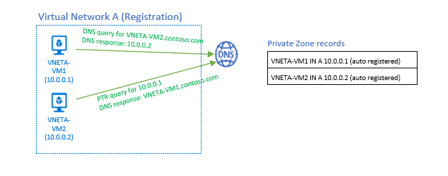
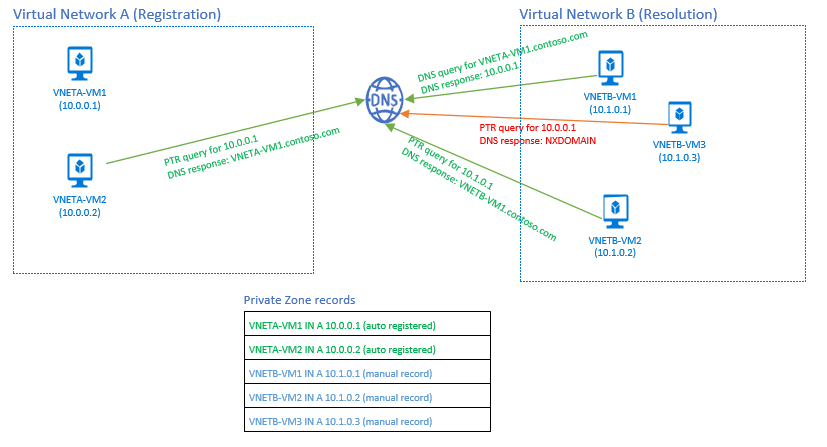
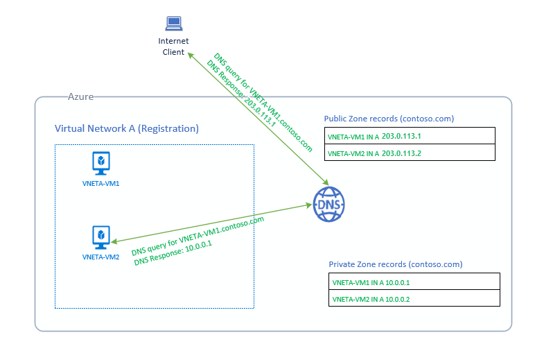

# Azure Private DNS zones scenarios

Azure Private DNS zones provide name resolution within a virtual network and between virtual networks. In this article, we'll look at some common scenarios that can benefit using this feature.

## Scenario: Name resolution scoped to a single virtual network

In this scenario, you have a virtual network in Azure that has many resources in it, including virtual machines. Your requirement is to resolve any resources in the virtual network using a specific domain name (DNS zone). You also need the naming resolution to be private and not accessible from the internet. Lastly, you need Azure to automatically register VMs into the DNS zone.

This scenario is shown below. We have a virtual network named "A" containing two VMs (VNETA-VM1 and VNETA-VM2). Each VM has a private IP associated. Once you've created a private zone, for example, `contoso.com`, and link virtual network "A" as a registration virtual network, Azure DNS will automatically create two A records in the zone referencing the two VMs. DNS queries from VNETA-VM1 can now resolve `VNETA-VM2.contoso.com` and will receive a DNS response that contains the private IP address of VNETA-VM2.
You can also do a reverse DNS query (PTR) for the private IP of VNETA-VM1 (10.0.0.1) from VNETA-VM2. The DNS response will contain the name VNETA-VM1, as expected. 

> [!NOTE]
> The IP addresses 10.0.0.1 and 10.0.0.2 are examples only. Since Azure reserves the first four addresses in a subnet, the .1 and .2 addresses are not normally assigned to a VM. 

## Scenario: Name Resolution across virtual networks

In this scenario, you need to associate a private zone with multiple virtual networks. You can implement this solution in various network architectures such as the Hub-and-Spoke model. This configuration is when a central hub virtual network is used to connect multiple spoke virtual networks together. The central hub virtual network can be linked as the registration virtual network and the spoke virtual networks can be linked as resolution virtual networks. 

The following diagram shows a simplified version of this scenario with only two virtual networks - A and B. A is defined as a registration virtual network and B is defined as a resolution virtual network. The intent is for both virtual networks to share a common zone `contoso.com`. When the zone gets created, virtual networks defined as registration will automatically register DNS records for VMs in virtual network (VNETA-VM1 and VNETA-VM2). You can also manually add DNS records into the zone for VMs in the resolution virtual network B. With this setup, you'll observe the following behavior for forward and reverse DNS queries:
* A DNS query from VNETB-VM1 in the Resolution virtual network B, for VNETA-VM1.contoso.com, will receive a DNS response containing the Private IP of VNETA-VM1.
* A Reverse DNS (PTR) query from VNETB-VM2 in the Resolution virtual network B, for 10.1.0.1, will receive a DNS response containing the FQDN VNETB-VM1.contoso.com.  
* A Reverse DNS (PTR) query from VNETB-VM3 in the Resolution virtual network B, for 10.0.0.1, will receive NXDOMAIN. The reason is that Reverse DNS queries are only scoped to the same virtual network. 

## Scenario: Split-Horizon functionality

In this scenario, you need a different naming resolution that depends on where the client is located for the same DNS zone. You may have a private and a public version of your application that has different functionality or behaviors. You required the use of the same domain name for both versions. This scenario can be accomplished by creating a Public and Private zone in Azure DNS with the same name. 

The following diagram demonstrates this scenario. You have a virtual network A that has two VMs (VNETA-VM1 and VNETA-VM2). Both have a private IP and public IP configured. A public DNS zone called `contoso.com` was created and registers the public IPs for these VMs as DNS records within the zone. A private DNS zone is also created called `contoso.com`. You defined virtual network A as a registration virtual network. Azure then automatically registers the VMs as A records into the Private Zone, pointing to their private IPs.

Now when an internet client does a DNS query for `VNETA-VM1.contoso.com`, Azure will return the public IP record from the public zone. If the same DNS query is issued from another VM (for example: VNETA-VM2) in the same virtual network A, Azure will return the Private IP record from the private zone. 

## Next steps
To learn more about Private DNS zones, see [Using Azure DNS for private domains](private-dns-overview.md).

Learn how to [create a Private DNS zone](./private-dns-getstarted-powershell.md) in Azure DNS.

Learn about DNS zones and records by visiting: [DNS zones and records overview](dns-zones-records.md).

Learn about some of the other key [networking capabilities](../networking/fundamentals/networking-overview.md) of Azure.
