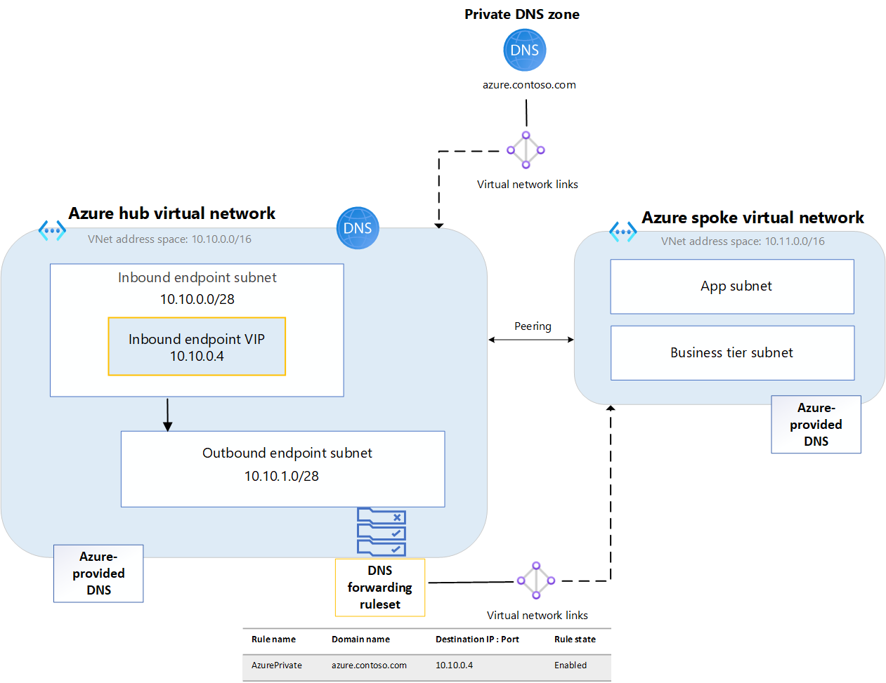
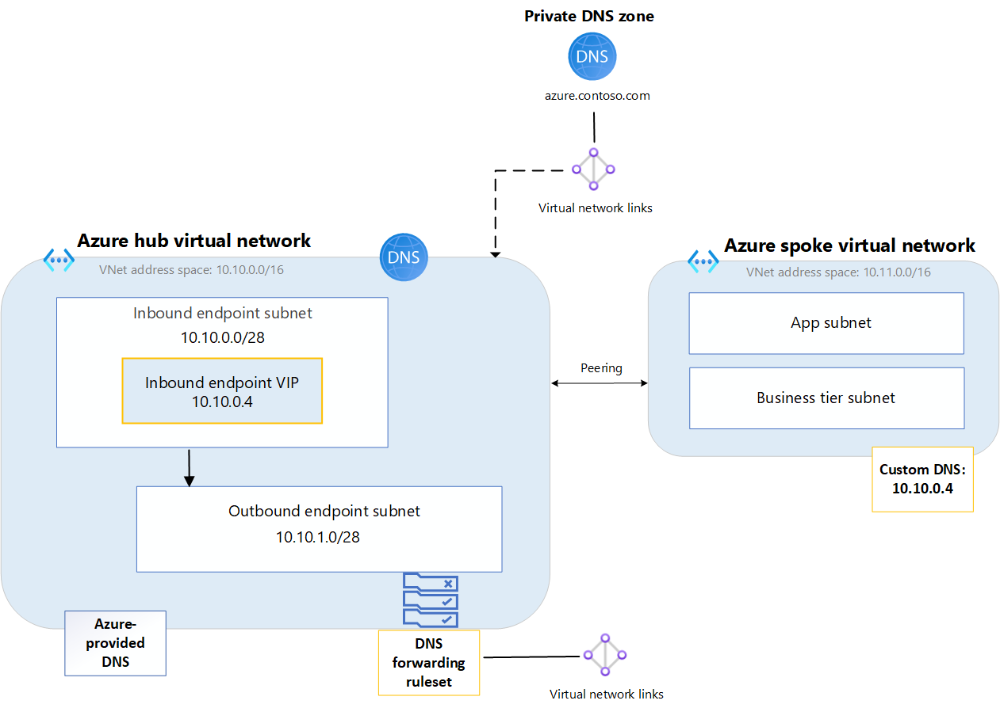

# Private resolver architecture

This article discusses two architectural design options that are available to resolve DNS names, including private DNS zones across your Azure network using an Azure DNS Private Resolver. Example configurations are provided with design recommendations for centralized vs distributed DNS resolution in a [hub and spoke VNet topology](/azure/cloud-adoption-framework/ready/azure-best-practices/hub-spoke-network-topology).

- For an overview of the Azure DNS Private Resolver, see [What is Azure DNS Private Resolver](dns-private-resolver-overview.md). 
- For more information about components of the private resolver, see Azure DNS Private Resolver [endpoints and rulesets](private-resolver-endpoints-rulesets.md).

## Distributed DNS architecture 

Consider the following hub and spoke VNet topology in Azure with a private resolver located in the hub and a ruleset link to the spoke VNet:

**Figure 1: Distributed DNS architecture using ruleset links**

- A hub VNet is configured with address space 10.10.0.0/16.
- A spoke VNet is configured with address space 10.11.0.0/16.
- A private DNS zone **azure.contoso.com** is linked to the hub VNet.
- A private resolver is provisioned in the hub VNet.
    - The private resolver has one inbound endpoint with an IP address of **10.10.0.4**.
    - The private resolver has one outbound endpoint and an associated DNS forwarding ruleset.
        - The DNS forwarding ruleset is linked to the spoke VNet.
        - A ruleset rule is configured to forward queries for the private zone to the inbound endpoint.

**DNS resolution in the hub VNet**: The virtual network link from the private zone to the Hub VNet enables resources inside the hub VNet to automatically resolve DNS records in **azure.contoso.com** using Azure-provided DNS ([168.63.129.16](../virtual-network/what-is-ip-address-168-63-129-16.md)). All other namespaces are also resolved using Azure-provided DNS. The hub VNet doesn't use ruleset rules to resolve DNS names because it isn't linked to the ruleset. To use forwarding rules in the hub VNet, create and link another ruleset to the Hub VNet.

**DNS resolution in the spoke VNet**: The virtual network link from the ruleset to the spoke VNet enables the spoke VNet to resolve **azure.contoso.com** using the configured forwarding rule. A link from the private zone to the spoke VNet isn't required here. The spoke VNet sends queries for **azure.contoso.com** to the hub's inbound endpoint. Other namespaces are also resolved for the spoke VNet using the linked ruleset if rules for those names are configured in a rule. DNS queries that don't match a ruleset rule use Azure-provided DNS. 

> [!IMPORTANT]
> In this example configuration, the hub VNet must be linked to the private zone, but must **not** be linked to a forwarding ruleset with an inbound endpoint forwarding rule. Linking a forwarding ruleset that contains a rule with the inbound endpoint as a destination to the same VNet where the inbound endpoint is provisioned can cause DNS resolution loops.

## Centralized DNS architecture

Consider the following hub and spoke VNet topology with an inbound endpoint provisioned as custom DNS in the spoke VNet:

**Figure 2: Centralized DNS architecture using custom DNS**

- A hub VNet is configured with address space 10.10.0.0/16.
- A spoke VNet is configured with address space 10.11.0.0/16.
- A private DNS zone **azure.contoso.com** is linked to the hub VNet.
- A private resolver is located in the hub VNet.
    - The private resolver has one inbound endpoint with an IP address of **10.10.0.4**.
    - The private resolver has one (optional) outbound endpoint and an associated DNS forwarding ruleset.
        - The DNS forwarding ruleset is linked to the hub VNet.
        - A ruleset rule **is not configured** to forward queries for the private zone to the inbound endpoint.

**DNS resolution in the hub VNet**: The virtual network link from the private zone to the Hub VNet enables resources inside the hub VNet to automatically resolve DNS records in **azure.contoso.com** using Azure-provided DNS ([168.63.129.16](../virtual-network/what-is-ip-address-168-63-129-16.md)). If configured, ruleset rules determine how DNS names are resolved.  Namespaces that don't match a ruleset rule are resolved using Azure-provided DNS. 

**DNS resolution in the spoke VNet**: In this example, the spoke VNet sends all of its DNS traffic to the inbound endpoint in the Hub VNet. Since **azure.contoso.com** has a virtual network link to the Hub VNet, all resources in the Hub can resolve **azure.contoso.com**, including the inbound endpoint (10.10.0.4). Thus, the spoke uses the hub inbound endpoint to resolve the private zone. Other DNS names are resolved for the spoke VNet according to rules provisioned in a forwarding ruleset, if they exist.

> [!NOTE]
> In the centralized DNS architecture scenario, both the hub and the spoke VNets can use the optional hub-linked ruleset  when resolving DNS names. This is because all DNS traffic from the spoke VNet is being sent to the hub due to the VNet's custom DNS setting. The hub VNet doesn't require an outbound endpoint or ruleset here, but if one is provisioned and linked to the hub (as shown in Figure 2), both the hub and spoke VNets will use the forwarding rules. As mentioned previously, it is important that a forwarding rule for the private zone isn't present in the ruleset because this configuration can cause a DNS resolution loop.

## Next steps

* Review components, benefits, and requirements for [Azure DNS Private Resolver](dns-private-resolver-overview.md).
* Learn how to create an Azure DNS Private Resolver by using [Azure PowerShell](./dns-private-resolver-get-started-powershell.md) or [Azure portal](./dns-private-resolver-get-started-portal.md).
* Understand how to [Resolve Azure and on-premises domains](private-resolver-hybrid-dns.md) using the Azure DNS Private Resolver.
* Learn about [Azure DNS Private Resolver endpoints and rulesets](private-resolver-endpoints-rulesets.md).
* Learn how to [Set up DNS failover using private resolvers](tutorial-dns-private-resolver-failover.md)
* Learn about some of the other key [networking capabilities](../networking/fundamentals/networking-overview.md) of Azure.
* [Learn module: Introduction to Azure DNS](/training/modules/intro-to-azure-dns).
