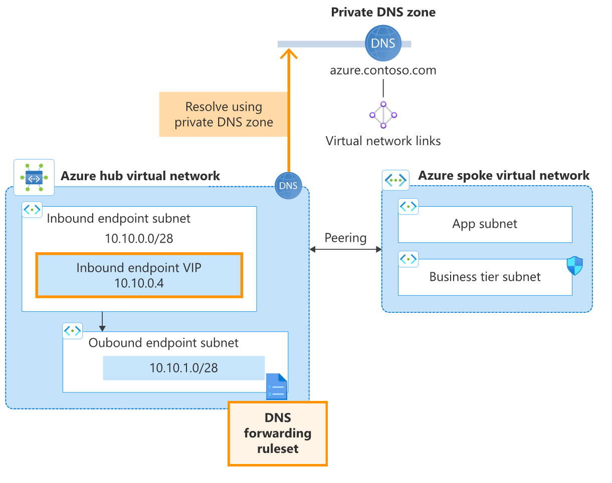

# Private resolver architecture

## Design considerations

Consider the following general [hub and spoke](/azure/architecture/reference-architectures/hybrid-networking/hub-spoke) VNet topology in Azure with an [Azure DNS Private Resolver](#azure-dns-private-resolver) located in the hub:

**Figure 1**: Azure hub and spoke VNet
- A hub VNet is configured with address space 10.10.0.0/16
- A spoke VNet is configured with address space 10.11.0.0/16
- A private resolver is located in the hub VNet
    - One inbound endpoint is provisioned with an IP address of 10.10.0.4
    - One outbound endpoint provisioned and associated with a DNS forwarding ruleset
- The private DNS zone azure.contoso.com is provisioned and linked to the hub VNet 

consider the following dependencies for DNS resolution:
1. Do spoke VNets need to resolve private DNS zones?
2. Are private DNS zones linked to spoke VNets?

When using a hub and spoke VNet design where private DNS zones don't need to be resolved in the spoke (centralized design), use the inbound endpoint in the spoke as a custom DNS server.
- Private DNS zones not linked to spokes
- Ruleset not linked to spoke
- Private DNS zones linked to hub VNet where endpoints are located
- Custom DNS

When spokes need to resolve private DNS zones linked to themselves (decentralized), link the ruleset to the spoke VNet. 
- Default DNS 

This article provides guidance on how to optimize DNS resolution with  for a centralized or a decentralized Azure VNet architecture. 

## Azure DNS Private Resolver

The [Azure DNS Private Resolver](dns-private-resolver-overview.md) 

## 2

## Procedures

The following procedures in this article are used to ....

## Next steps
* Review components, benefits, and requirements for [Azure DNS Private Resolver](dns-private-resolver-overview.md).
* Learn how to create an Azure DNS Private Resolver by using [Azure PowerShell](./dns-private-resolver-get-started-powershell.md) or [Azure portal](./dns-private-resolver-get-started-portal.md).
* Understand how to [Resolve Azure and on-premises domains](private-resolver-hybrid-dns.md) using the Azure DNS Private Resolver.
* Learn about [Azure DNS Private Resolver endpoints and rulesets](private-resolver-endpoints-rulesets.md).
* Learn how to [Set up DNS failover using private resolvers](tutorial-dns-private-resolver-failover.md)
* Learn about some of the other key [networking capabilities](../networking/fundamentals/networking-overview.md) of Azure.
* [Learn module: Introduction to Azure DNS](/training/modules/intro-to-azure-dns).
