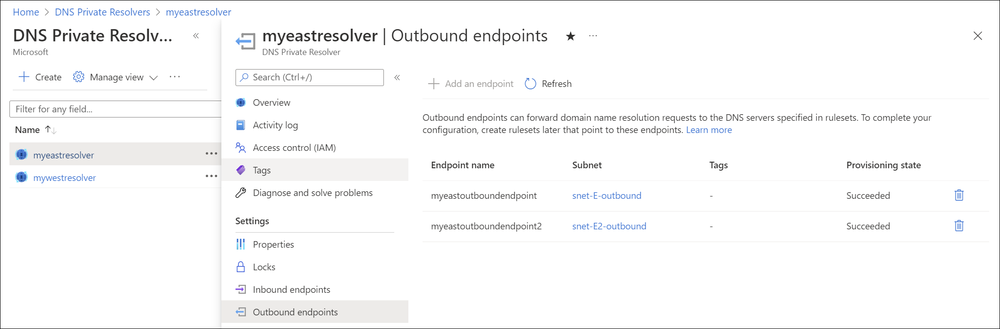
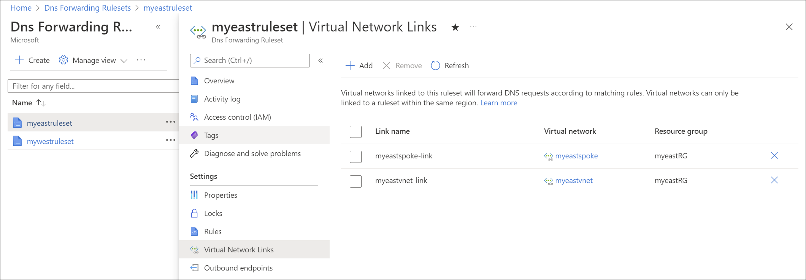

# Azure DNS Private Resolver endpoints and rulesets

In this article, you learn about components of the [Azure DNS Private Resolver](dns-private-resolver-overview.md). Inbound endpoints, outbound endpoints, and DNS forwarding rulesets are discussed. Properties and settings of these components are described, and examples are provided for how to use them. 

The architecture for Azure DNS Private Resolver is summarized in the following figure. In this example network, a DNS resolver is deployed in a hub VNet that peers with a spoke VNet. 

**Figure 1**: Example hub and spoke network with DNS resolver
- [Ruleset links](#ruleset-links) are provisioned in the [DNS forwarding ruleset](#dns-forwarding-rulesets) to both the hub and spoke VNets, enabling resources in both VNets to resolve custom DNS namespaces using DNS forwarding rules. 
- A private DNS zone is also deployed and linked to the hub VNet, enabling resources in the hub VNet to resolve records in the zone. 
- The spoke VNet resolves records in the private zone by using a DNS forwarding [rule](#rules) that forwards private zone queries to the inbound endpoint VIP in the hub VNet. 
- An ExpressRoute-connected on-premises network is also shown in the figure, with DNS servers configured to forward queries for the Azure private zone to the inbound endpoint VIP. For more information about enabling hybrid DNS resolution using the Azure DNS Private Resolver, see [Resolve Azure and on-premises domains](private-resolver-hybrid-dns.md).

> [!NOTE]
> The peering connection shown in the diagram is not required for name resolution. Vnets that are linked from a DNS forwarding ruleset will use the ruleset when performing name resolution, whether or not the linked VNet peers with the ruleset VNet.

## Inbound endpoints

As the name suggests, inbound endpoints ingress to Azure. Inbound endpoints provide an IP address to forward DNS queries from on-premises and other locations outside your virtual network. DNS queries sent to the inbound endpoint are resolved using Azure DNS. Private DNS zones that are linked to the virtual network where the inbound endpoint is provisioned are resolved by the inbound endpoint. 

The IP address associated with an inbound endpoint is always part of the private virtual network address space where the private resolver is deployed.  No other resources can exist in the same subnet with the inbound endpoint. The following screenshot shows an inbound endpoint with a virtual IP address (VIP) of **10.10.0.4** inside the subnet `snet-E-inbound` provisioned within a virtual network with address space of 10.10.0.0/16.

> [!NOTE]
> The IP address assigned to an inbound endpoint is not a static IP address that you can choose. Typically, the fifth IP address in the subnet is assigned.  However, if the inbound endpoint is reprovisioned, this IP address might change. The IP address does not change unless the inbound endpoint is reprovisioned.

## Outbound endpoints

Outbound endpoints egress from Azure and can be linked to [DNS Forwarding Rulesets](#dns-forwarding-rulesets).

Outbound endpoints are also part of the private virtual network address space where the private resolver is deployed. An outbound endpoint is associated with a subnet, but isn't provisioned with an IP address like the inbound endpoint.  No other resources can exist in the same subnet with the outbound endpoint. The following screenshot shows an outbound endpoint inside the subnet `snet-E-outbound`.

## DNS forwarding rulesets

DNS forwarding rulesets enable you to specify one or more custom DNS servers to answer queries for specific DNS namespaces. The individual [rules](#rules) in a ruleset determine how these DNS names are resolved. Rulesets can also be linked one or more virtual networks, enabling resources in the VNets to use the forwarding rules that you configure.

Rulesets have the following associations: 
- A single ruleset can be associated with multiple outbound endpoints. 
- A ruleset can have up to 1000 DNS forwarding rules. 
- A ruleset can be linked to up to 500 virtual networks in the same region

A ruleset can't be linked to a virtual network in another region. For more information about ruleset and other private resolver limits, see [What are the usage limits for Azure DNS?](dns-faq.yml#what-are-the-usage-limits-for-azure-dns-).

### Ruleset links

When you link a ruleset to a virtual network, resources within that virtual network will use the DNS forwarding rules enabled in the ruleset. The linked virtual networks aren't required to peer with the virtual network where the outbound endpoint exists, but these networks can be configured as peers. This configuration is common in a hub and spoke design. In this hub and spoke scenario, the spoke vnet doesn't need to be linked to the private DNS zone in order to resolve resource records in the zone. In this case, the forwarding ruleset rule for the private zone sends queries to the hub vnet's inbound endpoint. For example: **azure.contoso.com** to **10.10.0.4**.

The following screenshot shows a DNS forwarding ruleset linked to the spoke virtual network: **myeastspoke**.

Virtual network links for DNS forwarding rulesets enable resources in other VNets to use forwarding rules when resolving DNS names. The VNet with the private resolver must also be linked from any private DNS zones for which there are ruleset rules.

For example, resources in the vnet `myeastspoke` can resolve records in the private DNS zone `azure.contoso.com` if:
- The ruleset provisioned in `myeastvnet` is linked to `myeastspoke`
- A ruleset rule is configured and enabled in the linked ruleset to resolve `azure.contoso.com` using the inbound endpoint in `myeastvnet`

### Rules

DNS forwarding rules (ruleset rules) have the following properties:

| Property | Description |
| --- | --- |
| Rule name | The name of your rule. The name must begin with a letter, and can contain only letters, numbers, underscores, and dashes. |
| Domain name | The dot-terminated DNS namespace where your rule applies. The namespace must have either zero labels (for wildcard) or between 1 and 34 labels. For example, `contoso.com.` has two labels.1 |
| Destination IP:Port | The forwarding destination. One or more IP addresses and ports of DNS servers that are used to resolve DNS queries in the specified namespace. |
| Rule state | The rule state: Enabled or disabled. If a rule is disabled, it's ignored. |

1Single-label domain names are supported.

If multiple rules are matched, the longest prefix match is used.  

For example, if you have the following rules:

| Rule name | Domain name | Destination IP:Port | Rule state |
| --- | --- | --- | --- |
| Contoso | contoso.com. | 10.100.0.2:53 | Enabled  |
| AzurePrivate | azure.contoso.com. | 10.10.0.4:53 | Enabled  |
| Wildcard | . | 10.100.0.2:53 | Enabled  |

A query for `secure.store.azure.contoso.com` matches the **AzurePrivate** rule for `azure.contoso.com` and also the **Contoso** rule for `contoso.com`, but the **AzurePrivate** rule takes precedence because the prefix `azure.contoso` is longer than `contoso`. 

> [!IMPORTANT]
> If a rule is present in the ruleset that has as its destination a private resolver inbound endpoint, do not link the ruleset to the VNet where the inbound endpoint is provisioned. This configuration can cause DNS resolution loops. For example: In the previous scenario, no ruleset link should be added to `myeastvnet` because the inbound endpoint at `10.10.0.4` is provisioned in `myeastvnet` and a rule is present that resolves `azure.contoso.com` using the inbound endpoint.

#### Rule processing

- If multiple DNS servers are entered as the destination for a rule, the first IP address that is entered is used unless it doesn't respond. An exponential backoff algorithm is used to determine whether or not a destination IP address is responsive. Destination addresses that are marked as unresponsive aren't used for 30 minutes.
- Certain domains are ignored when using a wildcard rule for DNS resolution, because they are reserved for Azure services. See [Azure services DNS zone configuration](../private-link/private-endpoint-dns.md#azure-services-dns-zone-configuration) for a list of domains that are reserved. The two-label DNS names listed in this article (ex: windows.net, azure.com, azure.net, windowsazure.us) are reserved for Azure services.

> [!IMPORTANT]
> - You can't enter the Azure DNS IP address of 168.63.129.16 as the destination IP address for a rule. Attempting to add this IP address will output the error: **Exception while making add request for rule**. 
> - Do not use the private resolver's inbound endpoint IP address as a forwarding destination for zones that aren't linked to the virtual network where the private resolver is provisioned.

## Design options

How you deploy forwarding rulesets and inbound endpoints in a hub and spoke architecture ideally depends on your network design. Two configuration options are discussed briefly in the following sections. For a more detailed discussion with configuration examples, see [Private resolver architecture](private-resolver-architecture.md). 

### Forwarding ruleset links

Linking a **forwarding ruleset** to a VNet enables DNS forwarding capabilities in that VNet. For example, if a ruleset contains a rule to forward queries to a private resolver's inbound endpoint, this type of rule can be used to enable resolution of private zones that are linked to the inbound endpoint's VNet. This configuration can be used where a Hub VNet is linked to a private zone and you want to enable the private zone to be resolved in spoke VNets that are not linked to the private zone. In this scenario, DNS resolution of the private zone is carried out by the inbound endpoint in the hub VNet. 

The ruleset link design scenario is best suited to a [distributed DNS architecture](private-resolver-architecture.md#distributed-dns-architecture) where network traffic is spread across your Azure network, and might be unique in some locations. With this design, you can control DNS resolution in all VNets linked to the ruleset by modifying a single ruleset.  

> [!NOTE]
> If you use the ruleset link option and there is a forwarding rule with the inbound endpoint as destination, do not link the forwarding ruleset to the Hub VNet. Linking this type of ruleset to the same VNet where the inbound endpoint is provisioned can result in a DNS resolution loop. 

### Inbound endpoints as custom DNS

**Inbound endpoints** are able to process inbound DNS queries, and can be configured as custom DNS for a VNet. This configuration can replace instances where you are [using your own DNS server](../virtual-network/virtual-networks-name-resolution-for-vms-and-role-instances.md#name-resolution-that-uses-your-own-dns-server) as custom DNS in a VNet.

The custom DNS design scenario is best suited to a [centralized DNS architecture](private-resolver-architecture.md#centralized-dns-architecture) where DNS resolution and network traffic flow are mostly to a hub VNet, and is controlled from a central location. 

To resolve a private DNS zone from a spoke VNet using this method, the VNet where the inbound endpoint exists must be linked to the private zone. The Hub VNet can be (optionally) linked to a forwarding ruleset. If a ruleset is linked to the Hub, all DNS traffic sent to the inbound endpoint is processed by the ruleset.

## Next steps

* Review components, benefits, and requirements for [Azure DNS Private Resolver](dns-private-resolver-overview.md).
* Learn how to create an Azure DNS Private Resolver by using [Azure PowerShell](./dns-private-resolver-get-started-powershell.md) or [Azure portal](./dns-private-resolver-get-started-portal.md).
* Understand how to [Resolve Azure and on-premises domains](private-resolver-hybrid-dns.md) using the Azure DNS Private Resolver.
* Learn how to [Set up DNS failover using private resolvers](tutorial-dns-private-resolver-failover.md)
* Learn how to [configure hybrid DNS](private-resolver-hybrid-dns.md) using private resolvers.
* Learn about some of the other key [networking capabilities](../networking/fundamentals/networking-overview.md) of Azure.
* [Learn module: Introduction to Azure DNS](/training/modules/intro-to-azure-dns).
