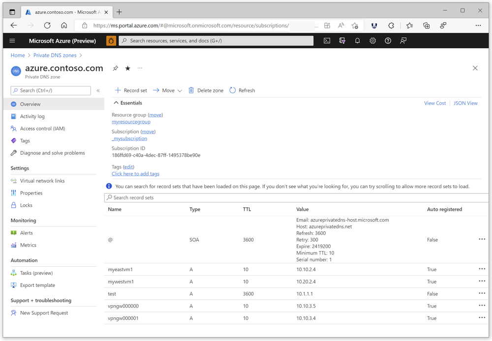
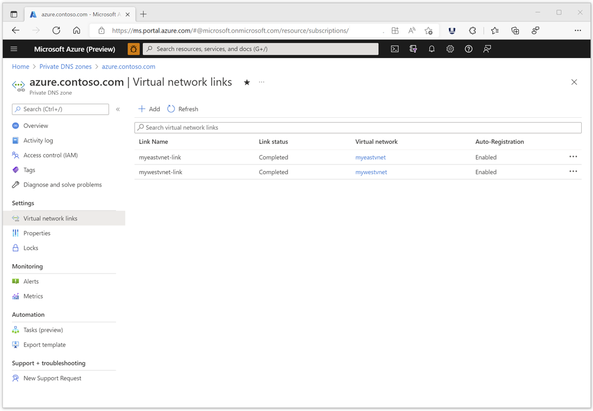
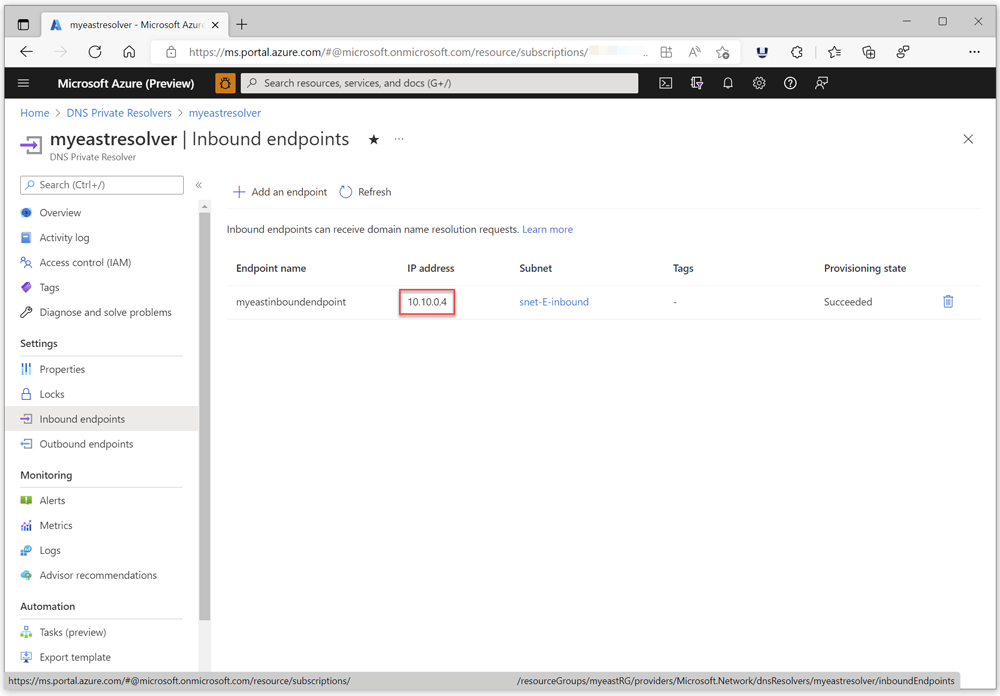
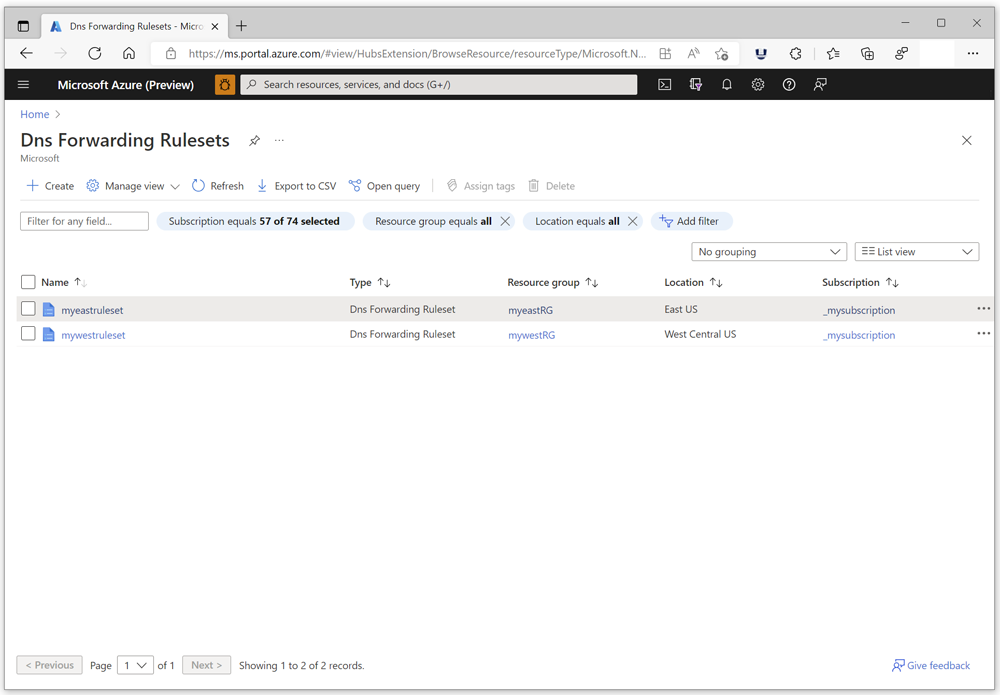
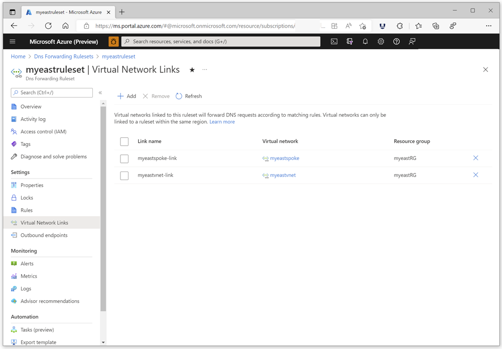
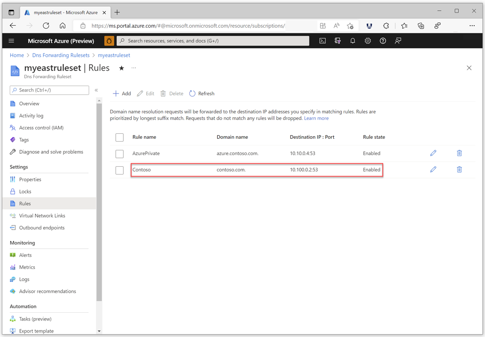
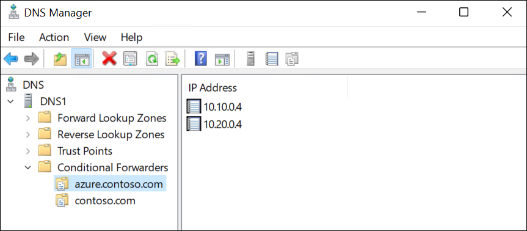
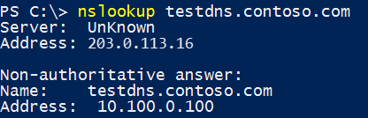
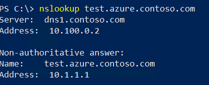

# Resolve Azure and on-premises domains

## Hybrid DNS resolution

This article provides guidance on how to configure hybrid DNS resolution by using an [Azure DNS Private Resolver](#azure-dns-private-resolver) with a [DNS forwarding ruleset](#dns-forwarding-ruleset). 

*Hybrid DNS resolution* is defined here as enabling Azure resources to resolve your on-premises domains, and on-premises DNS to resolve your Azure private DNS zones.

## Azure DNS Private Resolver

The [Azure DNS Private Resolver](dns-private-resolver-overview.md) is a service that can resolve on-premises DNS queries for Azure DNS private zones. Previously, it was necessary to [deploy a VM-based custom DNS resolver](../hdinsight/connect-on-premises-network.md), or use non-Microsoft DNS, DHCP, and IPAM (DDI) solutions to perform this function.

Benefits of using the Azure DNS Private Resolver service vs. VM-based resolvers or DDI solutions include:
- Zero maintenance: Unlike VM or hardware based solutions, the private resolver doesn't require software updates, vulnerability scans, or security patching. The private resolver service is fully managed.
- Cost reduction: Azure DNS Private Resolver is a multi-tenant service and can cost a fraction of the expense that is required to use and license multiple VM-based DNS resolvers.
- High availability: The Azure DNS Private Resolver service has built-in high availability features. The service is [availability zone](../availability-zones/az-overview.md) aware, thus ensuring that high availability and redundancy of your DNS solution can be accomplished with much less effort. For more information on how to configure DNS failover using the private resolver service, see [Tutorial: Set up DNS failover using private resolvers](tutorial-dns-private-resolver-failover.md).
- DevOps friendly: Traditional DNS solutions are hard to integrate with DevOps workflows as these often require manual configuration for every DNS change. Azure DNS private resolver provides a fully functional ARM interface that can be easily integrated with DevOps workflows.

## DNS forwarding ruleset

A DNS forwarding ruleset is a group of rules that specify one or more custom DNS servers to answer queries for specific DNS namespaces. For more information, see [Azure DNS Private Resolver endpoints and rulesets](private-resolver-endpoints-rulesets.md).

## Procedures

The following procedures in this article are used to enable and test hybrid DNS:
- [Create an Azure DNS private zone](#create-an-azure-dns-private-zone)
- [Create an Azure DNS Private Resolver](#create-an-azure-dns-private-resolver)
- [Configure an Azure DNS forwarding ruleset](#configure-an-azure-dns-forwarding-ruleset)
- [Configure on-premises DNS conditional forwarders](#configure-on-premises-dns-conditional-forwarders)
- [Demonstrate hybrid DNS](#demonstrate-hybrid-dns)

## Create an Azure DNS private zone

Create a private zone with at least one resource record to use for testing. The following quickstarts are available to help you create a private zone: 
- [Create a private zone - portal](private-dns-getstarted-portal.md)
- [Create a private zone - PowerShell](private-dns-getstarted-powershell.md) 
- [Create a private zone - CLI](private-dns-getstarted-cli.md) 

In this article, the private zone **azure.contoso.com** and the resource record **test** are used.  Autoregistration isn't required for the current demonstration.

> [!IMPORTANT]
> A recursive server is used to forward queries from on-premises to Azure in this example. If the server is authoritative for the parent zone (contoso.com), forwarding is not possible unless you first create a delegation for azure.contoso.com.

**Requirement**: You must create a virtual network link in the zone to the virtual network where you deploy your Azure DNS Private Resolver.  In the following example, the private zone is linked to two vnets: **myeastvnet** and **mywestvnet**. At least one link is required.

## Create an Azure DNS Private Resolver

The following quickstarts are available to help you create a private resolver. These quickstarts walk you through creating a resource group, a virtual network, and Azure DNS Private Resolver.  The steps to configure an inbound endpoint, outbound endpoint, and DNS forwarding ruleset are provided: 
- [Create a private resolver - portal](dns-private-resolver-get-started-portal.md)
- [Create a private resolver - PowerShell](dns-private-resolver-get-started-powershell.md) 

 When you're finished, write down the IP address of the inbound endpoint for the Azure DNS Private Resolver. In this example, the IP address is **10.10.0.4**.  This IP address is used later to configure on-premises DNS conditional forwarders.

## Configure an Azure DNS forwarding ruleset

Create a forwarding ruleset in the same region as your private resolver. The following example shows two rulesets. The **East US** region ruleset is used for the hybrid DNS demonstration.

**Requirement**: You must create a virtual network link to the vnet where your private resolver is deployed.  In the following example, two virtual network links are present. The link **myeastvnet-link** is created to a hub vnet where the private resolver is provisioned. There's also a virtual network link **myeastspoke-link** that provides hybrid DNS resolution in a spoke vnet that doesn't have its own private resolver. The spoke network is able to use the private resolver because it peers with the hub network. The spoke vnet link isn't required for the current demonstration.

Next, create a rule in your ruleset for your on-premises domain. In this example, we use **contoso.com**. Set the destination IP address for your rule to be the IP address of your on-premises DNS server.  In this example, the on-premises DNS server is at **10.100.0.2**.  Verify that the rule is **Enabled**.

> [!NOTE]
> Don't change the DNS settings for your virtual network to use the inbound endpoint IP address. Leave the default DNS settings.

## Configure on-premises DNS conditional forwarders

The procedure to configure on-premises DNS depends on the type of DNS server you're using. In the following example, a Windows DNS server at **10.100.0.2** is configured with a conditional forwarder for the private DNS zone **azure.contoso.com**. The conditional forwarder is set to forward queries to **10.10.0.4**, which is the inbound endpoint IP address for your Azure DNS Private Resolver. There's another IP address also configured here to enable DNS failover. For more information about enabling failover, see [Tutorial: Set up DNS failover using private resolvers](tutorial-dns-private-resolver-failover.md). For the purposes of this demonstration, only the **10.10.0.4** inbound endpoint is required.

 

## Demonstrate hybrid DNS

Using a VM located in the virtual network where the Azure DNS Private Resolver is provisioned, issue a DNS query for a resource record in your on-premises domain.  In this example, a query is performed for the record **testdns.contoso.com**:

 

The path for the query is: Azure DNS > inbound endpoint > outbound endpoint > ruleset rule for contoso.com > on-premises DNS (10.100.0.2).  The DNS server at 10.100.0.2 is an on-premises DNS resolver, but it could also be an authoritative DNS server.

Using an on-premises VM or device, issue a DNS query for a resource record in your Azure private DNS zone. In this example, a query is performed for the record **test.azure.contoso.com**:

 

The path for this query is: client's default DNS resolver (10.100.0.2) > on-premises conditional forwarder rule for azure.contoso.com > inbound endpoint (10.10.0.4) 

## Next steps
* Review components, benefits, and requirements for [Azure DNS Private Resolver](dns-private-resolver-overview.md).
* Learn how to create an Azure DNS Private Resolver by using [Azure PowerShell](./dns-private-resolver-get-started-powershell.md) or [Azure portal](./dns-private-resolver-get-started-portal.md).
* Understand how to [Resolve Azure and on-premises domains](private-resolver-hybrid-dns.md) using the Azure DNS Private Resolver.
* Learn about [Azure DNS Private Resolver endpoints and rulesets](private-resolver-endpoints-rulesets.md).
* Learn how to [Set up DNS failover using private resolvers](tutorial-dns-private-resolver-failover.md)
* Learn about some of the other key [networking capabilities](../networking/fundamentals/networking-overview.md) of Azure.
* [Learn module: Introduction to Azure DNS](/training/modules/intro-to-azure-dns).
