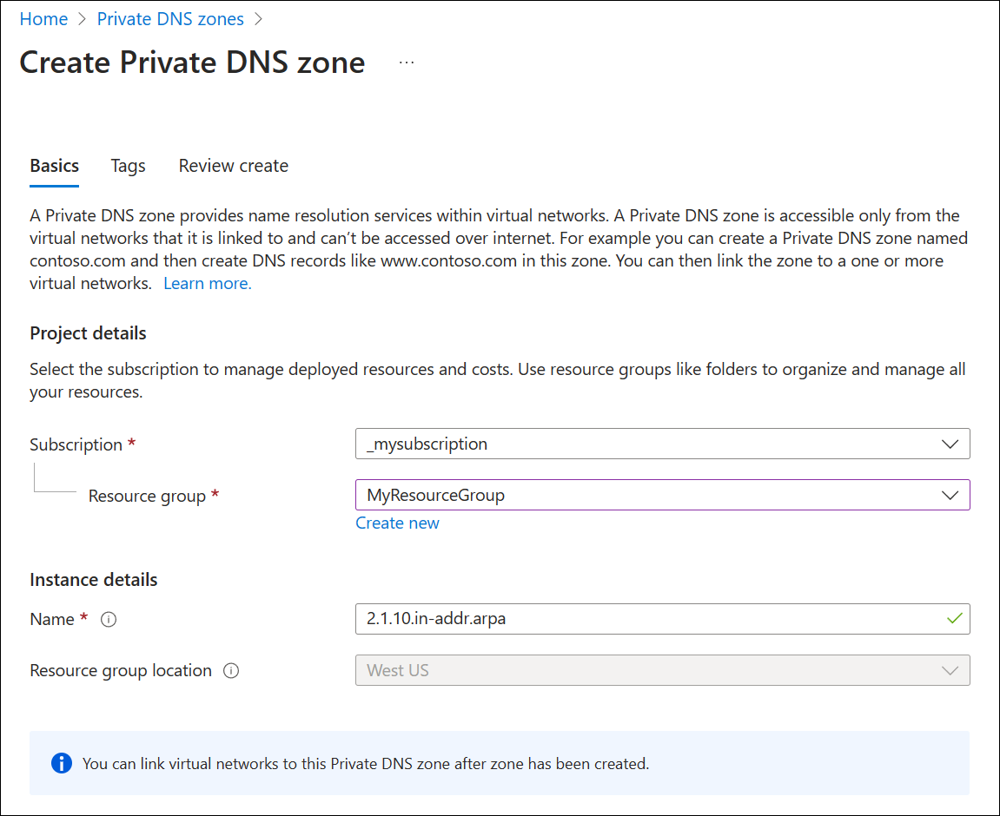
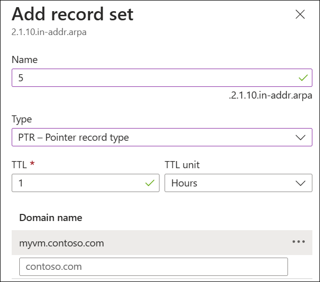
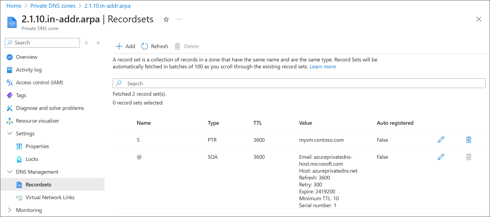
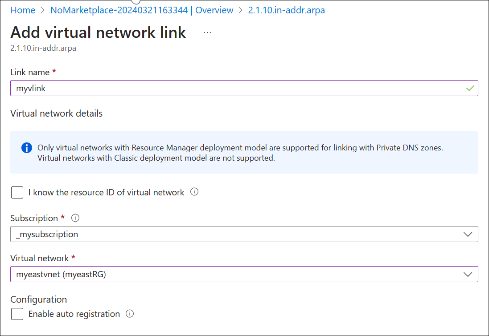

# Create and manage reverse DNS zones in Azure Private DNS

In this article, you learn how to create a private reverse lookup DNS zone and add pointer (PTR) records to the zone using the Azure portal.

## What is reverse DNS?

Reverse DNS (as the name indicates) is the opposite process to forward DNS. Reverse enables you to resolve an IP address to a name (for example: 10.1.2.5 --> myvm.contoso.com), whereas forward DNS resolves a name to an IP address. Azure Private DNS supports both IPv6 and IPv4 reverse DNS.

### IPv6 reverse DNS

IPv6 reverse DNS zones use the special domain **ip6.arpa**. For more information about IPv6 reverse zones and records, see the IPv6 sections that describe [creating an IPv6 reverse zone](dns-reverse-dns-hosting.md#ipv6) and [adding an IPv6 reverse DNS record](dns-reverse-dns-hosting.md#ipv6-1) in the [Host reverse DNS lookup zones in Azure DNS](dns-reverse-dns-hosting.md) article for public DNS. Azure Private DNS also supports IPv6 reverse DNS zones under the [requirements and restrictions](#requirements-and-restrictions) described in this article.

### IPv4 reverse DNS zones

IPv4 reverse DNS zones contain pointer (PTR) records and use the reserved domain name: **in-addr.arpa**. These reverse DNS zones follow a hierarchical naming pattern. For example: 

- **10.in-addr.arpa** contains all PTR records for IPv4 addresses in the 10.0.0.0/8 address space.
- **1.10.in-addr.arpa** contains all PTR records for IPv4 addresses in the 10.1.0.0/16 address space.
- **2.1.10.in-addr.arpa** contains only PTR records for IPv4 addresses in the 10.1.2.0/24 address space.

Private IPv4 reverse DNS zones are intended for use with private IP address space as defined in [RFC 1918](https://www.rfc-editor.org/info/rfc1918).

### IPv4 reverse DNS records

To create an IPv4 reverse DNS record in your zone, add the remaining IP address octets in reverse order into the appropriate in-addr.arpa zone and provide a fully qualified domain name value (also called a **ptrdname**). The number of remaining IP address octets depend on the scope of the reverse DNS zone. For example:

* 10.1.2.5 in the 10.in-addr.arpa zone appears as: `5.2.1  IN  PTR  myvm.contoso.com.` 
* 10.1.2.5 in the 1.10.in-addr.arpa zone appears as:`5.2   IN  PTR  myvm.contoso.com.`
* 10.1.2.5 in the 2.1.10.in-addr.arpa zone appears as:`5   IN  PTR  myvm.contoso.com.` 

> [!IMPORTANT]
> A reverse DNS zone for address space with a longer prefix takes precendence. For example, if all three zones contain entries for the IPv4 address 10.1.2.5 as shown here, only the entry in the 2.1.10.in-addr.arpa zone will be used. If the longer prefix zone (2.1.10.in-addr.arpa) exists, then all reverse DNS entries for the corresponding /24 address space must be entered in this zone.

## Requirements and restrictions

- [Autoregistration](private-dns-autoregistration.md) isn't supported for reverse DNS.
- A [virtual network link](private-dns-virtual-network-links.md) from the reverse zone is required to enable DNS resolution of PTR records. The process of [adding a virtual network link](#add-a-virtual-network-link) is demonstrated in this article. This is different from reverse DNS for public IP addresses, which don't require a virtual network link.
    - You can also forward DNS queries to a DNS resolver if the reverse zone is linked to the resolver's VNet.
- Reverse zones must follow the naming guidelines described in this article and in [RFC 3172](https://www.rfc-editor.org/info/rfc3172).

## Create a reverse lookup DNS zone

1. Sign in to the [Azure portal](https://portal.azure.com).
2. Select **Create a resource**, search for and select **Private DNS zones**, then select **+ Create**.
3. On the **Create DNS zone** page, select, or enter the following settings:

    | Setting | Details |
    | --- | --- |
    | **Subscription** | Select your subscription.|
    | **Resource group** | Select or create a new resource group. |
    | **Name** | Enter a name for the DNS zone. In this example, the class C reverse DNS zone name **2.1.10.in-addr.arpa** is used.  |
    | **Location** | Select the location for the resource group. The location is already be selected if you're using a previously created resource group. |

    See the following example:

    

4. Select **Review create**, and then select **Create**.

## Create a DNS PTR record

1. Select **+ Record set** to open the **Add record set** pane.
2. As described previously in this article, PTR records in a class C reverse DNS zone are single digit entries. In this example, enter the following:

   | Setting | Details |
   | --- | --- |
   | **Name** | Enter `5`.|
   | **Type** | Select `PTR - Pointer record type`. |
   | **TTL and TTL unit** | Use default values.  |
   | **Domain name** | Enter `myvm.contoso.com`. |

     See the following example:

     

3. Select **OK** to create the reverse DNS record.

     

## Add a virtual network link

In order for resources to resolve the reverse DNS zone, you must add a virtual network link pointing to the VNet that contains those resources. You can add multiple virtual network links. In this example, a link is added to the VNet: **myeastvnet** that contains a virtual machine. The virtual machine is then used to verify reverse DNS resolution.

1. Open the private zone overview, and then select **Virtual network links** under **Settings**.
2. Select **+ Add**.
3. Enter the following values on the **Add virtual network link** page:

   | Setting | Details |
   | --- | --- |
   | **Link name** | Enter a name for your link. For example: **myvlink**.|
   | **Subscription** | Select your subscription. |
   | **Virtual network** | Choose the virtual network that you wish to link to this private DNS zone.  |
   | **Configuration** | Don't select the checkbox to enable auto registration. Selecting this setting prevents creation of the virtual network link. |

     See the following example: 

     

4. Select **OK** and verify that the link is displayed on the Virtual network links page.

## Test DNS resolution

Using a VM in the linked virtual network: open a command line, type **nslookup 10.1.2.5** and press ENTER. 

If reverse DNS resolution is working, you see the *ptrdname* (FQDN value) that you entered into the reverse DNS zone:

```PowerShell
C:\>nslookup 10.1.2.5
Server:  UnKnown
Address:  168.63.129.16

Name:    myvm.contoso.com
Address:  10.1.2.5
```

## Next steps

* For more information on reverse DNS, see [reverse DNS lookup on Wikipedia](https://en.wikipedia.org/wiki/Reverse_DNS_lookup).
* Learn how to [manage reverse DNS records for your Azure services](dns-reverse-dns-for-azure-services.md).
