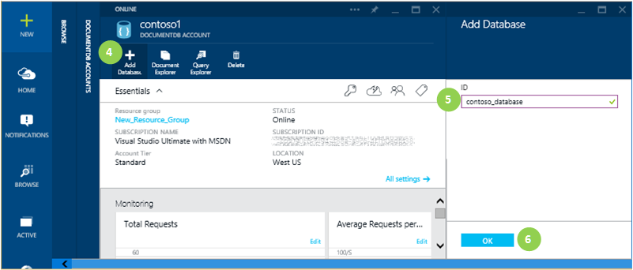
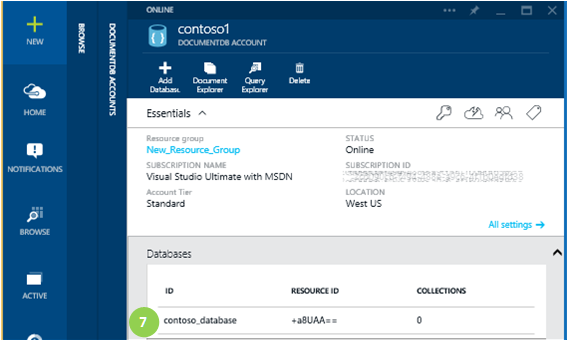

<properties 
	pageTitle="Create a DocumentDB database | Azure" 
	description="Learn how to create a DocumentDB NoSQL database using the Azure Preview portal." 
	services="documentdb" 
	authors="mimig1" 
	manager="jhubbard" 
	editor="monicar" 
	documentationCenter=""/>

<tags 
	ms.service="documentdb" 
	ms.workload="data-services" 
	ms.tgt_pltfrm="na" 
	ms.devlang="na" 
	ms.topic="get-started-article" 
	ms.date="05/21/2015" 
	ms.author="mimig"/>

# Create a DocumentDB database using the Azure Preview portal

To use Microsoft Azure DocumentDB, you must have DocumentDB account, a database, collections and documents.  This topic describes how to create a DocumentDB database in the Microsoft Azure Preview portal.

New to DocumentDB?  Watch [this](http://azure.microsoft.com/documentation/videos/create-documentdb-on-azure/) four minute video to see how to complete the most common tasks in the portal.

1.  In the [Azure Preview portal](https://portal.azure.com/), click **Browse**.

2.  In the **Browse** blade, click **DocumentDB Accounts**.

3.  In the **DocumentDB Accounts** blade, select the account in which to add a DocumentDB database. If you don't have any accounts listed, you'll need to [create a DocumentDB account](documentdb-create-account.md).
    
    

4. In the **DocumentDB Account** blade, click **Add Database**.

5. In the **Add Database** blade, enter the ID for your new database. When the name is validated, a green check mark appears in the ID box.

6. Click **OK** at the bottom of the screen to create the new database. 

	

8. The new database now appears in the **Databases** lens on the **DocumentDB Account** blade.
 
	

## Next steps

Now that you have a DocumentDB database, the next step is to create a collection.

Once your collection is created, you can [add documents](documentdb-view-json-document-explorer.md) or [import documents](documentdb-import-data.md) into the collection, and then [query your documents](documentdb-query-collections-query-explorer.md). 