<properties 
	pageTitle="Build a web application with ASP.NET MVC using DocumentDB | Azure" 
	description="Learn how to use DocumentDB with .NET to build a To Do List web application. You'll store and access data from an ASP.NET MVC web application hosted on Azure Websites." 
	services="documentdb" 
	documentationCenter=".net" 
	authors="ryancrawcour" 
	manager="jhubbard" 
	editor="cgronlun"/>

<tags 
	ms.service="documentdb" 
	ms.workload="data-services" 
	ms.tgt_pltfrm="na" 
	ms.devlang="dotnet" 
	ms.topic="hero-article" 
	ms.date="04/29/2015" 
	ms.author="ryancraw"/>

#Build a web application with ASP.NET MVC using DocumentDB

To highlight how you can efficiently leverage Azure DocumentDB to store and query JSON documents, this article provides an end-to-end walk-through showing you how to build a todo list web application using Azure DocumentDB. The tasks will be stored as JSON documents in Azure DocumentDB.

This walk-through shows you how to use the DocumentDB service provided by Azure to store and access data from an ASP.NET MVC web application hosted on Azure.

> [AZURE.TIP] This tutorial assumes that you have prior experience using ASP.NET MVC and Azure Websites. If you are new to ASP.NET or the [prerequisite tools](#_Toc395637760), we recommend downloading the complete [todo](https://github.com/Azure/azure-documentdb-net/tree/master/tutorials/todo) tutorial project from [GitHub](https://github.com/Azure/azure-documentdb-net) and building it using the [instructions at the end of this article](#GetProject). Once you have it built, you can review the article to gain insight on the code in the context of the project.

## Prerequisites

Before following the instructions in this article, you should ensure that you have the following:

- An active Azure account. If you don't have an account, you can create a free trial account in just a couple of minutes. For details, see [Azure Free Trial](../../pricing/free-trial/).
- [Visual Studio 2013](http://www.visualstudio.com/) Update 4 or higher.
- Azure SDK for .NET version 2.5.1 or higher, available through the [Microsoft Web Platform Installer][].

All the screen shots in this article have been taken using Visual Studio 2013 with Update 4 applied and the Azure SDK for .NET version 2.5.1. If your system is configured with different versions it is possible that your screens and options won't match entirely, but if you meet the above prerequisites this solution should work.

## Step 1: Create a DocumentDB database account

Let's start by creating a DocumentDB account. If you already have an account, you can skip to [Create a new ASP.NET MVC application](#_Toc395637762).

[AZURE.INCLUDE [documentdb-create-dbaccount](../includes/documentdb-create-dbaccount.md)]

[AZURE.INCLUDE [documentdb-keys](../includes/documentdb-keys.md)]

 
We will now walk through how to create a new ASP.NET MVC application from the ground-up. 

## Step 2: Create a new ASP.NET MVC application

Now that you have an account, let's create our new ASP.NET project.

1. In Visual Studio, on the **File** menu, point to **New**, and then click **Project**.

   	The **New Project** dialog box appears.
2. In the **Project types** pane, expand **Templates**, **Visual C#**, **Web**, and then select **ASP.NET Web Application**.

  	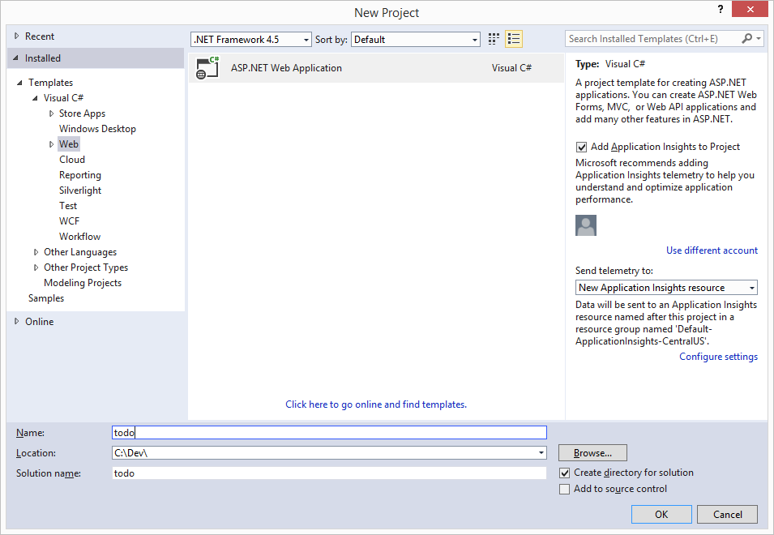

3. In the **Name** box, type the name of the project. This tutorial uses the name "todo". If you choose to use something other than this, then wherever this tutorial talks about the todo namespace, you need to adjust the provided code samples to use whatever you named your application. 

4. Click **Browse** to navigate to the folder where you would like to create the project, and then click **OK**.

  	The **New ASP.NET Project** dialog box appears.

  	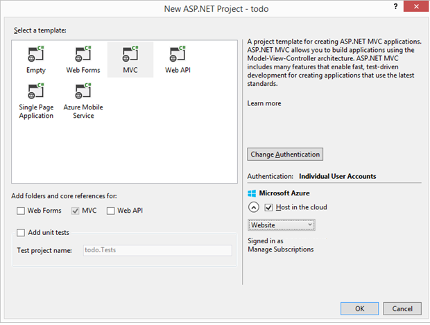

5. In the templates pane, select **MVC**.

6. If you plan on hosting your application in Azure then select **Host in the cloud** on the lower right to have Azure host the application. We've selected to host in the cloud, and to run the application hosted in an Azure Website. Selecting this option will preprovision an Azure Website for you and make life a lot easier when it comes time to deploy the final working application. If you want to host this elsewhere or don't want to configure Azure upfront, then just clear **Host in the Cloud**.

7. Click **OK** and let Visual Studio do its thing around scaffolding the empty ASP.NET MVC template. 

8. If you chose to host this in the cloud you will see at least one additional screen asking you to login to your Azure account and provide some values for your new website. Supply all the additional values and continue. 

  	I haven't chosen a "Database server" here because we're not using an Azure SQL Database Server here, we're going to be creating a new Azure DocumentDB account later on in the Azure Preview portal.

	For more information about choosing an **App Service plan** and **Resource group**, see [Azure App Service plans in-depth overview](azure-web-sites-web-hosting-plans-in-depth-overview.md).

  	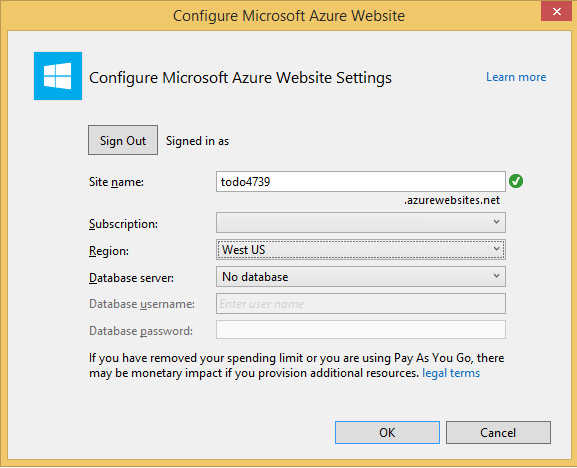

9. Once Visual Studio has finished creating the boilerplate MVC application you have an empty ASP.NET application that you can run locally.

	We'll skip running the project locally because I'm sure we've all seen the ASP.NET "Hello World" application. Let's go straight to adding DocumentDB to this project and building our application.

## Step 3: Add DocumentDB to your project

Now that we have most of the ASP.NET MVC plumbing that we need for
this solution, let's get to the real purpose of this tutorial, adding Azure DocumentDB to our web application.

1. The DocumentDB .NET SDK is packaged and distributed as a NuGet package. To get the NuGet package in Visual Studio, use the NuGet package manager in Visual Studio by right-clicking on the project in **Solution Explorer** and then clicking **Manage NuGet Packages**.

  	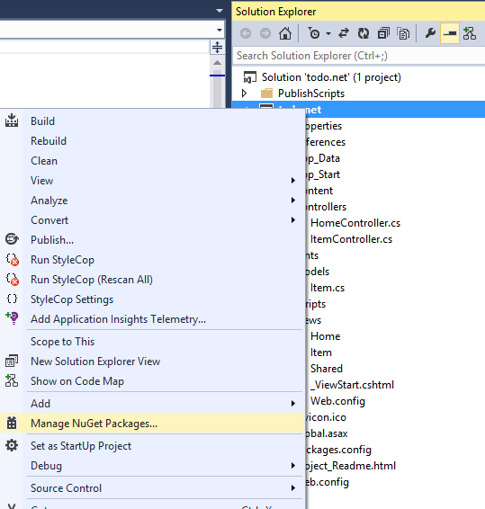

    The **Manage NuGet Packages** dialog box appears.

2. In the **Search Online** box, type ***Azure DocumentDB***. 
    
    From the results, install the **Microsoft Azure DocumentDB Client Library** package. This will download and install the DocumentDB package as well as all dependencies, like Newtonsoft.Json.

  	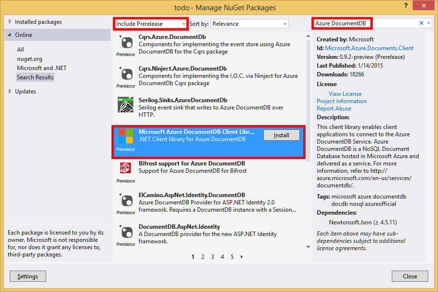

  	Alternatively you can use the Package Manager Console to install the package. To do so, on the **Tools** menu, click **NuGet Package Manager**, and then click **Package Manager Console**. At the prompt, type the following.

    	Install-Package Microsoft.Azure.DocumentDB

3. Once the package is installed, your Visual Studio solution should resemble the following with two new references added, Microsoft.Azure.Documents.Client and Newtonsoft.Json.

  	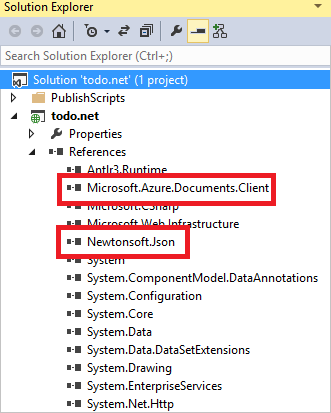

##Step 4: Set up the ASP.NET MVC application
 
Now let's add the models, views, and controllers to this MVC application:

- [Add a model](#_Toc395637764).
- [Add a controller](#_Toc395637765).
- [Add views](#_Toc395637766).

### Add a model

Let's begin by creating the **M** in MVC, the model. 

1. In **Solution Explorer**, right-click the **Models** folder, click **Add**, and then click **Class**.

  	The **Add New Item** dialog box appears.

2. Name your new class **Item.cs** and click **Add**. 

3. In this new **Item.cs** file, add the following after the last *using statement*.
		
		using Newtonsoft.Json;
	
4. Now replace this code 
		
		public class Item
		{
		}

	with the following code.
		
        public class Item
        {
        	[JsonProperty(PropertyName="id")]
        	public string Id { get; set; }
		
        	[JsonProperty(PropertyName="name")]
        	public string Name { get; set; }
		
        	[JsonProperty(PropertyName = "desc")]
        	public string Description { get; set; }
		
       		[JsonProperty(PropertyName="isComplete")]
        	public bool Completed { get; set; }    
		}

	All data in DocumentDB is passed over the wire and stored as JSON. To control the way your objects are serialized/deserialized by JSON.NET you can use the **JsonProperty** attribute as demonstrated in the **Item** class we just created. You don't **have** to do this but I want to ensure that my properties follow the JSON camelCase naming conventions. 
	
	Not only can you control the format of the property name when it goes into JSON, but you can entirely rename your .NET properties like I did with the **Description** property. 
	

### Add a controller

That takes care of the **M**, now let's create the **C** in MVC, a controller class.

1. In **Solution Explorer**, right-click the **Controllers** folder, click **Add**, and then click **Controller**.

    The **Add Scaffold** dialog box appears.

2. Select **MVC 5 Controller - Empty** and then click **Add**.

	

3. Name your new Controller, **ItemController.**

	

	Once the file is created, your Visual Studio solution should resemble the following with the new ItemController.cs file in **Solution Explorer**. The new Item.cs file created earlier is also shown.

	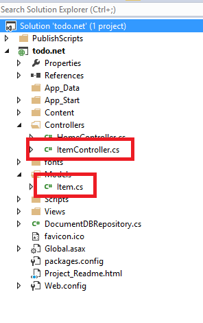

	You can close ItemController.cs, we'll come back to it later. 

### Add views

Now, let's create the **V** in MVC, the views:

- [Add an Item Index view](#AddItemIndexView).
- [Add a New Item view](#AddNewIndexView).
- [Add an Edit Item view](#_Toc395888515).

#### Add an Item Index view

1. In **Solution Explorer**, expand the **Views**  folder, right-click the empty **Item** folder that Visual Studio created for you when you added the **ItemController** earlier, click **Add**, and then click **View**.

	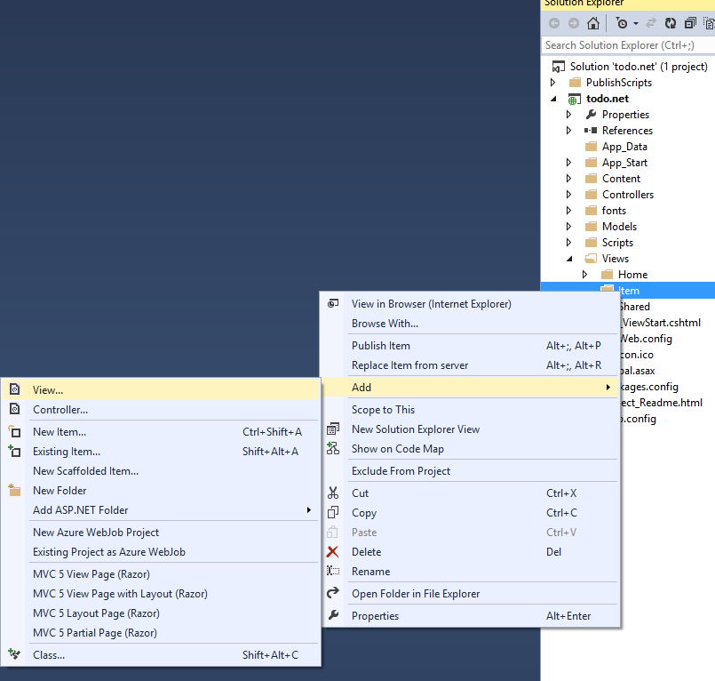

2. In the **Add View** dialog box, do the following:
	- In the **View name** box, type ***Index***.
	- In the **Template** box, select ***List***.
	- In the **Model class** box, select ***Item (todo.Models)***.
	- Leave the **Data context class** box empty. 
	- In the layout page box, type ***~/Views/Shared/_Layout.cshtml***.
	
	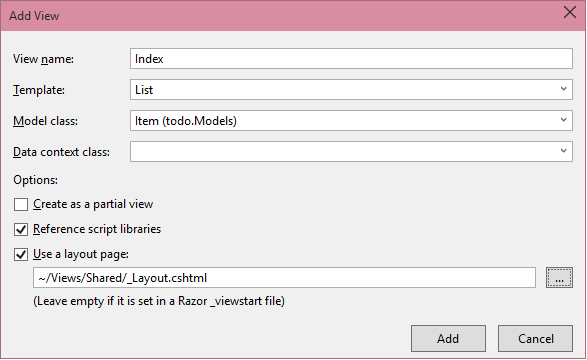

3. Once all these values are set, click **Add** and let Visual Studio create a new template view. Once it is done, it will open the cshtml file  that was created. We can close that file in Visual Studio as we will come back to it later.

#### Add a New Item view

Similar to how we created an **Item Index** view, we will now create a new view for creating new **Items**.

1. In **Solution Explorer**, right-click the **Item** folder again, click **Add**, and then click **View**.

2. In the **Add View** dialog box, do the following:
    - In the **View name** box, type ***Create***.
    - In the **Template** box, select ***Create***.
    - In the **Model class** box, select ***Item (todo.Models)***.
    - Leave the **Data context class** box empty.
    - In the layout page box, type ***~/Views/Shared/_Layout.cshtml***.
    - Click **Add**.

#### Add an Edit Item view

And finally, add one last view for editing an **Item** in the same way as before.

1. In **Solution Explorer**, right-click the **Item** folder again, click **Add**, and then click **View**.

2. In the **Add View** dialog box, do the following:
    - In the **View name** box, type ***Edit***.
    - In the **Template** box, select ***Edit***.
    - In the **Model class** box, select ***Item (todo.Models)***.
    - Leave the **Data context class** box empty. 
    - In the layout page box, type ***~/Views/Shared/_Layout.cshtml***.
    - Click **Add**.

Once this is done, close all the cshtml documents in Visual Studio as we will return to these views later.

## Step 5: Wiring up DocumentDB

Now that the standard MVC stuff is taken care of, let's turn to adding the code for DocumentDB. 

In this section, we'll add code to handle the following:

- [Listing incomplete Items](#_Toc395637770).
- [Adding Items](#_Toc395637771).
- [Editing Items](#_Toc395637772).

### Listing incomplete Items

The first thing to do here is add a class that contains all the logic to connect to and use DocumentDB. For this tutorial we'll encapsulate all this logic in to a repository class called DocumentDBRepository. 

1. In **Solution Explorer**, right-click on the project, click **Add**, and then click **Class**. Name the new class **DocumentDBRepository** and click **Add**.
 
2. In the newly created **DocumentDBRepository** class and add the following *using statements* above the *namespace* declaration
		
		using Microsoft.Azure.Documents; 
	    using Microsoft.Azure.Documents.Client; 
	    using Microsoft.Azure.Documents.Linq; 
		using System.Configuration;
		using System.Linq.Expressions;
		using System.Threading.Tasks;

	Now replace this code 

		public class DocumentDBRepository
		{
    	}

	with the following code.

    	
		public static class DocumentDBRepository<T>
    	{
			//Use the Database if it exists, if not create a new Database
	    	private static Database ReadOrCreateDatabase()
	    	{
	        	var db = Client.CreateDatabaseQuery()
	        	                .Where(d => d.Id == DatabaseId)
	        	                .AsEnumerable()
	        	                .FirstOrDefault();
				
	        	if (db == null)
	        	{
	        	    db = Client.CreateDatabaseAsync(new Database { Id = DatabaseId }).Result;
	        	}
				
	        	return db;
	    	}
			
			//Use the DocumentCollection if it exists, if not create a new Collection
	    	private static DocumentCollection ReadOrCreateCollection(string databaseLink)
	   		{
	    	    var col = Client.CreateDocumentCollectionQuery(databaseLink)
	        	                  .Where(c => c.Id == CollectionId)
	        	                  .AsEnumerable()
	        	                  .FirstOrDefault();
		
	        	if (col == null)
	        	{
					var collectionSpec = new DocumentCollection { Id = CollectionId };
					var requestOptions = new RequestOptions {OfferType = "S1" };
					
	        	    col = Client.CreateDocumentCollectionAsync(databaseLink, collectionSpec, requestOptions).Result;
	        	}
				
	        	return col;
	    	}
			
			//Expose the "database" value from configuration as a property for internal use
     	   	private static string databaseId;
     	   	private static String DatabaseId
     	   	{
				get
				{
					if (string.IsNullOrEmpty(databaseId))
					{
						databaseId = ConfigurationManager.AppSettings["database"];
					}
				
					return databaseId;
				}
       	 	}
			
			//Expose the "collection" value from configuration as a property for internal use
    	    private static string collectionId;
    	    private static String CollectionId
    	    {
				get
				{
					if (string.IsNullOrEmpty(collectionId))
					{
						collectionId = ConfigurationManager.AppSettings["collection"];
					}
				
					return collectionId;
				}
    	    }
			
			//Use the ReadOrCreateDatabase function to get a reference to the database.
    	    private static Database database;
    	    private static Database Database
    	    {
				get
				{
					if (database == null)
					{
						database = ReadOrCreateDatabase();
					}
					
					return database;
				}
    	    }
			
			//Use the ReadOrCreateCollection function to get a reference to the collection.
    	    private static DocumentCollection collection;
    	    private static DocumentCollection Collection
    	    {
				get
				{
					if (collection == null)
					{
						collection = ReadOrCreateCollection(Database.SelfLink);
					}
					
					return collection;
				}
    	    }
			
			//This property establishes a new connection to DocumentDB the first time it is used, 
			//and then reuses this instance for the duration of the application avoiding the
			//overhead of instantiating a new instance of DocumentClient with each request
    	    private static DocumentClient client;
    	    private static DocumentClient Client
    	    {
    	        get
    	        {
    	            if (client == null)
    	            {
						string endpoint = ConfigurationManager.AppSettings["endpoint"];
						string authKey = ConfigurationManager.AppSettings["authKey"];
						Uri endpointUri = new Uri(endpoint);
						client = new DocumentClient(endpointUri, authKey);
    	            }
    	            
    	            return client;
    	        }
    	    }
    	}

	> [AZURE.TIP] When creating a new DocumentCollection you can supply an optional RequestOptions parameter of OfferType, which allows you to specify the performance level of the new collection. If this parameter is not passed the default offer type will be used. For more on DocumentDB offer types please refer to [DocumentDB Performance Levels](documentdb-performance-levels.md)

3. We're reading some values from configuration, so open the **Web.config** file of your application and add the following lines under the `<AppSettings>` section.
	
    	<add key="endpoint" value="enter the URI from the Keys blade of the Azure Preview portal"/>
    	<add key="authKey" value="enter the PRIMARY KEY, or the SECONDARY KEY, from the Keys blade of the Azure  Preview portal"/>
    	<add key="database" value="ToDoList"/>
    	<add key="collection" value="Items"/>
	
4. Now, update the values for *endpoint* and *authKey* using the Keys blade of the Azure Preview portal. Use the **URI** from the Keys blade as the value of the endpoint setting, and use the **PRIMARY KEY**, or **SECONDARY KEY** from the Keys blade as the value of the authKey setting.

    That takes care of wiring up the DocumentDB repository, now let's add our application logic.

5. The first thing we want to be able to do with a todo list application is to display the incomplete items.  Copy and paste the following code snippet anywhere within the **DocumentDBRepository** class.

	    public static IEnumerable<T> GetItems(Expression<Func<T, bool>> predicate) 
	    {
			return Client.CreateDocumentQuery<T>(Collection.DocumentsLink) 
				.Where(predicate) 
				.AsEnumerable(); 
		} 

6. Open the **ItemController** we added earlier and add the following *using statements* above the namespace declaration.

		using System.Net;
		using System.Threading.Tasks;
		using todo.Models;

	If your project is not named "todo", then you need to update using "todo.Models"; to reflect the name of your project.

	Now replace this code

		//GET: Item
		public ActionResult Index()
		{
			return View();
		}

	with the following code.

    	public ActionResult Index()
    	{
			var items = DocumentDBRepository<Item>.GetItems(d => !d.Completed);
			return View(items);
    	}
	
At this point your solution should be able to build without any errors.

If you ran the application now, you would go to the **HomeController** and the **Index** view of that controller. This is the default behavior for the MVC template project we chose at the start but we don't want that! Let's change the routing on this MVC application to alter this behavior.

Open ***App\_Start\RouteConfig.cs*** and locate the line starting with "defaults:" and change it to resemble the following.

    	defaults: new { controller = "Item", action = "Index", id = UrlParameter.Optional }

This now tells ASP.NET MVC that if you have not specified a value in the URL to control the routing behavior that instead of **Home**, use **Item** as the controller and user **Index** as the view.

Now if you run the application, it will call into your **ItemController** which will call in to the repository class and use the GetItems method to return all the incomplete items to the **Views**\\**Item**\\**Index** view. 

If you build and run this project now, you should now see something that looks this.    

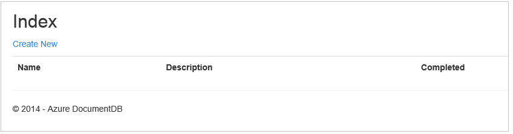

### Adding Items

Let's put some items into our database so we have something more than an empty grid to look at.

Let's add some code to  DocumentDBRepository and ItemController to persist the record in DocumentDB.

1.  Add the following method to your **DocumentDBRepository** class.

    	public static async Task<Document> CreateItemAsync(T item)
   	 	{
   	   		return await Client.CreateDocumentAsync(Collection.SelfLink, item);
   		}

	This method simply takes an object passed to it and persists it in DocumentDB.

2. Open the ItemController.cs file and add the following code snippet within the class. This is how ASP.NET MVC knows what to do for the **Create** action. In this case just render the associated Create.cshtml view created earlier.

    	public ActionResult Create()
    	{ 
			return View(); 
   		}

	We now need some more code in this controller that will accept the submission from the **Create** view.

2. Add the next block of code to the ItemController.cs class that tells ASP.NET MVC what to do with a form POST for this controller.
	
    	[HttpPost]
    	[ValidateAntiForgeryToken]
   	 	public async Task<ActionResult> Create([Bind(Include = 	"Id,Name,Description,Completed")] Item item)  
  	  	{
			if (ModelState.IsValid)  
			{  
			    await DocumentDBRepository<Item>.CreateItemAsync(item);
			    return RedirectToAction("Index");  
			}   
			return View(item);   
		}
	This code calls in to the DocumentDBRepository and uses the CreateItemAsync method to persist the new todo item to the database. 
 
	**Security Note**: The **ValidateAntiForgeryToken** attribute is used here to help protect this application against cross-site request forgery attacks. There is more to it than just adding this attribute, your views need to work with this anti-forgery token as well. For more on the subject, and examples of how to implement this correctly, please see [Preventing Cross-Site Request Forgery][]. The source code provided on [GitHub][] has the full implementation in place.

	**Security Note**: We also use the **Bind** attribute on the method parameter to help protect against over-posting attacks. For more details please see [Basic CRUD Operations in ASP.NET MVC][].

This concludes the code required to add new Items to our database.

### Editing Items

There is one last thing for us to do, and that is to add the ability to edit **Items** in the database and to mark them as complete. The view for editing was already added to the project, so we just need to add some code to our controller and to the **DocumentDBRepository** class again.

1. Add the following to the **DocumentDBRepository** class.

    	public static T GetItem(Expression<Func<T, bool>> predicate)
    	{
        	return Client.CreateDocumentQuery<T>(Collection.DocumentsLink)
                    	.Where(predicate)
                    	.AsEnumerable()
                    	.FirstOrDefault();
    	}		

    	public static async Task<Document> UpdateItemAsync(string id, T item)
    	{
        	Document doc = GetDocument(id);	
        	return await Client.ReplaceDocumentAsync(doc.SelfLink, item);
    	}

		private static Document GetDocument(string id) 
		{ 
			return Client.CreateDocumentQuery(Collection.DocumentsLink) 
				.Where(d => d.Id == id) 
				.AsEnumerable() 
				.FirstOrDefault(); 
		} 
	
	The first of these methods, **GetItem** fetches an Item from DocumentDB which is passed back to the **ItemController** and then on to the **Edit** view.
	
	The second of the methods we just added replaces the **Document** in DocumentDB with the version of the **Document** passed in from the **ItemController**.

2. Add the following to the **ItemController** class.

    	[HttpPost]
   		[ValidateAntiForgeryToken]
    	public async Task<ActionResult> Edit([Bind(Include = "Id,Name,Description,Completed")] Item item)
    	{
     	   if (ModelState.IsValid)
    	    {
    	        await DocumentDBRepository<Item>.UpdateItemAsync(item.Id, item);
    	        return RedirectToAction("Index");
    	    }

  	      return View(item);
 	   	}
		
		public ActionResult Edit(string id)
		{
		    if (string.IsNullOrEmpty(id))
		    {
		        return new HttpStatusCodeResult(HttpStatusCode.BadRequest);
		    }
					 
		    Item item = (Item)DocumentDBRepository<Item>.GetItem(d => d.Id == id);
		 	
		    if (item == null)
		    {
		        return HttpNotFound();
		    }
		 	
		    return View(item);
		}
		
	
	The first method handles the Http GET that happens when the user clicks on the **Edit** link from the **Index** view. This method fetches a [**Document**](http://msdn.microsoft.com/library/azure/microsoft.azure.documents.document.aspx) from DocumentDB and passes it to the **Edit** view.

	The **Edit** view will then do an Http POST to the **IndexController**. 
	
	The second method we added handles passing the updated object to DocumentDB to be persisted in the database.

That's it, that is everything we need to run our application, list incomplete **Items**, add new **Items**, and edit **Items**.

## Step 6: Run the application locally

To test the application on your local machine, do the following:

1. Hit F5 in Visual Studio to build the application in debug mode. It should build the application and launch a browser with the empty grid page we saw before:

	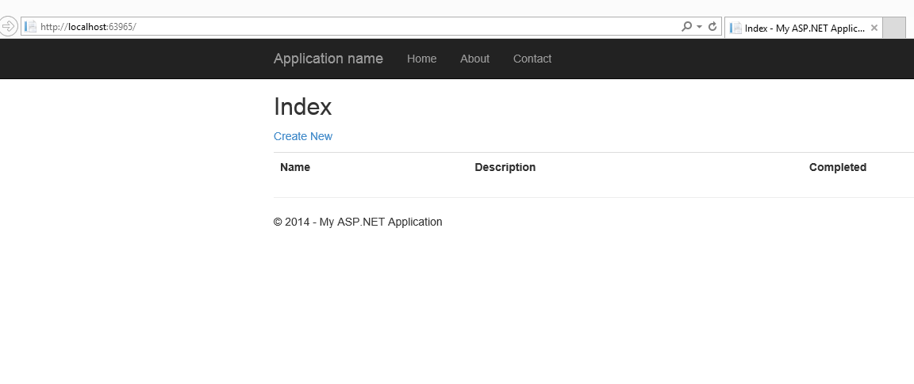

	If you run into errors at this point, you can compare your code against the todo tutorial on [GitHub][].

2. Click the **Create New** link and add values to the **Name** and **Description** fields. Leave the **Completed** check box unselected otherwise the new **Item** will be added in a completed state and will not appear on the initial list.

	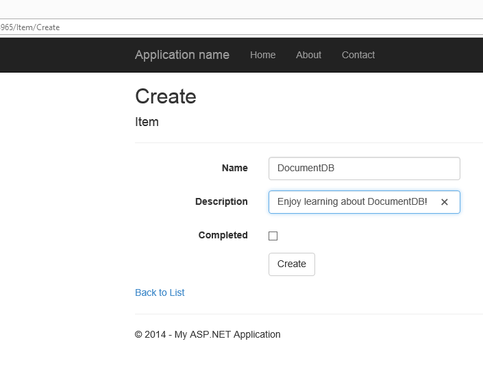

3. Click **Create** and you are redirected back to the **Index** view and your **Item** appears in the list.

	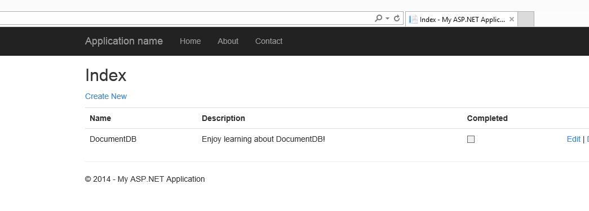

	Feel free to add a few more **Items** to your todo list.

3. Click **Edit** next to an **Item** on the list and you are taken to the **Edit** view where you can update any property of your object, including the **Completed** flag. If you mark the **Complete** flag and click **Save**, the **Item** is removed from the list of incomplete tasks.

	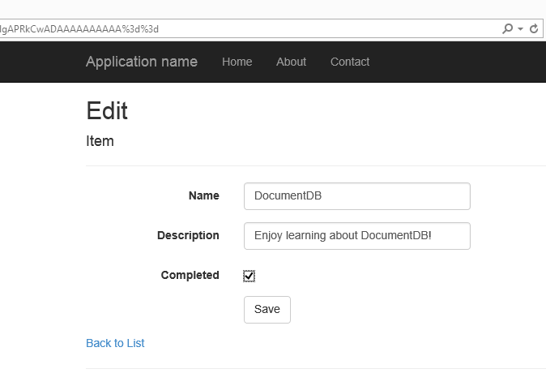

4. Once you've tested the app, press Ctrl+F5 to stop debugging the app. You're ready to deploy!

##Step 7: Deploy the application to Azure Websites

Now that you have the complete application working correctly with DocumentDB we're going to deploy this web app to Azure Websites. If you selected **Host in the cloud** when you created the empty ASP.NET MVC project then Visual Studio makes this really easy and does most of the work for you. 

1. To publish this application all you need to do is right-click on the project in **Solution Explorer** and click **Publish**.

    

2. Everything should already be configured according to your credentials; in fact the website has already been created in Azure for you at the **Destination URL** shown, all you need to do is click **Publish**.

    

In a few seconds, Visual Studio will finish publishing your web application and launch a browser where you can see your handy work running in Azure!

##Next steps

Congratulations! You just built your first ASP.NET MVC application using Azure DocumentDB and published it to Azure Websites. The source code for the complete application, including the detail and delete functionality that were not included in this tutorial can be downloaded or cloned from [GitHub][]. So if you're interested in adding that to your app, grab the code and add it to this app.

To add additional functionality to your application, review the APIs available in the [Document DB .NET Library](http://msdn.microsoft.com/library/azure/dn783362.aspx) and feel free to contribute to the DocumentDB .NET Library on [GitHub][]. 

##Get the solution from GitHub

If you're looking to save time and just want to build the complete todo solution, and not  add the code yourself, you're in luck. The complete solution is available on GitHub and you can build it and deploy it in a few minutes using the following instructions.

1. Ensure you have the [prerequisite software](#_Toc395637760) installed, which includes Visual Studio and Azure SDK for .NET version 2.3 or higher.

2. Clone the azure-documentdb-net repository using Git for Windows ([http://www.git-scm.com/](http://www.git-scm.com/)), or download the zip file from [GitHub](https://github.com/Azure/azure-documentdb-net/).

2. From Visual Studio, open the todo.sln file from the azure-documentdb-net/tutorials/todo directory.

3. To restore the references to the DocumentDB .NET SDK in Visual Studio 2013, right-click the todo solution in **Solution Explorer**, and then click **Enable NuGet Package Restore**, which will restore the references. 

4. Retrieve the **URI** and **PRIMARY KEY** or **SECONDARY KEY** values from the **Keys** blade of your DocumentDB account in the [Azure Preview portal](https://portal.azure.com/). 

	
	If you don't have an account, see [Create a database account](documentdb-create-account.md) to set one up.

	

5. In the Web.config file, update the default values for the **endpoint** and **authKey** keys.

    	<add key="endpoint" value="~enter URI for your DocumentDB Account, from Azure Preview portal~" /> 
		<add key="authKey" value="~enter either Primary or Secondary key for your DocumentDB Account, from Azure Preview portal~" /> 

	- Copy the **URI** value from the Keys blade and paste it into the **endpoint** property value. 
	- Copy the **PRIMARY KEY** or **SECONDARY KEY** value from the **Keys** blade and paste it into the **authKey** property value.
	

7. You can now [run your application locally](#_Toc395637773) and then [deploy it to Azure Websites](#_Toc395637774).

[\*]: https://microsoft.sharepoint.com/teams/DocDB/Shared%20Documents/Documentation/Docs.LatestVersions/PicExportError
[Visual Studio Express]: http://www.visualstudio.com/products/visual-studio-express-vs.aspx
[Microsoft Web Platform Installer]: http://www.microsoft.com/web/downloads/platform.aspx
[GitHub]: http://go.microsoft.com/fwlink/?LinkID=509838&clcid=0x409
[Preventing Cross-Site Request Forgery]: http://go.microsoft.com/fwlink/?LinkID=517254
[Basic CRUD Operations in ASP.NET MVC]: http://go.microsoft.com/fwlink/?LinkId=317598
