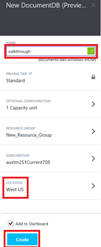
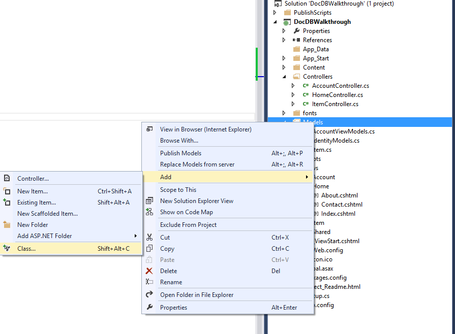

<properties title="Build a web application with ASP.NET MVC using DocumentDB" pageTitle="Build a web application with ASP.NET MVC using DocumentDB | Azure" description="Learn how to use DocumentDB to build a To Do List web application. You'll store and access data from an ASP.NET MVC web application hosted on Azure."  metaKeywords="NoSQL, DocumentDB,  database, document-orientated database, JSON, account" services="documentdb"  solutions="data-management" documentationCenter=""  authors="ryancraw" manager="jhubbard" editor="cgronlun" videoId="" scriptId="" />

<tags ms.service="documentdb" ms.workload="data-services" ms.tgt_pltfrm="na" ms.devlang="dotnet" ms.topic="article" ms.date="08/19/2014" ms.author="ryancraw" />

<a name="_Toc395809351">Build a web application with ASP.NET MVC using DocumentDB</a>
=======================================================================================================
  <a name="_Toc389828008">Overview</a>
==============================================================================================

<a name="_Toc395637759">Scenario</a>
------------------------------------

To highlight how customers can efficiently leverage Azure DocumentDB to store and query JSON documents, this document provides an end-to-end walk-through of building a ToDo List web application using Azure Document DB.

This walk-through shows you how to use DocumentDB service provided by Azure to store and access data from an ASP.NET MVC web application hosted on Azure and presumes that you have some prior experience using ASP.NET MVC and Azure Websites.

You will learn:

1\. Creating and provisioning a DocumentDB Account

2\. Creating a ASP.NET MVC Application

3\. Connecting to and using Azure DocumentDB from your web application

4\. Deploying the Web Application to Azure Websites

By following this walk-through, you will build a simple web-based task-management application that allows creating, retrieving and completing of tasks. The tasks will be stored as JSON documents in Azure DocumentDB.

<a name="_Toc395637760">Prerequisites</a>
================================================================

Before following the instructions in this article, you should ensure that you have the following installed:

Git for Windows <http://www.git-scm.com/downloads>

Visual Studio 2013 (or [Visual Studio Express][] which is the free version)

Azure SDK for .NET version 2.3 or higher, available through [Microsoft Web Platform Installer][]

All the screen shots in this document have been taken using Visual Studio 2013 with Update 3 applied and Azure SDK for .NET version 2.4. If your system is configured with different versions it is possible that your screens and options won't match entirely, but if you meet the above prerequisites this solution should work.

<a name="_Toc395637761">Create a DocumentDB database account</a>
================================================================

To provision a DocumentDB database account in Azure, open the Azure Management Portal and either Click the Azure Gallery tile on the homepage or click "+" in the lower left hand corner of the screen.

This will open the Azure Gallery, where you can select from the many available Azure services. In the Gallery, select "Data, storage and backup" from the list of categories.

From here, select the option for Azure DocumentDB

Then select "Create" from the bottom of the screen

This will open up the "New DocumentDB" blade where you can specify the name, region, scale, resource group and other settings for your new account.

Once you're done supplying the values for your account, click "Create" and the provisioning process will begin creating your database account.
When the provisioning process is complete, you should see a notification appear in the notifications area of the portal and the tile on your start screen (if you selected to create one) will change to show the completed action.

Once provisioning is complete, clicking the DocumentDB tile from the start screen will bring up the main blade for this newly created DocumentDB account.

 

Using the "Keys" button, access your endpoint URL and the Primary Key, copy these to your clipboard and keep them handy as we will use these values in the web application we will use these values in the web application we will create next.

We will now walk through how to create a new ASP.NET MVC application from the ground-up. For your reference the complete solution can be downloaded [here].

<a name="_Toc395637762">Create a new ASP.NET MVC application</a>
================================================================

In Visual Studio, click File - New Project and select the option to create a new ASP.NET MVC Web Application.

Select where you would like to create the project, what you want the project to be called (I'm using "todo") and click Ok.

If you plan on hosting your application in Azure then select the box on the lower right to "Host in the cloud". We've selected to host in the cloud, and run the application hosted in an Azure Website. Selecting this option will pre-provision an Azure Website for you and make life a lot easier when it comes times to deploy the final working application. If you want to host this elsewhere or don't want to configure Azure upfront, then just un-check the "Host in the Cloud" option.

Select OK and let Visual Studio do its thing around scaffolding the empty ASP.NET MVC template. If you chose to host this in the Cloud you will see at least one additional screen asking you to login to your Azure account and provide some values for your new Website. Proceed to supply all these Azure values and continue. 

I haven't chosen a "Database server" here because we're not using an Azure SQL Database Server here, we're going to be creating a new Azure DocumentDB Account later on in the management portal. 

Once Visual Studio has finished creating the boilerplate MVC application you have an empty ASP.NET application that you can run locally.

We'll skip running locally because I'm sure we've all seen the ASP.NET "Hello World" application. Let's go straight to adding DocumentDB to this project and building our application.

</h1>
<a name="_Toc395637767">Adding DocumentDB to your project</a>
=============================================================

That takes care of most of the ASP.NET MVC plumbing that we need for
this solution. Now let's get to the real purpose of this tutorial, adding Azure DocumentDB to our web application.

### 

### <a name="_Toc395637764">Installing the NuGet package</a>

The DocumentDB .NET SDK is packaged and distributed as a NuGet package. Using the NuGet package manager in Visual Studio (which you can get to by Right-Clicking on the Project and choosing "Manage NuGet Packages"

Search for Online for "Azure DocumentDB" and install the package. This will download and install the DocumentDB package as well as all dependencies, like Newtonsoft.Json.

**NOTE:** While the service is still in preview, the NuGet package is marked as "Prerelease" so you need to include the option to "Include Prerelease", else you will not find the package. 

Alternatively you could use the Package Command Console to install the package by typing;

    Install-Package Microsoft.Azure.Documents.Client -Pre

Once installed your Visual Studio solution should resemble the following with two new references added;

<a name="_Toc395637763">Setting up the ASP.NET MVC application</a>
==================================================================

### 

### <a name="_Toc395637764">Add a Model</a>

Let's begin by creating the **M** in MVC, the model. In Solution Explorer, right-click the *Models* folder and then click **Add**, then **Class**

Name your new Class, **Item** and then add the following code in to this new Class

    public class Item
    {
        [JsonProperty(PropertyName="id")]
        public string Id { get; set; }
		
        [JsonProperty(PropertyName="name")]
        public string Name { get; set; }
		
        [JsonProperty(PropertyName = "desc")]
        public string Description { get; set; }
		
        [JsonProperty(PropertyName="isComplete")]
        public bool Completed { get; set; }    
    }

All data in DocumentDB is passed over the wire, and stored, as JSON. To control the way your objects are serialized/deserialized by JSON.NET you can use the JsonProperty attribute as demonstrated in the Item class we just created. You don't **have** to do this but i wanted to ensure that my properties followed the JSON camelCase naming conventions. 

Not only can you control the format of the property name when it goes in to JSON, but you can entirely rename your .NET properties like I did with the Description property. 

You can, if you like, use JsonConverter objects here as well to completely control how serialization is handled.  

In order to get Visual Studio to resolve the "JsonProperty" attribute used here you need to add the following using statement to the using section of your class file;

    using Newtonsoft.Json;

### <a name="_Toc395637765">Add a Controller</a>

That takes care of the M, now let's create the **C** in MVC, a controller class.
In **Solution Explorer**, right-click the *Controllers* folder and then click **Add**, then **Controller**.

In the **Add Scaffold** dialog box, click **MVC 5 Controller - Empty.** Click **Add.**

Name your new Controller, **ItemController.**

Visual Studio will now add the ItemController your Solution Explorer should look like similar to below.

### <a name="_Toc395637766">Add Views</a>

And finally, let's create the **V** in MVC, a view.

#### Add Item Index View

Expand the ***Views***  folder in Solution Explorer and location the (empty) Item folder which Visual Studio would've created for you when you added the *ItemController* earlier. Right click on ***Item*** and choose to Add a new View.

In the "Add View" dialog. Call your view "***Index***", use the ***List*** Template, select the ***Item (todo.Models)*** which we created earlier as the class and finally use the ***~Views/Shared/_Layout.cshtml*** in the Solution as the Layout page.

Once all these values are set, click Add and let Visual Studio create your view for you. Visual Studio will create a template view. Once it is done, it will open the cshtml file created. We can close this document in Visual Studio as we will come back to it later.

#### Add New Item View

In a similar fashion to above, create a new View for creating new Items as per the example shown below;

#### Add Edit Item View

============================

And finally, add one last View for editing an Item in the same way as before;

Once this is done, close the cshtml documents in Visual Studio as we will return to these Views later.

</h1>
<a name="_Toc395637769">Wiring up DocumentDB</a>
------------------------------------------------

### <a name="_Toc395637770">Listing Incomplete Items</a>

Open the **ItemController** and remove all the code within the class (but leave the class) that Visual Studio added. We'll rebuild it piece by piece using DocumentDB.

Add the following code snippet within the now empty ItemController class;

    public ActionResult Index()
    {
        var items = DocumentDBRepository.GetIncompleteItems();
        return View(items);
    }

This code also uses a "pseudo repository" class called DocumentDBRepository which we have yet to create. This is actually just a Helper class that contains all the DocumentDB specific code. For the purposes of this walk-through we aren't going to implement a full data access layer with dependency injection, and factories and repository patterns, as you would probably be doing if you were building a real world application. 
For the purposes of this walk-through we're just going to put all the data access logic directly in to one project to keep things simple and focus on the DocumentDB specific bits.

Add a new Class to your project and call it **DocumentDBRepository.**
Replace the code in the class file with the following;

    public static class DocumentDBRepository
    {
        private static string databaseId;
        private static String DatabaseId
        {
			get
			{
				if (string.IsNullOrEmpty(databaseId))
				{
					databaseId = ConfigurationManager.AppSettings["database"];
				}
			
				return databaseId;
			}
        }
			  
        private static string collectionId;
        private static String CollectionId
        {
			get
			{
				if (string.IsNullOrEmpty(collectionId))
				{
					collectionId = ConfigurationManager.AppSettings["collection"];
				}
			
				return collectionId;
			}
        }
				
        private static Database database;
        private static Database Database
        {
			get
			{
				if (database == null)
				{
					database = ReadOrCreateDatabase();
				}
				
				return database;
			}
        }
		
        private static DocumentCollection collection;
        private static DocumentCollection Collection
        {
			get
			{
				if (collection == null)
				{
					collection = ReadOrCreateCollection(Database.SelfLink);
				}
				
				return collection;
			}
        }
		
        private static DocumentClient client;
        private static DocumentClient Client
        {
            get
            {
                if (client == null)
                {
					string endpoint = ConfigurationManager.AppSettings["endpoint"];
					string authKey = ConfigurationManager.AppSettings["authKey"];
					Uri endpointUri = new Uri(endpoint);
					client = new DocumentClient(endpointUri, authKey);
                }
                
                return client;
            }
        }
    } 

#### 

Spend some time resolving all the namespaces in Visual Studio. All namespaces will be easy to resolve in Visual Studio as long as the NuGet package was installed successfully. The references to the ReadOrCreateDatabase and ReadOrCreateCollection methods will remain unresolved until we have added them, which comes next. 

There are two method calls used here for reading or creating DocumentDB Databases and Document Collections.
So add the following two methods to this class;

    private static DocumentCollection ReadOrCreateCollection(string databaseLink)
    {
        var col = Client.CreateDocumentCollectionQuery(databaseLink)
                          .Where(c => c.Id == CollectionId)
                          .AsEnumerable()
                          .FirstOrDefault();

        if (col == null)
        {
            col = Client.CreateDocumentCollectionAsync(databaseLink, new DocumentCollection { Id = CollectionId }).Result;
        }
		
        return col;
    }

    private static Database ReadOrCreateDatabase()
    {
        var db = Client.CreateDatabaseQuery()
                        .Where(d => d.Id == DatabaseId)
                        .AsEnumerable()
                        .FirstOrDefault();
		
        if (db == null)
        {
            db = Client.CreateDatabaseAsync(new Database { Id = DatabaseId }).Result;
        }
		
        return db;
    }

</h1>

#### 

This takes care setting up the Database, a DocumentCollection, and creating some code to connect to DocumentDB through the DocumentClient. 

We're reading some values from configuration, so open the **web.config** and add the following lines under the
<AppSettings\> section;

    <add key="endpoint" value="enter you endpoint url from the Azure Management Portal"/>
    <add key="authKey" value="enter one of the keys from the Azure Management Portal"/>
    <add key="database" value="ToDoList"/>
    <add key="collection" value="Items"/>

</h4>

Now let's add some code to do the work. 
The first thing we want to be able to do with a ToDo List application is to display the incomplete items, The method below does this for you so copy & paste it anywhere within the repository class we are working with;
    
    public static List<Item> GetIncompleteItems()
    {
        return Client.CreateDocumentQuery<Item>(Collection.DocumentsLink)
                .Where(d => !d.Completed)
                .AsEnumerable()
                .ToList<Item>();
    }
    
The reference to *CreateDocumentQuery* will resolve after you need to manually add the following using directive;

    using Microsoft.Azure.Documents.Linq;

At this point your solution should be able to build without any errors.

If you ran the application now, you would go to the Home Controller and the Index view of that controller. This is the default behavior for the MVC template project we chose at the start but we don't want that! Let's change the routing on this MVC application to alter this behavior.

Open ***App\_Start\RouteConfig.cs*** and locate the line starting with "defaults:" and change it to resemble the following;

    defaults: new { controller = "Item", action = "Index", id = UrlParameter.Optional }

This now tells ASP.NET MVC that if you have not specified a value in the URL to control the routing behavior that instead of "Home" use "Item" as the controller and user Index as the view.
Now if you run the application, it will call in to your **ItemController** and return the results of the **GetIncompleteItems** method to the Views\Item\Index view. 

If you build and run this project now, you should now see something that looks this;    

### <a name="_Toc395637771">Adding Items</a>

Let's put some items in to our database so we have something more than an empty grid to look at.

We already have a View for Create, and a Button on the Index View which will take the user to the create view. Let's add some code to the Controller and Repository to persist the record in DocumentDB.

Open the ***ItemController.cs*** and add the following code snippet which is how ASP.NET MVC knows what to do for the Create action, in this case just render the associated Create.cshtml view created earlier.

    public ActionResult Create()
    { 
	return View(); 
    }

We now need some more code in this controller which will accept the submission from the create view.

Add the next block of code which tells ASP.NET MVC what to do with a form POST for this controller.
	
    [HttpPost]
    [ValidateAntiForgeryToken]
    public async Task<ActionResult> Create([Bind(Include = "Id,Name,Description,Completed")] Item item)  
    {
		if (ModelState.IsValid)  
		{  
		    await repo.CreateDocument(item);  
		    return RedirectToAction("Index");  
		}   
    	return View(item);   
    }

**Security Note**: The [ValidateAntiForgeryToken] attribute is used here to help protect this application against Cross-site Request Forgery attacks. There is more to it than just adding this attribute, your Views need to work with this anti-forgery token as well. For more on the subject, and examples of how to implement this correctly, please refer to [Preventing Cross-Site Request Forgery][]. The source code in the download link at the end of the article has the full implementation in place.

**Security Note**: We also use the [Bind] attribute on the method parameter to help protect against overposting attacks. For more details please see [Basic CRUD Operations in ASP.NET MVC][]

Now that this is in place, The Items Controller will  (securely) pass the Item, from the form, to the CreateDocument method of repository the class, so add the following method to your DocumentDBRepository class.

    public static async Task<Document> CreateItemAsync(Item item)
    {
        return await Client.CreateDocumentAsync(Collection.SelfLink, item);
    }

This method simply takes an object passed to it and persists it in DocumentDB.
This concludes the code required to add new items to our database.

### <a name="_Toc395637772">Editing Items</a>

There is one last thing for us to do, and that is the ability to edit items in the database and to mark them complete as we complete the tasks. As with adding, the view for editing has already been added so we just need to add some additional code to our Controller and to the DocumentDBRepository class again.

Add the following to the ItemController class;

    [HttpPost]
    [ValidateAntiForgeryToken]
    public async Task<ActionResult> Edit([Bind(Include = "Id,Name,Description,Completed")] Item item)
    {
        if (ModelState.IsValid)
        {
            await DocumentDBRepository.UpdateItemAsync(item);
            return RedirectToAction("Index");
        }

        return View(item);
    }
	
    public ActionResult Edit(string id)
    {
        if (id == null)
        {
            return new HttpStatusCodeResult(HttpStatusCode.BadRequest);
        }

        Item item = (Item)DocumentDBRepository.GetItem(id);
        if (item == null)
        {
            return HttpNotFound();
        }

        return View(item);
    }

The first method handles the Http Get that will happen when the user clicks on the "Edit" link from the Index view. This method fetches a Document from DocumentDB and passes it to the Edit View.

The Edit view will then do a Http Post to the IndexController. 
The second method we added handles this passing the updated object through to DocumentDB to be persisted in the database.

Add the following to the DocumentDBRepository class;

    public static Item GetItem(string id)
    {
        return Client.CreateDocumentQuery<Item>(Collection.DocumentsLink)
                    .Where(d => d.Id == id)
                    .AsEnumerable()
                    .FirstOrDefault();
    }
	
    public static async Task<Document> UpdateItemAsync(Item item)
    {
        Document doc = Client.CreateDocumentQuery(Collection.DocumentsLink)
                            .Where(d => d.Id == item.Id)
                            .AsEnumerable()
                            .FirstOrDefault();

        return await Client.ReplaceDocumentAsync(doc.SelfLink, item);
    }

The first of these two methods fetches an Item from DocumentDB which is passed back to the ItemController and then on to the Edit view.

The second of the two methods we just added replaces the document in DocumentDB with the version of the Document passed in from the ItemController.

That's it, that is everything we need to run our application, List incomplete items, Add new items, and lastly Edit items.

</h3>
<a name="_Toc395637773">Run your application locally</a>
=========================================================

### 

To test the application on your local machine, hit F5 in Visual Studio and it should build the application and launch a browser with the empty grid page we saw before:

1\.Use the provided fields for Item, Item Name and Category to enter information, and then click **"Create New"** link and supply some values. Leave the "Completed" check box unselected otherwise the new item will be added in a completed state and will not appear on the initial list.

If you hit Create, you will be redirected back to the Index page and hopefully your Item shows in the List.

Feel free to add a few more items to your Todo list.

2\.Click on "Edit" next to an Item on the list and you will be taken to the Edit view where you can update any property of your object, including the "Completed" flag. This effectively marks the item as complete and will remove it from the List of incomplete tasks.

3\.To complete a task, simply check the checkbox and then click **Save.** You will be redirected back to the list page where now the item will no longer appear of the list.

</h3>
<a name="_Toc395637774">Deploy application to Azure Websites</a>
================================================================

### 

Now that you have the complete application working correctly against DocumentDB we're going to deploy this to Azure Websites.

If you selected "Host in the cloud" when we created the empty ASP.NET MVC project then Visual Studio makes this really easy and does most of the work for us. To Publish this application to all you need to do, is Right Click on the Project in Solution Explorer (make sure you're not still running it locally) and select Publish

Everything should already be configured according to your credentials; in fact the website has already been created in Azure for you at the "Destination URL" shown, all you need to is Click **Publish**

In a few seconds, Visual Studio will finish publishing your web application and launch a browser where you can see your handy work running in Azure!

</h3>

<a name="_Toc395637775">Conclusion</a>
======================================

### 

Congratulations! You have just built your first ASP.NET MVC Application using Azure DocumentDB and published it to Azure Websites. The source code for the complete application, including the Details & Delete functionality that we skipped here, can be downloaded [here][].

[\*]: https://microsoft.sharepoint.com/teams/DocDB/Shared%20Documents/Documentation/Docs.LatestVersions/PicExportError
[Visual Studio Express]: http://www.visualstudio.com/en-us/products/visual-studio-express-vs.aspx
[Microsoft Web Platform Installer]: http://www.microsoft.com/web/downloads/platform.aspx
[here]: http://go.microsoft.com/fwlink/?LinkID=509838&clcid=0x409
[Preventing Cross-Site Request Forgery]: http://go.microsoft.com/fwlink/?LinkID=517254
[Basic CRUD Operations in ASP.NET MVC]: http://go.microsoft.com/fwlink/?LinkId=317598
