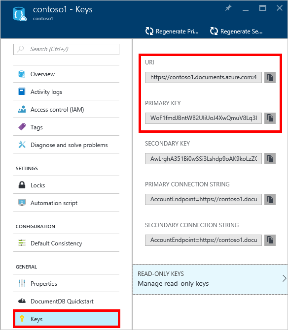
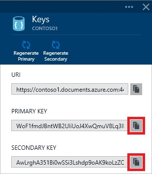
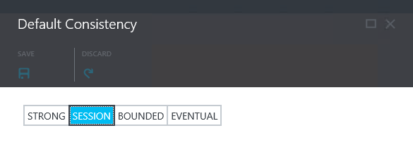
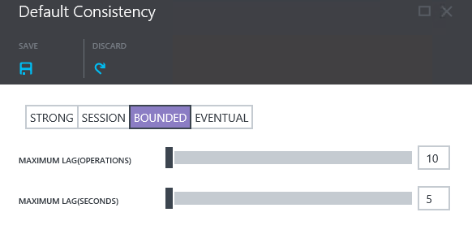

<properties 
	pageTitle="Manage a DocumentDB account | Azure" 
	description="Learn how to manage your DocumentDB account." 
	services="documentdb" 
	documentationCenter="" 
	authors="stephbaron" 
	manager="jhubbard" 
	editor="cgronlun"/>

<tags 
	ms.service="documentdb" 
	ms.workload="data-services" 
	ms.tgt_pltfrm="na" 
	ms.devlang="na" 
	ms.topic="article" 
	ms.date="04/29/2015" 
	ms.author="stbaro"/>

#How to manage a DocumentDB account

Learn how to work with keys, consistency settings, and learn how to delete an account.

## View, copy, and regenerate access keys
When you create a DocumentDB account, the service generates two master access keys that 
can be used for authentication when the DocumentDB
account is accessed. By providing two access keys, DocumentDB enables
you to regenerate the keys with no interruption to your DocumentDB
account.

In the [Microsoft Azure Preview portal](https://portal.azure.com/),
access the **Keys** part from your **DocumentDB Account** blade to view,
copy, and regenerate the access keys that are used to access your
DocumentDB account.

### View and copy an access key

1.      In the [Azure Preview portal](https://portal.azure.com/), access your DocumentDB account. 

2.      In the **Summary** lens, click **Keys**.

3.      On the **Keys** blade, click the **Copy** button to the right of the
key you wish to copy.

  

### Regenerate access keys

You should change the access keys to your DocumentDB account
periodically to help keep your connections more secure. Two access keys
are assigned to enable you to maintain connections to the DocumentDB
account using one access key while you regenerate the other access key.

> [AZURE.WARNING] Regenerating your access keys affects any applications that are
dependent on the current key. All clients that use the access key to
access the DocumentDB account must be updated to use the new key.

If you have applications or cloud services using the DocumentDB account,
you will lose the connections if you regenerate keys, unless you roll
your keys. The following steps outline the process involved in rolling your keys.

1.      Update the access key in your application code to reference the
secondary access key of the DocumentDB account.

2.      Regenerate the primary access key for your DocumentDB account.
In the  [Azure Preview portal](https://portal.azure.com/),
access your DocumentDB account.

3.      In the Summary lens, click **Keys**.

4.      On the **Keys** blade, click the **Regenerate Primary** command, then
click **Ok** to confirm that you want to generate a new key.

5.      Once you have verified that the new key is available for use
(approximately 5 minutes after regeneration), update the access key in
your application code to reference the new primary access key.

6.      Regenerate the secondary access key.

*Note that it can take several minutes before a newly generated key can
be used to access your DocumentDB account.*

## Manage DocumentDB Consistency Settings
DocumentDB supports four well-defined user-configurable data consistency
levels to allow developers to make predictable
consistency-availability-latency trade-offs.

- **Strong** consistency guarantees that read operations always
return the value that was last written.

- **Bounded Staleness** consistency guarantees that reads are
not too out-of-date. It specifically guarantees that the reads are no
more than K versions older than the last written version. 

- **Session** consistency guarantees monotonic reads (you never
read old data, then new, then old again), monotonic writes (writes are
ordered), and that you read the most recent writes within any single
client’s viewpoint.

- **Eventual** consistency guarantees that read operations
always read a valid subset of writes and will eventually converge.

*Note that by default, DocumentDB accounts are provisioned with Session
level consistency.  For additional information on DocumentDB consistency
settings, see the [Consistency
Level](http://go.microsoft.com/fwlink/p/?LinkId=402365) section.*

### To specify the default consistency for a DocumentDB Account

1.      In the [Azure Preview portal](https://portal.azure.com/), access your DocumentDB account. 

2.      In the **Configuration** lens, click **Default Consistency**.

3.      On the **Default Consistency** blade, select the default consistency
level you want for your DocumentDB account.

4.      Click **Save**.

5.      The progress of the operation may be monitored via the Azure Preview portal Notifications hub.

*Note that it can take several minutes before a change to the default
consistency setting takes affect across your DocumentDB account.*

##  How to: Delete a DocumentDB account
To remove a DocumentDB account that you are no longer using, use the
**Delete** command on the **DocumentDB Account** blade.

1.      In the [Azure Preview portal](https://portal.azure.com/), access the DocumentDB Account you
wish to delete. 

2.      On the **DocumentDB Account** blade, click the **Delete** command.

3.      On the resulting confirmation blade, type the DocumentDB Account
name to confirm that you want to delete the account.

4.      Click the **Delete** button on the confirmation blade.

## Next steps

Learn how to [get started with your DocumentDB
    account](http://go.microsoft.com/fwlink/p/?LinkId=402364).

To learn more about DocumentDB, see the Azure DocumentDB
    documentation on
    [azure.com](http://go.microsoft.com/fwlink/?LinkID=402319&clcid=0x409).

 
