<properties pageTitle="Monitor a DocumentDB account | Azure" description="Learn how to monitor your DocumentDB account for performance metrics (such as requests and server errors) and usage metrics (such as storage consumption)." services="documentdb" documentationCenter="" authors="mimig1" manager="jhubbard" editor="cgronlun"/>

<tags ms.service="documentdb" ms.workload="data-services" ms.tgt_pltfrm="na" ms.devlang="na" ms.topic="article" ms.date="01/13/2015" ms.author="mimig"/>

#Monitor a DocumentDB account  

You can monitor your DocumentDB accounts in the [Azure Preview portal](https://portal.azure.com/). For each DocumentDB account, both performance metrics (such as requests and server errors) and usage metrics (such as storage consumption) are available.

##In this article  

+ [How to: View performance metrics for a DocumentDB account](#metrics)
+ [How to: Customize performance metric views for a DocumentDB account](#custom)
+ [How to: Create side-by-side performance metric charts](#create)
+ [How to: View usage metrics for a DocumentDB account](#view)
+ [How to: Set up performance metric alerts for a DocumentDB account](#setup)
+ [Next steps](#next)
 

##   How to: View performance metrics for a DocumentDB account
1.	In the [Azure Preview portal](https://portal.azure.com/), click **Browse**, **DocumentDB Accounts**, and then click the name of the DocumentDB account for which you would like to view performance metrics.
2.	Within the **Monitoring** lens you can, by default, see:
	*	Total requests for the current day.
	*	Average requests per second for the current day. 
	
	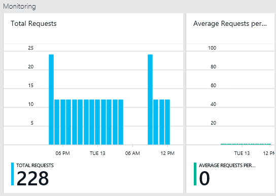

3.	Clicking on the **Total Requests** or **Average Requests per Second** part opens a detailed **Metric** blade.
4.	The **Metric** blade shows you details about the metrics you have selected.  At the top of the blade is a graph and below that a table which shows aggregation values of the selected metrics such as average, minimum, and maximum.  The metric blade also shows the list of alerts which have been defined, filtered to the metrics that appear on the current metric blade (this way, if you have a number of alerts, you'll only see the relevant ones presented here).   

	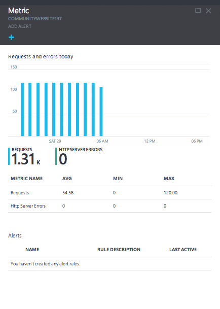

##   How to: Customize performance metric views for a DocumentDB account

1.	To customize the metrics that display in a particular part, right-click the metric chart, and then select **Edit Chart**.  
	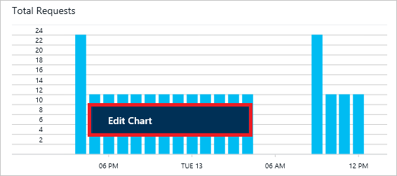

2.	On the **Edit Chart** blade, there are options to modify the metrics that display in the part, as well as their time range.  
	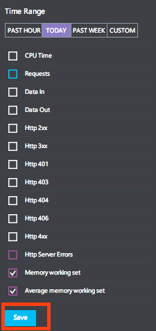

3.	To change the metrics displayed in the part, simply select or clear the available performance metrics, and then click **Save** at the bottom of the blade.  
4.	To change the time range, choose a different range (for example, **Past Hour**), and then click **Save** at the bottom of the blade.  

	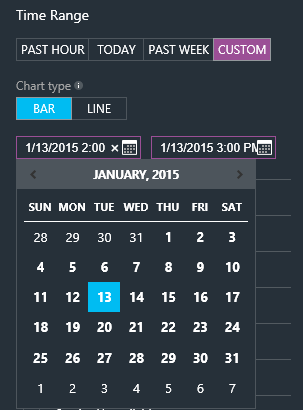 

##   How to: Create side-by-side performance metric charts
The Azure Preview portal allows you to create side-by-side metric charts.  

1.	First, right-click on the chart you want to clone and modify and select **Customize**. 

	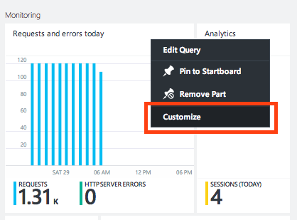

2.	Click **Clone** on the menu to copy the part and then click **Done customizing**. 

	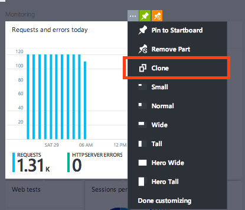  

You may now treat this part as any other metric part, customizing the metrics and time range displayed in the part.  By doing this, you can see two different metrics chart side-by-side at the same time.  
	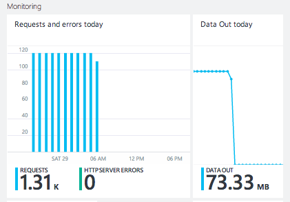  

##   How to: View usage metrics for a DocumentDB account
1.	In the [Azure Preview portal](https://portal.azure.com/), click **Browse**, **DocumentDB Accounts**, and then click the name of the DocumentDB account for which you would like to see usage metrics.
2.	Within the **Usage** lens you can view the following by default:
	*	Estimated cost.
	*	Storage consumed within the account.
	*	Maximum available storage of the account.
	*	User and permission usage.
	*	Capacity Unit (CU) allocation.
	*	Attachment usage.

	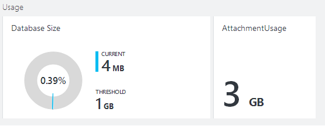
 
##   How to: Set up performance metric alerts for a DocumentDB account
1.	In the [Azure Preview portal](https://portal.azure.com/), click **Browse**, **DocumentDB Accounts**, and then click the name of the DocumentDB account for which you would like to setup performance metric alerts.
2.	Within the **Operations** lens, click the **Alert rules** part.  
	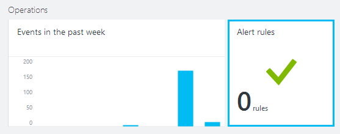

3.	In the Alert rules blade, click **Add Alert**.  
	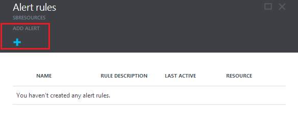

4.	In the **Add an alert rule** blade, specify:
	*	The name of the alert rule you are setting up.
	*	A description of the new alert rule.
	*	The metric for the alert rule.
	*	The condition, threshold, and period that determine when the alert activates. For example, a server error count greater than 5 over the last 15 minutes.
	*	Whether the service administrator and coadministrators are emailed when the alert fires.
	*	Additional email addresses for alert notifications.  
	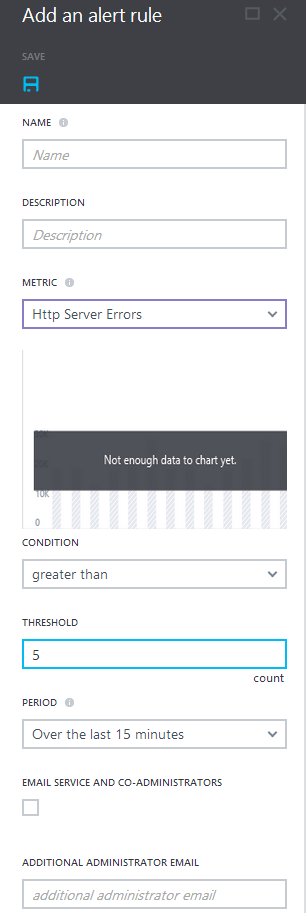

 
##   Next steps
To learn more about DocumentDB capacity and performance, see [Manage DocumentDB capacity and performance](../documentdb-manage/). 

<!--Anchors-->
[How to view performance metrics for a DocumentDB account]: #How-to-view-performance-metrics-for-a-DocumentDB-account
[Customize performance metric views for a DocumentDB account]: #Customize-performance-metric-views-for-a-DocumentDB-account
[How to create side-by-side performance metric charts]: #How-to-create-side-by-side-performance-metric-charts
[How to view usage metrics for a DocumentDB account]: #How-to-view-usage-metrics-for-a-DocumentDB-account
[How to setup performance metric alerts for a DocumentDB account]: #How-to-setup-performance-metric-alerts-for-a-DocumentDB-account
[Next steps]: #Next-steps
