<properties title="" pageTitle="Build a Node.js web application using DocumentDB | Azure" description="Learn how to use Azure DocumentDB to store and access data from a Node.js application hosted on Azure." metaKeywords="NoSQL, DocumentDB,  database, document-orientated database, JSON, getting started" services="documentdb" solutions="data-management" documentationCenter="" authors="ryancrawcour" manager="jhubbard" editor="cgronlun" scriptId=""/>

<tags ms.service="documentdb" ms.workload="data-services" ms.tgt_pltfrm="na" ms.devlang="na" ms.topic="article" ms.date="08/20/2014" ms.author="ryancraw" />

<a name="_Toc395783175">Build a Node.js web application using DocumentDB</a>
=================================================================================================

<a name="_Toc395783175">

This tutorial shows you how to use the Azure DocumentDB service to store and access data 
from a Node.js Express application hosted on Azure Websites.

This tutorial assumes that you have some prior experience using Node.js.

You will learn:

· How to use the Node.js Tools for Visual Studio

· How to work with Azure DocumentDB service using the documentdb npm module

· How to deploy the web application to Azure Websites

By following this tutorial, you will build a simple web-based
task-management application that allows creating, retrieving and
completing of tasks. The tasks will be stored as JSON documents in Azure
DocumentDB.

<a name="_Toc395783176">Prerequisites</a>
-----------------------------------------

Before following the instructions in this article, you should ensure
that you have the following installed:

[Node.js][] version v0.10.29 or higher

[Git][]

[Visual Studio 2013][] with update 3

[Node.js Tools for Visual Studio][]

**Note :** While we are using Visual Studio to build, debug, and deploy our Node.js
project in this tutorial you can use whichever editor you prefer
and run Node.js directly on whichever platform you choose in the way you
would normally run a Node.js project. You can then use the [Azure CLI][] tools to
deploy your application to Azure Websites

<a name="_Toc395637761">Create a DocumentDB database account</a>
================================================================

To provision a DocumentDB database account in Azure, open the [Azure Management Portal][] 
and either Click the Azure Gallery tile on the homepage or click “+” in the lower left hand corner of the screen.

This will open the Azure Gallery, where you can select from the many
available Azure services. In the Gallery, select “Data, storage and
backup” from the list of categories.

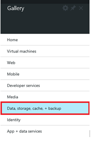

From here, select the option for Azure DocumentDB

Then select “Create” from the bottom of the screen

This will open up the “New DocumentDB” blade where you can specify the
name, region, scale, resource group and other settings for your new
account.

Once you’re done supplying the values for your account, Click “Create”
and the provisioning process will begin creating your database account.
Once the provisioning process is complete you should see a notification
appear in the notifications area of the portal and the tile on your
start screen (if you selected to create one) will change to show the
completed action.

Once provisioning is complete, clicking the DocumentDB tile from the
start screen will bring up the main blade for this newly created
DocumentDB account.

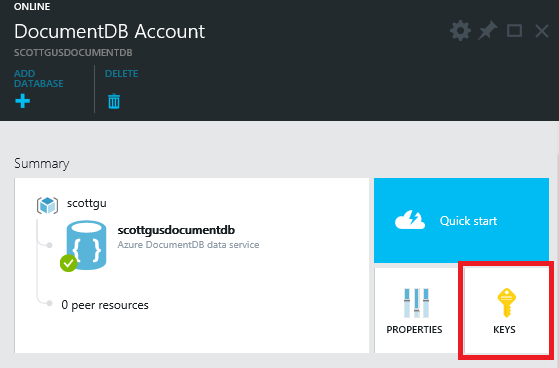 

Using the “Keys” button, access your endpoint URL and the Primary Key,
copy these to your clipboard and keep them handy as we will use these
values in the web application we will use these values in the web application we will create next.

<h2><a name="_Toc395783178">Create a new Node.js application</a></h2>

In Visual Studio, select File – New Project and Select to create a “Basic Microsoft Azure Express Application”

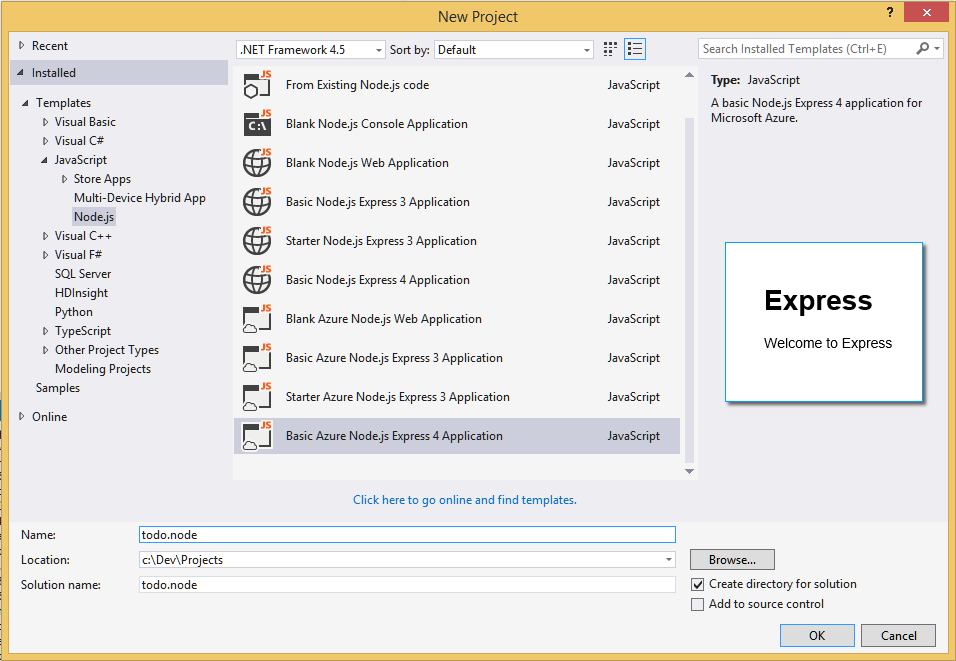

This will create a basic Express application for you. If you get
prompted to “install dependencies” select “Yes”. This will install all
the npm packages that are required for a new Express application.

Once this is complete the Solution Explorer should resemble the
following;

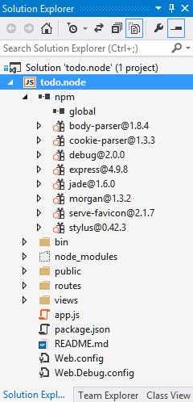

This shows you that you have Express, Jade and Stylus installed.

If you hit F5 in Visual Studio it should build the project, start
Node.js, and display a browser with the Express equivalent of “Hello
World”

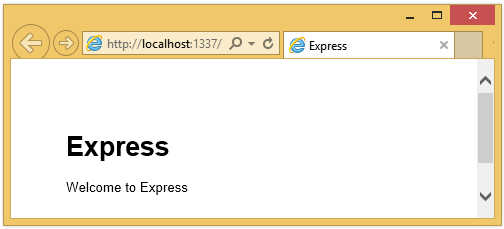

<a name="_Toc395783179">Install additional modules</a>
------------------------------------------------------

The **package.json** file is one of the files created in the root of the
project. This file contains a list of additional modules that are
required for an Express application. Later, when you deploy this
application to an Azure Web Site, this file will be used to determine
which modules need to be installed on Azure to support your application.

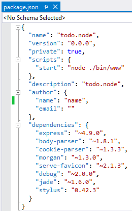

We need to install two more packages for this tutorial.

Right click on “npm” in the Solution Explorer and select “Install npm
Packages”

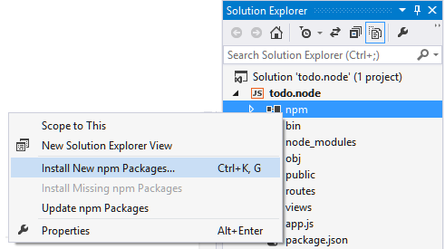

In the “Install New npm Packages” dialog, type **nconf** to search for
the module. This module will be used by the application to read the
database configuration values from a configuration file.

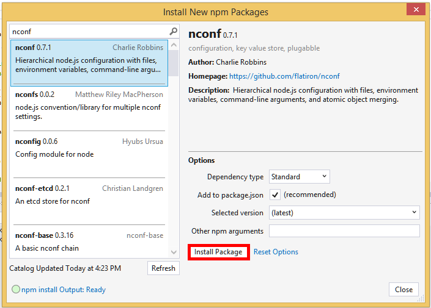

Finally, install the Azure DocumentDB module in the same way by search
for **documentdb**. This is the module where all the DocumentDB magic
happens.

Once you have installed these two additional modules, and dependencies, 
they should show up in Solution Explorer under the **npm**
modules.

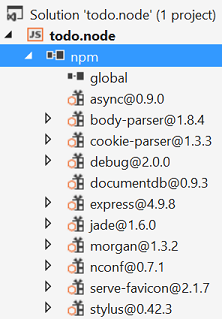

A quick check of the **package.json** file of the application should
show the additional modules, This file will tell Azure later which
packages it need to be download and installed when running your
application.

Edit the package.json file, if required, to resemble the example below.

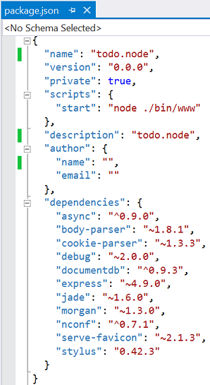

This tells Node (and Azure later) that your application depends on these
additional modules.

<h1><a name="_Toc395783180">Using the DocumentDB service in a node application</a></h1>

That takes care of all the initial setup and configuration, now let’s get down to why we’re here, and that’s to write some code using Azure DocumentDB.

To start, edit <b>app.js</b> located in the root of the Express application we just created.
Locate the following lines in the file;

    app.get('/', routes.index);
    app.get('/users', user.list);

And replace with the following two lines;

    app.get('/', routes.index);
    app.post('/', routes.createOrUpdateItem);

This tells the application what to do with the default GET and POST methods on a Form we will create next.

Now locate the <b>index.js</b> file found under the <b>routes</b> folder. Open this in your editor and delete all code found in this file.

Add the following at the top of the file;

    // import the modules we will use
    var DocumentDBClient = require('documentdb').DocumentClient;
    var nconf = require('nconf');
    
    // tell nconf which config file to use
    nconf.env();
    nconf.file({ file: 'config.json' });

This defines the modules that we are going to make use of; which are <b>documentdb</b> and <b>nconf</b>.

<b>nconf </b>is a module that allows you to load configuration values, like database connection strings, from external files rather than placing these values in-line in your code. nconf will look for a <b>config.json</b> by default for its configuration.

Let’s go ahead and create an empty text file called <b>config.json</b> in the root of the project (same location as app.js) 

Open this new <b>config.json</b> file and enter in the following values as appropriate for your DocumentDB endpoint. Be sure to set HOST and MASTER_KEY values correctly.

    {
	    "HOST"  	 : "<insert your DocDB endpoint here>",
	    "AUTH_KEY"	 : "<insert either primary or secondary key here>",
	    "DATABASE"	 : "ToDoList",
	    "COLLECTION" : "Items"
    }

Now, switching back to <b>index.js</b>, add the following lines after the last lines to actually go read the configuration file and store the values in page level variables.

      
    var host = nconf.get("HOST");
    var authKey = nconf.get("AUTH_KEY");
    var databaseId = nconf.get("DATABASE");
    var collectionId = nconf.get("COLLECTION");
    

Now that this is done, continue adding the following code to <b>index.js</b>

    // create some global variables which we will use later to hold instances of the DocumentDBClient, Database and Collection

	// create an instance of the DocumentDB client
    var client = new DocumentDBClient(host, { masterKey: authKey });
    
    exports.index = function (req, res) {   	
    	// before we can query for Items in the document store, we need to ensure we 
    	// have a database with a collection then use the collection to read the documents
    	readOrCreateDatabase(function (database) {
   			readOrCreateCollection(database, function (collection) {
    			listItems(collection, function (items) {
   					res.render('index', { title: 'My ToDo List', tasks: items });
				});    
			});
		});
	};
	
	exports.createOrUpdateItem = function (req, res) {
    	//first have to set the database & collection context so that we have the self links   
    	readOrCreateDatabase(function (database) {
        	readOrCreateCollection(database, function (collection) {
			            
				//if we find an item on the form, we'll create it in the database
            	var item = req.body.item;
            	if (item) {
                	createItem(collection, item, function () {
                    res.redirect('/');
                });
				
            	//else let's look for items marked as completed, 
            	//and update that item in the database
            	} else {
                	var completed = req.body.completed;
                	
	                //check if completed is actually an Array, if not make it one. 
                	//this happens when you select only one item            
                	if (!completed.forEach)
                    	completed = [completed];
                	
                	//use a recursive function to loop through items in 
                	//array calling updateItem each time through                                    
                	function updater(i) {
                    	if (i < completed.length) {
							updateItem(collection, completed[i], function () {
                            	updater(i + 1);
                        	});
                    	} else {
                        	res.redirect('/');
                    	}
                	}
                	
                	//kick off the recursion
                	updater(0);
            	}
			});
		});
	}

These are the two functions that we told the application to use earlier in the <b>app.js</b> when we defined the routes. When a GET hits the index view, the <b>exports.index</b> function will be run and similarly when a POST is received by the index view the <b>exports.createOfUpdateItem</b> function will be run.

These two functions do all the work of the application that we’re building however they call out to other functions, purely to make the code more readable and easier to follow. Continue adding the following code to the <b>index.js</b> file. This contains all the methods used by the two functions above and contain all the calls to DocumentDB. We will walk through each function in high-level detail later.

    // update item
	var updateItem = function (collection, itemId, callback) {
	    //first fetch the document based on the id
	    getItem(collection, itemId, function (doc) {
	        //now replace the document with the updated one
	        doc.completed = true;
	        client.replaceDocument(doc._self, doc, function (err, replacedDoc) {
	            if (err) {
	                throw (err);
	            }
	            
	            callback();
	        });
	    });
	}
	
	// get item
	var getItem = function (collection, itemId, callback) {      
	    client.queryDocuments(collection._self, 'SELECT * FROM root r WHERE r.id="' + itemId + '"').toArray(function (err, results) {
	        if (err) {
	            throw (err);
	        }
	
	        callback(results[0]);
	    });
	}
	
	// create new item
	var createItem = function (collection, documentDefinition, callback) {
	    documentDefinition.completed = false;
	    client.createDocument(collection._self, documentDefinition, function (err, doc) {
	        if (err) {
	            throw (err);
	        }
	        
	        callback();
	    });
	}
	
	// query the provided collection for all non-complete items
	var listItems = function (collection, callback) {
	    client.queryDocuments(collection._self, 'SELECT * FROM root r WHERE r.completed=false').toArray(function (err, docs) {
	        if (err) {
	            throw (err);
	        }
	        
	        callback(docs);
	    });
	}
	
	// if the database does not exist, then create it, else return the database object
	var readOrCreateDatabase = function (callback) {
	    client.queryDatabases('SELECT * FROM root r WHERE r.id="' + databaseId + '"').toArray(function (err, results) {
	        if (err) {
	            // some error occured, rethrow up
	            throw (err);
	        }
	        if (!err && results.length === 0) {
	            // no error occured, but there were no results returned 
	            // indicating no database exists matching the query            
	            client.createDatabase({ id: databaseId }, function (err, createdDatabase) {
	                callback(createdDatabase);
	            });
	        } else {
	            // we found a database
	            callback(results[0]);
	        }
	    });
	};
	
	// if the collection does not exist for the database provided, create it, else return the collection object
	var readOrCreateCollection = function (database, callback) {
	    client.queryCollections(database._self, 'SELECT * FROM root r WHERE r.id="' + collectionId + '"').toArray(function (err, results) {
	        if (err) {
	            // some error occured, rethrow up
	            throw (err);
	        }			
	        if (!err && results.length === 0) {
	            // no error occured, but there were no results returned 
	            //indicating no collection exists in the provided database matching the query
	            client.createCollection(database._self, { id: collectionId }, function (err, createdCollection) {
	                callback(createdCollection);
	            });
	        } else {
	            // we found a collection
	            callback(results[0]);
	        }
	    });
	};

<b>updateItem</b> – updates a document in the database based on the Item ID passed in from the form. It uses this ID to execute a <b><i>readDocument</i></b> method against DocumentDB to read the specific document we have stored. It then changes the “completed” attribute of the document to true, indicating it is now complete, and then proceeds to replace the document in the database. 

<b>getItem – </b>uses <b><i>queryDocuments </i></b>to get a single item from the database using the id property of the item.

<b>createItem</b> – uses the <b><i>createDocument</i></b> method to create a new document in the database based on the Item Name &amp; Item Category entered on the form. It also sets the completed flag to false, to indicate this item is not yet completed.

<b>listItems</b> – uses <b><i>queryDocuments</i></b> to look for all documents in the collection that are not yet complete, or where completed=false. It uses the DocumentDB query grammar which is based on ANSI-SQL to demonstrate this familiar, yet powerful querying capability. 

<b>readOrCreateDatabase</b> – uses <b><i>queryDatabases</i></b> to check if a database with this name already exists. If we can’t find one, then we go ahead and use <b><i>createDatabase</i></b> to create a new database with the supplied identifier (from our configuration file) on the endpoint specified (also from the configuration file)

<b>readOrCreateCollection</b> – as with readOrCreateDatabase this method first tried to find a collection with the supplied identifier, if one exists it is returned and if one does not exist it is created for you. 

That is all the code that is needed to interact with DocumentDB for this sample application.

Now let’s turn our attention to building the user interface so a user can actually interact with our application. The Express application we created uses <b>Jade</b> as the view engine. For more information on Jade please refer to <a href="http://jade-lang.com/">http://jade-lang.com/</a>

Open the <b>layout.jade </b>filefound in the <b>views</b> folder and replace the contents with the following;

	
	doctype html
	html
	  head
	    title= title
	    meta(http-equiv='X-UA-Compatible', content='IE=10')
	    link(rel='stylesheet', href='/stylesheets/style.css')
	    link(rel='stylesheet', href='/stylesheets/bootstrap.min.css')
	  body.app
	    nav.navbar.navbar-fixed-top
	      div.navbar-inner
	        container
	            a.brand(href='/') My Tasks
	    block content

This effectively tells the <b>Jade</b> engine to render some HTML for our application and creates a “<b>block</b>” called “<b>content</b>” where we can supply the layout for our content pages.

Now open the <b>index.jade </b>file, the view associated with index.js and replace the content with the following; 

	extends layout
	
	block content
	  h1= title
	  br
	
	  form(action="/", method="post")
	    table.table.table-striped.table-bordered
	      tr
	        td Name
	        td Category
	        td Complete
	      each task in tasks
	        tr
	            td #{task.name}
	            td #{task.category}
	            td 
	                input(type="checkbox", name="completed", value="#{task.id}", checked=(task.completed == true))
	    button.btn(type="submit") Update tasks
	
	  hr
	
	  form.well(action="/", method="post")
	    label Item Name:  
	    input(name="item[name]", type="textbox")
	    label Item Category: 
	    input(name="item[category]", type="textbox")
	    br
	    button.btn(type="submit") Add item

This extends layout, and provides content for the “block content”
placeholder we saw in the layout.jade file earlier.

In this layout we created two HTML forms. The first form contains a table 
for our data and a button that allows us to update items.The second form contains 
some input fields and a button that allows us to create a new item.

When either of these buttons are clicked the **createOrUpdateItem**
(i.e. a form POST is done) the function we created in the **index.js**
file will be called. If this page is just loaded directly (i.e. a GET is
performed) then the **index** function is run.

This should be all that we need for our application to work.

</h1>
<a name="_Toc395783181">Run your application locally</a>
========================================================

To test the application on your local machine, hit F5 in Visual Studio
and it should build the app, start Node.js and launch a browser with a
page that looks like the image below:

1\. Use the provided fields for Item, Item Name and Category to enter
information, and then click **Add Item**.

2\. The page should update to display the newly created item in the ToDo
List.

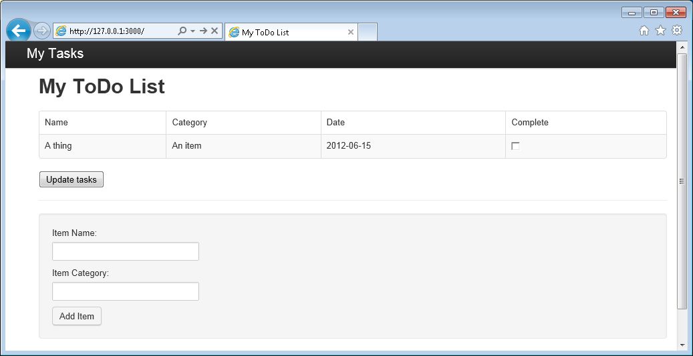

3\. To complete a task, simply check the checkbox in the Complete column,
and then click **Update tasks**

</h1>
<a name="_Toc395783182">Deploy your application to Azure Websites</a>
=====================================================================

With the Node.js Tools for Visual Studio installed deploying to Azure
Websites is easily accomplished in a few short steps.

Right click on your project and select “Publish”

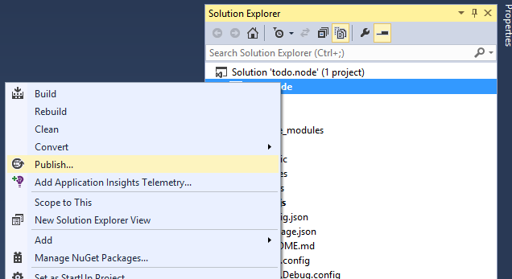

Then follow the publish wizard to provide the required configuration for
your Azure Website. The wizard will let you either choose an existing
website to update, or to create a new website.

Once you have supplied the necessary configuration just hit “Publish”

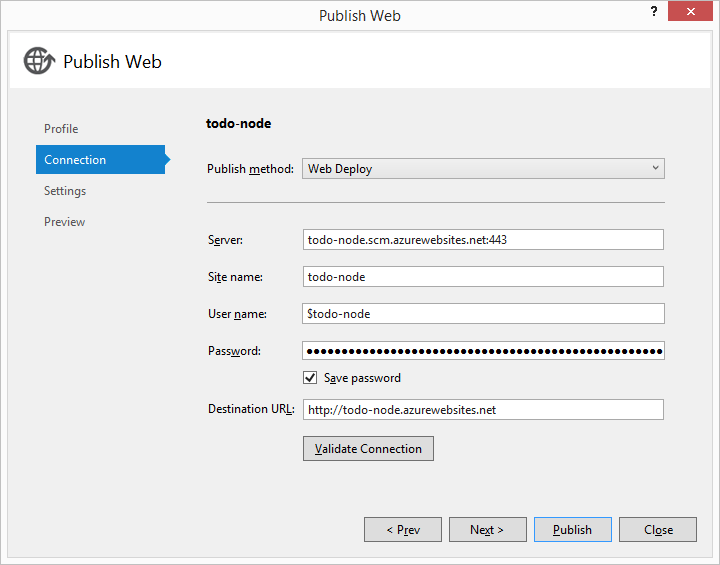

Then follow the publish wizard to provide the required configuration for
your Azure Website. The wizard will let you either choose an existing
website to update, or to create a new website.

Once you have supplied the necessary configuration just hit “Publish”

And Visual Studio will connect to your Azure subscription and publish
this Node.js application.

In a few seconds, Visual Studio will finish publishing your web
application and launch a browser where you can see your handy work
running in Azure!

 <a name="_Toc395637775">Conclusion</a>
===================================================================

Congratulations! You have just built your first Node.js Express Web
Application using Azure DocumentDB and published it to Azure Websites.

The source code for the complete reference application can be downloaded [here][].

</h1>
  [Node.js]: http://nodejs.org/
  [Git]: http://git-scm.com/
  [Visual Studio 2013]: http://msdn.microsoft.com/en-us/vstudio/cc136611.aspx
  [Node.js Tools for Visual Studio]: https://nodejstools.codeplex.com/
  [here]: http://go.microsoft.com/fwlink/?LinkID=509839&clcid=0x409
  [Azure CLI]: http://azure.microsoft.com/en-us/documentation/articles/xplat-cli/
  [Azure Management Portal]: http://portal.azure.com
