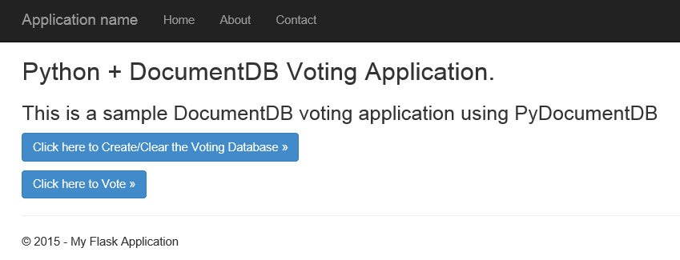
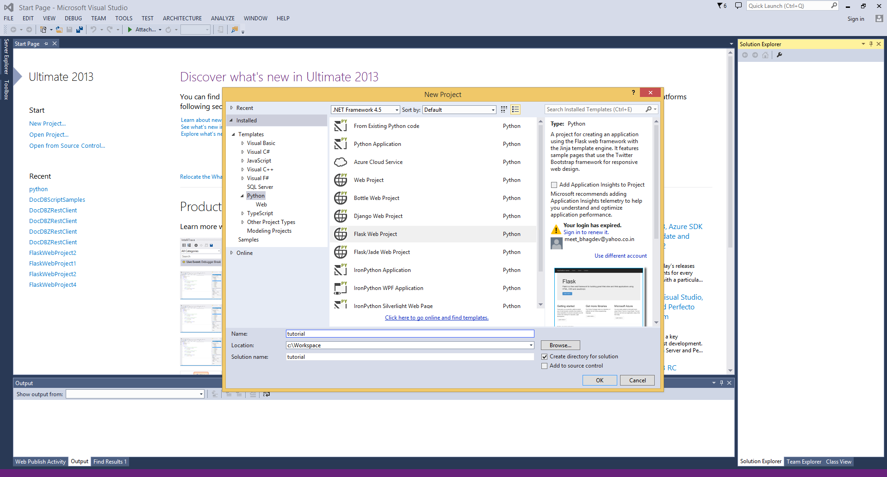
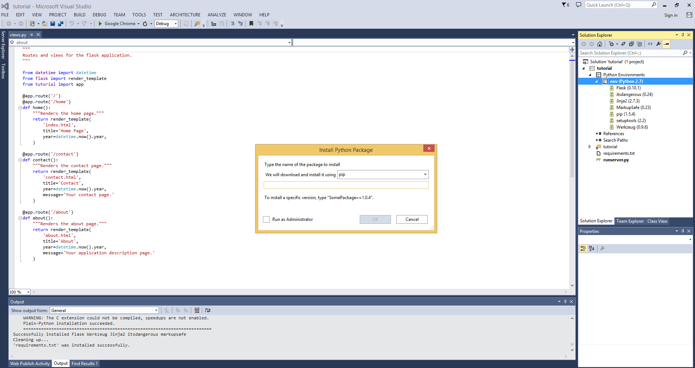
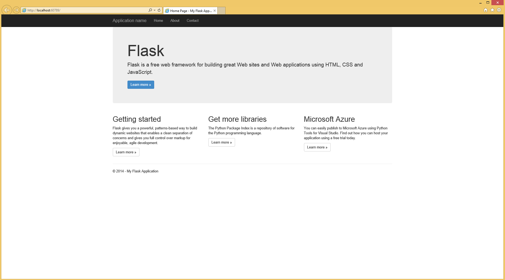
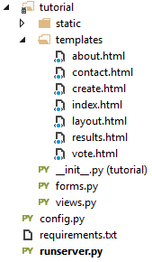
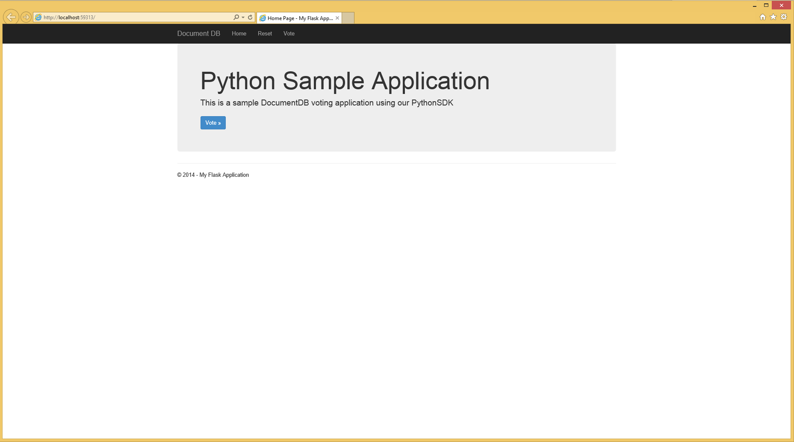
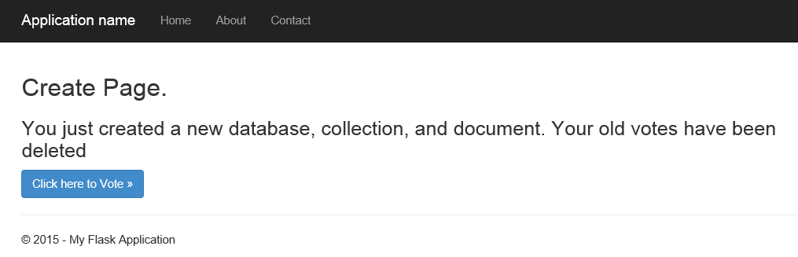
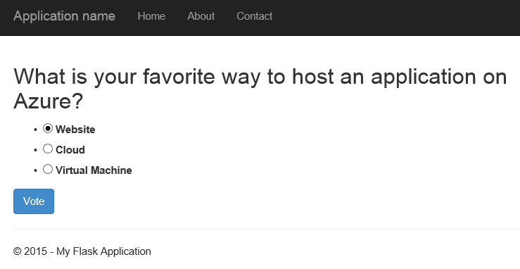
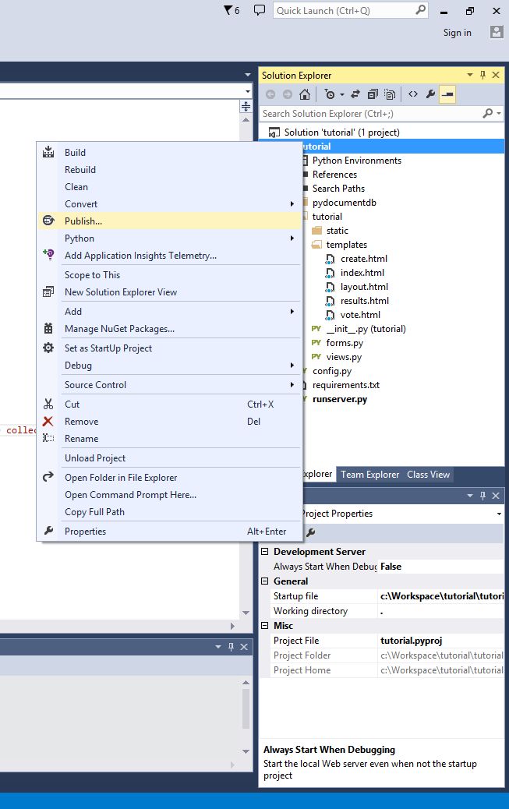
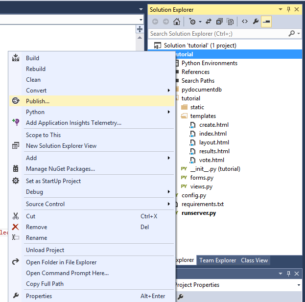

<properties 
    pageTitle="Build a web app with Python and Flask using DocumentDB | Azure" 
    description="Learn how to use DocumentDB to store and access data from an Python and Flask (MVC) web application hosted on Azure." 
    services="documentdb" 
    documentationCenter="python" 
    authors="ryancrawcour" 
    manager="jhubbard" 
    editor="cgronlun"/>

<tags 
    ms.service="documentdb" 
    ms.workload="data-management" 
    ms.tgt_pltfrm="na" 
    ms.devlang="python" 
    ms.topic="article" 
    ms.date="04/08/2015" 
    ms.author="ryancraw"/>

# Build a web application with Python and Flask (MVC) using DocumentDB

To highlight how customers can efficiently leverage Azure DocumentDB to
store and query JSON documents, this document provides an end-to-end
tutorial showing how to build a voting web application using Azure DocumentDB.

This tutorial shows you how to use the DocumentDB service provided by
Azure to store and access data from a Python web application hosted on
Azure and presumes that you have some prior experience using Python and
Azure Websites.

This tutorial covers:

1. Creating and provisioning a DocumentDB account.
2. Creating a Python MVC application.
3. Connecting to and using Azure DocumentDB from your web application.
4. Deploying the web application to Azure Websites.

By following this tutorial, you will build a simple voting
application that allows you to vote for a poll.

## Prerequisites

Before following the instructions in this article, you should ensure
that you have the following installed:

- [Visual Studio 2013](http://www.visualstudio.com/) or higher, or [Visual Studio Express], which is the free version.
- Python Tools for Visual Studio from [here][].
- Azure SDK for Visual Studio 2013, version 2.4 or higher available from
[here][1].
- Python 2.7 from [here][2].
- Microsoft Visual C++ Compiler for Python 2.7 from [here][3].

## Step 1: Create a DocumentDB database account

Let's start by creating a DocumentDB account. If you already have an account, you can skip to [Step 2: Create a new Python Flask Web Application](#Step-2:-Create-a-new-Python-Flask-Web-Application).

[AZURE.INCLUDE [documentdb-create-dbaccount](../includes/documentdb-create-dbaccount.md)]

[AZURE.INCLUDE [documentdb-keys](../includes/documentdb-keys.md)]

 
We will now walk through how to create a new Python Flask web application from the ground-up.

## Step 2: Create a new Python Flask web application

1. Open Visual Studio, then click **File** -\> **New Project** -\> **Python** -\>, **Flask Web
Project**, and create a new project with the name **tutorial**. 

	For those new to Flask, it is a web framework that helps us build web
applications in Python faster. [Click here to access Flask tutorials][].

	

2. It will ask you whether you want to
install external packages. Click on **Install into a virtual environment**. Be sure to use Python 2.7 as the base environment as PyDocumentDB does not currently support Python 3.x.  This will setup the required Python virtual environment for your project.

	

## Step 3: Modify the Python Flask web application

### Add flask packages to your project

Once your project is setup you need to add certain flask packages that
we will need for our project, including pydocumentdb, the python package for DocumentDB. 

1. Open the file named **requirements.txt** and replace the contents with the following.

    	flask==0.9
    	flask-mail==0.7.6
    	sqlalchemy==0.7.9
    	flask-sqlalchemy==0.16
    	sqlalchemy-migrate==0.7.2
    	flask-whooshalchemy==0.55a
    	flask-wtf==0.8.4
    	pytz==2013b
    	flask-babel==0.8
    	flup
    	pydocumentdb>=1.0.0

2. Right-click on **env** and click **install from requirements.txt**.

	

> [AZURE.NOTE] In rare cases, you may see a failure in the output window. If
this happens, check if the error is related to cleanup. Sometimes the
cleanup will fail but installation will still be successful (scroll up
in the output window to verify this).
 If this occurs it's ok to continue.

### Verify the virtual environment

Let's make sure that everything is installed properly. 

- Start the web
site by hitting **F5** This will launch the flask development server
and start your web browser. You should see the following page.

	

### Create Database, Collection and Document definitions

Now let's create our voting application.

- Add a Python file by right-clicking on on the folder named **tutorial** in the Solution Explorer.  Name the file **forms.py**.  

    	from flask.ext.wtf import Form
    	from wtforms import RadioField

    	class VoteForm(Form):
        	deploy_preference  = RadioField('Deployment Preference', choices=[
            	('Web Site', 'Web Site'),
            	('Cloud Service', 'Cloud Service'),
            	('Virtual Machine', 'Virtual Machine')], default='Web Site')

### Add the required imports to views.py

- Add the following import statements at the top in **views.py**. These
will import DocumentDB's PythonSDK and the Flask packages.

    	from forms import VoteForm
    	import config
    	import pydocumentdb.document_client as document_client
    

### Create Database, Collection and Document

- Add the following code to **views.py**. This takes care of creating the 
database used by the form. Do not delete any of the existing code in 
**views.py**. Simply append this to the end.

    	@app.route('/create')
    	def create():
        	"""Renders the contact page."""
        	client = document_client.DocumentClient(config.DOCUMENTDB_HOST, {'masterKey': config.DOCUMENTDB_KEY})
    
        	# Attempt to delete the database.  This allows this to be used to recreate as well as create
        	try:
            	db = next((data for data in client.ReadDatabases() if data['id'] == config.DOCUMENTDB_DATABASE))
            	client.DeleteDatabase(db['_self'])
        	except:
            	pass
    
       		# Create database
        	db = client.CreateDatabase({ 'id': config.DOCUMENTDB_DATABASE })
        	# Create collection
        	collection = client.CreateCollection(db['_self'],{ 'id': config.DOCUMENTDB_COLLECTION }, { 'offerType': 'S1' })
        	# Create document
        	document = client.CreateDocument(collection['_self'],
            	{ 'id': config.DOCUMENTDB_DOCUMENT,
            	'Web Site': 0,
            	'Cloud Service': 0,
            	'Virtual Machine': 0,
            	'name': config.DOCUMENTDB_DOCUMENT })
    
        	return render_template(
            	'create.html', 
            	title='Create Page', 
            	year=datetime.now().year,
            	message='You just created a new database, collection, and document.  Your old votes have been deleted')

> [AZURE.TIP] The CreateCollection method takes an optional RequestOptionsas the 3rd parameter. This can be used to specify the Offer Type for the Collection. If no offerType value is supplied then the Collection will be created using the default Offer Type. For more information on DocumentDB Offer Types please refer to [Performance levels in DocumentDB](documentdb-performance-levels.md)
> 
### Read Database, Collection, Document, and submit form

- Add the following code to **views.py**. This takes care of setting up
the form, reading the database, collection, and document. Do not delete
any of the existing code in **views.py**. Simply append this to the end.
    
    	@app.route('/vote', methods=['GET', 'POST'])
    	def vote(): 
        	form = VoteForm()
        	replaced_document ={}
        	if form.validate_on_submit(): # is user submitted vote  
            	client = document_client.DocumentClient(config.DOCUMENTDB_HOST, {'masterKey': config.DOCUMENTDB_KEY})
            
            	# Read databases and take first since id should not be duplicated.
            	db = next((data for data in client.ReadDatabases() if data['id'] == config.DOCUMENTDB_DATABASE))
            
            	# Read collections and take first since id should not be duplicated.
            	coll = next((coll for coll in client.ReadCollections(db['_self']) if coll['id'] == config.DOCUMENTDB_COLLECTION))
    
            	# Read documents and take first since id should not be duplicated.
            	doc = next((doc for doc in client.ReadDocuments(coll['_self']) if doc['id'] == config.DOCUMENTDB_DOCUMENT))
    
            	# Take the data from the deploy_preference and increment our database
            	doc[form.deploy_preference.data] = doc[form.deploy_preference.data] + 1
            	replaced_document = client.ReplaceDocument(doc['_self'], doc)
    
            	# Create a model to pass to results.html
            	class VoteObject:
                	choices = dict()
                	total_votes = 0
    
            	vote_object = VoteObject()
            	vote_object.choices = {
                	"Web Site" : doc['Web Site'],
                	"Cloud Service" : doc['Cloud Service'],
                	"Virtual Machine" : doc['Virtual Machine']
            	}
            	vote_object.total_votes = sum(vote_object.choices.values())
    
            	return render_template(
                	'results.html', 
                	year=datetime.now().year, 
                	vote_object = vote_object)
    
        	else :
            	return render_template(
                	'vote.html', 
                	title = 'Vote',
                	year=datetime.now().year,
                	form = form)

### Create the html files

Under the templates folder, add the following html files: create.html, results.html, vote.html.

1. Add the following code to **create.html**. It takes care of displaying
a message stating that we created a new database, collection, and document.

    	
    	
    	<h2>{{ title }}.</h2>
    	<h3>{{ message }}</h3>
    	
<a href="{{ url_for('vote') }}" class="btn btn-primary btn-large">Vote &raquo;</a>

    	

2. Add the following code to **results.html**. It takes care of displaying
the results of the poll.

    	
    	
    	<h2>Results of the vote</h2>
   	 	 
	
    	
    	

        	
{{choice}}

        	

            	

                	

                    	{{vote_object.choices[choice]}}
                	

            	

        	

    	

    	

    	 
    	<a class="btn btn-primary" href="{{ url_for('vote') }}">Vote again?</a>
    	

3. Add the following code to **vote.html**. It takes care of displaying the
poll and accepting the votes. On registering the votes the control is
passed over to views.py where we will recognize the vote casted and
append the document accordingly.

    	
    	
    	<h2>What is your favorite way to host an application on Azure?</h2>
    	<form action="" method="post" name="vote">
        	{{form.hidden_tag()}}
        	{{form.deploy_preference}}
        	<button class="btn btn-primary" type="submit">Vote</button>
    	</form>
    	

4. Replace the contents of **index.html** with the following. This
serves as the landing page for your application.

    	
    	
    	<h2>Python + DocumentDB Voting Application.</h2>
    	<h3>This is a sample DocumentDB voting application using PyDocumentDB</h3>
    	
<a href="{{ url_for('create') }}" class="btn btn-primary btn-large">Create/Clear the Voting Database &raquo;</a>

    	
<a href="{{ url_for('vote') }}" class="btn btn-primary btn-large">Vote &raquo;</a>

    	

### Add a configuration file and change the \_\_init\_\_.py

1. Right-click on the project name tutorial and add a file, **config.py**.
This config is required by forms in flask. You may use it to provide a
secret key as well. This is not needed for this tutorial though. 

2. Add the following code to config.py. Alter the values of **DOCUMENTDB\_HOST** and **DOCUMENTDB\_KEY**.

    	CSRF_ENABLED = True
    	SECRET_KEY = 'you-will-never-guess'
    
    	DOCUMENTDB_HOST = 'https://YOUR_DOCUMENTDB_NAME.documents.azure.com:443/'
    	DOCUMENTDB_KEY = 'YOUR_SECRET_KEY_ENDING_IN_=='
    
    	DOCUMENTDB_DATABASE = 'voting database'
    	DOCUMENTDB_COLLECTION = 'voting collection'
    	DOCUMENTDB_DOCUMENT = 'voting document'

3. Similarly replace the contents of **\_\_init\_\_.py** with the following.

    	from flask import Flask
    	app = Flask(__name__)
    	app.config.from_object('config')
    	import tutorial.views

4. After following the above mentioned steps, this is how Solution
Explorer should look.

	

## Step 4: Run your application locally

1. Hit F5 or the run button in Visual Studio and you should see the
following on your screen.

	

2. Click on **Create/Clear the Voting Database** to generate the database.

	

3. Then, click on **Vote** and select your option.

	

4. For every vote you cast it will increment the appropriate counter.

	

## Step 5: Deploy the application to Azure Websites

Now that you have the complete application working correctly against
DocumentDB we're going to deploy this to Azure Websites. 

1. Right-click on
the Project in Solution Explorer (make sure you're not still running it
locally) and select Publish.  Then, select Microsoft Azure Websites.

 	

2. Configure your Azure Website by providing your credentials and click **Publish**.

	

3. In a few seconds, Visual Studio will finish publishing your web
application and launch a browser where you can see your handy work
running in Azure!

## Next steps

Congratulations! You have just built your first Python application using
Azure DocumentDB and published it to Azure Websites.

To add additional functionality to your application, review the APIs available in the [DocumentDB Python SDK](https://pypi.python.org/pypi/pydocumentdb).

  [Click here to access Flask tutorials]: http://blog.miguelgrinberg.com/post/the-flask-mega-tutorial-part-i-hello-world
  [Visual Studio Express]: http://www.visualstudio.com/products/visual-studio-express-vs.aspx
  [here]: http://aka.ms/ptvs
  [1]: http://go.microsoft.com/fwlink/?linkid=254281&clcid=0x409
  [2]: https://www.python.org/downloads/windows/
  [3]: http://aka.ms/vcpython27 
  [Microsoft Web Platform Installer]: http://www.microsoft.com/web/downloads/platform.aspx
  [Azure Management Portal]: http://portal.azure.com
