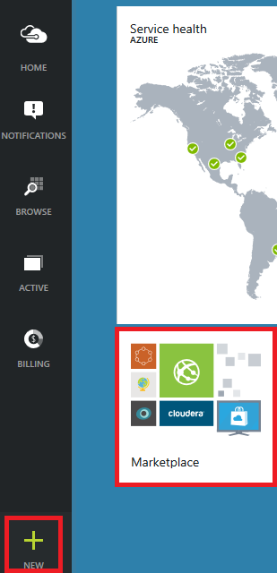
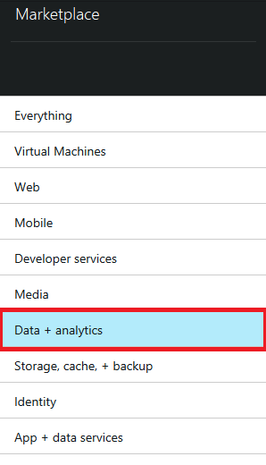
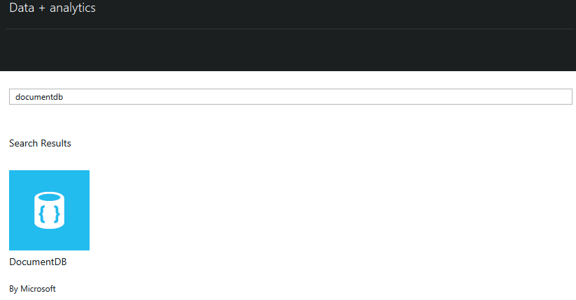
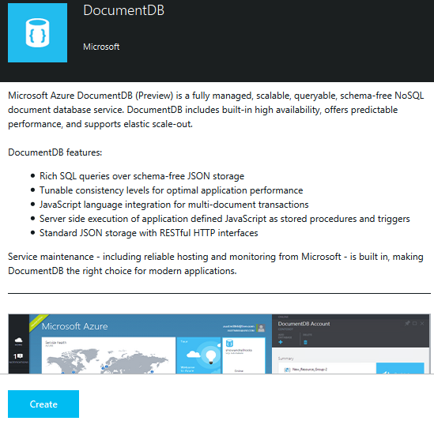
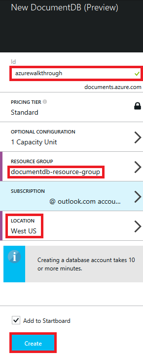
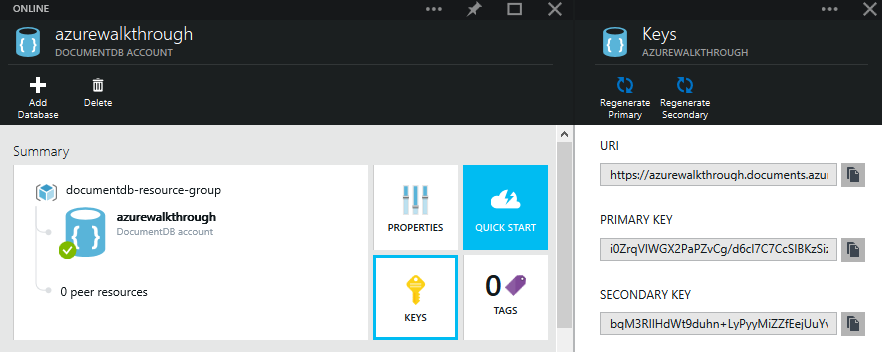
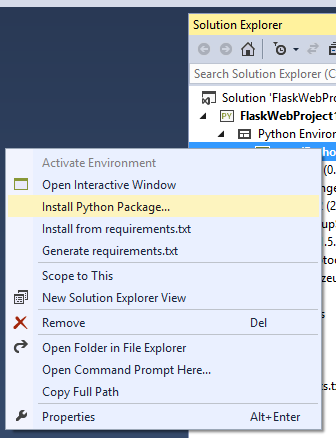
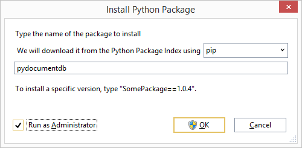

<properties pageTitle="Build a web app with Python and Flask using DocumentDB | Azure" description="Learn how to use DocumentDB to store and access data from an Python and Flask (MVC) web application hosted on Azure." services="documentdb" documentationCenter="" authors="docdbadmin" manager="jhubbard" editor="cgronlun"/>

<tags ms.service="documentdb" ms.workload="data-management" ms.tgt_pltfrm="na" ms.devlang="na" ms.topic="article" ms.date="08/20/2014" ms.author="hawong"/>

<a name="_Toc395809324">Build a web application with Python and Flask (MVC) using DocumentDB</a>
===========================================================================================================================================

<a name="_Toc395809324">

<a name="_Toc389828008">Overview</a>
========================================================================================================================

<a name="_Toc395809326">Scenario</a>
----------------------------------------------------------------

To highlight how customers can efficiently leverage Azure DocumentDB to
store and query JSON documents, this document provides an end-to-end
walkthrough of building a voting web application using Azure Document
DB.

This walkthrough shows you how to use DocumentDB service provided by
Azure to store and access data from an Python web application hosted on
Azure and presumes that you have some prior experience using Python and
Azure Websites.

You will learn:

1\. Creating and provisioning a DocumentDB Account

2\. Creating a Python MVC Application

3\. Connecting to and using Azure DocumentDB from your web application

4\. Deploying the Web Application to Azure Websites

By following this walkthrough, you will build a simple voting
application that allows you to vote for a poll.

<a name="_Toc395809329">Prerequisites</a>

Before following the instructions in this article, you should ensure
that you have the following installed:

Visual Studio 2013 (or [Visual Studio Express][] which is the free
version)

Python Tools for Visual Studio from [here][]

Azure SDK for Visual Studio 2013, version 2.4 or higher available from
[here][1]

Azure Cross-platform Command Line Tools, available through [Microsoft
Web Platform Installer][]

<a name="_Toc395809328">Create a DocumentDB database account</a>
============================================================================================

To provision a DocumentDB database account in Azure, open the Azure
Management Portal and either Click the Azure Gallery tile on the
homepage or click "+" in the lower left hand corner of the screen.

This will open the Azure Gallery, where you can select from the many
available Azure services. In the Gallery, select "Data, storage and
backup" from the list of categories.

From here, select the option for Azure DocumentDB

Then select "Create" from the bottom of the screen

This will open up the "New DocumentDB" blade where you can specify the
name, region, scale, resource group and other settings for your new
account.

Once you’re done supplying the values for your account, Click "Create"
and the provisioning process will begin creating your database account.
Once the provisioning process is complete you should see a notification
appear in the notifications area of the portal and the tile on your
start screen (if you selected to create one) will change to show the
completed action.

Once provisioning is complete, clicking the DocumentDB tile from the
start screen will bring up the main blade for this newly created
DocumentDB account.

Using the "Keys" button, access your endpoint URL and the Primary Key,
copy these to your clipboard and keep them handy as we will use these
values in the web application we will create next.

</a>

<a name="_Toc395809329">Create a new Python Flask Web application</a>
=================================================================================================

Open Visual Studio, File -\> New Project -\> Python -\>, Flask Web
Project with the name **tutorial**. It will ask you whether you want to
install external packages. Click on Install into a virtual environment
and then click on Create. This will setup the required Python virtual
environment for your project.

For those new to Flask, it is a web framework that helps us build web
applications in Python faster. [Click here to access Flask tutorials][].

<a name="_Toc395809329">Add flask packages to your project</a>
==================================

Once your project is setup you need to add certain flask packages that
we will need for our project - for example forms. Right-click on **env**
and **Install the following Python Packages (following this order is
important)**:

    flask==0.9
    flask-login
    flask-openid
    flask-mail==0.7.6
    sqlalchemy==0.7.9
    flask-sqlalchemy==0.16
    sqlalchemy-migrate==0.7.2
    flask-whooshalchemy==0.55a
    flask-wtf==0.8.4
    pytz==2013b
    flask-babel==0.8
    flup

**Note:** In rare cases, you may see a failure in the output window. If
this happens, check if the error is related to cleanup. Sometimes the
cleanup will fail but installation will still be successful (scroll up
in the output window to verify this).
 If this occurs it's ok to continue.

</h1>
<a name="_Toc395809331">Verify the virtual environment</a>
======================================================================================

Let's make sure that everything is installed properly. Start the web
site with clicking **F5** This will launch the flask development server
and start your web browser. You should see the following page:

<a name="_Toc395809332">Adding DocumentDB to your project</a>
=========================================================================================

The DocumentDB Python SDK is hosted in PyPi and can be installed with
pip.

Expand the Python Environments node in Solution Explorer, right click on
your environment and select "Install Python Package…"

Type in "--pre pydocumentdb" which is the name of the PyPi package. You can
optionally provide a known version if you want to control which version
you would like to install, leaving version out will ensure that latest
stable version is installed. Please make note that you will have to enter the
whole name "--pre pydocumentdb".

This will download and install the pydocumentdb package in to your
environment, once complete you should see pydocumentdb listed as a
module under your environment.

</h1>
<a name="_Toc395809333">Create Database, Collection and Document Definition</a>
============================================================================================================

Add the following a python file – **forms.py** and add it to the folder
called tutorial in your Solution Explorer. Add the following code to
forms.py. We are creating our polling application. This is done by
creating three Boolean fields which will be toggled based on user input.

</h1>

    #forms.py
    from flask.ext.wtf import Form
    from wtforms import TextField, BooleanField
    from wtforms.validators import Required
    import pydocumentdb.documents as documents
    import pydocumentdb.document_client as document_client
    import pydocumentdb.errors as errors
    class LoginForm(Form):
        openid = TextField('openid')
        remember_me = BooleanField('remember_me', default = False)
        remember_me1 = BooleanField('remember_me1', default = False)
        remember_me2 = BooleanField('remember_me2', default = False)

============================

### <a name="_Toc395809338">Create Database, Collection and Document</a>

\#Note : It is considered safer to keep your authentication credentials
in a config file rather than your app. For simplicity purposes we are
placing it in source code. Create a new function in views.py and call it
create Append the following to **views.py**. Do not delete any of the
existing code.

</h1>

    @app.route('/create')
    def create():
        """Renders the contact page."""
        host = 'https://meetdemo.documents.azure.com:443/'
        masterKey = '7xPDjHxJSuAUPI2BEWXF2VNVO6c3MN4q+941NAQwPphIqOGW/gE+pB1CQNp4K2F9/4T1bTl040t6JDeyCBmj3A=='
        client = document_client.DocumentClient(host, {'masterKey': masterKey})
        databases = client.ReadDatabases().ToArray()
        #delete any existing databases for simplicity
        for database in databases:
            client.DeleteDatabase(database['_self'])
        #create database
        db = client.CreateDatabase({ 'id': 'sample database' })
        # create collection
        collection = client.CreateCollection(db['_self'],{ 'id': 'sample collection' })
        # create document
        document = client.CreateDocument(collection['_self'],
        { 'id': 'sample document',
        'Web Site': '0 votes',
        'Cloud Service': '0 votes',
        'Virtual Machine': '0 votes',
        'name': 'sample document' })
        return render_template('create.html',title='Create Page',year=datetime.now().year,
        message='You just created a new database - sample database a collection - sample collection and a document - sample document that has your votes. Your old votes have been deleted')

<a name="_Toc395809338">Accept users vote and update the document</a>
=================================================================================================

### <a name="_Toc395809338">Add the required imports

============================

Add the following import statements at the top in **views.py**. These
will import DocumentDB's PythonSDK and Flask packages.

    from wtforms import Form, BooleanField, TextField, PasswordField, validators
    from forms import LoginForm
    import pydocumentdb.documents as documents
    import pydocumentdb.document_client as document_client
    import pydocumentdb.errors as errors

### <a name="_Toc395809338">Read Database and Collection and Document</a>

Add the following code to **views.py**. This takes care of setting up
the form, reading the database, collection and document. Do not delete
any of the existing code in views.py. Simply append this to the end.

    @app.route('/vote', methods=['GET', 'POST'])
    def vote(): 
        form = LoginForm()
        replaced_document ={}
        if form.validate_on_submit(): # is user submitted vote  
            host = 'https://meetdemo.documents.azure.com:443/'
            masterKey = '7xPDjHxJSuAUPI2BEWXF2VNVO6c3MN4q+941NAQwPphIqOGW/gE+pB1CQNp4K2F9/4T1bTl040t6JDeyCBmj3A=='
            client = document_client.DocumentClient(host, {'masterKey': masterKey})
            databases = client.ReadDatabases().ToArray()   #Read database
            db =databases[0] #For simplicity we are assuming there is only one database
            collections = client.ReadCollections(db['_self']).ToArray() #Read collection
            coll =collections[0] #For simplicity we are assuming there is only one collection
            documents = client.ReadDocuments(coll['_self']).ToArray() #Read document
            doc = documents[0]   #For simplicity we are assuming there is only document
    
### <a name="_Toc395809338">Registering the vote and modifying the document</a>

            replaced_document = doc
            if form.remember_me.data:
                print 'choice 1'             
                setvar = doc['Web Site']
                finalvar = setvar.split();
                votes = int(finalvar[0])
                votes = votes+1
                doc['Web Site'] = str(votes)+' '+finalvar[1]
                replaced_document = client.ReplaceDocument(doc['_self'],
                                                       doc)
                print replaced_document
            elif form.remember_me1.data:
                print 'choice 2'             
                setvar = doc['Cloud Service']
                finalvar = setvar.split();
                votes = int(finalvar[0])
                votes = votes+1
                doc['Cloud Service'] = str(votes)+' '+finalvar[1]
                replaced_document = client.ReplaceDocument(doc['_self'],
                                                       doc)
            else:
                print 'choice 2'             
                setvar = doc['Virtual Machine']
                finalvar = setvar.split();
                votes = int(finalvar[0])
                votes = votes+1
                doc['Virtual Machine'] = str(votes)+' '+finalvar[1]
                replaced_document = client.ReplaceDocument(doc['_self'],
                                                       doc)

### <a name="_Toc395809338">Displaying the results</a>

    return render_template('results.html', 
            title = 'Website = ' + replaced_document['Web Site'] + '\n' +'Cloud Service = ' + replaced_document['Cloud Service'] + '\n' + 'Virtual Machine = ' + replaced_document['Virtual Machine'])
        else :        
            return render_template('vote.html', 
            title = 'Vote',
            form = form,
            providers = app.config['OPENID_PROVIDERS'])

    @app.route('/results')
    def results():
        """Renders the results page."""
        return render_template(
            'results.html',
            title='Results',
            year=datetime.now().year,
            message='Your application description page.')

### <a name="_Toc395809338">Create the html files</a>

Under the templates folder add the following html files to it.
create.html, results.html, vote.html

Add the following code to **create.html**. It takes care of displaying
the message that we created a new database, collection and document.

    
    
    <h2>{{ title }}.</h2>
    <h3>{{ message }}</h3>
    
<a href="{{ url_for('vote') }}" class="btn btn-primary btn-large">Click here to Vote &raquo;</a>

    

Add the following code to **results.html**. It takes care of displaying
the results of the poll.
    
    
    
    <h3>Results of the vote</h3>
    <pre>{{ title }}</pre>
    
<a href="{{ url_for('vote') }}" class="btn btn-primary btn-large">Vote Again &raquo;</a>

    

Add the following code to **vote.html**. It takes care of displaying the
poll and accepting the votes. On registering the votes the control is
passed over to views.py where we will recognize the vote casted and
append the document accordingly.

    
    
    <h1>What is your favorite way to host an application on Azure?</h1>
    <form action="" method="post" name="login">
    {{form.hidden_tag()}}
    
 

        {{form.remember_me}} Website
        {{form.remember_me1}} Cloud
        {{form.remember_me2}} Virtual Machine
        
<input type="submit" value="Cast your vote">

    </form>
    
    

============================

Delete the code in **layout.html** and replace it with the following. It
takes care of setting up navbar and the respective urls for routing

Delete the code in index.html and replace it with the following. This
serves as the landing page for your application

</h1>
<a name="_Toc395809341">Add a configuration file and change the \_\_init\_\_.py</a>.
----------------------------------------------------------------------------------------------------------------

Right click on the project name tutorial and add a file - **config.py**.
This config is required by forms in flask. You may use it to provide a
secret key as well. Add the following code to config.py
    
    CSRF_ENABLED = True
    SECRET_KEY = 'you-will-never-guess'
    OPENID_PROVIDERS = [
       ]

Similarly append the **\_\_init\_\_.py file**. Locate it under the
folder called tutorial. Replace the original code with the following. It
takes care of the connection between the views and the config.py file.

    from flask import Flask
    app = Flask(__name__)
    app.config.from_object('config')
    import tutorial.views

After following the above mentioned steps, this is how your solution
explorer should look like

<a name="_Toc395637774">Run your application locally</a>
============================

Hit F5 or the run button in visual studio and you should see the
following on your screen.

Click on vote and select your option

For every vote you cast it will increment the appropriate counter. When
you vote the next time you will be able to see the results.

</h1>
<a name="_Toc395637774">Deploy application to Azure Websites</a>
========================================================================================================================

Now that you have the complete application working correctly against
DocumentDB we're going to deploy this to Azure Websites. Right Click on
the Project in Solution Explorer (make sure you're not still running it
locally) and select Publish.

Configure your Azure Website by providing your credentials and creating
a new website/reusing an old website.

In a few seconds, Visual Studio will finish publishing your web
application and launch a browser where you can see your handy work
running in Azure!

</h1>
<a name="_Toc395809338">Conclusion</a>
==========

Congratulations! You have just built your first Python Application using
Azure DocumentDB and published it to Azure Websites.

If you would like the complete solution, [click here][]. (Note: You will
still have to add the virtual environment, install the python tools and
packages as mentioned above)

</h1>

  [click here]: http://go.microsoft.com/fwlink/?LinkID=509840&clcid=0x409
  [Click here to access Flask tutorials]: http://blog.miguelgrinberg.com/post/the-flask-mega-tutorial-part-i-hello-world

  [Visual Studio Express]: http://www.visualstudio.com/en-us/products/visual-studio-express-vs.aspx
  [here]: https://pytools.codeplex.com/releases/view/123624
  [1]: http://go.microsoft.com/fwlink/?linkid=254281&clcid=0x409
  [Microsoft Web Platform Installer]: http://www.microsoft.com/web/downloads/platform.aspx
