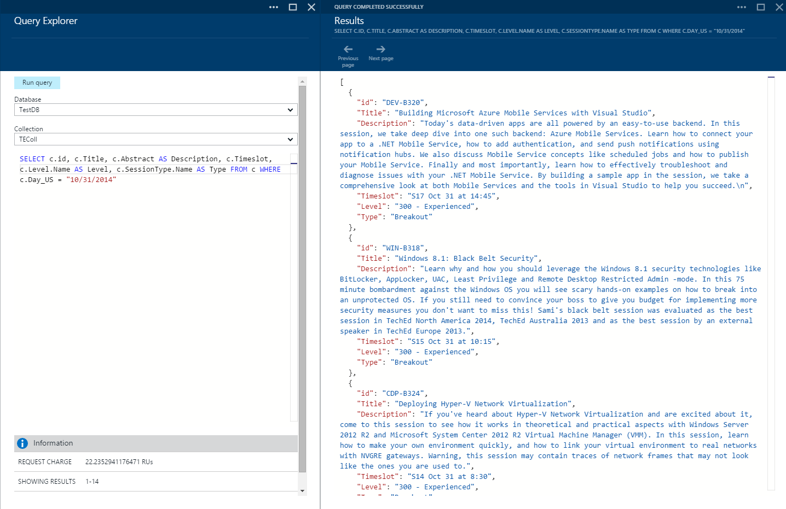
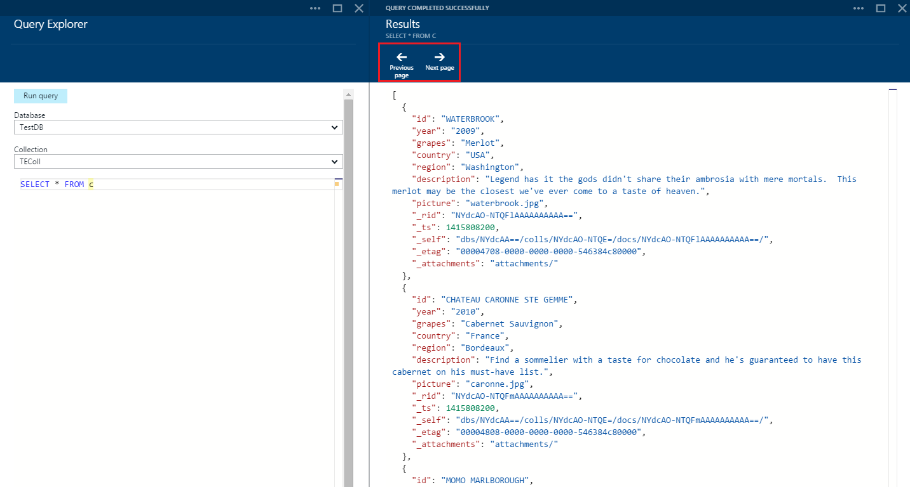
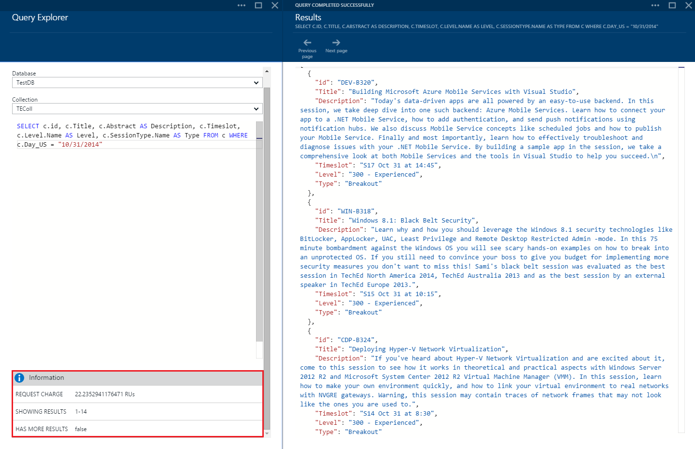
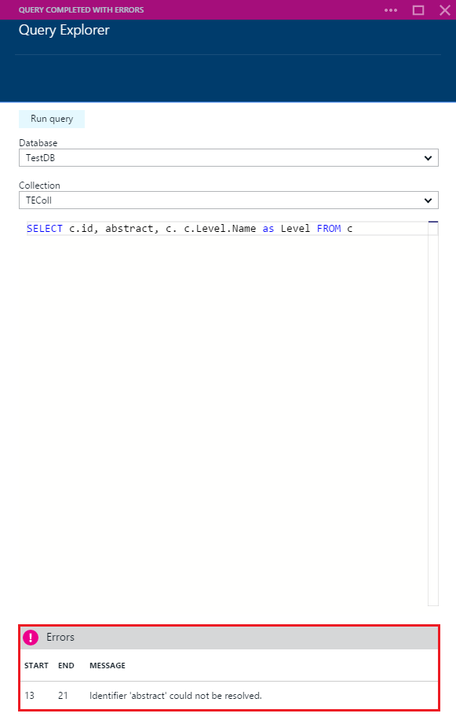

<properties 
	pageTitle="Create, edit, and run SQL queries against a DocumentDB collection using Query Explorer | Azure" 
	description="Learn about the DocumentDB Query Explorer, an Azure Preview portal tool to create, edit, and run SQL queries against a DocumentDB collection." 
	services="documentdb" 
	authors="stephbaron" 
	manager="johnmac" 
	editor="monicar" 
	documentationCenter=""/>

<tags 
	ms.service="documentdb" 
	ms.workload="data-services" 
	ms.tgt_pltfrm="na" 
	ms.devlang="na" 
	ms.topic="article" 
	ms.date="04/29/2015" 
	ms.author="stbaro"/>

# Create, edit, and run SQL queries against a DocumentDB collection using Query Explorer #

This article provides an overview of the [Microsoft Azure DocumentDB](http://azure.microsoft.com/services/documentdb/) Query Explorer, a Microsoft Azure Preview portal tool that enables you to create, edit, and run queries against a DocumentDB collection. 

By completing this tutorial, you'll be able to answer the following questions:  

-	How can I easily create, edit, and run queries against a DocumentDB collection via a web browser?
-	How can I easily navigate through pages of DocumentDB query results via a web browser?
-	How can I troubleshoot syntax errors with my DocumentDB query? 

##Launch and navigate Query Explorer##

Query Explorer can be launched from any of the DocumentDB account, database, and collection blades.
  
1. Near the bottom of each blade is a **Developer Tools** lens, which contains the **Query Explorer** tile.
	
	 

2. Simply click the tile to launch Query Explorer.

	The **Database** and **Collection** drop-down list boxes are pre-populated depending on the context in which you launch Query Explorer.  For example, if you launch from a database blade, then the current database is pre-populated. If you launch from a collection blade, then the current collection is pre-populated.

	

##Create, edit, and run queries with Query Explorer##

Query Explorer allows you to easily create, edit, and run queries against a DocumentDB collection, and includes basic keyword and value highlighting to improve the query authoring experience.  

- When initially opening Query Explorer, a default query of SELECT * FROM c is provided.  You can accept the default query or construct your own and then click the **Run query** button to view the results. Query Explorer supports the DocumentDB SQL query language as described in [Query DocumentDB](documentdb-sql-query.md).

	 

- By default, Query Explorer returns results in sets of 100.  If your query produces more than 100 results, simply use the **Next page** and **Previous page** commands to navigate through the result set.

	

- Successful queries provide information such as the request charge, the set of results currently being shown, and whether there are more results, which can then be accessed via the **Next page** command, as mentioned previously.

	

- Likewise, if a query completes with errors, Query Explorer displays a list of errors that can help with troubleshooting efforts.

	

##Next steps

- To learn more about DocumentDB, click [here](http://azure.com/docdb).
- To learn more about the DocumentDB SQL grammar supported in Query Explorer, click [here](documentdb-sql-query.md).
