<properties 
	pageTitle="View, edit, create, and upload JSON documents using the DocumentDB Document Explorer | Azure" 
	description="Learn about the DocumentDB Document Explorer, an Azure Preview portal tool to view, edit, create, and upload JSON documents with DocumentDB." 
	services="documentdb" 
	authors="stephbaron" 
	manager="johnmac" 
	editor="monicar" 
	documentationCenter=""/>

<tags 
	ms.service="documentdb" 
	ms.workload="data-services" 
	ms.tgt_pltfrm="na" 
	ms.devlang="na" 
	ms.topic="article" 
	ms.date="04/29/2015" 
	ms.author="stbaro"/>

# View, edit, create, and upload JSON documents using the DocumentDB Document Explorer #

This article provides an overview of the [Microsoft Azure DocumentDB](http://azure.microsoft.com/services/documentdb/) Document Explorer, an Azure Preview portal tool that enables you to view, edit, create, and upload JSON documents with DocumentDB. 

By completing this tutorial, you'll be able to answer the following questions:  

-	How can I easily create, view, edit, and delete individual DocumentDB documents via a web browser?
-	How can I easily view the system properties of a DocumentDB document via a web browser?
-	How can I easily perform bulk ingestion of documents into DocumentDB via a web browser?

##Launch and navigate Document Explorer##

Document Explorer can be launched from any of the DocumentDB account, database, and collection blades.  

1. Near the bottom of each blade is a **Developer Tools** lens that contains the **Document Explorer** part.

	 

2. Simply click the tile to launch Document Explorer.

	
The **Database** and **Collection** drop-down list boxes are pre-populated depending on the context in which you launch Document Explorer.  For example, if you launch from a database blade, then the current database is pre-populated.  If you launch from a collection blade, then the current collection is pre-populated.

	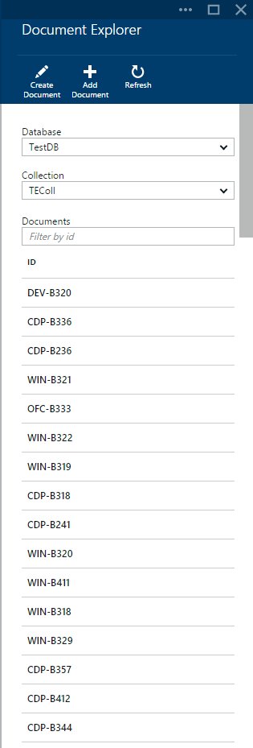

3. Document Explorer loads up to the first 100 documents in the selected collection.  You can load additional documents (in batches of 100) by selecting the **Load more** option at the bottom of the Document Explorer blade.  

4. The **Database** and **Collection** drop-down list boxes can be used to easily change the collection from which documents are currently being viewed without having to close and re-launch Document Explorer.  

5. Document Explorer also supports filtering the currently loaded set of documents by their id property.  Simply type in the filter box.

	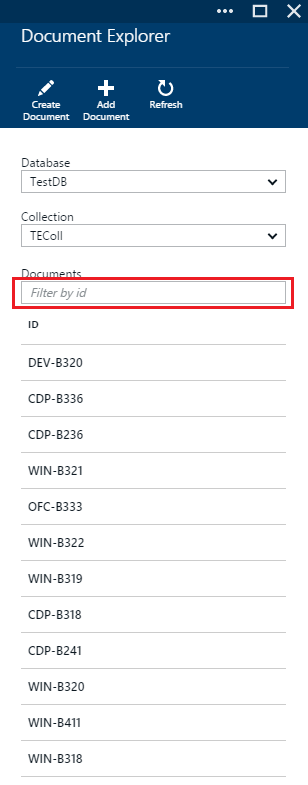 

	And the results in the Document Explorer list are filtered based on your supplied criteria.

	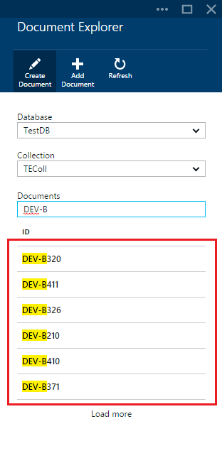

	> [AZURE.IMPORTANT] The Document Explorer filter functionality only filters from the ***currently*** loaded set of documents and does not perform a query against the currently selected collection.

6. To refresh the list of documents loaded by Document Explorer, simply click the **Refresh** command at the top of the blade.

	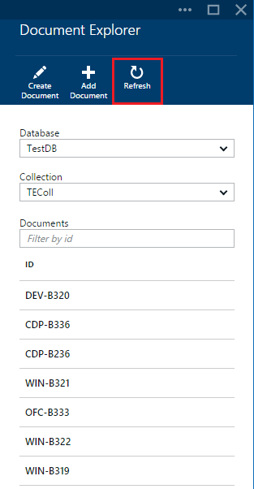

##View, create, and edit documents with Document Explorer##

Document Explorer allows you to easily create, edit and delete documents.  

- To create a document, simply click the **Create Document** command and a minimal JSON snippet is provided.

	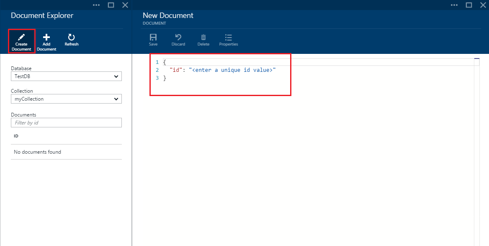 

- Simply type or paste the JSON content of the document you wish to create and click the **Save** command to commit your document.

	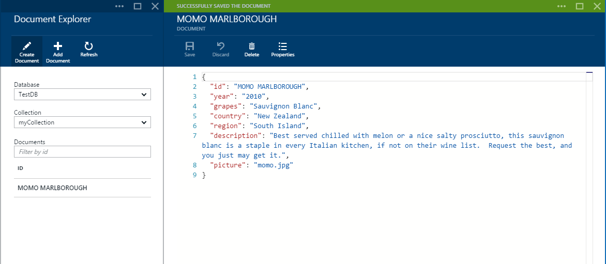

	> [AZURE.NOTE] If you do not provide an "id" property, then Document Explorer automatically adds an id property and generates a GUID as the id value. 

- To edit an existing document, simply select it in Document Explorer, edit the document as you see fit, and click the **Save** command.

	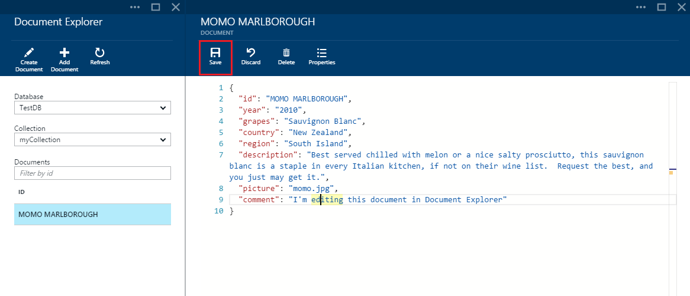

- If you're editing a document and decide that you want to discard the current set of edits, simply click the discard command, confirm the discard action, and the previous state of the document be reloaded.

	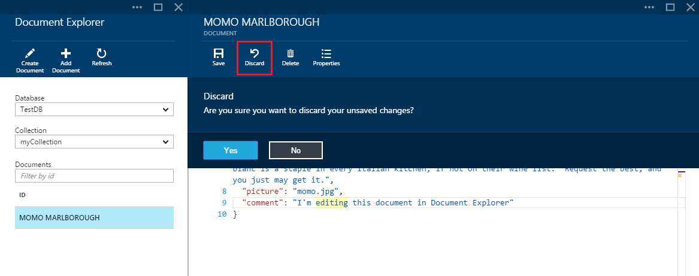

- You can delete a document by selecting it, clicking the **Delete** command, and then confirming the delete. After confirming, the document is immediately removed from the Document Explorer list:

	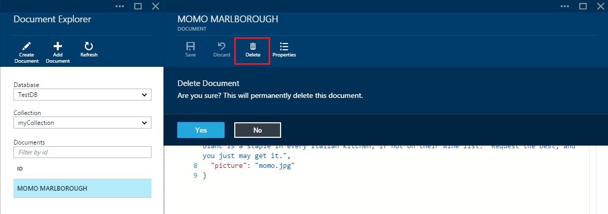

- Note that Document Explorer validates that any new or edited document contains valid JSON.  You can even hover over the incorrect section to get details about the validation error.

	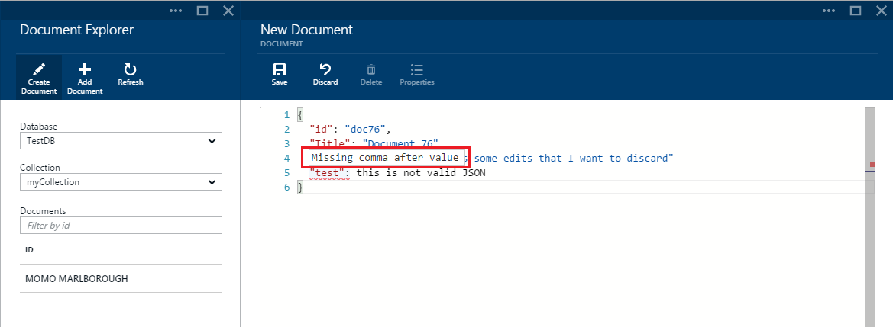

- Additionally, Document Explorer prevents you from saving a document with invalid JSON content.

	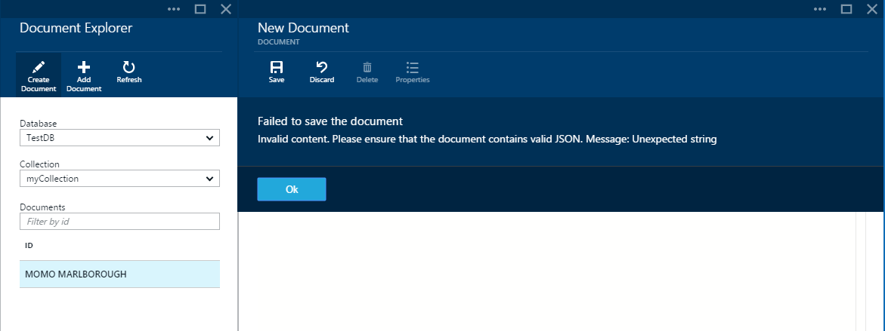

- Finally, Document Explorer allows you to easily view the system properties of the currently loaded document by clicking the **Properties** command.

	

	> [AZURE.NOTE] The timestamp (_ts) property is internally represented as epoch time, but Document Explorer displays the value in a human readable GMT format.

##Bulk add documents with Document Explorer##

Document Explorer supports bulk ingestion of one or more existing JSON documents.  

1. To start the upload process, click the **Add Document** command.
	
	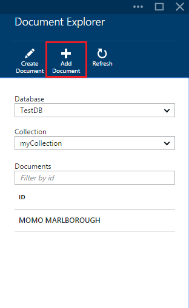

2. A new blade opens.  Click the browse button to open a file explorer window and select one or more JSON documents to upload.

	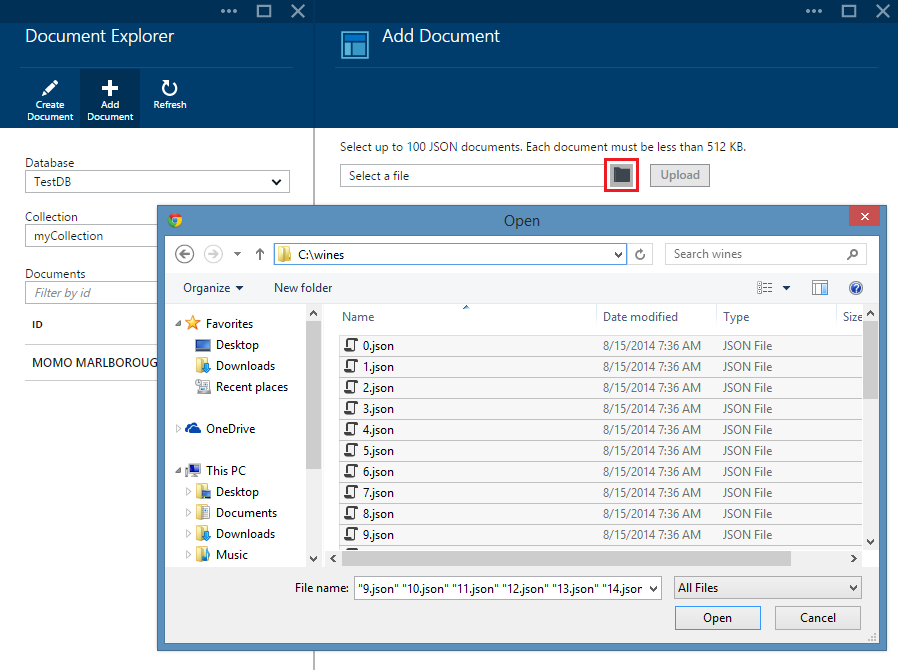

	> [AZURE.NOTE] Document Explorer currently supports up to 100 JSON documents per individual upload operation.

3. Once you're satisfied with your selection, click the **Upload** button.  The documents are automatically added to the Document Explorer grid and the upload results are displayed as the operation progresses. Import failures are reported for individual files.

	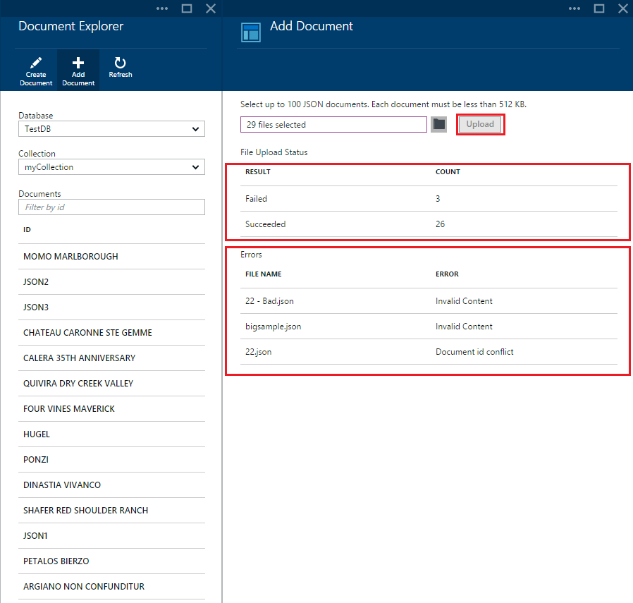

4. Once the operation has completed, you can select up to another 100 documents to upload.

##Next steps

To learn more about DocumentDB, click [here](http://azure.com/docdb).
