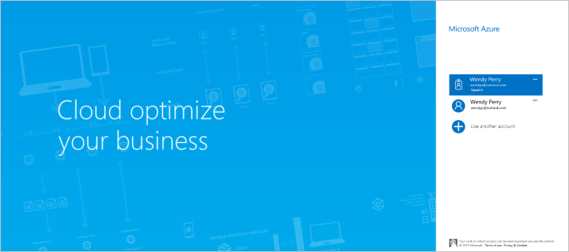
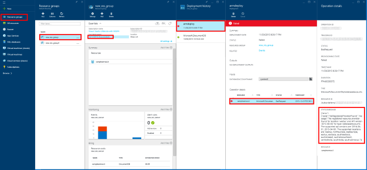

# Automate Azure Cosmos DB account creation using Azure CLI 1.0 and Azure Resource Manager templates
> [!div class="op_single_selector"]
> * [Azure portal](documentdb-create-account.md)
> * [Azure CLI 1.0](documentdb-automation-resource-manager-cli-nodejs.md)
> * [Azure CLI 2.0](documentdb-automation-resource-manager-cli.md)
> * [Azure PowerShell](documentdb-manage-account-with-powershell.md)

This article shows you how to create an Azure Cosmos DB DocumentDB API account by using Azure Resource Manager templates or directly with Azure Command-Line Interface (CLI) 1.0. To create an Azure Cosmos DB account using the Azure portal, see [Create an Azure Cosmos DB database account using the Azure portal](documentdb-create-account.md).

Azure Cosmos DB DocumentDB API and MongoDB API database accounts are currently the only Azure Cosmos DB resources that can be created using Resource Manager templates and Azure CLI 1.0.

To create Azure Cosmos DB DocumentDB API, Table API, Graph API, or Mongo DB account using CLI 2.0, see [Create an Azure DocumentDB account using the Azure CLI](documentdb-automation-resource-manager-cli.md).

## Getting ready
Before you can use Azure CLI 1.0 with Azure resource groups, you need to have the right  version and an Azure account. If you don't have Azure CLI 1.0, [install it](../cli-install-nodejs.md).

### Update your Azure CLI 1.0 version
At the command prompt, type `azure --version` to see whether you have already installed version 0.10.4 or later. You may be prompted to participate in Microsoft Azure CLI data collection at this step, and can select y or n to opt-in or opt-out.

    azure --version
    0.10.4 (node: 4.2.4)

If your version is not 0.10.4 or later, you need to either [install Azure CLI 1.0](../cli-install-nodejs.md) or update by using one of the native installers, or through **npm** by typing `npm update -g azure-cli` to update or `npm install -g azure-cli` to install.

### Set your Azure account and subscription
If you don't already have an Azure subscription but you do have a Visual Studio subscription, you can activate your [Visual Studio subscriber benefits](https://azure.microsoft.com/pricing/member-offers/msdn-benefits-details/). Or you can sign up for a [free trial](https://azure.microsoft.com/pricing/free-trial/).

You need to have a work or school account or a Microsoft account identity to use Azure resource management templates. If you have one of these accounts, type the following command:

    azure login

Which produces the following output:

    info:    Executing command login
    |info:    To sign in, use a web browser to open the page https://aka.ms/devicelogin.
    Enter the code E1A2B3C4D to authenticate.

> [!NOTE]
> If you don't have an Azure account, you see an error message indicating that you need a different type of account. To create one from your current Azure account, see [Creating a work or school identity in Azure Active Directory](../virtual-machines/windows/create-aad-work-id.md?toc=%2fazure%2fvirtual-machines%2fwindows%2ftoc.json).
>
>

Open [https://aka.ms/devicelogin](https://aka.ms/devicelogin) in a browser and enter the code provided in the command output.

Once you've entered the code, select the identity you want to use in the browser and provide your user name and password if needed.

You receive the following confirmation screen when you're successfully logged in, and you can then close the browser window.

The command shell also provides the following output:

    /info:    Added subscription Visual Studio Ultimate with MSDN
    info:    Setting subscription "Visual Studio Ultimate with MSDN" as default
    +
    info:    login command OK

In addition to the interactive login method described here, there are additional Azure CLI 1.0 login methods available. For more information about the other methods and information about handling multiple subscriptions, see [Connect to an Azure subscription from the Azure Command-Line Interface (Azure CLI 1.0)](../xplat-cli-connect.md).

### Switch to Azure CLI 1.0 resource group mode
By default, Azure CLI 1.0 starts in the service management mode (**asm** mode). Type the following to switch to resource group mode.

    azure config mode arm

Which provides the following output:

    info:    Executing command config mode
    info:    New mode is arm
    info:    config mode command OK

If needed, you can switch back to the default set of commands by typing `azure config mode asm`.

### Create or retrieve your resource group
To create an Azure Cosmos DB account, you first need a resource group. If you already know the name of the resource group that you'd like to use, then skip to [Step 2](#create-documentdb-account-cli).

To review a list of all your current resource groups, run the following command and take note of the resource group name you'd like to use:

    azure group list

To create a resource group, run the following command, specify the name of the new resource group to create, and the region in which to create the resource group:

    azure group create <resourcegroupname> <resourcegrouplocation>

* `<resourcegroupname>` can only use alphanumeric characters, periods, underscores, the '-' character, and parenthesis and cannot end in a period.
* `<resourcegrouplocation>` must be one of the regions in which Azure Cosmos DB is generally available. The current list of regions is provided on the [Azure Regions page](https://azure.microsoft.com/regions/#services).

Example input:

    azure group create new_res_group westus

Which produces the following output:

    info:    Executing command group create
    + Getting resource group new_res_group
    + Creating resource group new_res_group
    info:    Created resource group new_res_group
    data:    Id:                  /subscriptions/xxxxxxxx-xxxx-xxxx-xxxx-xxxxxxxxxxxx/resourceGroups/new_res_group
    data:    Name:                new_res_group
    data:    Location:            westus
    data:    Provisioning State:  Succeeded
    data:    Tags: null
    data:
    info:    group create command OK

If you encounter errors, see [Troubleshooting](#troubleshooting).

## Understanding Resource Manager templates and resource groups
Most applications are built from a combination of different resource types (such as one or more Azure Cosmos DB account, storage accounts, a virtual network, or a content delivery network). The default Azure service management API and the Azure portal represented these items by using a service-by-service approach. This approach requires you to deploy and manage the individual services individually (or find other tools that do so), and not as a single logical unit of deployment.

*Azure Resource Manager templates* make it possible for you to deploy and manage these different resources as one logical deployment unit in a declarative fashion. Instead of imperatively telling Azure what to deploy one command after another, you describe your entire deployment in a JSON file -- all the resources and associated configuration and deployment parameters -- and tell Azure to deploy those resources as one group.

You can learn lots more about Azure resource groups and what they can do for you in the [Azure Resource Manager overview](../azure-resource-manager/resource-group-overview.md). If you're interested in authoring templates, see [Authoring Azure Resource Manager templates](../azure-resource-manager/resource-group-authoring-templates.md).

## Task: Create a single region Azure Cosmos DB account
Use the instructions in this section to create a Single Region Azure Cosmos DB account. This can be accomplished using Azure CLI 1.0 with or without Resource Manager templates.

###  Create a single region Azure Cosmos DB account using Azure CLI 1.0 without Resource Manager templates
Create an Azure Cosmos DB account in the new or existing resource group by entering the following command at the command prompt:

> [!TIP]
> If you run this command in Azure PowerShell or Windows PowerShell you receive an error about an unexpected token. Instead, run this command at the Windows Command Prompt.
>
>

    azure resource create -g <resourcegroupname> -n <databaseaccountname> -r "Microsoft.DocumentDB/databaseAccounts" -o 2015-04-08 -l <resourcegrouplocation> -p "{\"databaseAccountOfferType\":\"Standard\",\"ipRangeFilter\":\"<ip-range-filter>\",\"locations\":["{\"locationName\":\"<databaseaccountlocation>\",\"failoverPriority\":\"<failoverPriority>\"}"]}"

* `<resourcegroupname>` can only use alphanumeric characters, periods, underscores, the '-' character, and parenthesis and cannot end in a period.
* `<resourcegrouplocation>` is the region of the current resource group.
* `<ip-range-filter>` Specifies the set of IP addresses or IP address ranges in CIDR form to be included as the allowed list of client IPs for a given database account. IP addresses/ranges must be comma separated and must not contain any spaces. For more information, see [Azure Cosmos DB Firewall Support](documentdb-firewall-support.md)
* `<databaseaccountname>` can only use lowercase letters, numbers, the '-' character, and must be between 3 and 50 characters.
* `<databaseaccountlocation>` must be one of the regions in which Azure Cosmos DB is generally available. The current list of regions is provided on the [Azure Regions page](https://azure.microsoft.com/regions/#services).

Example input:

    azure resource create -g new_res_group -n samplecliacct -r "Microsoft.DocumentDB/databaseAccounts" -o 2015-04-08 -l westus -p "{\"databaseAccountOfferType\":\"Standard\",\"ipRangeFilter\":\"\",\"locations\":["{\"locationName\":\"westus\",\"failoverPriority\":\"0\"}"]}"

Which produces the following output as your new account is provisioned:

    info:    Executing command resource create
    + Getting resource samplecliacct
    + Creating resource samplecliacct
    info:    Resource samplecliacct is updated
    data:
    data:    Id:        /subscriptions/xxxxxxxx-xxxx-xxxx-xxxx-xxxxxxxxxxxx/resourceGroups/new_res_group/providers/Microsoft.DocumentDB/databaseAccounts/samplecliacct
    data:    Name:      samplecliacct
    data:    Type:      Microsoft.DocumentDB/databaseAccounts
    data:    Parent:
    data:    Location:  West US
    data:    Tags:
    data:
    info:    resource create command OK

If you encounter errors, see [Troubleshooting](#troubleshooting).

After the command returns, the account will be in the **Creating** state for a few minutes, before it changes to the **Online** state in which it is ready for use. You can check on the status of the account in the [Azure portal](https://portal.azure.com), on the **Azure Cosmos DB Accounts** blade.

###  Create a single region Azure Cosmos DB account using Azure CLI 1.0 with Resource Manager templates
The instructions in this section describe how to create an Azure Cosmos DB account with an Azure Resource Manager template and an optional parameters file, both of which are JSON files. Using a template enables you to describe exactly what you want and repeat it without errors.

Create a local template file with the following content. Name the file azuredeploy.json.

    {
        "$schema": "http://schema.management.azure.com/schemas/2015-01-01/deploymentTemplate.json#",
        "contentVersion": "1.0.0.0",
        "parameters": {
            "databaseAccountName": {
                "type": "string"
            },
            "locationName1": {
                "type": "string"
            }
        },
        "variables": {},
        "resources": [
            {
                "apiVersion": "2015-04-08",
                "type": "Microsoft.DocumentDb/databaseAccounts",
                "name": "[parameters('databaseAccountName')]",
                "location": "[resourceGroup().location]",
                "properties": {
                    "databaseAccountOfferType": "Standard",
                    "ipRangeFilter": "",
                    "locations": [
                        {
                            "failoverPriority": 0,
                            "locationName": "[parameters('locationName1')]"
                        }
                    ]
                }
            }
        ]
    }

The failoverPriority must be set to 0 since this is a single region account. A failoverPriority of 0 indicates that this region be kept as the [write region for the Azure Cosmos DB account][scaling-globally].
You can either enter the value at the command line, or create a parameter file to specify the value.

To create a parameters file, copy the following content into a new file and name the file azuredeploy.parameters.json. If you plan on specifying the database account name at the command prompt, you can continue without creating this file.

    {
        "$schema": "http://schema.management.azure.com/schemas/2015-01-01/deploymentParameters.json#",
        "contentVersion": "1.0.0.0",
        "parameters": {
            "databaseAccountName": {
                "value": "samplearmacct"
            },
            "locationName1": {
                "value": "westus"
            }
        }
    }

In the azuredeploy.parameters.json file, update the value field of `"samplearmacct"` to the database name you'd like to use, then save the file. `"databaseAccountName"` can only use lowercase letters, numbers, the '-' character, and must be between 3 and 50 characters. Update the value field of `"locationName1"` to the region where you would like to create the Azure Cosmos DB account.

To create an Azure Cosmos DB account in your resource group, run the following command and provide the path to the template file, the path to the parameter file or the parameter value, the name of the resource group in which to deploy, and a deployment name (-n is optional).

To use a parameter file:

    azure group deployment create -f <PathToTemplate> -e <PathToParameterFile> -g <resourcegroupname> -n <deploymentname>

* `<PathToTemplate>` is the path to the azuredeploy.json file created in step 1. If your path name has spaces in it, put double quotes around this parameter.
* `<PathToParameterFile>` is the path to the azuredeploy.parameters.json file created in step 1. If your path name has spaces in it, put double quotes around this parameter.
* `<resourcegroupname>` is the name of the existing resource group in which to add an Azure Cosmos DB database account.
* `<deploymentname>` is the optional name of the deployment.

Example input:

    azure group deployment create -f azuredeploy.json -e azuredeploy.parameters.json -g new_res_group -n azuredeploy

OR to specify the database account name parameter without a parameter file, and instead get prompted for the value, run the following command:

    azure group deployment create -f <PathToTemplate> -g <resourcegroupname> -n <deploymentname>

Example input which shows the prompt and entry for a database account named samplearmacct:

    azure group deployment create -f azuredeploy.json -g new_res_group -n azuredeploy
    info:    Executing command group deployment create
    info:    Supply values for the following parameters
    databaseAccountName: samplearmacct

As the account is provisioned, you receive the following information:

    info:    Executing command group deployment create
    + Initializing template configurations and parameters
    + Creating a deployment
    info:    Created template deployment "azuredeploy"
    + Waiting for deployment to complete
    +
    +
    info:    Resource 'new_res_group' of type 'Microsoft.DocumentDb/databaseAccounts' provisioning status is Running
    +
    info:    Resource 'new_res_group' of type 'Microsoft.DocumentDb/databaseAccounts' provisioning status is Succeeded
    data:    DeploymentName     : azuredeploy
    data:    ResourceGroupName  : new_res_group
    data:    ProvisioningState  : Succeeded
    data:    Timestamp          : 2015-11-30T18:50:23.6300288Z
    data:    Mode               : Incremental
    data:    CorrelationId      : 4a5d4049-c494-4053-bad4-cc804d454700
    data:    DeploymentParameters :
    data:    Name                 Type    Value
    data:    -------------------  ------  ------------------
    data:    databaseAccountName  String  samplearmacct
    data:    locationName1        String  westus
    info:    group deployment create command OK

If you encounter errors, see [Troubleshooting](#troubleshooting).  

After the command returns, the account will be in the **Creating** state for a few minutes, before it changes to the **Online** state in which it is ready for use. You can check on the status of the account in the [Azure portal](https://portal.azure.com), on the **Azure Cosmos DB Accounts** blade.

## Task: Create a single region Azure Cosmos DB: API for MongoDB account
Use the instructions in this section to create a single region API for MongoDB account. This can be accomplished using Azure CLI 1.0 with Resource Manager templates.

###  Create a single region MongoDB account using Azure CLI 1.0 with Resource Manager templates
The instructions in this section describe how to create an API for MongoDB account with an Azure Resource Manager template and an optional parameters file, both of which are JSON files. Using a template enables you to describe exactly what you want and repeat it without errors.

Create a local template file with the following content. Name the file azuredeploy.json.

    {
        "$schema": "http://schema.management.azure.com/schemas/2015-01-01/deploymentTemplate.json#",
        "contentVersion": "1.0.0.0",
        "parameters": {
            "databaseAccountName": {
                "type": "string"
            },
            "locationName1": {
                "type": "string"
            }
        },
        "variables": {},
        "resources": [
            {
                "apiVersion": "2015-04-08",
                "type": "Microsoft.DocumentDb/databaseAccounts",
                "name": "[parameters('databaseAccountName')]",
                "location": "[resourceGroup().location]",
                "kind": "MongoDB",
                "properties": {
                    "databaseAccountOfferType": "Standard",
                    "ipRangeFilter": "",
                    "locations": [
                        {
                            "failoverPriority": 0,
                            "locationName": "[parameters('locationName1')]"
                        }
                    ]
                }
            }
        ]
    }

The kind must be set to MongoDB to specify that this account will support MongoDB APIs. If no kind property is specified, the default will be an Azure Cosmos DB DocumentDB API account.

The failoverPriority must be set to 0 since this is a single region account. A failoverPriority of 0 indicates that this region be kept as the [write region for the Azure Cosmos DB account][scaling-globally].
You can either enter the value at the command line, or create a parameter file to specify the value.

To create a parameters file, copy the following content into a new file and name the file azuredeploy.parameters.json. If you plan on specifying the database account name at the command prompt, you can continue without creating this file.

    {
        "$schema": "http://schema.management.azure.com/schemas/2015-01-01/deploymentParameters.json#",
        "contentVersion": "1.0.0.0",
        "parameters": {
            "databaseAccountName": {
                "value": "samplearmacct"
            },
            "locationName1": {
                "value": "westus"
            }
        }
    }

In the azuredeploy.parameters.json file, update the value field of `"samplearmacct"` to the database name you'd like to use, then save the file. `"databaseAccountName"` can only use lowercase letters, numbers, the '-' character, and must be between 3 and 50 characters. Update the value field of `"locationName1"` to the region where you would like to create the Azure Cosmos DB account.

To create an Azure Cosmos DB account in your resource group, run the following command and provide the path to the template file, the path to the parameter file or the parameter value, the name of the resource group in which to deploy, and a deployment name (-n is optional).

To use a parameter file:

    azure group deployment create -f <PathToTemplate> -e <PathToParameterFile> -g <resourcegroupname> -n <deploymentname>

* `<PathToTemplate>` is the path to the azuredeploy.json file created in step 1. If your path name has spaces in it, put double quotes around this parameter.
* `<PathToParameterFile>` is the path to the azuredeploy.parameters.json file created in step 1. If your path name has spaces in it, put double quotes around this parameter.
* `<resourcegroupname>` is the name of the existing resource group in which to add an Azure Cosmos DB database account.
* `<deploymentname>` is the optional name of the deployment.

Example input:

    azure group deployment create -f azuredeploy.json -e azuredeploy.parameters.json -g new_res_group -n azuredeploy

OR to specify the database account name parameter without a parameter file, and instead get prompted for the value, run the following command:

    azure group deployment create -f <PathToTemplate> -g <resourcegroupname> -n <deploymentname>

Example input which shows the prompt and entry for a database account named samplearmacct:

    azure group deployment create -f azuredeploy.json -g new_res_group -n azuredeploy
    info:    Executing command group deployment create
    info:    Supply values for the following parameters
    databaseAccountName: samplearmacct

As the account is provisioned, you receive the following information:

    info:    Executing command group deployment create
    + Initializing template configurations and parameters
    + Creating a deployment
    info:    Created template deployment "azuredeploy"
    + Waiting for deployment to complete
    +
    +
    info:    Resource 'new_res_group' of type 'Microsoft.DocumentDb/databaseAccounts' provisioning status is Running
    +
    info:    Resource 'new_res_group' of type 'Microsoft.DocumentDb/databaseAccounts' provisioning status is Succeeded
    data:    DeploymentName     : azuredeploy
    data:    ResourceGroupName  : new_res_group
    data:    ProvisioningState  : Succeeded
    data:    Timestamp          : 2015-11-30T18:50:23.6300288Z
    data:    Mode               : Incremental
    data:    CorrelationId      : 4a5d4049-c494-4053-bad4-cc804d454700
    data:    DeploymentParameters :
    data:    Name                 Type    Value
    data:    -------------------  ------  ------------------
    data:    databaseAccountName  String  samplearmacct
    data:    locationName1        String  westus
    info:    group deployment create command OK

If you encounter errors, see [Troubleshooting](#troubleshooting).  

After the command returns, the account will be in the **Creating** state for a few minutes, before it changes to the **Online** state in which it is ready for use. You can check on the status of the account in the [Azure portal](https://portal.azure.com), on the **Azure Cosmos DB Accounts** blade.

## Task: Create a multi-region Azure Cosmos DB account
Azure Cosmos DB has the capability to [distribute your data globally][distribute-globally] across various [Azure regions](https://azure.microsoft.com/regions/#services). When creating an Azure Cosmos DB account, the regions in which you would like the service to exist can be specified. Use the instructions in this section to create a multi-region Azure Cosmos DB account. This can be accomplished using Azure CLI 1.0 with or without Resource Manager templates.

###  Create a multi-region Azure Cosmos DB account using Azure CLI 1.0 without Resource Manager templates
Create an Azure Cosmos DB account in the new or existing resource group by entering the following command at the command prompt:

> [!TIP]
> If you run this command in Azure PowerShell or Windows PowerShell you receive an error about an unexpected token. Instead, run this command at the Windows Command Prompt.
>
>

    azure resource create -g <resourcegroupname> -n <databaseaccountname> -r "Microsoft.DocumentDB/databaseAccounts" -o 2015-04-08 -l <resourcegrouplocation> -p "{\"databaseAccountOfferType\":\"Standard\",\"ipRangeFilter\":\"<ip-range-filter>\",\"locations\":["{\"locationName\":\"<databaseaccountlocation1>\",\"failoverPriority\":\"<failoverPriority1>\"},{\"locationName\":\"<databaseaccountlocation2>\",\"failoverPriority\":\"<failoverPriority2>\"}"]}"

* `<resourcegroupname>` can only use alphanumeric characters, periods, underscores, the '-' character, and parenthesis and cannot end in a period.
* `<resourcegrouplocation>` is the region of the current resource group.
* `<ip-range-filter>` Specifies the set of IP addresses or IP address ranges in CIDR form to be included as the allowed list of client IPs for a given database account. IP addresses/ranges must be comma separated and must not contain any spaces. For more information, see [Azure Cosmos DB Firewall Support](documentdb-firewall-support.md)
* `<databaseaccountname>` can only use lowercase letters, numbers, the '-' character, and must be between 3 and 50 characters.
* `<databaseaccountlocation1>` and `<databaseaccountlocation2>` must be regions in which Azure Cosmos DB is generally available. The current list of regions is provided on the [Azure Regions page](https://azure.microsoft.com/regions/#services).

Example input:

    azure resource create -g new_res_group -n samplecliacct -r "Microsoft.DocumentDB/databaseAccounts" -o 2015-04-08 -l westus -p "{\"databaseAccountOfferType\":\"Standard\",\"ipRangeFilter\":\"\",\"locations\":["{\"locationName\":\"westus\",\"failoverPriority\":\"0\"},{\"locationName\":\"eastus\",\"failoverPriority\":\"1\"}"]}"

Which produces the following output as your new account is provisioned:

    info:    Executing command resource create
    + Getting resource samplecliacct
    + Creating resource samplecliacct
    info:    Resource samplecliacct is updated
    data:
    data:    Id:        /subscriptions/xxxxxxxx-xxxx-xxxx-xxxx-xxxxxxxxxxxx/resourceGroups/new_res_group/providers/Microsoft.DocumentDB/databaseAccounts/samplecliacct
    data:    Name:      samplecliacct
    data:    Type:      Microsoft.DocumentDB/databaseAccounts
    data:    Parent:
    data:    Location:  West US
    data:    Tags:
    data:
    info:    resource create command OK

If you encounter errors, see [Troubleshooting](#troubleshooting).

After the command returns, the account will be in the **Creating** state for a few minutes, before it changes to the **Online** state in which it is ready for use. You can check on the status of the account in the [Azure portal](https://portal.azure.com), on the **Azure Cosmos DB Accounts** blade.

###  Create a multi-region Azure Cosmos DB account using Azure CLI 1.0 with Resource Manager templates
The instructions in this section describe how to create an Azure Cosmos DB account with an Azure Resource Manager template and an optional parameters file, both of which are JSON files. Using a template enables you to describe exactly what you want and repeat it without errors.

Create a local template file with the following content. Name the file azuredeploy.json.

    {
        "$schema": "http://schema.management.azure.com/schemas/2015-01-01/deploymentTemplate.json#",
        "contentVersion": "1.0.0.0",
        "parameters": {
            "databaseAccountName": {
                "type": "string"
            },
            "locationName1": {
                "type": "string"
            },
            "locationName2": {
                "type": "string"
            }
        },
        "variables": {},
        "resources": [
            {
                "apiVersion": "2015-04-08",
                "type": "Microsoft.DocumentDb/databaseAccounts",
                "name": "[parameters('databaseAccountName')]",
                "location": "[resourceGroup().location]",
                "properties": {
                    "databaseAccountOfferType": "Standard",
                    "ipRangeFilter": "",
                    "locations": [
                        {
                            "failoverPriority": 0,
                            "locationName": "[parameters('locationName1')]"
                        },
                        {
                            "failoverPriority": 1,
                            "locationName": "[parameters('locationName2')]"
                        }
                    ]
                }
            }
        ]
    }

The preceding template file can be used to create an Azure Cosmos DB account with two regions. To create the account with more regions, add it to the "locations" array and add the corresponding parameters.

One of the regions must have a failoverPriority value of 0 to indicate that this region be kept as the [write region for the Azure Cosmos DB account][scaling-globally]. The failover priority values must be unique among the locations and the highest failover priority value must be less than the total number of regions. You can either enter the value at the command line, or create a parameter file to specify the value.

To create a parameters file, copy the following content into a new file and name the file azuredeploy.parameters.json. If you plan on specifying the database account name at the command prompt, you can continue without creating this file.

    {
        "$schema": "http://schema.management.azure.com/schemas/2015-01-01/deploymentParameters.json#",
        "contentVersion": "1.0.0.0",
        "parameters": {
            "databaseAccountName": {
                "value": "samplearmacct"
            },
            "locationName1": {
                "value": "westus"
            },
            "locationName2": {
                "value": "eastus"
            }
        }
    }

In the azuredeploy.parameters.json file, update the value field of `"samplearmacct"` to the database name you'd like to use, then save the file. `"databaseAccountName"` can only use lowercase letters, numbers, the '-' character, and must be between 3 and 50 characters. Update the value field of `"locationName1"` and `"locationName2"` to the region where you would like to create the Azure Cosmos DB account.

To create an Azure Cosmos DB account in your resource group, run the following command and provide the path to the template file, the path to the parameter file or the parameter value, the name of the resource group in which to deploy, and a deployment name (-n is optional).

To use a parameter file:

    azure group deployment create -f <PathToTemplate> -e <PathToParameterFile> -g <resourcegroupname> -n <deploymentname>

* `<PathToTemplate>` is the path to the azuredeploy.json file created in step 1. If your path name has spaces in it, put double quotes around this parameter.
* `<PathToParameterFile>` is the path to the azuredeploy.parameters.json file created in step 1. If your path name has spaces in it, put double quotes around this parameter.
* `<resourcegroupname>` is the name of the existing resource group in which to add an Azure Cosmos DB database account.
* `<deploymentname>` is the optional name of the deployment.

Example input:

    azure group deployment create -f azuredeploy.json -e azuredeploy.parameters.json -g new_res_group -n azuredeploy

OR to specify the database account name parameter without a parameter file, and instead get prompted for the value, run the following command:

    azure group deployment create -f <PathToTemplate> -g <resourcegroupname> -n <deploymentname>

Example input, which shows the prompt and entry for a database account named samplearmacct:

    azure group deployment create -f azuredeploy.json -g new_res_group -n azuredeploy
    info:    Executing command group deployment create
    info:    Supply values for the following parameters
    databaseAccountName: samplearmacct

As the account is provisioned, you receive the following information:

    info:    Executing command group deployment create
    + Initializing template configurations and parameters
    + Creating a deployment
    info:    Created template deployment "azuredeploy"
    + Waiting for deployment to complete
    +
    +
    info:    Resource 'new_res_group' of type 'Microsoft.DocumentDb/databaseAccounts' provisioning status is Running
    +
    info:    Resource 'new_res_group' of type 'Microsoft.DocumentDb/databaseAccounts' provisioning status is Succeeded
    data:    DeploymentName     : azuredeploy
    data:    ResourceGroupName  : new_res_group
    data:    ProvisioningState  : Succeeded
    data:    Timestamp          : 2015-11-30T18:50:23.6300288Z
    data:    Mode               : Incremental
    data:    CorrelationId      : 4a5d4049-c494-4053-bad4-cc804d454700
    data:    DeploymentParameters :
    data:    Name                 Type    Value
    data:    -------------------  ------  ------------------
    data:    databaseAccountName  String  samplearmacct
    data:    locationName1        String  westus
    data:    locationName2        String  eastus
    info:    group deployment create command OK

If you encounter errors, see [Troubleshooting](#troubleshooting).  

After the command returns, the account will be in the **Creating** state for a few minutes, before it changes to the **Online** state in which it is ready for use. You can check on the status of the account in the [Azure portal](https://portal.azure.com), on the **Azure Cosmos DB Accounts** blade.

## Troubleshooting
If you receive errors like `Deployment provisioning state was not successful` while creating your resource group or database account, you have a few troubleshooting options.

> [!NOTE]
> Providing incorrect characters in the database account name or providing a location in which Azure Cosmos DB is not available will cause deployment errors. Database account names can only use lowercase letters, numbers, the '-' character, and must be between 3 and 50 characters. All valid database account locations are listed on the [Azure Regions page](https://azure.microsoft.com/regions/#services).
>
>

* If your output contains the following `Error information has been recorded to C:\Users\wendy\.azure\azure.err`, then review the error info in the azure.err file.
* You may find useful info in the log file for the resource group. To view the log file, run the following command:

        azure group log show <resourcegroupname> --last-deployment

    Example input:

        azure group log show new_res_group --last-deployment

    Then see [Troubleshooting resource group deployments in Azure](../azure-resource-manager/resource-manager-common-deployment-errors.md) for additional information.
* Error information is also available in the Azure portal as shown in the following screenshot. To navigate to the error info: click Resource Groups in the Jumpbar, select the Resource Group that had the error, then in the Essentials area of the Resource group blade click the date of the Last Deployment, then in the Deployment history blade select the failed deployment, then in the Deployment blade click the Operation detail with the red exclamation mark. The Status Message for the failed deployment is displayed in the Operation details blade.

    

## Next steps
Now that you have an Azure Cosmos DB account, the next step is to create an Azure Cosmos DB database. You can create a database by using one of the following:

* The Azure portal, as described in [Create an Azure Cosmos DB collection and database using the Azure portal](documentdb-create-collection.md).
* The C# .NET samples in the [DatabaseManagement](https://github.com/Azure/azure-documentdb-net/tree/master/samples/code-samples/DatabaseManagement) project of the [azure-documentdb-dotnet](https://github.com/Azure/azure-documentdb-net/tree/master/samples/code-samples) repository on GitHub.
* The [Azure Cosmos DB DocumentDB API SDKs](https://msdn.microsoft.com/library/azure/dn781482.aspx). The Azure Cosmos DB DocumentDB APIs have .NET, Java, Python, Node.js, and JavaScript API SDKs.

After creating your database, you need to [add one or more collections](documentdb-create-collection.md) to the database, then [add documents](documentdb-view-json-document-explorer.md) to the collections.

After you have documents in a collection, you can use [SQL](documentdb-sql-query.md) to [execute queries](documentdb-sql-query.md#ExecutingSqlQueries) against your documents by using the [Query Explorer](documentdb-query-collections-query-explorer.md) in the portal, the [REST API](https://msdn.microsoft.com/library/azure/dn781481.aspx), or one of the [SDKs](https://msdn.microsoft.com/library/azure/dn781482.aspx).

To learn more about Azure Cosmos DB, see the [Azure Cosmos DB multi-model introduction](../cosmos-db/introduction.md).

For more templates you can use, see [Azure Quickstart templates](https://azure.microsoft.com/documentation/templates/).

<!--Reference style links - using these makes the source content way more readable than using inline links-->
[distribute-globally]: https://azure.microsoft.com/documentation/articles/documentdb-distribute-data-globally
[scaling-globally]: https://azure.microsoft.com/documentation/articles/documentdb-distribute-data-globally/#scaling-across-the-planet
