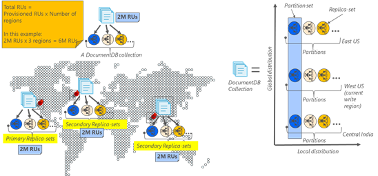

<properties
	pageTitle="Automatic backup and restore with DocumentDB | Microsoft Azure"
	description="Learn how to perform automatic backups and database restores with Azure DocumentDB."
	keywords="TBD"
	services="documentdb"
	authors="syamkmsft"
	manager="jhubbard"
	editor="monicar"/>

<tags
	ms.service="documentdb"
	ms.workload="data-services"
	ms.tgt_pltfrm="na"
	ms.devlang="multiple"
	ms.topic="article"
	ms.date="09/12/2016"
	ms.author="syam.kumar"/>

# Automatic Backups and Restore with DocumentDB 

DocumentDB automatically takes backup of all your data at regular intervals. The backups are taken without affecting the performance or availability of your database operations. All your backups are stored separately in another storage service and is further globally replicated for resiliency against regional disasters. The automatic backups are meant for scenarios when you accidentally delete your DocumentDB collection and later want to restore it.  

We start with a quick recap of the data redundancy and availability in DocumentDB before discussing backups. 

## High availability with DocumentDB - a quick recap 

DocumentDB is designed to be [globally distributed](documentdb-distribute-data-globally.md) – it allows you to scale throughput across multiple Azure regions along with policy driven failover and transparent multi-homing APIs. As a database system offering [99.99 availability SLAs](https://azure.microsoft.com/support/legal/sla/documentdb/v1_0/), all the writes in DocumentDB are durably committed by a quorum of replicas within a local data center. Additionally, if your database account is associated with more than one Azure regions, your writes are replicated across other regions as well. To scale your throughput and access data at low latencies, you can have as many read regions associated with your database account as you like, and in each read region, the (replicated) data is durably persisted across a replica set.  

As illustrated below, a single DocumentDB collection is [horizontally partitioned](documentdb-partition-data.md) (a “partition” is denoted by a circle in the figure below) and each partition is made highly available via a replica set. This is the local distribution within a single Azure region (denoted by the X axis). Further, each partition (with its corresponding replica set) is then globally distributed across multiple regions associated with your database account (e.g. in this illustration the three regions – East US, West US and Central India). The “partition set” is a globally distributed entity comprising of multiple copies of your data in each region (denoted by the Y axis). You can assign priority to the regions associated with your database account and DocumentDB will transparently failover to the next region in case of disaster. You can also manually simulate failover to test the end to end availability of your application.  

The following image illustrates the high degree of redundancy with DocumentDB.

## High degree of redundancy with DocumentDB

With DocumentDB, not only your data but the backups of your data are also made highly redundant and resilient to regional disasters. For this, DocumentDB automatically takes backups of all your data periodically. Internally, the frequency of backup is configurable on a per database account basis. Currently, full backups are taken approximately every four hours but this is subject to change. 

The backups are taken without affecting the performance or availability of your database operations. DocumentDB takes the backup in the background without consuming your provisioned RUs or affecting the performance and without affecting the availability of your database. 

Unlike your data which is stored inside DocumentDB, the backups are stored in Azure Blob Storage service. To guarantee the low latency/efficient upload, the snapshot of your backup is uploaded to an instance of Azure Blob storage in the same region as the current write region of your DocumentDB database account. For resiliency against regional disaster, each snapshot of your backup data in Azure Blob Storage is again replicated via Geo-redundant storage (GRS) to another region. The illustration below shows that the entire DocumentDB collection (with all three primary partitions in West US, in this example) are backed up in a remote Azure Blob Storage in West US and then GRS replicated to East US. 

The following image illustrates periodic full backups of all DocumentDB entities in GRS Azure Storage.

## Retention period for a given snapshot

While we periodically take snapshots of your data, for compliance reasons, each snapshot of data is stored for at least 30 days and up to 90 days before we eventually purge it. Internally, this retention interval is configurable on a per database account basis. 

## Restoring your data from the backup

In case you accidentally delete your data, you can file a support ticket and call us. We will restore your data from the last backup. For a specific snapshot of your backup to be restored, we require that the data was at least available with us for the duration of the backup cycle for that snapshot.

Note that unlike the 99.99 high availability SLA that DocumentDB offers, currently there are no SLAs for RPO or RTO for your backups. While currently we take backups of your data approximately every four hours or so, this is subject to change. Also, the time it takes to restore your data also varies on the amount of data you have. With that caveat out of the way, it is equally important to note that, over the past few years we have been regularly restoring data for customers who accidentally delete their DocumentDB collections and then call us. Note that in future, we will expose this capability to you directly both programmatically as well as via Azure portal. 