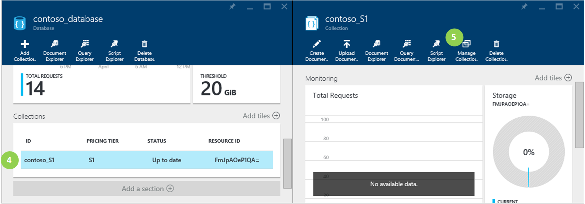
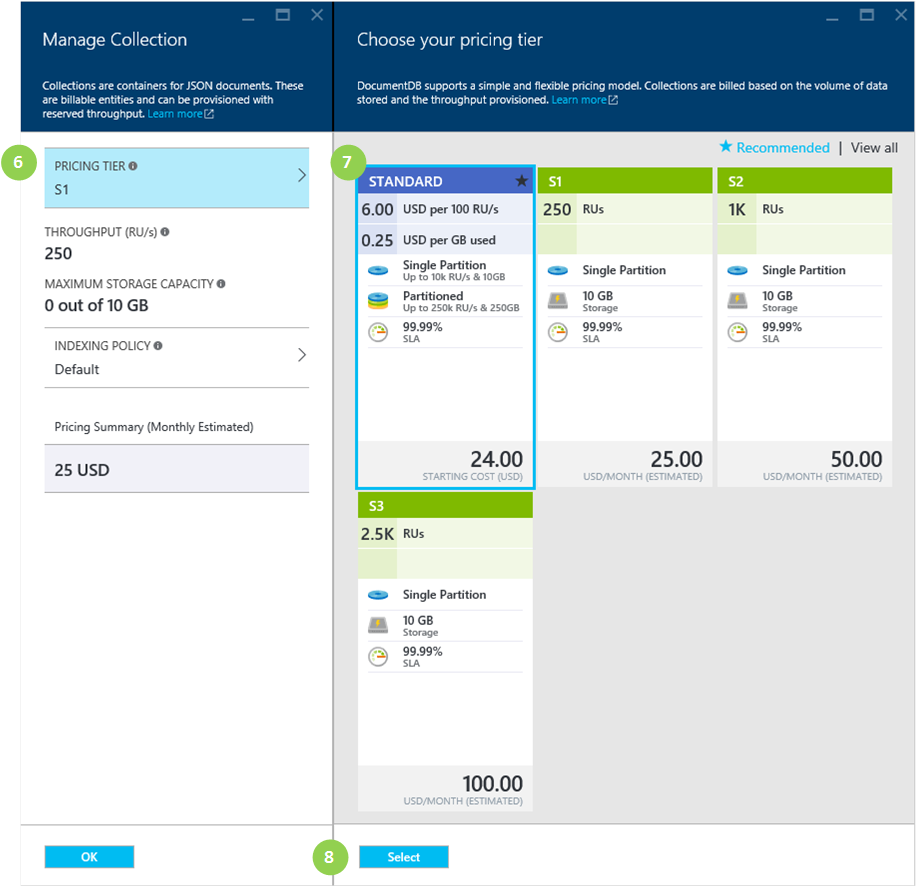
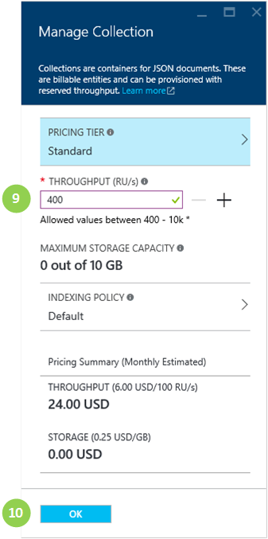

<properties 
	pageTitle="Change DocumentDB collection performance | Microsoft Azure" 
	description="Learn how to change from using pre-defined performance to user-defined performance on a collection, and how to change from a single partition collection to a partioned collection." 
	services="documentdb" 
	authors="mimig1" 
	manager="jhubbard" 
	editor="" 
	documentationCenter=""/>

<tags 
	ms.service="documentdb" 
	ms.workload="data-services" 
	ms.tgt_pltfrm="na" 
	ms.devlang="na" 
	ms.topic="article" 
	ms.date="04/01/2016" 
	ms.author="mimig"/>

# Change DocumentDB collection throughput and partitioning

As announced at //build 2016, DocumentDB collections can now use user-defined performance values or pre-defined performance values. If your collection was created before March 31, 2016, your collection uses the pre-defined  S1, S2, or S3 [performance levels](documentdb-performance-levels.md) (250 RU/s, 1K RU/s, or 2.5K RU/s, respectively). To change your collection from using a pre-defined performance level to a user-defined performance level, you need to change the pricing tier for the collection, then specify your throughput level. For instructions on completing this, see [Change from pre-defined performance to user-defined performance](documentdb-change-collection-performance.md#change-from-pre-defined-performance-to-user-defined-performance) below.

If you would like to not only change your collection to use user-defined performance, but also increase the storage capacity to greater than the 10GB available in the S1, S2, and S3 performance levels, you need to change from using a single-partition collection to a partitioned collection. For instructions on completing this, see [Change from a single partition collection to a partioned collection](documentdb-change-collection-performance.md#change-from-a-single-partition-collection-to-a-partioned-collection) below.

## Change from pre-defined performance to user-defined performance

1.  In the [Azure portal](https://portal.azure.com/), in the Jumpbar, click **DocumentDB Accounts**. If **DocumentDB Accounts** is not visible, click **Browse** and then click **DocumentDB Accounts**.

    

2.  In the **DocumentDB Accounts** blade, select the account that contains the collection to change.

3. In the **DocumentDB account** blade for the selected account, scroll down to the **Databases** lens, and then select the database that contains the collection to change.

4. In the **Database** blade, scroll down to the **Collections** lens, and then select the collection to change.

    

5. In the **Collection** blade, click **Manage Collection**.

6. In the **Manage Collection** blade, click **Pricing Tier**.

    

7. In the **Pricing Tier** blade, click **Standard**.

8. In the **Pricing Tier** blade, click **Select**.

8. Back in the **Manage Collection** blade, the **Pricing Tier** was changed to **Standard** and the **Throughput (RU/s)** box is displayed. 

    Change the value in the **Throughput** box to a value between 400 and 10,000 [Request units](documentdb-request-units.md)/second (RU/s). The **Pricing Summary** on the bottom of the page updates automatically to provide an estimate of the monthly cost.

    

9. On the **Manage Collection** blade, click **OK** to update your collection to the user-defined performance.

> [AZURE.NOTE] Changing performance levels of a collection may take up to 2 minutes. 

If you determine that you need more throughput (greater than 10,000 RU/s) or more storage (greater than 10GB) you can create a partitioned collection. To create a partitioned collection, see [Create a collection](documentdb-create-collection.md).

## Change from a single partition collection to a partioned collection

Single-partition collections have a maximum storage size of 10GB and throughput levels between 400-10,000 RU/s. Partitioned collections can have a maximum storage size of 250GB (or higher on request) and throughput levels between 10,100-250,000 RU/s. For more information about single-partition collections and partitioned-collections, see [Partitioning and scaling in Azure DocumentDB](documentdb-partition-data.md). 

If you have a single-partition collection and want to migrate to a partitioned collection, please [contact us](mailto:askdocdb@microsoft.com) for help in migrating these collections.

## Next steps

In this article, I've described how to modify your collection to use user-defined performance or switch from using a single partition collection to a partitioned collection.

Additional resources:

- [Partitioning and scaling in Azure DocumentDB](documentdb-partition-data.md).  
- [Performance levels in DocumentDB](documentdb-performance-levels.md)
 