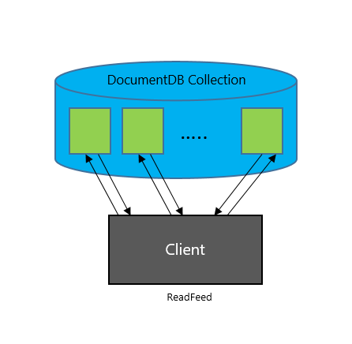
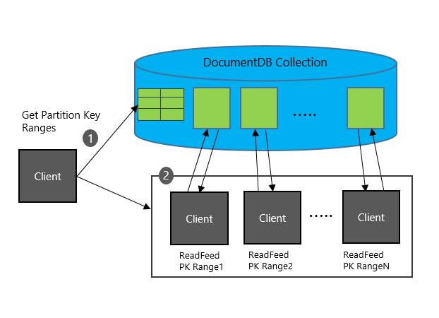

# Working with the ChangeFeed support in Azure DocumentDB
[Azure DocumentDB](documentdb-introduction.md) is a fast and flexible NoSQL database service that is used for storing high-volume transactional and operational data with predictable single-digit millisecond latency for reads and writes. This makes it well-suited for IoT, gaming, retail, and operational logging applications. A common design pattern in these applications is to track changes made to DocumentDB data, and update materialized views, perform real-time analytics, archive data to cold storage, and trigger notifications on certain events based on these changes. DocumentDB's **ChangeFeed support** allows you to build efficient and scalable solutions for each of these patterns.

With ChangeFeed support, DocumentDB provides a real-time sorted list of documents within a DocumentDB collection in the order in which they were modified. These changes can be read and processed by a single consumer that performs real-time analysis or triggers certain actions, or distributed across a number of consumers for distributed processing. Let's look at the APIs for ChangeFeed and how you can use them to build scalable real-time applications.

# Use Cases and Scenarios
ChangeFeed allows for efficient processing of large datasets with a high volume of writes, and offers an alternative to querying entire datasets to identify what has changed. For example, you can perform the following tasks efficiently:

* Update a cache, search index, or a data warehouse with data stored in Azure DocumentDB.
* Implement application-level data tiering and archival, that is, store "hot data" in DocumentDB, and age out "cold data" to [Azure Blob Storage](../storage/storage-introduction.md) or [Azure Data Lake Store](../data-lake-store/data-lake-store-overview.md).
* Implement batch analytics on data using [Apache Hadoop](documentdb-run-hadoop-with-hdinsight.md).
* Implement [lambda architectures on Azure](https://blogs.technet.microsoft.com/msuspartner/2016/01/27/azure-partner-community-big-data-advanced-analytics-and-lambda-architecture/) with DocumentDB at the ingestion point. 
* Implement [lambda pipelines on Azure](https://blogs.technet.microsoft.com/msuspartner/2016/01/27/azure-partner-community-big-data-advanced-analytics-and-lambda-architecture/) with DocumentDB. DocumentDB provides a scalable database solution that can handle both ingestion and query, and implement lambda architectures with low TCO. 
* Perform no down-time migrations to another Azure DocumentDB account with different partitioning schemes, and indexing policies.

**Lambda Pipelines with Azure DocumentDB for ingestion and query:**

You can use DocumentDB to receive and store event data from devices, sensors, infrastructure, and applications, and process these events in real-time with [Azure Stream Analytics](documentdb-search-indexer.md), [Apache Storm](../hdinsight/hdinsight-storm-overview.md), or [Apache Spark](../hdinsight/hdinsight-apache-spark-overview.md). 

Within web and mobile apps, you can track events such as changes to your customer's profile, preferences, or location to trigger certain actions like sending push notifications to their devices using [Azure Functions](../azure-functions/functions-bindings-documentdb.md) or [App Services](https://azure.microsoft.com/services/app-service/). If you're using DocumentDB to build a game, you can use ChangeFeed to implement real-time leaderboards based on scores from completed games.

# How ChangeFeed works in Azure DocumentDB
DocumentDB provides the ability to incrementally read updates made to a DocumentDB collection. This change feed has the following properties:

* Changes to documents within a collection are available immediately in real-time in the change feed with no lag.
* Each change to a document will appear only once in the change feed.
* The change feed is sorted by time of modification within each partition key value. There is no guaranteed order across partition-key values.
* Changes can be synchronized from any point-in-time, i.e. there is no fixed data retention period for which changes are available.
* Only the most recent change for a given document will be included in the change log. Intermediate changes may not be available.
* Changes are available in chunks of partition key ranges. This capability allows changes from large collections to be processed in parallel by multiple consumers/servers.

DocumentDB's Change Feed is enabled by default for all accounts, and does not incur any additional costs on your account. You can use your [provisioned throughput](documentdb-request-units.md) in your write region or any [read region](documentdb-distribute-data-globally.md) to read from the change feed, just like any other operation from DocumentDB. In the following section, we describe how to access the change feed using the DocumentDB REST API and SDKs.

The change feed includes inserts and update operations made to documents within the collection. You can capture deletes by either setting a "soft-delete" flag within your documents in place of deletes. Alternatively, you can set a finite expiration period for your documents via the [TTL capability](documentdb-time-to-live.md), for example, 24 hours and use the value of that property to capture deletes.

## Working with the REST API and SDK
DocumentDB provides elastic containers or storage and throughput called **collections**. Data within collections is logically grouped using [partition keys](documentdb-partition-data.md) for scalability and performance. DocumentDB provides various APIs for accessing this data, including lookup by ID (Read/Get), query, and read-feeds (scans). The change feed can be obtained by populating two new request headers to DocumentDB's `ReadDocumentFeed` API, and can be processed in parallel across ranges of partition keys.

### ReadDocumentFeed API
Let's take a brief look at how ReadDocumentFeed works. DocumentDB supports reading a feed of documents within a collection via the `ReadDocumentFeed` API. For example, the following request returns a page of documents inside the `serverlogs` collection. 

	GET https://mydocumentdb.documents.azure.com/dbs/smalldb/colls/smallcoll HTTP/1.1
	x-ms-date: Tue, 22 Nov 2016 17:05:14 GMT
	authorization: type%3dmaster%26ver%3d1.0%26sig%3dgo7JEogZDn6ritWhwc5hX%2fNTV4wwM1u9V2Is1H4%2bDRg%3d
	Cache-Control: no-cache
	x-ms-consistency-level: Strong
	User-Agent: Microsoft.Azure.Documents.Client/1.10.27.5
	x-ms-version: 2016-07-11
	Accept: application/json
	Host: mydocumentdb.documents.azure.com

Results can be limited by using the `x-ms-max-item-count` header, and reads can be resumed by resubmitting the request with a `x-ms-continuation` header returned in the previous response. When performed from a single client, `ReadDocumentFeed` iterates through results across partitions serially. 

You can retrieve this information using one of the supported [DocumentDB SDKs](documentdb-sdk-dotnet.md). For example, the following snippet shows how to perform ReadDocumentFeed in .NET.

    FeedResponse<dynamic> feedResponse = null;
    do
    {
        feedResponse = await client.ReadDocumentFeedAsync(collection, new FeedOptions { MaxItemCount = -1 });
    }
    while (feedResponse.ResponseContinuation != null);

> [!NOTE]
> ChangeFeed requires SDK versions 1.11.0 and above (currently available in private preview)

**Serial Read Document Feed**

### Distributed Execution of ReadDocumentFeed
For collections that contain terabytes of data or more, or ingest a large volume of updates, serial execution of read feed from a single client machine might not be a practical solution. In order to support these big data scenarios, DocumentDB provides APIs to distribute `ReadDocumentFeed` calls transparently across a number of client readers/consumers. 

**Distributed Read Document Feed**

In order to provide scalable processing of incremental changes, DocumentDB supports a scale-out model for the change feed API based on ranges of partition keys.

* You can obtain a list of partition key ranges for a collection performing a `ReadPartitionKeyRanges` call. 
* For each partition key range, you can perform a `ReadDocumentFeed` to read documents with partition keys within that range.

### Retrieving Partition Key Ranges for a Collection
You can retrieve the Partition Key Ranges by requesting the `pkranges` resource within a collection. For example the following request retrieves the list of partition key ranges for the `serverlogs` collection:

	GET https://querydemo.documents.azure.com/dbs/bigdb/colls/serverlogs/pkranges HTTP/1.1
	x-ms-date: Tue, 15 Nov 2016 07:26:51 GMT
	authorization: type%3dmaster%26ver%3d1.0%26sig%3dEConYmRgDExu6q%2bZ8GjfUGOH0AcOx%2behkancw3LsGQ8%3d
	x-ms-consistency-level: Session
	x-ms-version: 2016-07-11
	Accept: application/json
	Host: querydemo.documents.azure.com

This request returns the following response containing metadata about the partition key ranges:

	HTTP/1.1 200 Ok
	Content-Type: application/json
	x-ms-item-count: 25
	x-ms-schemaversion: 1.1
	Date: Tue, 15 Nov 2016 07:26:51 GMT

	{
	   "_rid":"qYcAAPEvJBQ=",
	   "PartitionKeyRanges":[
	      {
	         "_rid":"qYcAAPEvJBQCAAAAAAAAUA==",
	         "id":"0",
	         "_etag":"\"00002800-0000-0000-0000-580ac4ea0000\"",
	         "minInclusive":"",
	         "maxExclusive":"05C1CFFFFFFFF8",
	         "_self":"dbs\/qYcAAA==\/colls\/qYcAAPEvJBQ=\/pkranges\/qYcAAPEvJBQCAAAAAAAAUA==\/",
	         "_ts":1477100776
	      },
	      ...
	   ],
	   "_count": 25
	}

**Partition Key Range Properties**:
Each partition key range includes the metadata properties in the following table. The id property must be used in the following call to retrieve changes for the partition key range.

<table>
	<tr>
		<th>Header name</th>
		<th>Description</th>
	</tr>
	<tr>
		<td>id</td>
		<td>The ID for the partition key range. This is a stable and unique ID within each collection.</td>
	</tr>
	<tr>
		<td>maxExclusive</td>
		<td>The maximum partition key hash value for the partition key range. For internal use.</td>
	</tr>
	<tr>
		<td>minInclusive</td>
		<td>The minimum partition key hash value for the partition key range. For internal use.</td>
	</tr>		
</table>

You can do this using one of the supported [DocumentDB SDKs](documentdb-sdk-dotnet.md). For example, the following snippet shows how to retrive partition key ranges in .NET.

    List<PartitionKeyRange> partitionKeyRanges = new List<PartitionKeyRange>();
    FeedResponse<PartitionKeyRange> response;

    do
    {
        response = await client.ReadPartitionKeyRangeFeedAsync(collection);
        partitionKeyRanges.AddRange(response);
    }
    while (response.ResponseContinuation != null);

DocumentDB supports retrieval of documents per partition key range by setting the optional `x-ms-documentdb-partitionkeyrangeid` header. 

### Performing an Incremental ReadDocumentFeed
ReadDocumentFeed supports the following scenarios/tasks for incremental processing of changes in DocumentDB collections:

* Read all changes to documents from the beginning, that is, from collection creation.
* Read all changes to future updates to documents from current time.
* Read all changes to documents from a logical version of the collection (ETag). You can checkpoint your consumers based on the returned ETag from incremental read-feed requests.

The changes include inserts and updates to documents. To capture deletes, you must use a set a property [TTL expiration for documents](documentdb-time-to-live.md).

The following table lists the request and response headers for ReadDocumentFeed operations.

**Request Headers for incremental ReadDocumentFeed**:

<table>
	<tr>
		<th>Header name</th>
		<th>Description</th>
	</tr>
	<tr>
		<td>A-IM</td>
		<td>Must be set to "Incremental feed", or omitted otherwise</td>
	</tr>
	<tr>
		<td>If-None-Match</td>
		<td>
			
No header: returns all changes from the beginning (collection creation)

			
"*": returns all new changes to data within the collection

			
&lt;etag&gt;: If set to a collection ETag, returns all changes made since that logical timestamp

		</td>
	</tr>
	<tr>
		<td>x-ms-documentdb-partitionkeyrangeid</td>
		<td>The partition key range ID for reading data.</td>
	</tr>
</table>

**Response Headers for incremental ReadDocumentFeed**:

<table>
	<tr>
		<th>Header name</th>
		<th>Description</th>
	</tr>
	<tr>
		<td>etag</td>
		<td>The logical version of data within the collection.</td>
	</tr>
</table>

Here's a sample request to return all incremental changes in collection from the logical version/ETag `28535` and partition key range = `1`:

	GET https://mydocumentdb.documents.azure.com/dbs/bigdb/colls/bigcoll/docs HTTP/1.1
	x-ms-max-item-count: 1
	If-None-Match: "28535"
	A-IM: Incremental feed
	x-ms-documentdb-partitionkeyrangeid: 16
	x-ms-date: Tue, 22 Nov 2016 20:43:01 GMT
	authorization: type%3dmaster%26ver%3d1.0%26sig%3dzdpL2QQ8TCfiNbW%2fEcT88JHNvWeCgDA8gWeRZ%2btfN5o%3d
	x-ms-version: 2016-07-11
	Accept: application/json
	Host: mydocumentdb.documents.azure.com

Changes will be ordered by time within each partition key value within the partition key range. There is no guaranteed order across partition-key values. Just like read-feed calls, if there are more results than can fit in a single page, you can read the next page of results by resubmitting the request with the `x-ms-continuation` header. If multiple documents were updated transactionally within a stored procedure or trigger, they will all be returned within the same response page.

The .NET SDK provides the `CreateChangeFeedQuery` and `ChangeFeedOptions` helper classes to access changes made to a collection. The following snippet shows how to retrieve all changes from the beginning using the .NET SDK from a single client.

    private async Task<Dictionary<string, string>> GetChanges(
        DocumentClient client,
        string collection,
        Dictionary<string, string> checkpoints)
    {
        Dictionary<string, string> nextCheckpoints = new Dictionary<string, string>();

        List<PartitionKeyRange> partitionKeyRanges = new List<PartitionKeyRange>();
        FeedResponse<PartitionKeyRange> response;

        do
        {
            response = await client.ReadPartitionKeyRangeFeedAsync(collection);
            partitionKeyRanges.AddRange(response);
        }
        while (response.ResponseContinuation != null);

        foreach (PartitionKeyRange pkRange in partitionKeyRanges)
        {
            string continuation = (checkpoints == null) ? null : checkpoints[pkRange.Id];
            IDocumentQuery<Document> query = client.CreateDocumentChangeFeedQuery(
                collection,
                new ChangeFeedOptions
                {
                    PartitionKeyRangeId = pkRange.Id,
                    StartFromBeginning = true,
                    RequestContinuation = continuation,
                    MaxItemCount = 1
                });

            while (query.HasMoreResults)
            {
                FeedResponse<Document> readChangesResponse = query.ExecuteNextAsync<Document>().Result;
                foreach (Document changedDocument in readChangesResponse)
                {
                    Console.WriteLine(changedDocument.Id);
                }

                nextCheckpoints[pkRange.Id] = response.ResponseContinuation;
            }
        }

        return nextCheckpoints;
    }

And the following snippet shows how to process changes in real-time with DocumentDB by using the ChangeFeed support and the method above. The first call returns all the documents in the collection, and the second only returns the two documents created that were created since the last checkpoint.

    // Returns all documents in the collection.
    Dictionary<string, string> checkpoints = await GetChanges(client, collection, null);

    client.CreateDocumentAsync(collection, new { id = Guid.NewGuid().ToString() }).Wait();
    client.CreateDocumentAsync(collection, new { id = Guid.NewGuid().ToString() }).Wait();

    // Returns only the two documents created above.
    checkpoints = await GetChanges(client, collection, checkpoints);

In this article, we provided a walkthrough of DocumentDB's ChangeFeed support, and how to track changes made to DocumentDB data using the DocumentDB REST API and/or SDKs. 

## Next Steps
* Learn more about [DocumentDB's resource model and hierarchy](documentdb-resources.md)
* Get started coding with the [DocumentDB SDKs](documentdb-sdk-dotnet.md) or the [REST API](https://msdn.microsoft.com/library/azure/dn781481.aspx)