<properties 
    pageTitle="DocumentDB change notifications using Logic Apps | Microsoft Azure" 
    description="." 
    keywords="change notification"
    services="documentdb" 
    authors="hedidin" 
    manager="jhubbard" 
    editor="mimig" 
    documentationCenter=""/>

<tags 
    ms.service="documentdb" 
    ms.workload="data-services" 
    ms.tgt_pltfrm="na" 
    ms.devlang="rest-api" 
    ms.topic="article" 
    ms.date="06/14/2016" 
    ms.author="b-hoedid"/>

# Notifications for new or changed DocumentDB resources using Logic Apps

This article came about from a question I saw posted one of the Azure DocumentDB community forums. The question was **Does DocumentDB support notifications for modified resources**?

I have worked with BizTalk Server for many years, and this is a very common scenario when using the [WCF LOB Adapter](https://msdn.microsoft.com/library/bb798128.aspx). So I decided to see if I could duplicate this functionality in DocumentDB for new and/or modified documents.

This article provides an overview of the components of the change notification solution, which includes a [trigger](documentdb-programming.md#trigger) and a [Logic App](../app-service-logic/app-service-logic-what-are-logic-apps.md). Important code snippets are provided inline and the entire solution is available on [GitHub](https://github.com/HEDIDIN/DocDbNotifications).

## Use case

The following story is the use case for this article.

DocumentDB is the repository for Health Level Seven International (HL7) Fast Healthcare Interoperability Resources (FHIR)  documents. Let's assume that your DocumentDB database combined with your API and Logic App make up an HL7 FHIR Server.  A healthcare facility is storing patient data in the DocumentDB "Patients" database. There are several collections within the patient database; Clinical, Identification, etc. Patient information falls under identification.  You have a collection named "Patient".

The Cardiology department is tracking personal heath and exercise data. Searching for new or modified Patient records is time consuming. They asked the IT department if there was a way that they could receive a notification for new or modified Patient records.  

The IT department said that they could easily provide this. They also said that they could push the documents to [Azure Blob Storage](https://azure.microsoft.com/services/storage/) so the Cardiology department could easily access them.

## How the IT department solved the problem

In order to create this application, the IT department decided to model it first.  The nice thing about using Business Process Model and Notation (BPMN) is that both technical and non-technical people can easily understand it. This whole notification process is considered a business process. 

## High-Level view of notification process

1. You start with a Logic App that has a timer trigger. By default, the trigger runs every hour.
2. Next you do an HTTP POST to the Logic App.
3. The Logic App does all the work.

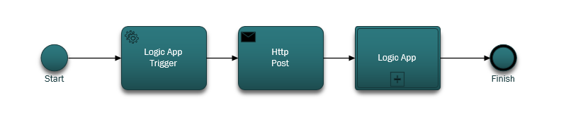

### Let's take a look at what this Logic App does
If you look at the following figure there are several steps in the LogicApp workflow.

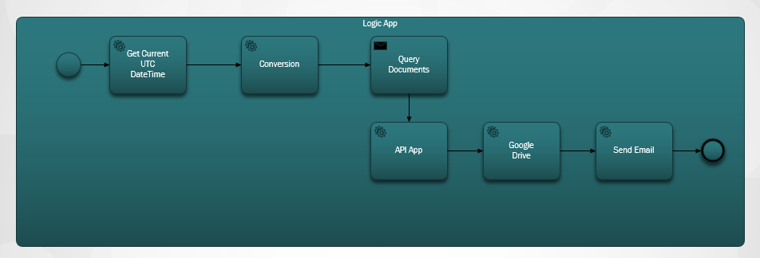

The steps are as follows:

1. You need to get the current UTC DateTime from an API App.  The default value is one hour previous.

2. The UTC DateTime is converted to a Unix Timestamp format. This is the default format for timestamps in DocumentDB.

3. You POST the value to an API App, which does a DocumentDB query. The value is used in a query.

    ```SQL
     	SELECT * FROM Patients p WHERE (p._ts >= @unixTimeStamp)
    ```

    > [AZURE.NOTE] The _ts represents the TimeStamp metadata for all DocumentDB resources.

4. If there are documents found, the response body is sent to your Azure Blob Storage.

    > [AZURE.NOTE] Blob storage requires an Azure Storage account. You need to provision an Azure Blob storage account and add a new Blob named patients. For more information, see [About Azure storage accounts](../storage/storage-create-storage-account.md) and [Get started with Azure Blob storage](../storage/storage-dotnet-how-to-use-blobs.md).

5. Finally, an email is sent that notifies the recipient of the number of documents found. If no documents were found, the email body would be "0 Documents Found". 

Now that you have an idea of what the workflow does, let's take a look at how you implement it.

### Let's start with the main Logic App

If you're not familiar with Logic Apps, they are available in the [Azure Marketplace](https://portal.azure.com/), and you can learn more about them in [What are Logic Apps?](../app-service-logic/app-service-logic-what-are-logic-apps.md)

When you create a new Logic App, you are asked **How would you like to start?**

When you click inside the text box, you have a choice of events. For this Logic App, select **Manual - When an HTTP request is received** as shown below.

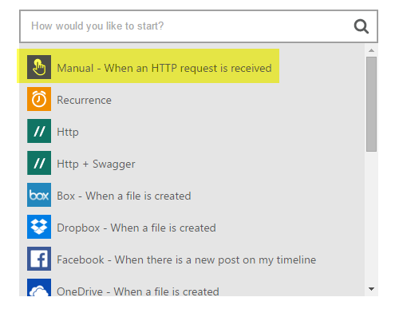

### Design View of your completed Logic App
Let's jump ahead and look at the completed design view for the Logic App, which is named DocDB.

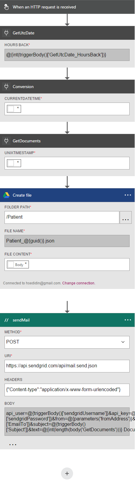

When editing the actions in the Logic App Designer, you have the option of selecting **Outputs** from the HTTP Request or from the previous action as shown in the sendMail action below.

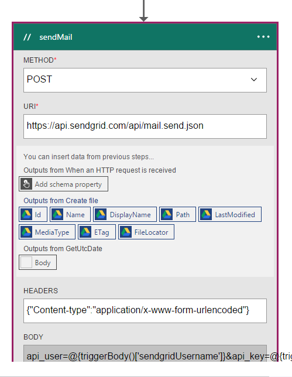

Before each action in your workflow, you can make a decision; **Add an action** or **Add a condition** as shown in the following figure.


If you select **Add a condition**, you are presented with a form, as shown in the following figure, to enter your logic.  This is in essence, a business rule.  If you click inside a field, you have a choice of selecting parameters from the previous action. You can also enter the values directly.

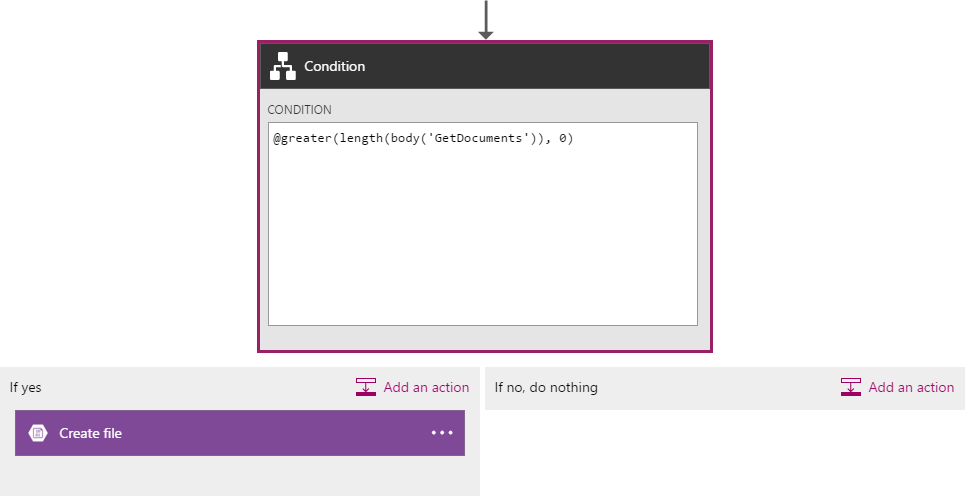

> [AZURE.NOTE] You also have the capability to enter everything in Code View.

Let's take a look at the completed Logic App in code view.  

```JSON
   
   	"$schema": "https://schema.management.azure.com/providers/Microsoft.Logic/schemas/2015-08-01-preview/workflowdefinition.json#",
    "actions": {
        "Conversion": {
            "conditions": [
                {
                    "dependsOn": "GetUtcDate"
                }
            ],
            "inputs": {
                "method": "post",
                "queries": {
                    "currentdateTime": "@{body('GetUtcDate')}"
                },
                "uri": "https://docdbnotificationapi-debug.azurewebsites.net/api/Conversion"
            },
            "metadata": {
                "apiDefinitionUrl": "https://docdbnotificationapi-debug.azurewebsites.net/swagger/docs/v1",
                "swaggerSource": "custom"
            },
            "type": "Http"
        },
        "Createfile": {
            "conditions": [
                {
                    "expression": "@greater(length(body('GetDocuments')), 0)"
                },
                {
                    "dependsOn": "GetDocuments"
                }
            ],
            "inputs": {
                "body": "@body('GetDocuments')",
                "host": {
                    "api": {
                        "runtimeUrl": "https://logic-apis-westus.azure-apim.net/apim/azureblob"
                    },
                    "connection": {
                        "name": "@parameters('$connections')['azureblob']['connectionId']"
                    }
                },
                "method": "post",
                "path": "/datasets/default/files",
                "queries": {
                    "folderPath": "/patients",
                    "name": "Patient_@{guid()}.json"
                }
            },
            "type": "ApiConnection"
        },
        "GetDocuments": {
            "conditions": [
                {
                    "dependsOn": "Conversion"
                }
            ],
            "inputs": {
                "method": "post",
                "queries": {
                    "unixTimeStamp": "@body('Conversion')"
                },
                "uri": "https://docdbnotificationapi-debug.azurewebsites.net/api/Patient"
            },
            "metadata": {
                "apiDefinitionUrl": "https://docdbnotificationapi-debug.azurewebsites.net/swagger/docs/v1",
                "swaggerSource": "custom"
            },
            "type": "Http"
        },
        "GetUtcDate": {
            "conditions": [],
            "inputs": {
                "method": "get",
                "queries": {
                    "hoursBack": "@{int(triggerBody()['GetUtcDate_HoursBack'])}"
                },
                "uri": "https://docdbnotificationapi-debug.azurewebsites.net/api/Authorization"
            },
            "metadata": {
                "apiDefinitionUrl": "https://docdbnotificationapi-debug.azurewebsites.net/swagger/docs/v1",
                "swaggerSource": "custom"
            },
            "type": "Http"
        },
        "sendMail": {
            "conditions": [
                {
                    "dependsOn": "GetDocuments"
                }
            ],
            "inputs": {
                "body": "api_user=@{triggerBody()['sendgridUsername']}&api_key=@{triggerBody()['sendgridPassword']}&from=@{parameters('fromAddress')}&to=@{triggerBody()['EmailTo']}&subject=@{triggerBody()['Subject']}&text=@{int(length(body('GetDocuments')))} Documents Found",
                "headers": {
                    "Content-type": "application/x-www-form-urlencoded"
                },
                "method": "POST",
                "uri": "https://api.sendgrid.com/api/mail.send.json"
            },
            "type": "Http"
        }
    },
    "contentVersion": "1.0.0.0",
    "outputs": {
        "Results": {
            "type": "String",
            "value": "@{int(length(body('GetDocuments')))} Records Found"
        }
    },
    "parameters": {
        "$connections": {
            "defaultValue": {},
            "type": "Object"
        },
        "fromAddress": {
            "defaultValue": "user@msn.com",
            "type": "String"
        },
        "toAddress": {
            "defaultValue": "XXXXX@XXXXXXX.net",
            "type": "String"
        }
    },
    "triggers": {
        "manual": {
            "inputs": {
                "schema": {
                    "properties": {},
                    "required": [],
                    "type": "object"
                }
            },
            "type": "Manual"
        }
	
```

If you are not familiar with what the different sections in the code represents, you can view the [Logic App Workflow Definition Language](http://aka.ms/logicappsdocs) documentation.

For this workflow you are using an [HTTP Webhook Trigger](https://sendgrid.com/blog/whats-webhook/). If you look at the code above, you will see parameters like the following example.

```C#

    =@{triggerBody()['Subject']}

```

The `triggerBody()` represents the parameters that are included in the body of an REST POST to the Logic App REST API. The `()['Subject']` represents the field. All these parameters make up the JSON formatted body. 

> [AZURE.NOTE] By using a Web hook, you can have full access to the header and body of the trigger's request. In this application you want the body.

As mentioned previously, you can use the designer to assign parameters or do it in code view.
If you do it in code view, then you define which properties require a value as shown in the following code sample. 

```JSON

	"triggers": {
		"manual": {
		    "inputs": {
			"schema": {
			    "properties": {
			"Subject": {
			    "type" : "String"	

			}
			},
			    "required": [
			"Subject"
			     ],
			    "type": "object"
			}
		    },
		    "type": "Manual"
		}
	    }
```

What you are doing is creating a JSON schema that will be passed in from the body of the HTTP POST.
To fire your trigger, you will need a Callback URL.  You will learn how to generate it later in the tutorial.  

## Actions
Let's see what each action in our Logic App does.

### GetUTCDate

**Designer View**

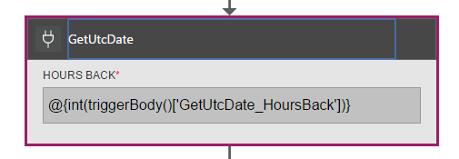

**Code View**

```JSON

	"GetUtcDate": {
		    "conditions": [],
		    "inputs": {
			"method": "get",
			"queries": {
			    "hoursBack": "@{int(triggerBody()['GetUtcDate_HoursBack'])}"
			},
			"uri": "https://docdbnotificationapi-debug.azurewebsites.net/api/Authorization"
		    },
		    "metadata": {
			"apiDefinitionUrl": "https://docdbnotificationapi-debug.azurewebsites.net/swagger/docs/v1"
		    },
		    "type": "Http"
		},

```

This HTTP action performs a GET operation.  It calls the API APP GetUtcDate method. The Uri uses the 'GetUtcDate_HoursBack' property passed into the Trigger body.  The 'GetUtcDate_HoursBack' value is set in the first Logic App. You will learn more about the Trigger Logic App later in the tutorial.

This action calls your API App to return the UTC Date string value.

#### Operations

**Request**

```JSON

	{
	    "uri": "https://docdbnotificationapi-debug.azurewebsites.net/api/Authorization",
	    "method": "get",
	    "queries": {
		  "hoursBack": "24"
	    }
	}

```

**Response**

```JSON

	{
	    "statusCode": 200,
	    "headers": {
		  "pragma": "no-cache",
		  "cache-Control": "no-cache",
		  "date": "Fri, 26 Feb 2016 15:47:33 GMT",
		  "server": "Microsoft-IIS/8.0",
		  "x-AspNet-Version": "4.0.30319",
		  "x-Powered-By": "ASP.NET"
	    },
	    "body": "Fri, 15 Jan 2016 23:47:33 GMT"
	}

```

The next step is to convert the UTC DateTime value to the Unix TimeStamp, which is a .NET double type.

### Conversion

##### Designer View

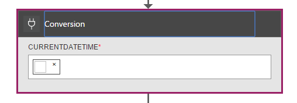

##### Code View

```JSON

	"Conversion": {
	    "conditions": [
		{
		    "dependsOn": "GetUtcDate"
		}
	    ],
	    "inputs": {
		"method": "post",
		"queries": {
		    "currentDateTime": "@{body('GetUtcDate')}"
		},
		"uri": "https://docdbnotificationapi-debug.azurewebsites.net/api/Conversion"
	    },
	    "metadata": {
		"apiDefinitionUrl": "https://docdbnotificationapi-debug.azurewebsites.net/swagger/docs/v1"
	    },
	    "type": "Http"
	},

```

In this step you pass in the value returned from the GetUTCDate.  There is a dependsOn condition, which means that the GetUTCDate action must complete successfully. If not, then this action is skipped. 

This action calls your API App to handle the conversion.

#### Operations

##### Request

```JSON

	{
	    "uri": "https://docdbnotificationapi-debug.azurewebsites.net/api/Conversion",
	    "method": "post",
	    "queries": {
		"currentDateTime": "Fri, 15 Jan 2016 23:47:33 GMT"
	    }
	}   
```

##### Response

```JSON

	{
	    "statusCode": 200,
	    "headers": {
		  "pragma": "no-cache",
		  "cache-Control": "no-cache",
		  "date": "Fri, 26 Feb 2016 15:47:33 GMT",
		  "server": "Microsoft-IIS/8.0",
		  "x-AspNet-Version": "4.0.30319",
		  "x-Powered-By": "ASP.NET"
	    },
	    "body": 1452901653
	}
```

In the next action, you will do a POST operation to our API App.

### GetDocuments 

##### Designer View

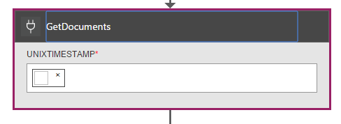

##### Code View

```JSON

	"GetDocuments": {
	    "conditions": [
		{
		    "dependsOn": "Conversion"
		}
	    ],
	    "inputs": {
		"method": "post",
		"queries": {
		    "unixTimeStamp": "@{body('Conversion')}"
		},
		"uri": "https://docdbnotificationapi-debug.azurewebsites.net/api/Patient"
	    },
	    "metadata": {
		"apiDefinitionUrl": "https://docdbnotificationapi-debug.azurewebsites.net/swagger/docs/v1"
	    },
	    "type": "Http"
	},

```

For the GetDocuments action you are going to pass in the response body from the Conversion action. This is a parameter in the Uri:

 
```C#

	unixTimeStamp=@{body('Conversion')}

```

The QueryDocuments action does a HTTP POST operation to the API App. 

The method called is **QueryForNewPatientDocuments**.

#### Operations

##### Request

```JSON

	{
	    "uri": "https://docdbnotificationapi-debug.azurewebsites.net/api/Patient",
	    "method": "post",
	    "queries": {
		"unixTimeStamp": "1452901653"
	    }
	}
```

##### Response

```JSON

	{
	    "statusCode": 200,
	    "headers": {
		"pragma": "no-cache",
		"cache-Control": "no-cache",
		"date": "Fri, 26 Feb 2016 15:47:35 GMT",
		"server": "Microsoft-IIS/8.0",
		"x-AspNet-Version": "4.0.30319",
		"x-Powered-By": "ASP.NET"
	    },
	    "body": [
		{
		    "id": "xcda",
		    "_rid": "vCYLAP2k6gAXAAAAAAAAAA==",
		    "_self": "dbs/vCYLAA==/colls/vCYLAP2k6gA=/docs/vCYLAP2k6gAXAAAAAAAAAA==/",
		    "_ts": 1454874620,
		    "_etag": "\"00007d01-0000-0000-0000-56b79ffc0000\"",
		    "resourceType": "Patient",
		    "text": {
			"status": "generated",
			"div": "<div>\n      \n      <p>Henry Levin the 7th</p>\n    \n    </div>"
		    },
		    "identifier": [
			{
			    "use": "usual",
			    "type": {
				"coding": [
				    {
					"system": "http://hl7.org/fhir/v2/0203",
					"code": "MR"
				    }
				]
			    },
			    "system": "urn:oid:2.16.840.1.113883.19.5",
			    "value": "12345"
			}
		    ],
		    "active": true,
		    "name": [
			{
                    "family": [
                        "Levin"
                    ],
                    "given": [
                        "Henry"
                    ]
                }
            ],
            "gender": "male",
            "birthDate": "1932-09-24",
            "managingOrganization": {
                "reference": "Organization/2.16.840.1.113883.19.5",
                "display": "Good Health Clinic"
            }
        },

```

The next action is to save the documents to [Azure Blog storage](https://azure.microsoft.com/services/storage/). 

> [AZURE.NOTE] Blob storage requires an Azure Storage account. You need to provision an Azure Blob storage account and add a new Blob named patients. For more information, see [Get started with Azure Blob storage](../storage/storage-dotnet-how-to-use-blobs.md).

### Create File

##### Designer View

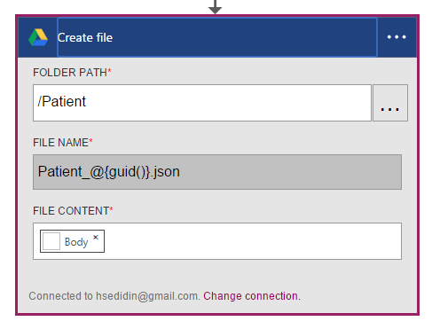

##### Code View

```JSON

	{
    "host": {
        "api": {
            "runtimeUrl": "https://logic-apis-westus.azure-apim.net/apim/azureblob"
        },
        "connection": {
            "name": "subscriptions/fxxxxxc079-4e5d-b002-xxxxxxxxxx/resourceGroups/Api-Default-Central-US/providers/Microsoft.Web/connections/azureblob"
        }
    },
    "method": "post",
    "path": "/datasets/default/files",
    "queries": {
        "folderPath": "/patients",
        "name": "Patient_17513174-e61d-4b56-88cb-5cf383db4430.json"
    },
    "body": [
        {
            "id": "xcda",
            "_rid": "vCYLAP2k6gAXAAAAAAAAAA==",
            "_self": "dbs/vCYLAA==/colls/vCYLAP2k6gA=/docs/vCYLAP2k6gAXAAAAAAAAAA==/",
            "_ts": 1454874620,
            "_etag": "\"00007d01-0000-0000-0000-56b79ffc0000\"",
            "resourceType": "Patient",
            "text": {
                "status": "generated",
                "div": "<div>\n      \n      <p>Henry Levin the 7th</p>\n    \n    </div>"
            },
            "identifier": [
                {
                    "use": "usual",
                    "type": {
                        "coding": [
                            {
                                "system": "http://hl7.org/fhir/v2/0203",
                                "code": "MR"
                            }
                        ]
                    },
                    "system": "urn:oid:2.16.840.1.113883.19.5",
                    "value": "12345"
                }
            ],
            "active": true,
            "name": [
                {
                    "family": [
                        "Levin"
                    ],
                    "given": [
                        "Henry"
                    ]
                }
            ],
            "gender": "male",
            "birthDate": "1932-09-24",
            "managingOrganization": {
                "reference": "Organization/2.16.840.1.113883.19.5",
                "display": "Good Health Clinic"
            }
        },

```

The code is generated from action in the designer. You don't have to modify the code.

If you are not familiar with using the Azure Blob API, see [Get started with the Azure blob storage API](../connectors/connectors-create-api-azureblobstorage.md).

#### Operations

##### Request

```JSON

	"host": {
        "api": {
            "runtimeUrl": "https://logic-apis-westus.azure-apim.net/apim/azureblob"
        },
        "connection": {
            "name": "subscriptions/fxxxxxc079-4e5d-b002-xxxxxxxxxx/resourceGroups/Api-Default-Central-US/providers/Microsoft.Web/connections/azureblob"
        }
    },
    "method": "post",
    "path": "/datasets/default/files",
    "queries": {
        "folderPath": "/patients",
        "name": "Patient_17513174-e61d-4b56-88cb-5cf383db4430.json"
    },
    "body": [
        {
            "id": "xcda",
            "_rid": "vCYLAP2k6gAXAAAAAAAAAA==",
            "_self": "dbs/vCYLAA==/colls/vCYLAP2k6gA=/docs/vCYLAP2k6gAXAAAAAAAAAA==/",
            "_ts": 1454874620,
            "_etag": "\"00007d01-0000-0000-0000-56b79ffc0000\"",
            "resourceType": "Patient",
            "text": {
                "status": "generated",
                "div": "<div>\n      \n      <p>Henry Levin the 7th</p>\n    \n    </div>"
            },
            "identifier": [
                {
                    "use": "usual",
                    "type": {
                        "coding": [
                            {
                                "system": "http://hl7.org/fhir/v2/0203",
                                "code": "MR"
                            }
                        ]
                    },
                    "system": "urn:oid:2.16.840.1.113883.19.5",
                    "value": "12345"
                }
            ],
            "active": true,
            "name": [
                {
                    "family": [
                        "Levin"
                    ],
                    "given": [
                        "Henry"
                    ]
                }
            ],
            "gender": "male",
            "birthDate": "1932-09-24",
            "managingOrganization": {
                "reference": "Organization/2.16.840.1.113883.19.5",
                "display": "Good Health Clinic"
            }
        },….


```

##### Response

```JSON

	{
	    "statusCode": 200,
	    "headers": {
		"pragma": "no-cache",
		"x-ms-request-id": "2b2f7c57-2623-4d71-8e53-45c26b30ea9d",
		"cache-Control": "no-cache",
		"date": "Fri, 26 Feb 2016 15:47:36 GMT",
		"set-Cookie": "ARRAffinity=29e552cea7db23196f7ffa644003eaaf39bc8eb6dd555511f669d13ab7424faf;Path=/;Domain=127.0.0.1",
		"server": "Microsoft-HTTPAPI/2.0",
		"x-AspNet-Version": "4.0.30319",
		"x-Powered-By": "ASP.NET"
	    },
	    "body": {
		"Id": "0B0nBzHyMV-_NRGRDcDNMSFAxWFE",
		"Name": "Patient_47a2a0dc-640d-4f01-be38-c74690d085cb.json",
		"DisplayName": "Patient_47a2a0dc-640d-4f01-be38-c74690d085cb.json",
		"Path": "/Patient/Patient_47a2a0dc-640d-4f01-be38-c74690d085cb.json",
		"LastModified": "2016-02-26T15:47:36.215Z",
		"Size": 65647,
		"MediaType": "application/octet-stream",
		"IsFolder": false,
		"ETag": "\"c-g_a-1OtaH-kNQ4WBoXLp3Zv9s/MTQ1NjUwMTY1NjIxNQ\"",
		"FileLocator": "0B0nBzHyMV-_NRGRDcDNMSFAxWFE"
	    }
	}
```

Your last step is to send an email notification

### sendEmail

##### Designer View

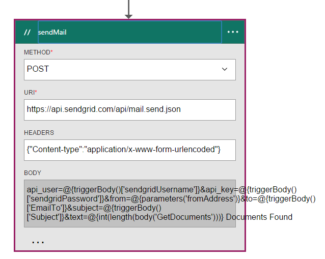

##### Code View

```JSON


	"sendMail": {
	    "conditions": [
		{
		    "dependsOn": "GetDocuments"
		}
	    ],
	    "inputs": {
		"body": "api_user=@{triggerBody()['sendgridUsername']}&api_key=@{triggerBody()['sendgridPassword']}&from=@{parameters('fromAddress')}&to=@{triggerBody()['EmailTo']}&subject=@{triggerBody()['Subject']}&text=@{int(length(body('GetDocuments')))} Documents Found",
		"headers": {
		    "Content-type": "application/x-www-form-urlencoded"
		},
		"method": "POST",
		"uri": "https://api.sendgrid.com/api/mail.send.json"
	    },
	    "type": "Http"
	}
```

In this action you send an email notification.  You are using [SendGrid](https://sendgrid.com/marketing/sendgrid-services?cvosrc=PPC.Bing.sendgrib&cvo_cid=SendGrid%20-%20US%20-%20Brand%20-%20&mc=Paid%20Search&mcd=BingAds&keyword=sendgrib&network=o&matchtype=e&mobile=&content=&search=1&utm_source=bing&utm_medium=cpc&utm_term=%5Bsendgrib%5D&utm_content=%21acq%21v2%2134335083397-8303227637-1649139544&utm_campaign=SendGrid+-+US+-+Brand+-+%28English%29).   

The code for this was generated using a template for Logic App and SendGrid that is in the [101-logic-app-sendgrid Github repository](https://github.com/Azure/azure-quickstart-templates/tree/master/101-logic-app-sendgrid).
 
The HTTP operation is a POST. 

The authorization parameters are in the trigger properties

```JSON

	},
		"sendgridPassword": {
			 "type": "SecureString"
		 },
		 "sendgridUsername": {
			"type": "String"
		 }

		In addition, other parameters are static values set in the Parameters section of the Logic App. These are:
		},
		"toAddress": {
		    "defaultValue": "XXXX@XXXX.com",
		    "type": "String"
		},
		"fromAddress": {
		    "defaultValue": "XXX@msn.com",
		    "type": "String"
		},
		"emailBody": {
		    "defaultValue": "@{string(concat(int(length(actions('QueryDocuments').outputs.body)) Records Found),'/n', actions('QueryDocuments').outputs.body)}",
		    "type": "String"
		},

```

The emailBody is concatenating the number of documents returned from the query, which can be "0" or more, along with, "Records Found". The rest of the parameters are set from the Trigger parameters.

This action depends on the **GetDocuments** action.

#### Operations

##### Request
```JSON

	{
	    "uri": "https://api.sendgrid.com/api/mail.send.json",
	    "method": "POST",
	    "headers": {
		"Content-type": "application/x-www-form-urlencoded"
	    },
	    "body": "api_user=azureuser@azure.com&api_key=Biz@Talk&from=user@msn.com&to=XXXX@XXXX.com&subject=New Patients&text=37 Documents Found"
	}

```

##### Response

```JSON

	{
	    "statusCode": 200,
	    "headers": {
		"connection": "keep-alive",
		"x-Frame-Options": "DENY,DENY",
		"access-Control-Allow-Origin": "https://sendgrid.com",
		"date": "Fri, 26 Feb 2016 15:47:35 GMT",
		"server": "nginx"
	    },
	    "body": {
		"message": "success"
	    }
	}
```

Lastly you want to be able to see the results from your Logic App on the Azure Portal. To do that, you add a parameter to the outputs section.


```JSON

	"outputs": {
		"Results": {
		    "type": "String",
		    "value": "@{int(length(actions('QueryDocuments').outputs.body))} Records Found"
		}

```

This returns the same value that is sent in the email body. The following figure shows an example where "29 Records Found".

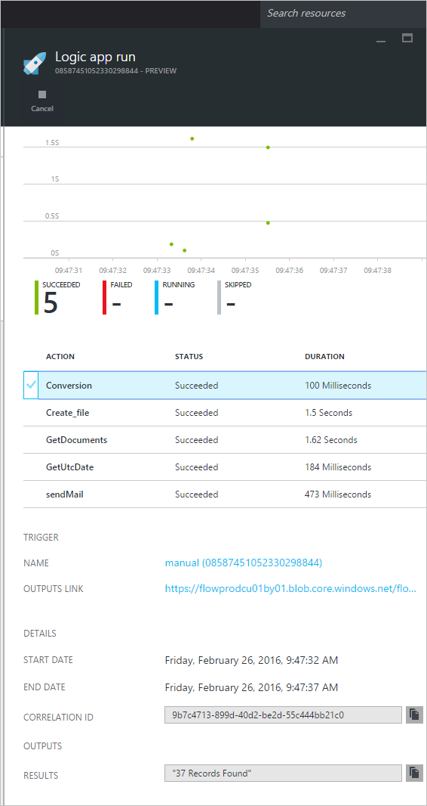

## Metrics
You can configure monitoring for the main Logic App in the portal. This enables you to view the Run Latency and other events as show in the following figure.

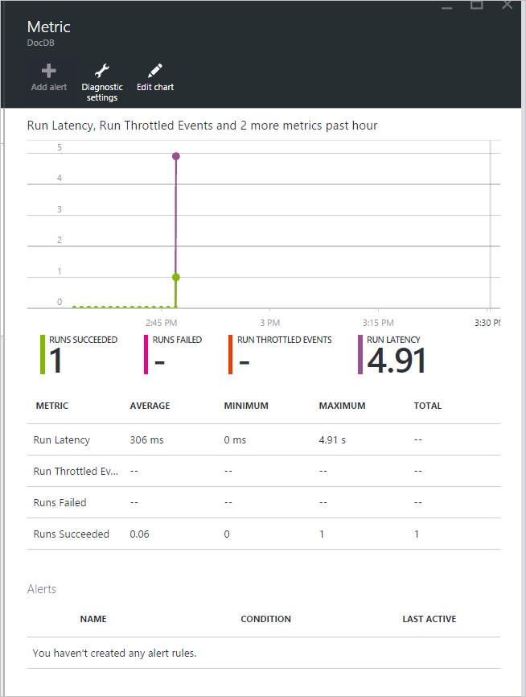

## DocDb Trigger

This Logic App is the trigger that starts the workflow on your main Logic App.

The following figure shows the Designer View.

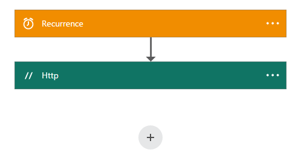

```JSON

	{
	    "$schema": "https://schema.management.azure.com/providers/Microsoft.Logic/schemas/2015-08-01-preview/workflowdefinition.json#",
	    "actions": {
		"Http": {
		    "conditions": [],
		    "inputs": {
			"body": {
			    "EmailTo": "XXXXXX@XXXXX.net",
			    "GetUtcDate_HoursBack": "24",
			    "Subject": "New Patients",
			    "sendgridPassword": "********",
			    "sendgridUsername": "azureuser@azure.com"
			},
			"method": "POST",
			"uri": "https://prod-01.westus.logic.azure.com:443/workflows/12a1de57e48845bc9ce7a247dfabc887/triggers/manual/run?api-version=2015-08-01-preview&sp=%2Ftriggers%2Fmanual%2Frun&sv=1.0&sig=ObTlihr529ATIuvuG-dhxOgBL4JZjItrvPQ8PV6973c"
		    },
		    "type": "Http"
		}
	    },
	    "contentVersion": "1.0.0.0",
	    "outputs": {
		"Results": {
		    "type": "String",
		    "value": "@{body('Http')['status']}"
		}
	    },
	    "parameters": {},
	    "triggers": {
		"recurrence": {
		    "recurrence": {
			"frequency": "Hour",
			"interval": 24
		    },
		    "type": "Recurrence"
		}
	    }
	}

```

The Trigger is set for a recurrence of twenty-four hours. 
The Action is an HTTP POST that uses the Callback URL for the main Logic App. 
The body contains the parameters that are specified in the JSON Schema. 

#### Operations

##### Request

```JSON

	{
	    "uri": "https://prod-01.westus.logic.azure.com:443/workflows/12a1de57e48845bc9ce7a247dfabc887/triggers/manual/run?api-version=2015-08-01-preview&sp=%2Ftriggers%2Fmanual%2Frun&sv=1.0&sig=ObTlihr529ATIuvuG-dhxOgBL4JZjItrvPQ8PV6973c",
	    "method": "POST",
	    "body": {
		"EmailTo": "XXXXXX@XXXXX.net",
		"GetUtcDate_HoursBack": "24",
		"Subject": "New Patients",
		"sendgridPassword": "********",
		"sendgridUsername": "azureuser@azure.com"
	    }
	}

```

##### Response

```JSON

	{
	    "statusCode": 202,
	    "headers": {
		"pragma": "no-cache",
		"x-ms-ratelimit-remaining-workflow-writes": "7486",
		"x-ms-ratelimit-burst-remaining-workflow-writes": "1248",
		"x-ms-request-id": "westus:2d440a39-8ba5-4a9c-92a6-f959b8d2357f",
		"cache-Control": "no-cache",
		"date": "Thu, 25 Feb 2016 21:01:06 GMT"
	    }
	}
```

Now let's look at the API App.

## DocDBNotificationApi

Although there are several operations in the app, you are only going to use three.

* GetUtcDate
* ConvertToTimeStamp
* QueryForNewPatientDocuments

### DocDBNotificationApi Operations
Let's take a look at the Swagger documentation

> [AZURE.NOTE] To allow you to call the operations externally, you need to add a CORS allowed origin value of "*" (without quotes) in the settings of your API App as shown in the following figure.

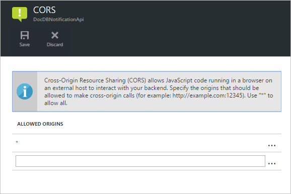

#### GetUtcDate


#### ConvertToTimeStamp

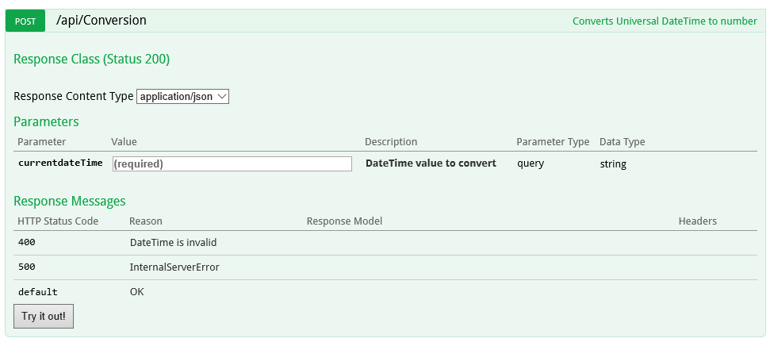

#### QueryForNewPatientDocuments

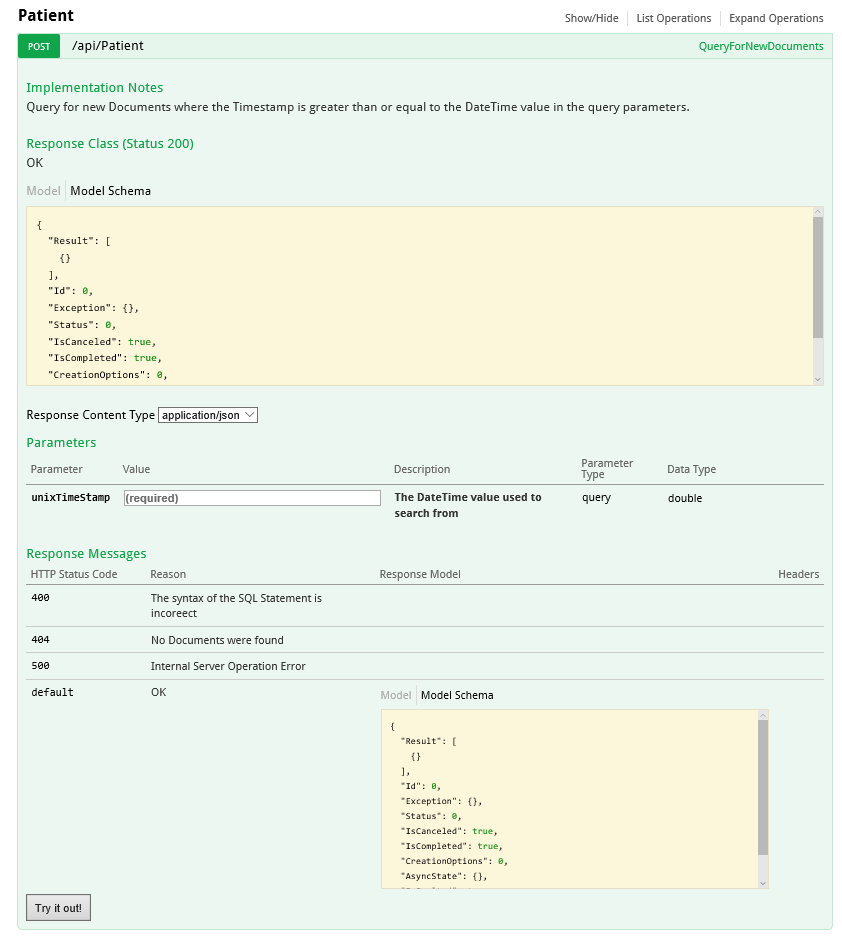

Let's take a look at the code behind this operation.

#### GetUtcDate

```C#

    /// <summary>
	/// Gets the current UTC Date value
	/// </summary>
	/// <returns></returns>
	[H ttpGet]
	[Metadata("GetUtcDate", "Gets the current UTC Date value minus the Hours Back")]
	[SwaggerOperation("GetUtcDate")]
	[SwaggerResponse(HttpStatusCode.OK, type: typeof (string))]
	[SwaggerResponse(HttpStatusCode.InternalServerError, "Internal Server Operation Error")]
	public string GetUtcDate(
	   [Metadata("Hours Back", "How many hours back from the current Date Time")] int hoursBack)
	{


	    return DateTime.UtcNow.AddHours(-hoursBack).ToString("r");
	}
```

This operation simply returns the returns the current UTC DateTime minus the HoursBack value.

#### ConvertToTimeStamp

``` C#

        /// <summary>
        ///     Converts DateTime to double
        /// </summary>
        /// <param name="currentdateTime"></param>
        /// <returns></returns>
        [Metadata("Converts Universal DateTime to number")]
        [SwaggerResponse(HttpStatusCode.OK, null, typeof (double))]
        [SwaggerResponse(HttpStatusCode.BadRequest, "DateTime is invalid")]
        [SwaggerResponse(HttpStatusCode.InternalServerError)]
        [SwaggerOperation(nameof(ConvertToTimestamp))]
        public double ConvertToTimestamp(
            [Metadata("currentdateTime", "DateTime value to convert")] string currentdateTime)
        {
            double result;

            try
            {
                var uncoded = HttpContext.Current.Server.UrlDecode(currentdateTime);

                var newDateTime = DateTime.Parse(uncoded);
                //create Timespan by subtracting the value provided from the Unix Epoch
                var span = newDateTime - new DateTime(1970, 1, 1, 0, 0, 0, 0).ToLocalTime();

                //return the total seconds (which is a UNIX timestamp)
                result = span.TotalSeconds;
            }
            catch (Exception e)
            {
                throw new Exception("unable to convert to Timestamp", e.InnerException);
            }

            return result;
        }

```

This operation converts the response from the GetUtcDate operation to a double value.

#### QueryForNewPatientDocuments

```C#

	    /// <summary>
        ///     Query for new Patient Documents
        /// </summary>
        /// <param name="unixTimeStamp"></param>
        /// <returns>IList</returns>
        [Metadata("QueryForNewDocuments",
            "Query for new Documents where the Timestamp is greater than or equal to the DateTime value in the query parameters."
            )]
        [SwaggerOperation("QueryForNewDocuments")]
        [SwaggerResponse(HttpStatusCode.OK, type: typeof (Task<IList<Document>>))]
        [SwaggerResponse(HttpStatusCode.BadRequest, "The syntax of the SQL Statement is incorrect")]
        [SwaggerResponse(HttpStatusCode.NotFound, "No Documents were found")]
        [SwaggerResponse(HttpStatusCode.InternalServerError, "Internal Server Operation Error")]
        // ReSharper disable once ConsiderUsingAsyncSuffix
        public IList<Document> QueryForNewPatientDocuments(
            [Metadata("UnixTimeStamp", "The DateTime value used to search from")] double unixTimeStamp)
        {
            var context = new DocumentDbContext();
            var filterQuery = string.Format(InvariantCulture, "SELECT * FROM Patient p WHERE p._ts >=  {0}",
                unixTimeStamp);
            var options = new FeedOptions {MaxItemCount = -1};


            var collectionLink = UriFactory.CreateDocumentCollectionUri(DocumentDbContext.DatabaseId,
                DocumentDbContext.CollectionId);

            var response =
                context.Client.CreateDocumentQuery<Document>(collectionLink, filterQuery, options).AsEnumerable();

            return response.ToList();
	}

```

This operation uses the [DocumentDB .NET SDK](documentdb-sdk-dotnet.md) to create a document query. 

```C#
     CreateDocumentQuery<Document>(collectionLink, filterQuery, options).AsEnumerable();
```

The response from the ConvertToTimeStamp operation (unixTimeStamp) is passed in. The operation returns a List of documents, `IList<Document>`.

Previously we talked about the CallbackURL. In order to start the workflow in your main Logic App, you will need to call it using the CallbackURL.

## CallbackURL

To start off, you will need your Azure AD Token.  It can be difficult to get this token. I was looking for an easy method and Jeff Hollan, who is an Azure Logic App program manager, recommended using the [armclient](http://blog.davidebbo.com/2015/01/azure-resource-manager-client.html) in PowerShell.  You can install it following the directions provided.

The operations you want to use are Login and Call ARM API.
 
Login: You use the same credentials for logging in to the Azure Portal. 

The Call ARM Api operation is the one that will generate your CallBackURL.

In PowerShell, you call it as follows:	

```powershell

	ArmClient.exe post https://management.azure.com/subscriptions/[YOUR SUBSCRIPTION ID/resourcegroups/[YOUR RESOURCE GROUP]/providers/Microsoft.Logic/workflows/[YOUR LOGIC APP NAME/triggers/manual/listcallbackurl?api-version=2015-08-01-preview

```

Your result should look like this:

```powershell

	https://prod-02.westus.logic.azure.com:443/workflows/12a1de57e48845bc9ce7a247dfabc887/triggers/manual/run?api-version=2015-08-01-prevaiew&sp=%2Ftriggers%2Fmanual%2Frun&sv=1.0&sig=XXXXXXXXXXXXXXXXXXX

```

You can use a tool like [postman](http://www.getpostman.com/) to test you main Logic App as shown in the following figure.

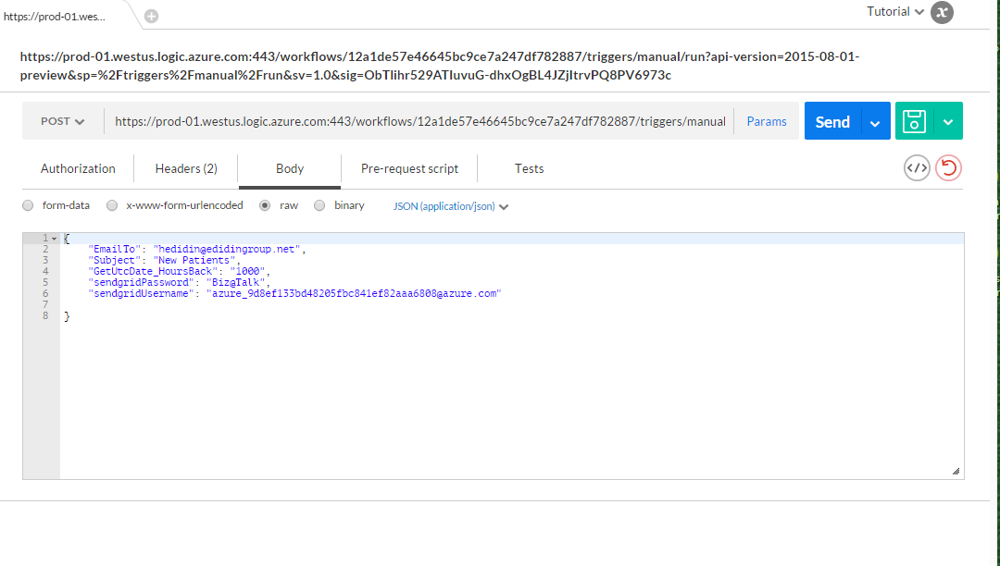

The following table lists the Trigger parameters that make up the body of the DocDB Trigger Logic App.

Parameter | Description 
--- | --- 
GetUtcDate_HoursBack | Used to set the number of hours for the search start date
sendgridUsername | Used to set the number of hours for the search start date
sendgridPassword | The user name for Send Grid email
EmailTo | The email address that will receive the email notification
Subject | The Subject for the email

## Viewing the patient data in the Azure Blob service

Go to your Azure Storage account, and select Blobs under services as shown in the following figure.

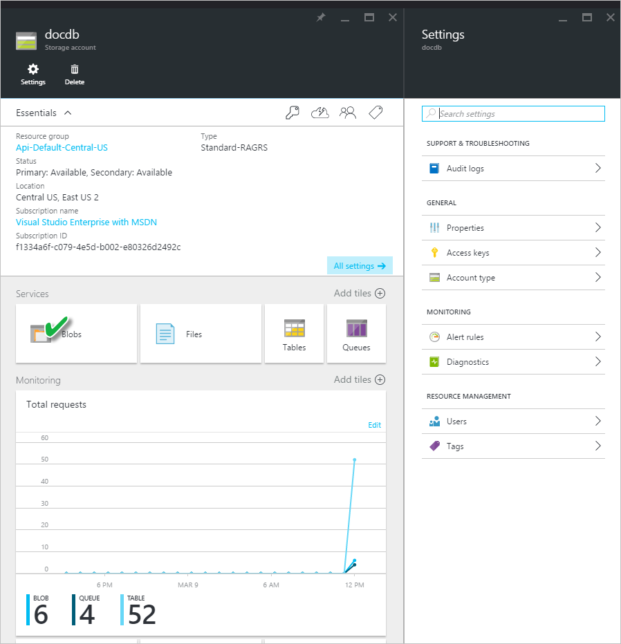 

You will be able to view the Patient blob file information as shown below.

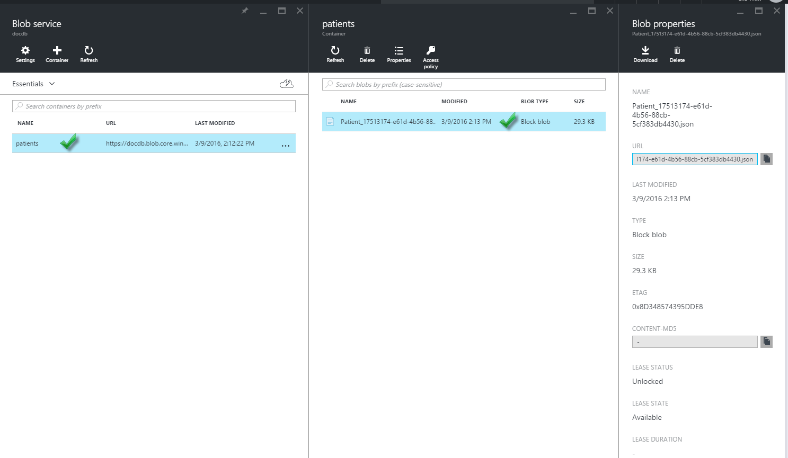


## Summary

In this walkthrough, you've learned the following:

* It is possible to implement notifications in DocumentDB.
* By using Logic Apps, you can automate the process.
* By using Logic Apps, you can reduce the time it takes to deliver an application.
* By using HTTP you can easy consume an API App within a Logic App.
* You can easily create a CallBackURL that replaces the HTTP Listener.
* You can easily create custom workflows with Logic Apps Designer.

The key is to plan ahead and model your workflow.

## Next steps
Please download and use the Logic App code provided on [Github](https://github.com/HEDIDIN/DocDbNotifications). I invite you to build on the application and submit changes to the repo. 

To learn more about DocumentDB, visit the [Learning Path](https://azure.microsoft.com/documentation/learning-paths/documentdb/).
