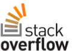

<properties
  pageTitle="DocumentDB community & news | Microsoft Azure"
  description="Join the Azure DocumentDB community to build relationships, showcase your work, and sharpen your skills."
  services="documentdb"
  documentationCenter=""
  authors="aliuy"
  manager="johnmac"
  editor="mimig"/>

<tags
  ms.service="documentdb"
  ms.devlang="na"
  ms.topic="article"
  ms.tgt_pltfrm="na"
  ms.workload="data-services"
  ms.date="07/06/2016"
  ms.author="andrl"/>

# Community portal

## Community spotlight

Let us promote your project! Show us the awesome project you're working on with DocumentDB, and we will help share your genius with the world. To submit your project, send us an e-mail at: [askdocdb@microsoft.com](mailto:askdocdb@microsoft.com).

### documentdb-lumenize

*by Larry Maccherone*

Aggregations (Group-by, Pivot-table, and N-dimensional Cube) and Time Series Transformations as Stored Procedures in DocumentDB.

Check it out on [Github](https://github.com/lmaccherone/documentdb-lumenize) and [npm](https://www.npmjs.com/package/lumenize).

### DocumentDB Studio

*by Ming Liu*

A client management viewer/explorer for Microsoft Azure DocumentDB service.

Check it out on [Github](https://github.com/mingaliu/DocumentDBStudio).

### DoQmentDB

*by Ariel Mashraki*

DoQmentDB is a Node.js promise-based client, that provide a MongoDB-like layer on top of DocumentDB.

Check it out on [Github](https://github.com/a8m/doqmentdb) and [npm](https://www.npmjs.com/package/doqmentdb).

### Swagger REST API for DocumentDB

*by Howard Edidin*

A DocumentDB REST API Swagger file that can be easily deployed as an API App.

Check it out on [Github](https://github.com/HEDIDIN/DocumentDB-REST/tree/master/DocumentDBRestApi).

### fluent-plugin-documentdb

*by Yoichi Kawasaki*

fluent-plugin-documentdb is a Fluentd plugin for outputing to Azure DocumentDB.

Check it out on [Github](https://github.com/yokawasa/fluent-plugin-documentdb) and [rubygems](https://rubygems.org/gems/fluent-plugin-documentdb).

*Find more open source DocumentDB projects on [GitHub](https://github.com/search?p=4&q=documentdb&type=Repositories).*

## News, blogs, and articles

You can stay up-to-date with the latest DocumentDB news and features by following [our blog](https://azure.microsoft.com/blog/tag/documentdb/).

**Community posts:**

- [**Going Social with DocumentDB**](https://blogs.msdn.microsoft.com/mvpawardprogram/2016/03/15/going-social-with-documentdb/) - *by Matias Quarantaas*

- [**UWP, Azure App Services, and DocumentDB Soup: A photo-sharing app**](https://blogs.windows.com/buildingapps/2016/03/17/uwp-azure-app-services-and-documentdb-soup-a-photo-sharing-app/) - *by Eric Langland*

- [**Notifications for new or changed DocumentDB resources using Logic Apps**](documentdb-change-notification.md) - *by Howard Edidin*

- [**Collecting logs into Azure DocumentDB using fluent-plugin-documentdb**](http://unofficialism.info/posts/collecting-logs-into-azure-documentdb-using-fluent-plugin-documentdb/) - *by Yoichi Kawasaki*

- [**DocumentDB revisited Part 1/2 – The theory**](https://peterintheazuresky.wordpress.com/2016/02/19/documentdb-revisited-part-12-the-theory/) - *by Peter Mannerhult*

- [**What to love and hate about Azure’s DocumentDB**](http://blog.falafel.com/4-what-to-love-and-hate-about-azures-documentdb/) - *by George Saadeh*

- [**Azure DocumentDB Server-Side Scripting**](https://www.simple-talk.com/cloud/cloud-data/azure-documentdb-server-side-scripting/) - *by Robert Sheldon*

- [**DocumentDB as a data sink for Azure Stream Analytics**](http://janatdevelopment.com/2015/12/11/documentdb-as-a-data-sink-for-azure-stream-analytics/?utm_source=twitterfeed&utm_medium=twitter) - *by Jan Hentschel*

- [**Azure DocumentDB in production!**](http://blog.nexapp.ca/2015/11/30/azure-documentdb-in-production/) - *by Alexandre Walsh and Marc-Olivier Duval*

- [**Azure Search Indexers – DocumentDB Queries (Spanish)**](http://www.ealsur.com.ar/wp/index.php/2015/11/19/azure-search-indexers-documentdb-queries/) - *by Matthias Quaranta*

- [**Azure DocumentDB SQL query basics (Japanese)**](http://beachside.hatenablog.com/entry/2015/12/06/000045) - *by Atsushi Yokohama*

- [**Data Points - Aurelia Meets DocumentDB: A Matchmaker’s Journey**](https://msdn.microsoft.com/magazine/mt620011.aspx) - *by Julie Lerman*

- [**Infrastructure as Code and Continuous Deployment of a Node.js + Azure DocumentDB Solution**](http://www.talmeida.net/blog/2015/10/26/infrastructure-as-code-and-continuous-deployment-of-a-nodejs-azure-documentdb-solution) - *by Thiago Almedia*

- [**Why DocumentDb Makes Good Business Sense for Some Projects**](http://www.iquestllc.com/blogs/read/405/why-documentdb-makes-good-business-sense-for-some-projects) - *by Samuel Uresin*

- [**Azure DocumentDB development moving forward – development of the Client class (1 of 2) (Japanese)**](http://beachside.hatenablog.com/entry/2015/10/01/202734) - *by Atsushi Yokohama*

- [**Things you need to know when using Azure DocumentDB (Japanese)**](http://beachside.hatenablog.com/entry/2015/10/01/202734) - *by Atsushi Yokohama*

- [**Dealing with RequestRateTooLarge errors in Azure DocumentDB and testing performance**](http://blogs.msdn.com/b/bigdatasupport/archive/2015/09/02/dealing-with-requestratetoolarge-errors-in-azure-documentdb-and-testing-documentdb-performance.aspx) - *by Azim Uddin*

- [**Data Points - An Overview of Microsoft Azure DocumentDB**](https://msdn.microsoft.com/magazine/mt147238.aspx) - *by Julie Lerman*

- [**Using DocumentDB With F#**](https://jamessdixon.wordpress.com/2014/12/30/using-documentdb-with-f/) - *by Jamie Dixon*

- [**Analysing Application Logs with DocumentDB**](http://vincentlauzon.com/2015/09/06/analysing-application-logs-with-documentdb/) - *by Vincent-Philippe Lauzon*

- [**Azure DocumentDB – Point in time Backups**](http://softwarejuancarlos.com/2015/09/06/azure-documentdb-point-in-time-backups/) - *by Juan Carlos Sanchez*

*Do you have a blog post, code sample, or case-study you'd like to share? [Let us know](mailto:askdocdb@microsoft.com)!*

## Events and recordings

### Recent and upcoming events

| Event Name                                                                                                                 | Speaker                                                     | Location             | Date                     | Hashtag |
| -------------------------------------------------------------------------------------------------------------------------- | ----------------------------------------------------------- | -------------------- | ------------------------ | ------- |
| [Ignite 2016](https://myignite.microsoft.com/sessions?q=documentdb) | Andrew Liu and Tara Jana | Atlanta, GA | September 26-30, 2016 | [#MSIgnite](https://twitter.com/MS_Ignite) |

*Are you speaking at or hosting an event? [Let us know](mailto:askdocdb@microsoft.com) how we can help!*

### Previous events and recordings

| Event Name                                                                                                                 | Speaker                                                     | Location             | Date                   | Recording |
| -------------------------------------------------------------------------------------------------------------------------- | ----------------------------------------------------------- | -------------------- | ---------------------- | --------- |
| [DevTeach](http://devteach.com/) | Ken Cenerelli  | Montreal, Canada | July 4-8, 2016 | [NoSQL, No Problem, Using Azure DocumentDB](http://www.slideshare.net/KenCenerelli) |
| [Integration and IoT ](http://www.btug.be/events) | Eldert Grootenboer | Kontich, Belgium | June 30, 2016 | n/a |
| [MongoDB World 2016](https://www.mongodb.com/world16) | Kirill Gavrylyuk | New York, New York | June 28-29, 2016 | n/a |
| [Integration User Group](http://www.integrationusergroup.com/do-logic-apps-support-error-handling/) | Howard S. Edidin | Webcast | June 20, 2016 | [Do Logic Apps support error handling?](http://www.integrationusergroup.com/do-logic-apps-support-error-handling/) |
| [Meetup: UK Azure User Group](http://www.meetup.com/UKAzureUserGroup/events/229673468/)| Andrew Liu  | London, UK | May 12, 2016 | n/a
|[Meetup: ONETUG - Orlando .NET User Group ](http://www.meetup.com/ONETUG/events/230797164/)| Santosh Hari| Orlando, FL| May 12, 2016| n/a 
| [SQLBits XV](https://sqlbits.com/)                                                                                         | Andrew Liu, Aravind Ramachandran                            | Liverpool, UK        | May 4-7, 2016            | n/a| [Meetup: NYC .NET Developers Group](http://www.meetup.com/NYC-NET-Developers/events/230396260/)                            | Leonard Lobel                                               | New York City, NY    | April 21, 2016           | n/a |
| [Integration User Group](http://www.integrationusergroup.com/#)                                                            | Howard Edidin                                               | Webinar              | April 25, 2016           | n/a |
| [Global Azure Bootcamp: SoCal](http://xprs.imcreator.com/free/vishalishere/gab2016)                                        | Leonard Lobel                                               | Orange, CA           | April 16, 2016           | n/a |
| [Global Azure Bootcamp: Redmond](https://www.eventbrite.com/e/2016-global-azure-bootcamp-redmond-wa-tickets-21387752343)   | David Makogon                                               | Redmond, WA          | April 16, 2016           | n/a |
| [SQL Saturday #481 - Israel 2016](http://www.sqlsaturday.com/481/Sessions/Details.aspx?sid=40912)                          | Leonard Lobel                                               | HaMerkaz, Israel     | April 04, 2016         | n/a |
| [Build 2016](https://build.microsoft.com/)                                                                                 | John Macintyre                                              | San Francisco, CA    | March 31, 2016         | [Delivering Applications at Scale with DocumentDB, Azure's NoSQL Document Database](https://channel9.msdn.com/Events/Build/2016/B840)
| [SQL Saturday #505 - Belgium 2016](http://www.sqlsaturday.com/505/Sessions/Details.aspx?sid=44217)                         | Mihail Mateev                                               | Antwerp, Belgium     | March 19, 2016         | n/a |
| [Meetup: CloudTalk](http://www.meetup.com/CloudTalk/events/227963695/)                                                     | Kirat Pandya                                                | Bellevue, WA         | March 3, 2016          | n/a |
| [Meetup: Azure Austin](http://www.meetup.com/azureaustin/events/228209275/)                                                | Merwan Chinta                                               | Austin, TX           | January 28, 2016       | n/a |
| [Meetup: msdevmtl](http://www.meetup.com/msdevmtl/events/223839818/)                                                       | Vincent-Philippe Lauzon                                     | Montreal, QC, Canada | December 1, 2015       | n/a |
| [Meetup: SeattleJS](http://www.meetup.com/seattlejs/events/220102664/)                                                     | David Makogon                                               | Seattle, WA          | November 12, 2015      | n/a |
| [PASS Summit 2015](http://www.sqlpass.org/summit/2015/)                                                                    | Jeff Renz, Andrew Hoh, Aravind Ramachandran, John Macintyre | Seattle, WA          | October 27-30, 2015    | [Developing Modern Applications on Azure](https://www.youtube.com/watch?v=k5Z24HX-RyQ) |
| [CloudDevelop 2015](http://www.clouddevelop.org/)                                                                          | David Makogon, Ryan Crawcour                                | Columbus, OH         | October 23, 2015       | n/a |
| [SQL Saturday #454 - Turin 2015](http://www.sqlsaturday.com/454/Sessions/Details.aspx?sid=40130)                           | Marco De Nittis                                             | Turin, Italy         | October 10, 2015       | n/a |
| [SQL Saturday #430 - Sofia 2015](http://www.sqlsaturday.com/430/Sessions/Details.aspx?sid=36090)                           | Leonard Lobel                                               | Sofia, Bulgaria      | October 10, 2015       | n/a |
| [SQL Saturday #444 - Kansas City 2015](http://www.sqlsaturday.com/444/Sessions/Details.aspx?sid=38576)                     | Jeff Renz                                                   | Kansas City, MO      | October 3, 2015        | n/a |
| [SQL Saturday #429 - Oporto 2015](http://www.sqlsaturday.com/429/Sessions/Details.aspx?sid=36089)                          | Leonard Lobel                                               | Oporto, Portugal     | October 3, 2015        | n/a |
| [AzureCon](https://azure.microsoft.com/azurecon/)                                                                          | David Makogon, Ryan Crawcour, John Macintyre                | Virtual Event        | September 29, 2015     | [Azure data and analytics platform](https://channel9.msdn.com/events/Microsoft-Azure/AzureCon-2015/ACON207) [Working with NoSQL Data in DocumentDB](https://channel9.msdn.com/Events/Microsoft-Azure/AzureCon-2015/ACON338) |
| [SQL Saturday #434 - Holland 2015](http://www.sqlsaturday.com/434/Sessions/Details.aspx?sid=36413)                         | Leonard Lobel                                               | Utrecht, Netherlands | September 26, 2015     | [Introduction to Azure DocumentDB](https://channel9.msdn.com/Blogs/Windows-Azure/SQL-Saturday-Holland-2015-Introduction-to-Azure-DocumentDB) |
| [SQL Saturday #441 - Denver 2015](http://www.sqlsaturday.com/441/Sessions/Details.aspx?sid=39191)                          | Jeff Renz                                                   | Denver, CO           | September 19, 2015     | n/a |
| [Meetup: San Francisco Bay Area Azure Developers](http://www.meetup.com/bayazure/events/223943785/)                        | Andrew Liu                                                  | San Francisco, CA    | September 15, 2015     | n/a |
| [Belarus Azure User Group Meet-Up](https://www.facebook.com/events/786540124800276/)                                       | Alex Zyl                                                    | Minsk, Belarus       | September 9, 2015      | [Introduction to DocumentDB concept overview, consistency levels, sharding strategies](https://www.youtube.com/watch?v=Uc_qwWzJKH8) |
| [NoSQL Now!](http://nosql2015.dataversity.net/)                                                                            | David Makogon, Ryan Crawcour                                | San Jose, CA         | August 18-20, 2015     | n/a |
| [@Scale Seattle](http://www.atscaleconference.com/)                                                                        | Dharma Shukla                                               | Seattle, WA          | June 17, 2015          | [Schema Agnostic Indexing with Azure DocumentDB](https://www.youtube.com/watch?v=VJQ_5qFFVP4) |
| [Tech Refresh 2015](https://channel9.msdn.com/Events/DXPortugal/Tech-Refresh-2015)                                         | Bruno Lopes                                                 | Lisbon, Portugal     | June 15, 2015          | [DocumentDB 101](https://channel9.msdn.com/Events/DXPortugal/Tech-Refresh-2015/DPDEV01) |
| [SQL Saturday #417 - Sri Lanka 2015](http://www.sqlsaturday.com/417/Sessions/Details.aspx?sid=21415)                       | Mihail Mateev                                               | Colombo, Sri Lanka   | June 06, 2015          | n/a |
| [Meetup:Seattle Scalability Meetup](http://www.meetup.com/Seattle-Scalability-Meetup/events/204010442/)                    | Dharma Shukla                                               | Seattle, WA          | May 27, 2015           | n/a |
| [SQL Saturday #377 - Kiev 2015](http://www.sqlsaturday.com/377/Sessions/Details.aspx?sid=20322)                            | Mihail Mateev                                               | Kiev, Ukraine        | May 23, 2015           | n/a |
| [Database Month](http://www.databasemonth.com/database/azure-documentdb)                                                   | Dharma Shukla                                               | New York, NY         | May 19, 2015           | [Azure DocumentDB: Massively-Scalable,­ Multi-Tenant Document Database Service](https://www.youtube.com/watch?v=iZsqBc3Dkbk) |
| [Meetup: London SQL Server User Group](http://www.meetup.com/London-SQL-Server-User-Group/events/221525058/)               | Allan Mitchell                                              | London, UK           | May 19, 2015           | n/a |
| [DevIntersection](https://devintersection.com/)                                                                            | Andrew Liu                                                  | Scottsdale, AZ       | May 18-21, 2015        | n/a |
| [Meetup: Seattle Web App Developers Group](http://www.meetup.com/Seattle-Web-App-Developers-Group/events/220591071/)       | Andrew Liu                                                  | Seattle, WA          | May 14, 2015           | n/a |
| [Ignite](http://ignite.microsoft.com/)                                                                                     | Andrew Hoh, John Macintyre                                  | Chicago, IL          | May 4-8, 2015          | [SELECT Latest FROM DocumentDB video](https://azure.microsoft.com/documentation/videos/microsoft-ignite-2015-select-latest-from-microsoft-azure-documentdb/) [DocumentDB and Azure HDInsight: Better Together video](https://azure.microsoft.com/documentation/videos/microsoft-ignite-2015-microsoft-azure-documentdb-and-azure-hdinsight-better-together/) |
| [Build 2015](http://www.buildwindows.com/)                                                                                 | Ryan Crawcour                                               | San Francisco, CA    | April 29 - May 1, 2015 | [Build the Next Big Thing with Azure’s NoSQL Service: DocumentDB](https://channel9.msdn.com/Events/Build/2015/2-729) |
| [Global Azure Bootcamp 2015 - Spain](http://azurebootcamp.es/)                                                             | Luis Ruiz Pavon, Roberto Gonzalez                           | Madrid, Spain        | April 25, 2015         | [#DEAN DocumentDB + Express + AngularJS + NodeJS running on Azure](https://channel9.msdn.com/events/Developers-Spain-Events/Global-Azure-Bootcamp-2015/DEAN-DocumentDB--Express--AngularJS--NodeJS-running-on-Azure) |
| [Meetup: Azure Usergroup Denmark](http://www.meetup.com/Azure-Usergroup-Denmark/events/221026670/)                         | Christian Holm Diget                                        | Copenhagen, Denmark  | April 16, 2015         | n/a |
| [Meetup: Charlotte Microsoft Cloud](http://www.meetup.com/Charlotte-Microsoft-Cloud/events/221503519/)                     | Jamie Rance                                                 | Charlotte, NC        | April 8, 2015          | n/a |
| [SQL Saturday #375 - Silicon Valley 2015](http://www.sqlsaturday.com/375/Sessions/Details.aspx?sid=15289)                  | Ike Ellis                                                   | Mountain View, CA    | March 28, 2015         | n/a |
| [Meetup: Istanbul Azure Meetup](http://www.meetup.com/istanbul-azure-meetup/events/220325538/)                             | Daron Yondem                                                | Istanbul, Turkey     | March 7, 2015          | n/a |
| [Meetup: Great Lakes Area .Net User Group](http://www.meetup.com/Great-Lakes-Area-NET-User-Group-MIGANG/events/220364576/) | Michael Collier                                             | Southfield, MI       | February 18, 2015      | n/a |
| [TechX Azure](https://www.youtube.com/channel/UCDRlI2E4z5qmHsBXTrFOE2Q)                                                    | Magnus Mårtensson                                           | Stockholm, Sweden    | January 28-29, 2015    | [DocumentDB in Azure the new NoSQL option for the Cloud](https://www.youtube.com/watch?v=Hw7hDYoChNI) |

### Videos and Podcasts

| Show                                        | Speaker                     | Date               | Episode |
| ------------------------------------------- | --------------------------- | ------------------ | ------- |
| Channel 9: Microsoft + Open Source          | Jose Miguel Parrella         | April 14, 2016    | [From MEAN to DEAN in Azure with Bitnami, VM Scale Sets and DocumentDB](https://channel9.msdn.com/Blogs/Open/From-MEAN-to-DEAN-in-Azure-with-Bitnami-VM-Scale-Sets-and-DocumentDB) |
| Wired2WinWebinar                            | Sai Sankar Kunnathukuzhiyil | March 9, 2016      | [Developing Solutions with Azure DocumentDB](https://www.youtube.com/watch?v=xKttEwXv_bs)
| Integration User Group                      | Han Wong                    | February 17, 2016  | [Analyze and visualize non-relational data with DocumentDB + Power BI](http://www.integrationusergroup.com/analyze-visualize-non-relational-data-documentdb-power-bi/) |
| The Azure Podcast                           | Cale Teeter                 | January 14, 2016   | [Episode 110: Using DocumentDB & Search](http://azpodcast.azurewebsites.net/post/Episode-110-Using-DocumentDB-Search) |
| Channel 9: Modern Applications              | Tara Shankar Jana           | December 13, 2016  | [Take a modern approach to data in your apps](https://channel9.msdn.com/Series/Modern-Applications/Take-a-modern-approach-to-data-in-your-apps) |
| NinjaTips                                   | Miguel Quintero             | December 10, 2015  | [DocumentDB - Un vistazo general](https://channel9.msdn.com/Series/Ninja-Tips/31-NinjaTips-Desarrollo-DocumentDB-1-Vistazo-general) |
| Integration User Group                      | Howard Edidin               | November 9, 2015   | [Azure DocumentDB for Healthcare Integration – Part 2](http://www.integrationusergroup.com/azure-documentdb-for-healthcare-integration-part-2/) |
| Integration User Group                      | Howard Edidin               | October 5, 2015    | [Azure DocumentDB for Healthcare Integration](http://www.integrationusergroup.com/?event=azure-documentdb-and-biztalk) |
| DX Italy - #TecHeroes                       | Alessandro Melchiori        | October 2, 2015    | [#TecHeroes - DocumentDB](https://channel9.msdn.com/Shows/TecHeroes/TecHeroes-DocumentDB) |
| Microsoft Cloud Show - Podcast              | Andrew Liu                  | September 30, 2015 | [Episode 099 - Azure DocumentDB with Andrew Liu](http://www.microsoftcloudshow.com/podcast/Episodes/099-azure-documentdb-with-andrew-liu) |
| .NET Rocks!  - Podcast                      | Ryan Crawcour               | September 29, 2015 | [Data on DocumentDB with Ryan CrawCour](https://www.dotnetrocks.com/?show=1197) |
| Data Exposed                                | Ryan Crawcour               | September 28, 2015 | [What's New with Azure DocumentDB Since GA](https://channel9.msdn.com/Shows/Data-Exposed/Whats-New-with-Azure-DocumentDB-Since-GA) |
| The Azure Podcast                           | Cale Teeter                 | September 17, 2015 | [Episode 94: azpodcast.com re-architecture](http://azpodcast.azurewebsites.net/post/Episode-94-azpodcastcom-re-architecture) |
| Cloud Cover                                 | Ryan Crawcour               | September 4, 2015  | [Episode 185: DocumentDB Updates with Ryan CrawCour](https://channel9.msdn.com/Shows/Cloud+Cover/Episode-185-DocDB-Updates-with-Ryan-CrawCour) |
| CodeChat 033                                | Greg Doerr                  | July 28, 2015      | [Greg Doerr on Azure DocumentDB](https://channel9.msdn.com/Shows/codechat/033) |
| NoSql Central                               | King Wilder                 | May 25, 2015       | [Golf Tracker - A video overview on how to build a web application on top of AngularJS, WebApi 2, and DocumentDB.](http://www.nosqlcentral.net/Story/Details/videos/kahanu/1-documentdb-golf-tracker-overview) |
| In-Memory Technologies PASS Virtual Chapter | Stephen Baron               | May 25, 2015       | [Hello DocumentDB](https://www.youtube.com/watch?v=itFXQCd9-dI) |
| Data Exposed                                | Ryan Crawcour               | April 8, 2015      | [DocumentDB General Availibility and What's New!](https://channel9.msdn.com/Shows/Data-Exposed/DocumentDB-General-Availability-and-Whats-New) |
| Data Exposed                                | Andrew Liu                  | March 17, 2015     | [Java SDK for DocumentDB](https://channel9.msdn.com/Shows/Data-Exposed/Java-SDK-for-DocumentDB) |
| #DevHangout                                 | Gustavo Alzate Sandoval     | March 11, 2015     | [DocumentDB, la base de datos NoSql de Microsoft Azure](https://www.youtube.com/watch?v=8Ud3jB8KOBA) |
| Data Architecture Virtual Chapter PASS      | Ike Ellis                   | February 25, 2015  | [Introduction to DocumentDB](https://www.youtube.com/watch?v=7BQYdFUkz6s) |

### Online classes

| Learning partner                                                                                                                                                                      | Description |
| ------------------------------------------------------------------------------------------------------------------------------------------------------------------------------------- | ----------- |
|  | [**Microsoft Virtual Academy**](https://www.microsoftvirtualacademy.com/en-us/training-courses/developing-solutions-with-azure-documentdb-10554) offers you training from the people who help build Azure DocumentDB. |
|                                                       | [**Pluralsight**](http://www.pluralsight.com/courses/azure-documentdb-introduction) is a key Microsoft partner offering Azure training. If you are an MSDN subscriber, use your benefits to access Microsoft Azure training. |
|                                                  | [**OpsGility**](https://www.opsgility.com/courses/player/introduction_to_azure_documentdb) provides deep technical training on Microsoft Azure. Get instructor-led training on-site or through a remote classroom by their industry-acknowledged trainers. |

## Discussion

### Twitter

Follow us on twitter [@DocumentDB](https://twitter.com/DocumentDB) and stay up to date with the latest conversation on the [#DocumentDB](https://twitter.com/hashtag/DocumentDB) hashtag.

### Online forums

| Forum provider                                                                                                                  | Description |
| ------------------------------------------------------------------------------------------------------------------------------- | ----------- |
|  | A language-independent collaboratively edited question and answer site for programmers. Follow our tag: [azure-documentdb](http://stackoverflow.com/questions/tagged/azure-documentdb) |
|                                 | A good place for support and feedback on Microsoft Azure features and services like Web Sites, DocumentDB, etc. |

## Contact the team

Do you need technical help? Have questions? Wondering whether NoSQL is a good fit for you? You can [schedule a 1:1 chat directly with the DocumentDB engineering team](http://www.askdocdb.com/).You can also shoot us an [e-mail](mailto:askdocdb@microsoft.com) or tweet us at [@DocumentDB](https://twitter.com/DocumentDB). 

## Open source projects

These projects are actively developed by the Azure DocumentDB team in collaboration with our open source community.

### SDKs

| Platform | Github                                                                      | Package |
| -------- | --------------------------------------------------------------------------- | ------- |
| Node.js  | [azure-documentdb-node](https://github.com/Azure/azure-documentdb-node)     | [npm](https://www.npmjs.com/package/documentdb) |
| Java     | [azure-documentdb-java](https://github.com/Azure/azure-documentdb-java)     | [Maven](http://search.maven.org/#search%7Cga%7C1%7Ca%3A%22azure-documentdb%22) |
| Python   | [azure-documentdb-python](https://github.com/Azure/azure-documentdb-python) | [PyPI](https://pypi.python.org/pypi/pydocumentdb) |

### Other projects

| Name                | Github                                                                                            | Website |
| ------------------- | ------------------------------------------------------------------------------------------------- | ------- |
| Documentation       | [azure-content](https://github.com/Azure/azure-content/tree/master/articles/documentdb)           | [Documentation website](https://azure.microsoft.com/documentation/services/documentdb/) |
| Hadoop Connector    | [azure-documentdb-hadoop](https://github.com/Azure/azure-documentdb-hadoop)                       | [Maven](http://search.maven.org/#search%7Cga%7C1%7Ca%3A%22azure-documentdb-hadoop%22) |
| Data migration tool | [azure-documentdb-datamigrationtool](https://github.com/Azure/azure-documentdb-datamigrationtool) | [Microsoft download center](http://www.microsoft.com/en-us/download/details.aspx?id=46436) |

## DocumentDB Wizards

DocumentDB Wizards are community leaders who’ve demonstrated an exemplary commitment to helping others get the most out of their experience with Azure DocumentDB. They share their exceptional passion, real-world knowledge, and technical expertise with the community and with the DocumentDB team.

Wizard | Picture 
 --- | --- 
 [Allan Mitchell](https://twitter.com/allansqlis) |  
 [Jen Stirrup](https://twitter.com/jenstirrup) |             
 [Lenni Lobel](https://twitter.com/lennilobel) |  |          
 [Mihail Mateev](https://twitter.com/mihailmateev) |  |
 [Larry Maccherone](https://twitter.com/lmaccherone) |  
 [Howard Edidin](https://twitter.com/hsedidin) |  

Want to become a DocumentDB Wizard? While there is no benchmark for becoming a DocumentDB Wizard, some of the criteria we evaluate include the impact of a nominee’s contributions to online forums such as StackOverflow and MSDN; wikis and online content; conferences and user groups; podcasts, Web sites, blogs and social media; and articles and books. You can nominate yourself or someone else by [sending us an email](mailto:askdocdb@microsoft.com).
