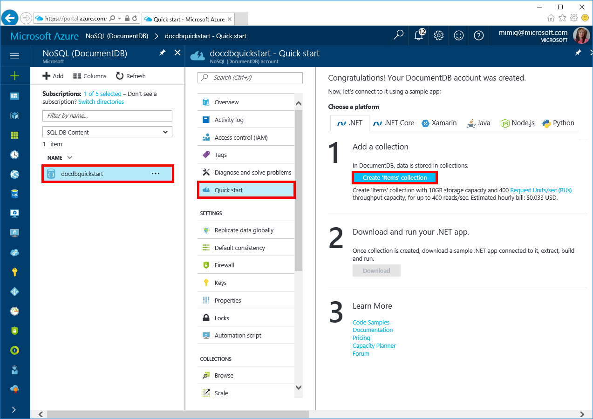

# Azure DocumentDB: Use .NET (C#) to connect and query data

This quick start demonstrates how to use the Azure portal and [.NET](documentdb-sdk-dotnet.md) to connect to an Azure DocumentDB account, create a database and collection, and then build and deploy a web app on the Windows platform.

This quick start uses as its starting point the resources created in one of these quick starts: (*internal note: we'll have to make sure those scripts only create the acct and don't create collections or we'll have double collections*)

- [Create account - Portal](documentdb-get-started-portal.md)
- [Create account - CLI](documentdb-get-started-cli.md)
- [Create account - PowerShell](documentdb-get-started-powershell.md)

## Install .NET

### **Windows .NET framework**

Visual Studio 2017 Community is a fully-featured, extensible, free IDE for creating modern applications for Android, iOS, Windows, as well as web & database applications and cloud services. If you already have Visual Studio installed on your machine, skip the next few steps.

1. Download the [installer](https://go.microsoft.com/fwlink/?LinkId=691978). 
2. Run the installer and follow the installation prompts to complete the installation.

### **Mac OS**
*Is there another topic that has these install instructions for .NET (not .NET core)?*
pen your terminal and navigate to a directory where you plan on creating your .NET Core project. Enter the following commands to install **brew**, **OpenSSL**, and **.NET Core**. 

```bash
ruby -e "$(curl -fsSL https://raw.githubusercontent.com/Homebrew/install/master/install)"
brew update
brew install openssl
mkdir -p /usr/local/lib
ln -s /usr/local/opt/openssl/lib/libcrypto.1.0.0.dylib /usr/local/lib/
ln -s /usr/local/opt/openssl/lib/libssl.1.0.0.dylib /usr/local/lib/
```

Install .NET Core on macOS. Download the [official installer](https://go.microsoft.com/fwlink/?linkid=843444). This installer will install the tools and put them on your PATH so you can run dotnet from the Console

### **Linux (Ubuntu)**
*Is there another topic that has these install instructions for .NET (not .NET core)?*
Open your terminal and navigate to a directory where you plan on creating your .NET Core project. Enter the following commands to install **.NET Core**.

```bash
sudo sh -c 'echo "deb [arch=amd64] https://apt-mo.trafficmanager.net/repos/dotnet-release/ xenial main" > /etc/apt/sources.list.d/dotnetdev.list'
sudo apt-key adv --keyserver hkp://keyserver.ubuntu.com:80 --recv-keys 417A0893
sudo apt-get update
sudo apt-get install dotnet-dev-1.0.1
```

## Add a collection

Add a collection in the Azure portal. 

1. Log in to the [Azure portal](https://portal.azure.com/).
2. On the left-hand menu, click  at the bottom, type **DocumentDB** in the search box, and then click **NoSQL (DocumentDB)**.
3. In the **NoSQL (DocumentDB)** page, select the DocumentDB account to add collections to.
4. On the account page, on the left-hand menu, click **Quick start**.
5. On the Quick start page, in the Step 1 area, click **Create 'Items' Collection**. Or if you've already created the Items collection from a different quickstart tab, then proceed to step 6. 

    

    Once the collection has been created, the text in the Step 1 area changes to `"Items" collection has been created with 10GB storage capacity and 400 Request Units/sec (RUs) throughput capacity, for up to 400 reads/sec. Estimated hourly bill: $0.033 USD.`

6. In the Step 2 area, click **Download**. When asked if you want to open or save DocumentDB-Quickstart-Dotnet.zip, click **Save** and then click **Open**. 

7. In File Explorer, extract the contents of the zip file. 

8. Open the todo.sln solution in Visual Studio 2017.
    
## Build and deploy the web app

Build and deploy the sample app, then add some sample data to store in DocumentDB.

1. In Visual Studio 2017, press CTRL + F5 to run the application. 

    The sample application is displayed in your browswer.

2. Click **Create New** in the browser and create a few new tasks in your to-do app.

   

## Query data in the Azure portal

*Kirill - Will this move to Data Explorer or stay in Query Explorer?*

*Todo - add a screenshot of the appropriate part of the portal with a description of the query capabilities*

## Review metrics in the Azure portal

Use the Azure portal to review the availability, latency, throughput, and consistency of your collection. Each graph that's associated with the [DocumentDB Service Level Agreements (SLAs)](https://azure.microsoft.com/en-us/support/legal/sla/documentdb/) provides a line showing the quota required to meet the SLA and your actual usage, providing you transparency into the performance of your database. Additional metrics such as storage usage, number of requests per minute are also included in the portal

* In the Azure portal, in the left menu, under **Monitoring**, click **Metrics**.

   

## Next steps

- For .NET documentation, see [.NET documentation](https://docs.microsoft.com/dotnet/).
- *Todo - list other quickstarts.*