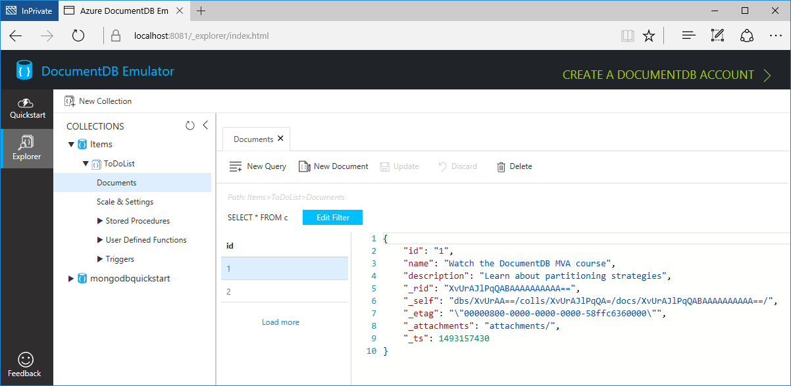
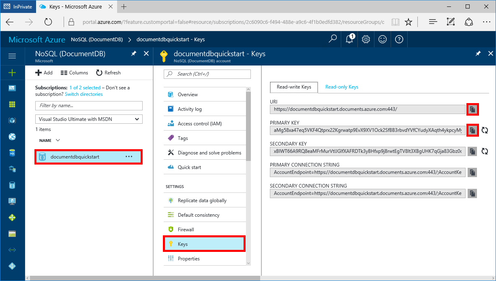

# Azure Cosmos DB: Build a .NET (C#) and DocumentDB API web app

This quick start demonstrates how to build an ASP.NET web app connected to Azure Cosmos DB in just a few minutes using Visual Studio 2017, Azure Cosmos DB Emulator, and the Azure portal.

If you don’t already have Visual Studio 2017 installed, you can download and use the **free** [Visual Studio 2017 Community Edition](https://www.visualstudio.com/downloads/). Make sure that you enable **Azure development** during the Visual Studio setup. 

Once you're finished, you'll have a simple app up and running in the cloud.


## Download Azure Cosmos DB Emulator
You can build Azure Cosmos DB apps without an Azure subscription or an internet connection. Download the **free** [Azure Cosmos DB Emulator](https://aka.ms/documentdb-emulator). 

> [!NOTE] To install, configure, and run the DocumentDB Emulator, you must have administrative privileges on the computer.

## Download the sample app

Clone the sample app repository on your local machine. If you do not have Git installed, you can [download it](https://git-scm.com/).

 ```bash
git clone https://github.com/Azure-Samples/documentdb-dotnet-getting-started/
```

## Connect the app to Azure Cosmos DB Emulator
Open the sample app in Visual Studio, and update the web.config file to connect to Azure Cosmos DB Emulator.

```HTML
<appSettings>
    ...
    <add key="endpoint" value="https://localhost:8081/" />
    <add key="authKey" value="C2y6yDjf5/R+ob0N8A7Cgv30VRDJIWEHLM+4QDU5DE2nQ9nDuVTqobD4b8mGGyPMbIZnqyMsEcaGQy67XIw/Jw==" />
    ...
  </appSettings>
```

## Build and run the web app

Build and deploy the sample app, then add some sample data to store in Azure Cosmos DB.

1. In Visual Studio 2017, press CTRL + F5 to run the application. 

    The sample application is displayed in your browswer.

2. Click **Create New** in the browser and create a few new tasks in your to-do app.

   

## Query data in the Data Explorer
The Azure Cosmos DB Emulator includes a web-based Data Explorer that lets you create collections, view, and edit documents. When the DocumentDB emulator launches it automatically opens the DocumentDB Data Explorer in your browser. The address appears as https://localhost:8081/_explorer/index.html. If you close the explorer and would like to re-open it later, you can either open the URL in your browser or launch it from the DocumentDB Emulator in the Windows Tray Icon as shown below.

Once you've added a few sample tasks to your todo app, you can use the Data Explorer to view, query, and run business-logic on your data.

In the Data Explorer, expand your collection (the ToDoList collection), and then you can view the documents, perform queries, and even create and run stored procedures, triggers, and UDFs.

   
 
## Create an Azure Cosmos DB account with DocumentDB API

To perform the remaining steps of the tutorial, you need an internet connection and an Azure subscription. [!INCLUDE [quickstarts-free-trial-note](../../includes/quickstarts-free-trial-note.md)]

Follow this quick start to [create Azure Cosmos DB account with DocumentDB API using the Azure portal](documentdb-get-started-portal.md).

## Connect the web app to the Azure Cosmos DB account and run it

Now that you have an Azure Cosmos DB account, retrieve your URI and key from the Azure Portal and update the web.config file.

In the [Azure portal](https://portal.azure.com/) on the left-navigation menu, click **Keys**. Use the copy button to copy the URI and Primary Key, and paste them into the web.config file. Now run your app again and you'll be running against your highly-available, globally distributed Azure Cosmos DB account.  



```HTML
<appSettings>
    ...
    <add key="endpoint" value="Copy from URI in Azure Portal" />
    <add key="authKey" value="Copy from Primary Key in Azure Portal" />
    ...
</appSettings>
```

## Query data in the Data Explorer in the Azure portal

Once you've added a few sample tasks to your todo app, you can use the Data Explorer (preview) in the Azure portal to view, query, and run business-logic on your data.

* In the Azure portal, in the navigation menu, under **Collections**, click **Data Explorer (Preview)**. In the Data Explorer blade, expand your collection (the ToDoList collection), and then you can view the documents, perform queries, and even create and run stored procedures, triggers, and UDFs.

   
   *screenshot to be updated with appropriate data shown*

## Review metrics in the Azure portal

Use the Azure portal to review the availability, latency, throughput, and consistency of your collection. Each graph that's associated with the [Azure Cosmos DB Service Level Agreements (SLAs)](https://azure.microsoft.com/en-us/support/legal/sla/documentdb/) provides a line showing the quota required to meet the SLA and your actual usage, providing you transparency into the performance of your database. Additional metrics such as storage usage, number of requests per minute are also included in the portal

* In the Azure portal, in the left menu, under **Monitoring**, click **Metrics**.

   

## Next steps

- For .NET documentation, see [.NET documentation](https://docs.microsoft.com/dotnet/).

- To connect and query using Node.js and a MongoDB app, see [Build a Node.js and MongoDB web app](documentdb-connect-mongodb-app.md).
- To connect and query using the Gremlin console, see [Connect to Gremlin console](documentdb-connect-gremlin-graph.md).
- To connect and query using Visual Graph Explorer, see [Visual Graph Explorer](documentdb-connect-graph-explorer.md).
- To connect and query using the Graph API and .NET, see [Connect to graphs using .NET](documentdb-connect-graph-dotnet.md).
- To connect and query using the Tables API and .NET, see [Connect to tables using .NET](documentdb-connect-tables-dotnet.md).
- To connect and query using Xamarin, see [Connect to Xamarin using .NET](documentdb-connect-xamarin-dotnet.md).