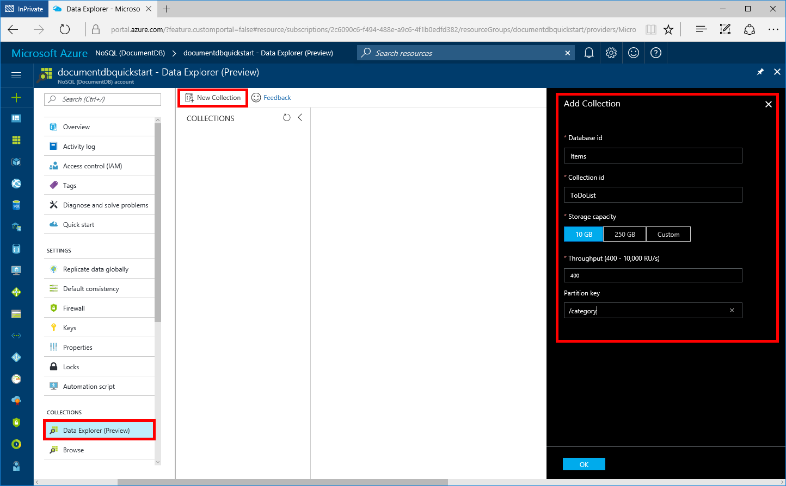
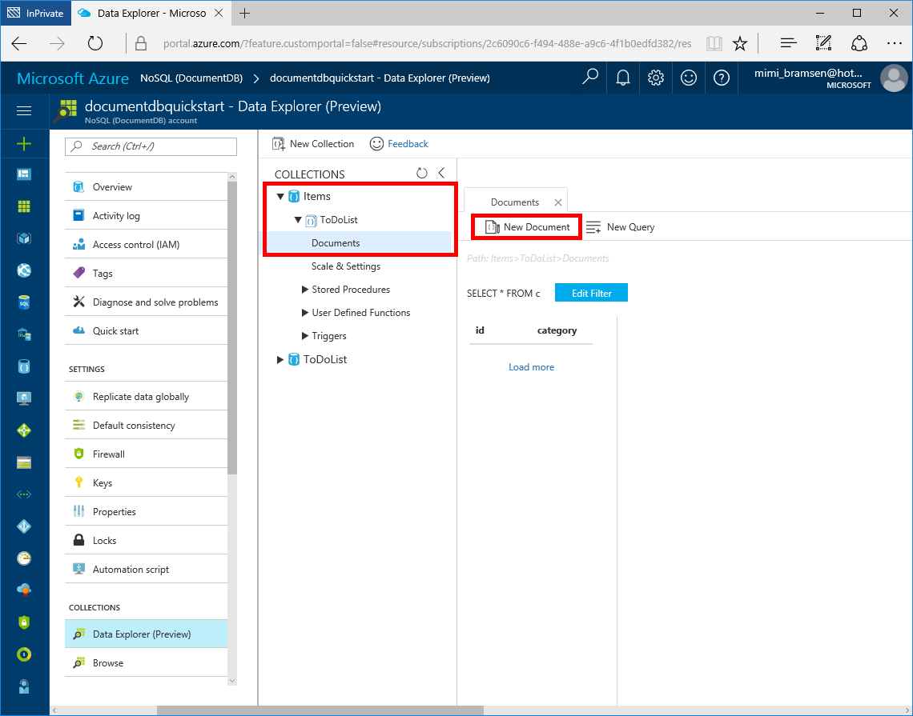
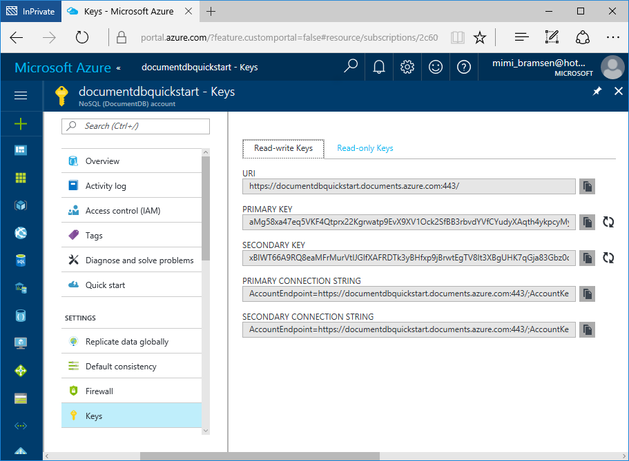
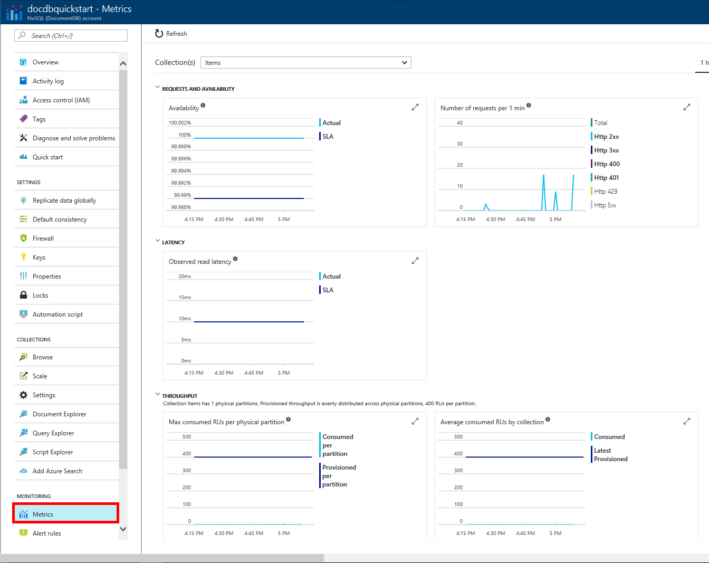

# Azure Cosmos DB: Use .NET (C#) to connect and query data with the DocumentDB API

This quick start demonstrates how to use the Azure portal and [.NET](documentdb-sdk-dotnet.md) to connect to an Azure Cosmos DB account, create a database and collection, and then build and deploy a web app on the Windows platform.

If you don’t already have Visual Studio 2017 installed, you can download and use the **free** [Visual Studio 2017 Community Edition](https://www.visualstudio.com/downloads/). Make sure that you enable **Azure development** during the Visual Studio setup.

[!INCLUDE [quickstarts-free-trial-note](../../includes/quickstarts-free-trial-note.md)]

## Create database account

[!INCLUDE [documentdb-create-dbaccount](../../includes/documentdb-create-dbaccount.md)]

## Add a collection

You can now use Data Explorer to create a collection and add data to your database. 

1. In the Azure portal, in the navigation menu, under **Collections**, click **Data Explorer (Preview)**. 
2. In the Data Explorer blade, click **New Collection**, then fill in the page using the following information.
    * In the **Database id** box, enter *Items* as ID for your new database. Database names must be between 1 and 255 characters, and cannot contain `/ \ # ?` or a trailing space.
    * In the **Collection id** box, enter *ToDoList* as the ID for your new collection. Collection names have the same character requirements as database IDs.
    * In the **Storage Capacity** box, leave the default 10 GB selected.
    * In the **Throughput** box, leave the default 400 RUs selected. You can scale up the throughput later if you want to reduce latency.
    * In the **Partition key** box, for the purpose of this sample, enter the value */category*, so that tasks in the todo app you create can be partitioned by category. Selecting the correct partition key is important in creating a performant collection, read more about it in [Designing for partitioning](documentdb-partition-data.md#designing-for-partitioning).

   

3. Once the form is filled out, click **OK**.

## Add sample data

You can now add data to your new collection using Data Explorer.

1. In Data Explorer, the new database appears in the Collections pane. Expand the **Items** database, expand the **ToDoList** collection, click **Documents**, and then click **New Documents**. 

   
  
2. Now add a few new documents to the collection with the following structure, where you insert unique values for id in each document and change the other properties as you see fit. Your new documents can have any structure you want as Azure Cosmos DB doesn't impose any schema on your data.

     ```json
     {
         "id": "1",
         "category": "personal",
         "name": "groceries",
         "description": "Pick up apples and strawberries."
     }
     ```

     You can now use queries in Data Explorer to retrieve your data. By default, Data Explorer uses SELECT * FROM c to retrieve all documents in the collection, but you can change that to SELECT * FROM c ORDER BY c.name ASC, to return all the documents in alphabetic ascending order of the name property. 
 
     You can also use Data Explorer to create stored procedures, UDFs, and triggers to perform server-side business logic. Data Explorer exposes all of the built in programmatic data access available in the APIs, but provides easy access to your data in the Azure Portal.

## Clone the sample application

Now let's clone a  DocumentDB API app from github, set the connection string, and run it. You'll see how easy it is to work with data programmatically. 

Open a git terminal window, such as git bash, and `CD` to a working directory.  

Run the following command to clone the sample repository. 

```bash
git clone https://github.com/Azure-Samples/documentdb-dotnet-getting-started.git
```
Then open the solution file in Visual Studio 2017. 

## Update your connection string

Now you need to get your connection string information from Azure Cosmos DB so that you can copy it into your app.

* Back in the Azure portal, in the left navigation, click **Keys**. You'll use the copy buttons on the right side of the screen to copy the URI and Primary Key into the web.config file in the next step.

    

## Build and deploy the web app

1. In Visual Studio 2017, open the web.config file. 

2. Copy your URI and Primary Key value from the portal and update the URI and Key value in the web.config file. You've now updated your app with all the info it needs to communicate with Azure Cosmos DB.

3. In Visual Studio, click CTRL + F5 to run the application. Your app displays in your browser. 

2. Click **Create New** in the browser and create a few new tasks in your to-do app.

   

You can now go back to Data Explorer and see query, modify, and work with this new data. 

## Review SLAs in the Azure portal

Now that your app is up and running, you'll want to ensure ensure business continuity, and watch user access to ensure high-availability to your users. You can use the Azure portal to review the availability, latency, throughput, and consistency of your collection. Each graph that's associated with the [Azure Cosmos DB Service Level Agreements (SLAs)](https://azure.microsoft.com/support/legal/sla/documentdb/) provides a line showing the quota required to meet the SLA and your actual usage, providing you transparency into the performance of your database. Additional metrics such as storage usage, number of requests per minute are also included in the portal

* In the Azure portal, in the left menu, under **Monitoring**, click **Metrics**.

   

## Next steps

To learn more about the Azure Comsos DB DocumentDB API, see [What is the DocumentDB API?(documentdb-introduction). To learn more about the SQL query language which you can use in the Azure portal and programmatically, see [SQL](documentdb-sql-query.md).

If you're not going to continue to use this app and Azure Cosmos DB, use the following steps to delete all resources created by this quick start in the Azure portal. If you plan to continue on to work with subsequent quick starts, do not clean up the resources created in this quick start. 

1. From the left-hand menu in the Azure portal, click **Resource groups** and then click the name of the resource you just created. 
2. On your resource group page, click **Delete**, type the name of the resource to delete in the text box, and then click **Delete**.
