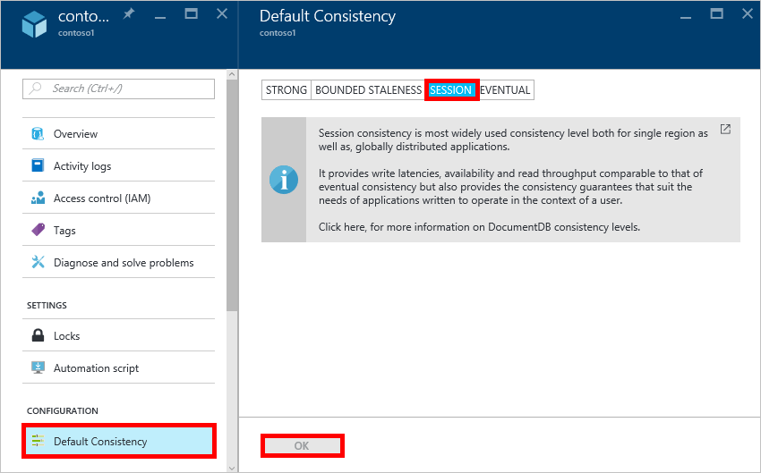
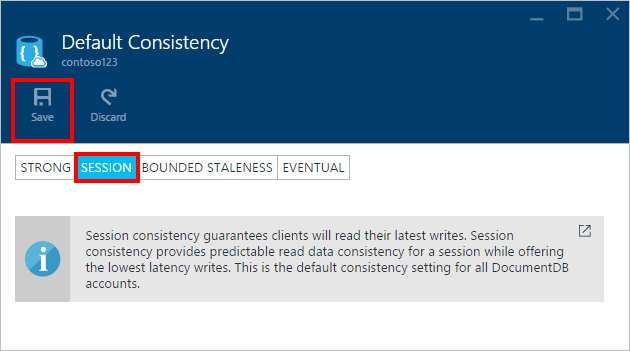

<properties
	pageTitle="Consistency levels in DocumentDB | Microsoft Azure"
	description="DocumentDB has four consistency levels to help balance eventual consistency, availability, and latency trade-offs."
	keywords="eventual consistency, documentdb, azure, Microsoft azure"
	services="documentdb"
	authors="mimig1"
	manager="jhubbard"
	editor="cgronlun"
	documentationCenter=""/>

<tags
	ms.service="documentdb"
	ms.workload="data-services"
	ms.tgt_pltfrm="na"
	ms.devlang="na"
	ms.topic="article"
	ms.date="06/15/2016"
	ms.author="mimig"/>

# Consistency levels in DocumentDB

Azure DocumentDB is designed from the ground up with global distribution in mind. It is designed to offer predictable low latency guarantees, a 99.99% availability SLA, and multiple well-defined relaxed consistency models. Currently, DocumentDB provides four consistency levels: strong, bounded-staleness, session, and eventual. Besides the **strong** and the **eventual consistency** models commonly offered by other NoSQL databases, DocumentDB also offers two carefully codified and operationalized consistency models – **bounded staleness** and **session**, and has validated their usefulness against real world use cases. Collectively these four consistency levels enable you to make well-reasoned trade-offs between consistency, availability, and latency. 

## Scope of consistency

The granularity of consistency is scoped to a single user request. A write request may correspond to an insert, replace, upsert, or delete transaction (with or without the execution of an associated pre or post trigger). Or a write request may correspond to the transactional execution of a JavaScript stored procedure operating over multiple documents within a partition. As with the writes, a read/query transaction is also scoped to a single user request. The user may be required to paginate over a large result-set, spanning multiple partitions, but each read transaction is scoped to a single page and served from within a single partition.

## Consistency levels

You can configure a default consistency level on your database account that applies to all the collections (across all of the databases) under your database account. By default, all reads and queries issued against the user defined resources will use the default consistency level specified on the database account. However, you can relax the consistency level of a specific read/query request by specifying the [[x-ms-consistency-level]](https://msdn.microsoft.com/library/azure/mt632096.aspx) request header. There are four types of consistency levels supported by the DocumentDB replication protocol that provide a clear trade-off between specific consistency guarantees and performance, as described below.

![DocumentDB offers multiple, well defined (relaxed) consistency models to choose from][1]

**Strong**: 

- Strong consistency offers a [linearizability](https://aphyr.com/posts/313-strong-consistency-models) guarantee with the reads guaranteed to return the most recent version of a document. 
- Strong consistency guarantees that a write is only visible after it is committed durably by the majority quorum of replicas. A write is either synchronously committed durably by both the primary and the quorum of secondaries, or it is aborted. A read is always acknowledged by the majority read quorum, a client can never see an uncommitted or partial write and is always guaranteed to read the latest acknowledged write. 
- DocumentDB accounts that are configured to use strong consistency cannot associate more than one Azure region with their DocumentDB account. 
- The cost of a read operation (in terms of [request units](documentdb-request-units.md) consumed) with strong consistency is the higher than session and eventual, but the same as bounded staleness.
 

**Bounded staleness**: 

- Bounded staleness consistency guarantees that the reads may lag behind writes by at most *K* versions or prefixes of a document or *t* time-interval. 
- Consequently, when choosing bounded staleness, the “staleness” can be configured in two ways: 
    - Number of versions *K* of the document by which the reads lag behind the writes
    - Time interval *t* 
- Bounded staleness offers total global order except within the “staleness window”. Note that the monotonic read guarantees exists within a region both inside and outside the “staleness window”. 
- Bounded staleness provides a stronger consistency guarantee than session or eventual consistency. For globally distributed applications, we recommend you use bounded staleness for scenarios where you would like to have strong consistency but also want 99.99% availability and low latency. 
- DocumentDB accounts that are configured with bounded staleness consistency can associate any number of Azure regions with their DocumentDB account. 
- The cost of a read operation (in terms of RUs consumed) with strong consistency is the higher than session and eventual consistency, but the same as strong consistency.

**Session**: 

- Unlike the global consistency models offered by strong and bounded staleness consistency levels, session consistency is scoped to a client session. 
- Session consistency is ideal for all scenarios where a device or user session is involved since it guarantees monotonic reads, monotonic writes, and read your own writes (RYW) guarantees. 
- Session consistency provides predictable consistency for a session, and maximum read throughput while offering the lowest latency writes and reads. 
- DocumentDB accounts that are configured with session consistency can associate any number of Azure regions with their DocumentDB account. 
- The cost of a read operation (in terms of RUs consumed) with session consistency level is less than strong and bounded staleness, but more than eventual consistency
 

**Eventual**: 

- Eventual consistency guarantees that in absence of any further writes, the replicas within the group will eventually converge. 
- Eventual consistency is the weakest form of consistency where a client may get the values that are older than the ones it had seen before.
- Eventual consistency provides the weakest read consistency but offers the lowest latency for both reads and writes.
- DocumentDB accounts that are configured with eventual consistency can associate any number of Azure regions with their DocumentDB account. 
- The cost of a read operation (in terms of RUs consumed) with the eventual consistency level is the lowest of all the DocumentDB consistency levels.

## Consistency guarantees

The following table captures various consistency guarantees corresponding to the four consistency levels.

| Guarantee                                                         |    Strong                                       |    Bounded Staleness                                                                           |    Session                                       |    Eventual                                 |
|----------------------------------------------------------|-------------------------------------------------|------------------------------------------------------------------------------------------------|--------------------------------------------------|--------------------------------------------------|
|    **Total global order**                                |    Yes                                          |    Yes, outside of the “staleness window”                                                      |    No, partial “session” order                   |    No                                            |
|    **Consistent prefix guarantee**                       |    Yes                                          |    Yes                                                                                         |    Yes                                           |    Yes                                           |
|    **Monotonic reads**                                   |    Yes                                          |    Yes, across   regions outside of the staleness window and within a region all the time.     |    Yes, for the given session                    |    No                                            |
|    **Monotonic writes**                                  |    Yes                                          |    Yes                                                                                         |    Yes                                           |    Yes                                           |
|    **Read your writes**                                  |    Yes                                          |    Yes                                                                                         |    Yes (in the write region)                      |    No                                            |

## Configuring the default consistency level

1.  In the [Azure portal](https://portal.azure.com/), in the Jumpbar, click **DocumentDB Accounts**.

2. In the **DocumentDB Accounts** blade, select the database account to modify.

3. In the account blade, if the **All Settings** blade is not already opened, click the **Settings** icon on the top command bar.

4. In the **All Settings** blade, click on the **Default Consistency** entry under **Feature**.

	

5. In the **Default Consistency** blade, select the new consistency level and click **OK**.

	

## Consistency levels for queries

By default, for user defined resources, the consistency level for queries is the same as the consistency level for reads. By default, the index is updated synchronously on each insert, replace, or delete of a document to the collection. This enables the queries to honor the same consistency level as that of the document reads. While DocumentDB is write optimized and supports sustained volumes of document writes, synchronous index maintenance and serving consistent queries, you can configure certain collections to update their index lazily. Lazy indexing further boosts the write performance and is ideal for bulk ingestion scenarios when a workload is primarily read-heavy.  

Indexing Mode|	Reads|	Queries  
-------------|-------|---------
Consistent (default)|	Select from strong, bounded staleness, session, or eventual|	Select from strong, bounded staleness, session, or eventual|
Lazy|	Select from strong, bounded staleness, session, or eventual|	Eventual  

As with read requests, you can lower the consistency level of a specific query request by specifying the [x-ms-consistency-level](https://msdn.microsoft.com/library/azure/mt632096.aspx) request header.

## Next steps

If you'd like to do more reading about consistency levels and tradeoffs, we recommend the following resources:

-	Doug Terry. Replicated Data Consistency explained through baseball (video).   
[https://www.youtube.com/watch?v=gluIh8zd26I](https://www.youtube.com/watch?v=gluIh8zd26I)
-	Doug Terry. Replicated Data Consistency explained through baseball.   
[http://research.microsoft.com/pubs/157411/ConsistencyAndBaseballReport.pdf](http://research.microsoft.com/pubs/157411/ConsistencyAndBaseballReport.pdf)
-	Doug Terry. Session Guarantees for Weakly Consistent Replicated Data.   
[http://dl.acm.org/citation.cfm?id=383631](http://dl.acm.org/citation.cfm?id=383631)
-	Daniel Abadi. Consistency Tradeoffs in Modern Distributed Database Systems Design: CAP is only part of the story”.   
[http://computer.org/csdl/mags/co/2012/02/mco2012020037-abs.html](http://computer.org/csdl/mags/co/2012/02/mco2012020037-abs.html)
-	Peter Bailis, Shivaram Venkataraman, Michael J. Franklin, Joseph M. Hellerstein, Ion Stoica. Probabilistic Bounded Staleness (PBS) for Practical Partial Quorums.   
[http://vldb.org/pvldb/vol5/p776_peterbailis_vldb2012.pdf](http://vldb.org/pvldb/vol5/p776_peterbailis_vldb2012.pdf)
-	Werner Vogels. Eventual Consistent - Revisited.    
[http://allthingsdistributed.com/2008/12/eventually_consistent.html](http://allthingsdistributed.com/2008/12/eventually_consistent.html)

[1]: ./media/documentdb-consistency-levels/consistency-tradeoffs.png