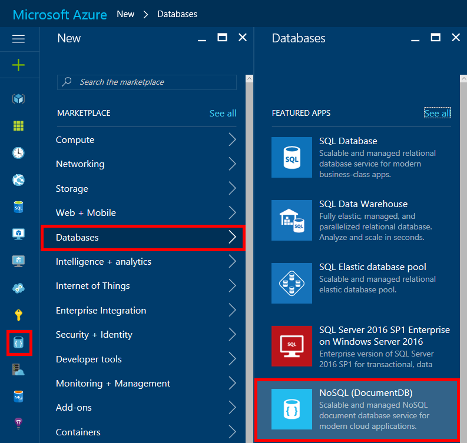
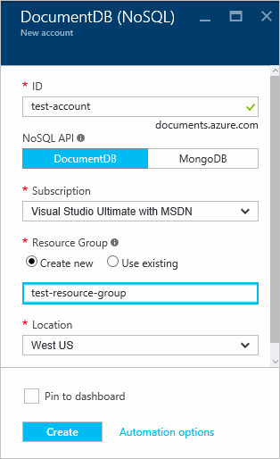
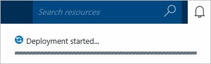
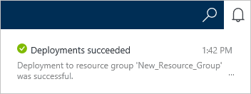
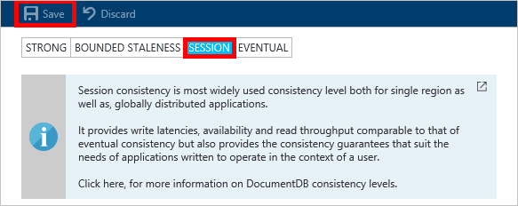

# How to create an Azure Cosmos DB NoSQL account using the Azure portal
> [!div class="op_single_selector"]
> * [Azure portal](documentdb-create-account.md)
> * [Azure CLI 1.0](documentdb-automation-resource-manager-cli-nodejs.md)
> * [Azure CLI 2.0](documentdb-automation-resource-manager-cli.md)
> * [Azure Powershell](documentdb-manage-account-with-powershell.md)

To build a database with Microsoft Azure Cosmos DB, you must:

* Have an Azure account. You can get a [free Azure account](https://azure.microsoft.com/free) if you don't have one already.
* Create an Azure Cosmos DB account.  

You can create an Azure Cosmos DB account using either the Azure portal, Azure Resource Manager templates, or Azure command-line interface (CLI). This article shows how to create an Azure Cosmos DB account using the Azure portal. To create an account using Azure Resource Manager or Azure CLI, see [Automate Azure Cosmos DB database account creation](documentdb-automation-resource-manager-cli.md).

Are you new to Azure Cosmos DB? Watch [this](https://azure.microsoft.com/documentation/videos/create-documentdb-on-azure/) four-minute video by Scott Hanselman to see how to complete the most common tasks in the online portal.

1. Sign in to the [Azure portal](https://portal.azure.com/).
2. On the left navigation, click **New**, click **Databases**, and then click **Azure Cosmos DB**.

     
3. In the **New account** blade, specify the desired configuration for the Azure Cosmos DB account.

    

   * In the **ID** box, enter a name to identify the Azure Cosmos DB account.  When the **ID** is validated, a green check mark appears in the **ID** box. The **ID** value becomes the host name within the URI. The **ID** may contain only lowercase letters, numbers, and the '-' character, and must be between 3 and 50 characters. Note that *documents.azure.com* is appended to the endpoint name you choose, the result of which becomes your Azure Cosmos DB account endpoint.
   * In the **NoSQL API** box, select the programming model to use:

     * **DocumentDB**: The DocumentDB API is available via .NET, Java, Node.js, Python and JavaScript [SDKs](documentdb-sdk-dotnet.md), as well as HTTP [REST](https://msdn.microsoft.com/library/azure/dn781481.aspx), and offers programmatic access to all the DocumentDB functionality.
     * **MongoDB**: DocumentDB also offers [protocol-level support](documentdb-protocol-mongodb.md) for **MongoDB** APIs. When you choose the MongoDB API option, you can use existing MongoDB SDKs and [tools](documentdb-mongodb-mongochef.md) to talk to DocumentDB. You can [move](documentdb-import-data.md) your existing MongoDB apps to use DocumentDB, with [no code changes needed](documentdb-connect-mongodb-account.md), and take advantage of a fully managed database as a service, with limitless scale, global replication, and other capabilities.
   * For **Subscription**, select the Azure subscription that you want to use for the Azure Cosmos DB account. If your account has only one subscription, that account is selected by default.
   * In **Resource Group**, select or create a resource group for your Azure Cosmos DB account.  By default, a new resource group is created. For more information, see [Using the Azure portal to manage your Azure resources](../azure-portal/resource-group-portal.md).
   * Use **Location** to specify the geographic location in which to host your Azure Cosmos DB account.
4. Once the new Azure Cosmos DB account options are configured, click **Create**. To check the status of the deployment, check the Notifications hub.  

     

   
5. After the Azure Cosmos DB account is created, it is ready for use with the default settings. The default consistency of the Azure Cosmos DB account is set to **Session**.  You can adjust the default consistency by clicking **Default Consistency** in the resource menu. To learn more about the consistency levels offered by Azure Cosmos DB, see [Consistency levels in Azure Cosmos DB](documentdb-consistency-levels.md).

     

     

[How to: Create an Azure Cosmos DB account]: #Howto
[Next steps]: #NextSteps

## Next steps
Now that you have an Azure Cosmos DB account, the next step is to create an Azure Cosmos DB collection and database.

You can create a new collection and database by using one of the following:

* The Azure portal, as described in [Create an Azure Cosmos DB collection using the Azure portal](documentdb-create-collection.md).
* The all-inclusive tutorials, which include sample data: [.NET](documentdb-get-started.md), [.NET MVC](documentdb-dotnet-application.md), [Java](documentdb-java-application.md), [Node.js](documentdb-nodejs-application.md), or [Python](documentdb-python-application.md).
* The [.NET](documentdb-dotnet-samples.md#database-examples), [Node.js](documentdb-nodejs-samples.md#database-examples), or [Python](documentdb-python-samples.md#database-examples) sample code available in GitHub.
* The [.NET](documentdb-sdk-dotnet.md), [.NET Core](documentdb-sdk-dotnet-core.md), [Node.js](documentdb-sdk-node.md), [Java](documentdb-sdk-java.md), [Python](documentdb-sdk-python.md), and [REST](https://msdn.microsoft.com/library/azure/mt489072.aspx) SDKs.

After creating your database and collection, you need to [add documents](documentdb-view-json-document-explorer.md) to the collections.

After you have documents in a collection, you can use [DocumentDB SQL](documentdb-sql-query.md) to [execute queries](documentdb-sql-query.md#ExecutingSqlQueries) against your documents. You can execute queries by using the [Query Explorer](documentdb-query-collections-query-explorer.md) in the portal, the [REST API](https://msdn.microsoft.com/library/azure/dn781481.aspx), or one of the [SDKs](documentdb-sdk-dotnet.md).

### Learn more
To learn more about Azure Cosmos DB, explore these resources:

* [Azure Cosmos DB Introduction](../cosmos-db/introduction.md)
