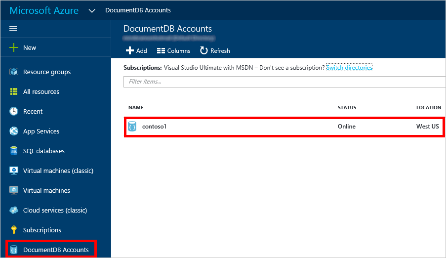
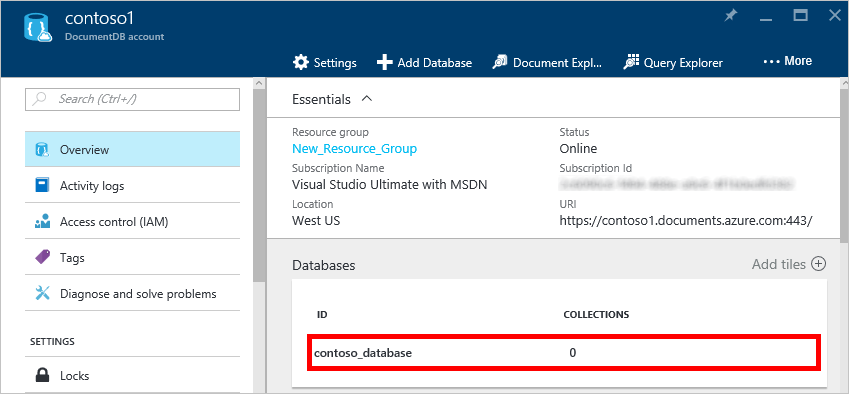
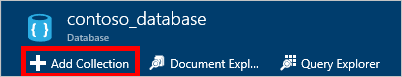
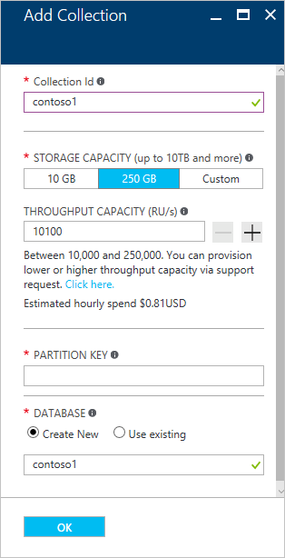
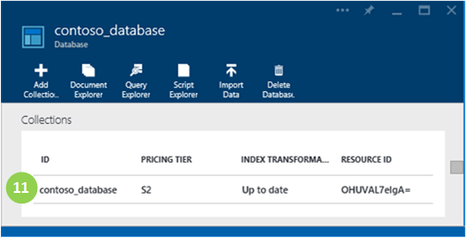

<properties 
	pageTitle="Create a DocumentDB database collection | Microsoft Azure" 
	description="Learn how to create JSON document collections using the online service portal for Azure DocumentDB, a cloud based NoSQL document database. Get a free trial today." 
	services="documentdb" 
	authors="mimig1" 
	manager="jhubbard" 
	editor="monicar" 
	documentationCenter=""/>

<tags 
	ms.service="documentdb" 
	ms.workload="data-services" 
	ms.tgt_pltfrm="na" 
	ms.devlang="na" 
	ms.topic="article" 
	ms.date="08/11/2016" 
	ms.author="mimig"/>

# How to create a DocumentDB collection using the Azure portal

To use Microsoft Azure DocumentDB, you must have a [DocumentDB account](documentdb-create-account.md), a [database](documentdb-create-database.md), a collection, and documents. This topic describes how to create a DocumentDB collection in the Azure portal. 

Not sure what a collection is? See [What is a DocumentDB collection?](#what-is-a-documentdb-collection)

1.  In the [Azure portal](https://portal.azure.com/), in the Jumpbar, click **DocumentDB Accounts**, and then in the **DocumentDB Accounts** blade, select the account in which to add a collection. 
    
    If **DocumentDB Accounts** is not visible in the Jumpbar, click **Browse** and then click **DocumentDB Accounts**. If you don't have any accounts listed, you'll need to [create a DocumentDB account](documentdb-create-account.md).

    

2. In the **DocumentDB account** blade for the selected account, in the **Databases** lens, select the database in which to add a collection.

    

3. In the **Database** blade, click **Add Collection**.

	

4. In the **Add Collection** blade, in the **ID** box, enter the ID for your new collection. Collection names must be between 1 and 255 characters, and cannot contain `/ \ # ?` or a trailing space. When the name is validated, a green check mark appears in the ID box.

	

5. By default, **Pricing Tier** is set to **Standard** so that you can customize the throughput and storage for your collection. For more information about the pricing tier, see [Performance levels in DocumentDB](documentdb-performance-levels.md).  

6. Select a **Partitioning mode** for the collection, either **Single Partition** or **Partitioned**. 

    A **single partition** has a reserved storage capacity of 10GB, and can have throughput levels from 400-10,000 request units/second (RU/s). One RU corresponds to the throughput of a read of a 1KB document. For more information about request units, see [Request units](documentdb-request-units.md). 

    A **partitioned collection** can scale to handle an unlimited amount of storage over multiple partitions, and can have throughput levels starting at 10,100 RU/s. In the portal, the largest storage you can reserve is 250 GB, and the most throughput you can reserve is 250,000 RU/s. To increase either quota, file a request as described in [Request increased DocumentDB account quotas](documentdb-increase-limits.md). For more informaiton about partitioned collections, see [Single Partition and Partitioned Collections](documentdb-partition-data.md#single-partition-and-partitioned-collections).

    If you use the Standard pricing tier, you can return to this blade at any time and change the throughput of your collection. For information on estimating your throughput needs, see [Estimating throughput needs](documentdb-request-units/#estimating-throughput-needs). 

7. Select the **Throughput** for the collection. You can use the [Capacity planner](https://www.documentdb.com/capacityplanner) to estimate your needs.  

8. If you are creating a partitioned collection, select the **Partition Key** for the collection. Selecting the correct partition key is important in creating a performant collection. For more information on selecting a partition key, see [Designing for partitioning](documentdb-partition-data.md#designing-for-partitioning).

9. Click **OK** at the bottom of the screen to create the new collection. 

10. The new collection now appears in the **Collections** lens on the **Database** blade.
 
	

## What is a DocumentDB collection? 

A collection is a container of JSON documents and the associated JavaScript application logic. A collection is a billable entity, where the [cost](documentdb-performance-levels.md) is determined by the provisioned throughput of the collection. Collections can span one or more partitions/servers and can scale to handle practically unlimited volumes of storage or throughput.

Collections are automatically partitioned into one or more physical servers by DocumentDB. When you create a collection, you can specify the provisioned throughput in terms of request units per second and a partition key property. The value of this property will be used by DocumentDB to distribute documents among partitions and route requests like queries. The partition key value also acts as the transaction boundary for stored procedures and triggers. Each collection has a reserved amount of throughput specific to that collection, which is not shared with other collections in the same account. Therefore, you can scale out your application both in terms of storage and throughput. 

Collections are not the same as tables in relational databases. Collections do not enforce schema, in fact DocumentDB does not enforce any schemas, it's a schema-free database. Therefore you can store different types of documents with diverse schemas in the same collection. You can choose to use collections to store objects of a single type like you would with tables. The best model depends only on how the data appears together in queries and transactions.

## Other ways to create a DocumentDB collection

Collections do not have to be created using the portal, you can also create them using the [DocumentDB SDKs](documentdb-sdk-dotnet.md) and the REST API. 

- For a C# code sample, see the [C# collection samples](documentdb-dotnet-samples.md#collection-examples). 
- For a Node.js code sample, see the [Node.js collection samples](documentdb-nodejs-samples.md#collection-examples).
- For a Python code sample, see [Python collection samples](documentdb-python-samples.md#collection-examples).
- For a REST API sample, see [Create a Collection](https://msdn.microsoft.com/library/azure/mt489078.aspx).

## Troubleshooting

If **Add Collection** is disabled in the Azure portal, that means your account is currently disabled, which normally occurs when all the benefits credits for the month are used.	

## Next steps

Now that you have a collection, the next step is to add documents or import documents into the collection. When it comes to adding documents to a collection, you have a few choices:

- You can [add documents](documentdb-view-json-document-explorer.md) by using the Document Explorer in the portal.
- You can [import documents and data](documentdb-import-data.md) by using the DocumentDB Data Migration Tool, which enables you to import JSON and CSV files, as well as data from SQL Server, MongoDB, Azure Table storage, and other DocumentDB collections. 
- Or you can add documents by using one of the [DocumentDB SDKs](documentdb-sdk-dotnet.md). DocumentDB has .NET, Java, Python, Node.js, and JavaScript API SDKs. For C# code samples showing how to work with documents by using the DocumentDB .NET SDK, see the [C# document samples](documentdb-dotnet-samples.md#document-examples). For Node.js code samples showing how to work with documents by using the DocumentDB Node.js SDK, see the [Node.js document samples](documentdb-nodejs-samples.md#document-examples).

After you have documents in a collection, you can use [DocumentDB SQL](documentdb-sql-query.md) to [execute queries](documentdb-sql-query.md#executing-queries) against your documents by using the [Query Explorer](documentdb-query-collections-query-explorer.md) in the portal, the [REST API](https://msdn.microsoft.com/library/azure/dn781481.aspx), or one of the [SDKs](documentdb-sdk-dotnet.md). 
