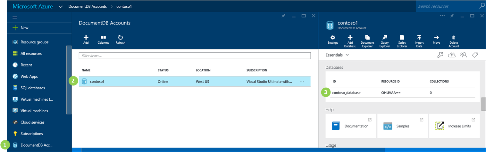
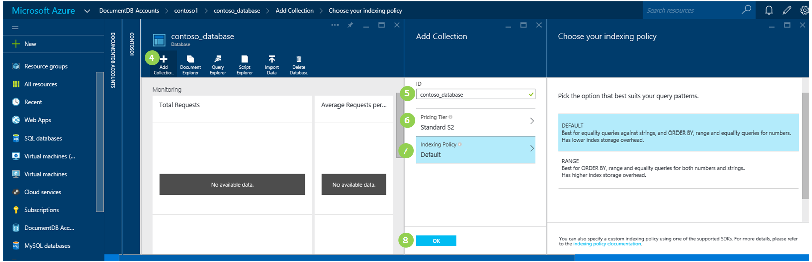
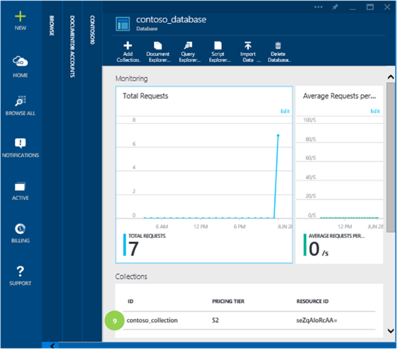

<properties 
	pageTitle="Create a DocumentDB collection | Azure" 
	description="Learn how to create a DocumentDB collection using the Azure Preview portal." 
	services="documentdb" 
	authors="mimig1" 
	manager="jhubbard" 
	editor="monicar" 
	documentationCenter=""/>

<tags 
	ms.service="documentdb" 
	ms.workload="data-services" 
	ms.tgt_pltfrm="na" 
	ms.devlang="na" 
	ms.topic="get-started-article" 
	ms.date="05/21/2015" 
	ms.author="mimig"/>

# Create a DocumentDB collection using the Azure Preview portal

To use Microsoft Azure DocumentDB, you must have DocumentDB account, a database, a collection, and documents. This topic describes how to create a DocumentDB collection in the Microsoft Azure Preview portal. Collections do not have to be created from the Preview portal, you can also create them using the [DocumentDB SDKs](https://msdn.microsoft.com/library/azure/dn781482.aspx).

New to DocumentDB?  Watch [this](http://azure.microsoft.com/documentation/videos/create-documentdb-on-azure/) four minute video to see how to complete the most common tasks in the portal.

1.  In the [Azure Preview portal](https://portal.azure.com/), click **Browse**.

2.  In the **Browse** blade, click **DocumentDB Accounts**.

3.  In the **DocumentDB Accounts** blade, select the account that contains the database in which to add a collection. If you don't have any accounts listed, you'll need to [create a DocumentDB account](documentdb-create-account.md).
    
    

4. In the **Database** blade, click **Add collections**.

5. In the **Add Database** blade, enter the ID for your new database. When the name is validated, a green check mark appears in the ID box.

6. Select a pricing tier for the new collection. Each collection you create is a billable entity. For more information about the performance levels available, see [Performance levels in DocumentDB](documentdb-performance-levels.md).

6. Click **OK** at the bottom of the screen to create the new collection. 

	

8. The new collection now appears in the **Collections** lens on the **Database** blade.
 
	

## Next steps

Now that you have a collection, the next step is to add documents or import documents into the collection. When it comes to adding documents to a collection, you have a few choices:

- You can [add documents](../documentdb-view-json-document-explorer.md) by using the Document Explorer tile in the Preview portal.
- You can [import documents and data](documentdb-import-data.md) by using the DocumentDB Data Migration Tool, which enables you to import JSON and CSV files, as well as data from SQL Server, MongoDB, Azure Table storage, and other DocumentDB collections. 
- Or you can add documents by using the [DocumentDB SDKs](https://msdn.microsoft.com/library/azure/dn781482.aspx).

Once you have documents in your collection, you can [query your documents](documentdb-query-collections-query-explorer.md) by using the Query Explorer in the Preview portal, or you can query documents by using [DocumentDB SQL](documentdb-sql-query.md). 