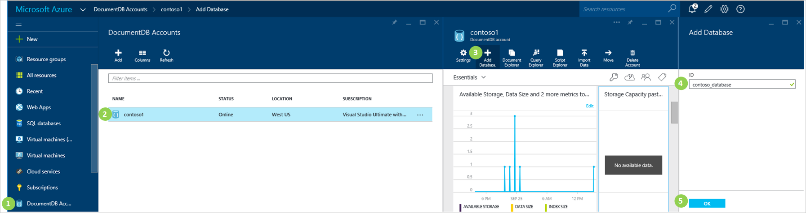
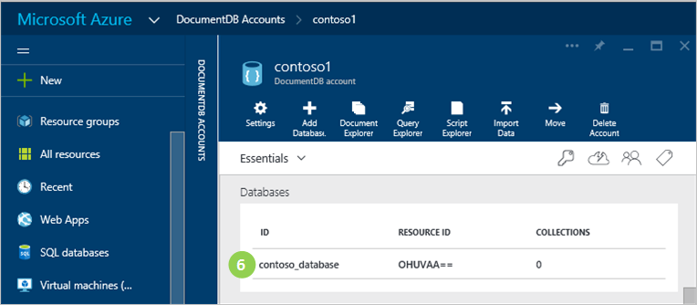

<properties 
	pageTitle="Create a NoSQL DocumentDB database | Microsoft Azure" 
	description="Learn how to create managed databases using the online service portal for Azure DocumentDB, a NoSQL document database for JSON. Get a free trial today." 
	services="documentdb" 
	authors="mimig1" 
	manager="jhubbard" 
	editor="monicar" 
	documentationCenter=""/>

<tags 
	ms.service="documentdb" 
	ms.workload="data-services" 
	ms.tgt_pltfrm="na" 
	ms.devlang="na" 
	ms.topic="article" 
	ms.date="09/28/2015" 
	ms.author="mimig"/>

# Create a DocumentDB database using the Azure preview portal

To use Microsoft Azure DocumentDB, you must have a [DocumentDB account](documentdb-create-account.md), a database, a collection, and documents.  This topic describes how to create a DocumentDB database in the Microsoft Azure preview portal. 

1.  In the [Azure preview portal](https://portal.azure.com/), in the Jumpbar, click **DocumentDB Accounts**. 

2.  In the **DocumentDB Accounts** blade, select the account in which to add a DocumentDB database. If you don't have any accounts listed, you'll need to [create a DocumentDB account](documentdb-create-account.md).

3. In the **DocumentDB account** blade, click **Add Database**.

4. In the **Add Database** blade, enter the ID for your new database. When the name is validated, a green check mark appears in the **ID** box.

5. Click **OK** at the bottom of the screen to create the new database. 

7. The new database now appears in the **Databases** lens on the **DocumentDB Account** blade.
 
	

## Other ways to create a DocumentDB database

Databases do not have to be created using the preview portal, you can also create them using the [DocumentDB SDKs](https://msdn.microsoft.com/library/azure/dn781482.aspx). For a C# code sample showing how to create a database using the DocumentDB .NET SDK, see the [Program.cs](https://github.com/Azure/azure-documentdb-net/blob/master/samples/code-samples/DatabaseManagement/Program.cs) file in the DatabaseManagement project, available in the [azure-documentdb-net](https://github.com/Azure/azure-documentdb-net) repository on [GitHub.com](https://github.com). 

## Next steps

Now that you have a DocumentDB database, the next step is to [create a collection](documentdb-create-collection.md).

Once your collection is created, you can [add documents](../documentdb-view-json-document-explorer.md) by using the Document Explorer in the preview portal, [import documents](documentdb-import-data.md) into the collection by using the DocumentDB Data Migration Tool, or use one of the [DocumentDB SDKs](https://msdn.microsoft.com/library/azure/dn781482.aspx) to perform CRUD operations. DocumentDB has .NET, Java, Python, Node.js, and JavaScript API SDKs. For .NET code samples showing how to create, remove, update and delete documents, see [Program.cs](https://github.com/Azure/azure-documentdb-net/blob/master/samples/code-samples/DocumentManagement/Program.cs) in the DocumentManagement project in the azure-documentdb-net repository on GitHub.com.  

After you have documents in a collection, you can use [DocumentDB SQL](documentdb-sql-query.md) to [execute queries](documentdb-sql-query.md#executing-queries) against your documents by using the [Query Explorer](documentdb-query-collections-query-explorer.md) in the preview portal, the [REST API](https://msdn.microsoft.com/library/azure/dn781481.aspx), or one of the [SDKs](https://msdn.microsoft.com/library/azure/dn781482.aspx). 
