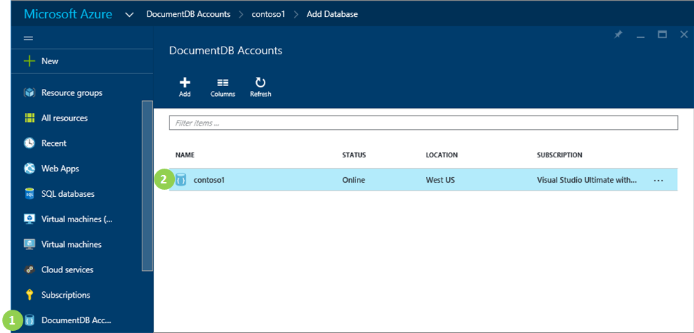
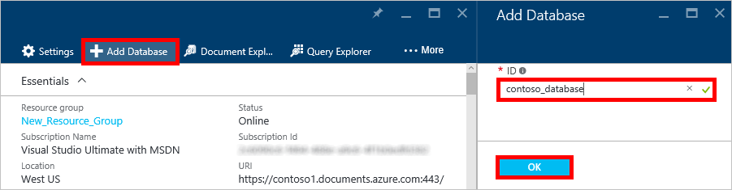

<properties 
	pageTitle="How to create a database in DocumentDB | Microsoft Azure" 
	description="Learn how to create a database using the online service portal for Azure DocumentDB, your blazing fast, global-scale NoSQL database." 
	keywords="how to create a database" 
	services="documentdb" 
	authors="mimig1" 
	manager="jhubbard" 
	editor="monicar" 
	documentationCenter=""/>

<tags 
	ms.service="documentdb" 
	ms.workload="data-services" 
	ms.tgt_pltfrm="na" 
	ms.devlang="na" 
	ms.topic="article" 
	ms.date="05/16/2016" 
	ms.author="mimig"/>

# How to create a database for DocumentDB using the Azure portal

To use Microsoft Azure DocumentDB, you must have a [DocumentDB account](documentdb-create-account.md), a database, a collection, and documents.  This topic describes how to create a database for DocumentDB in the Microsoft Azure portal. For information on how to create a database using one of the SDKs, see [Other ways to create a DocumentDB database](#other-ways-to-create-a-documentdb-database).

1.  In the [Azure Portal](https://portal.azure.com/), in the Jumpbar, click **DocumentDB Accounts**. If **DocumentDB Accounts** is not visible, click **Browse** and then click **DocumentDB Accounts**.

2.  In the **DocumentDB Accounts** blade, select the account in which to add a DocumentDB NoSQL database. If you don't have any accounts listed, you'll need to [create a DocumentDB account](documentdb-create-account.md).

    

3. In the **DocumentDB account** blade, click **Add Database**.

4. In the **Add Database** blade, enter the ID for your new database. When the name is validated, a green check mark appears in the **ID** box.

5. Click **OK** at the bottom of the screen to create the new database. 

6. The new database now appears in the **Databases** lens on the **DocumentDB Account** blade.
 
	

## Other ways to create a DocumentDB database

Databases do not have to be created using the portal, you can also create them using the [DocumentDB SDKs](documentdb-sdk-dotnet.md) or the [REST API](https://msdn.microsoft.com/library/mt489072.aspx). For information on working with databases by using the .NET SDK, see [.NET database examples](documentdb-dotnet-samples.md#database-examples). For information on working with databases by using the Node.js SDK, see [Node.js database examples](documentdb-nodejs-samples.md#database-examples). 

## Next steps

Now that you know how to create a database for DocumentDB, the next step is to [create a collection](documentdb-create-collection.md).

Once your collection is created, you can [add JSON documents](documentdb-view-json-document-explorer.md) by using the Document Explorer in the Portal, [import documents](documentdb-import-data.md) into the collection by using the DocumentDB Data Migration Tool, or use one of the [DocumentDB SDKs](documentdb-sdk-dotnet.md) to perform CRUD operations. DocumentDB has .NET, Java, Python, Node.js, and JavaScript API SDKs. For .NET code samples showing how to create, remove, update and delete documents, see [.NET document examples](documentdb-dotnet-samples.md#document-examples). For information on working with documents by using the Node.js SDK, see [Node.js document examples](documentdb-nodejs-samples.md#document-examples). 

After you have documents in a collection, you can use [DocumentDB SQL](documentdb-sql-query.md) to [execute queries](documentdb-sql-query.md#executing-sql-queries) against your documents by using the [Query Explorer](documentdb-query-collections-query-explorer.md) in the Portal, the [REST API](https://msdn.microsoft.com/library/azure/dn781481.aspx), or one of the [SDKs](documentdb-sdk-dotnet.md). 
