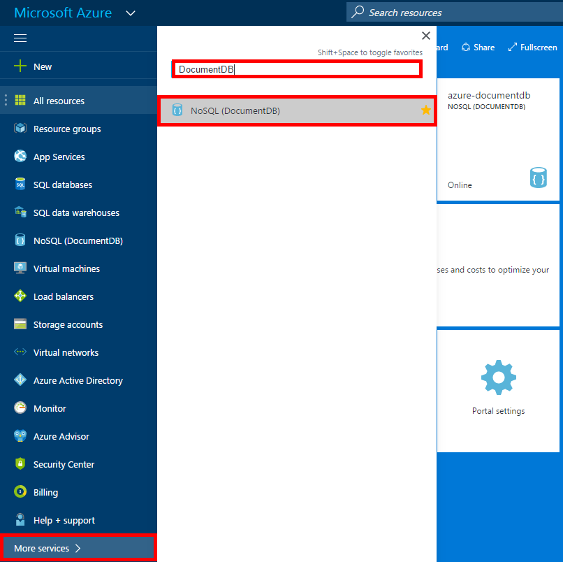
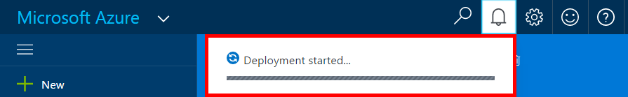
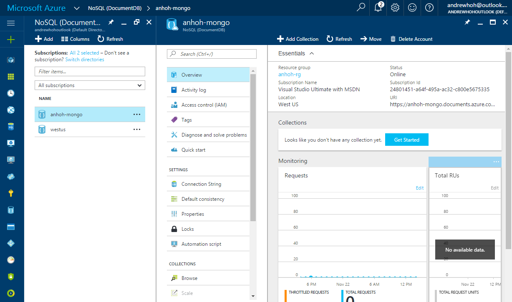

# Create an Azure Cosmos DB account with MongoDB API
Azure Cosmos DB databases can now be used as the data store for apps written for MongoDB. To use this functionality, you need an Azure account and an Azure Cosmos DB account. This tutorial walks you through the process of creating an Azure Cosmos DB account for use with MongoDB apps. 

You can create an Azure Cosmos DB with support for MongoDB account using either the Azure portal or Azure CLI with Azure Resource Manager templates. This article shows how to create an Azure Cosmos DB with support for MongoDB account using the Azure portal. To create an account using Azure CLI with Azure Resource Manager, see [Automate Azure Cosmos DB account management using Azure CLI 2.0](documentdb-automation-resource-manager-cli.md).

## Prerequisite
An Azure account. If you don't have an Azure account, create a [free Azure account](https://azure.microsoft.com/free/) now.
## Create an Azure Cosmos DB account

1. In an internet browser, sign in to the [Azure Portal](https://portal.azure.com).
2. In the left navigation, click on **Azure Cosmos DB**.

    

3. Alternatively, click **More services >**, type **DocumentDB** in the top search bar, and click **Azure Cosmos DB**.

    

4. On the top of the **Azure Cosmos DB** blade, click **+ Add** on the top action bar.

    

5. In the **Azure Cosmos DB account** blade, specify the desired configuration for the account.

   

    - In the **ID** box, enter a name to identify the account.  When the **ID** is validated, a green check mark appears in the **ID** box. The **ID** value becomes the host name within the URI. The **ID** may contain only lowercase letters, numbers, and the '-' character, and must be between 3 and 50 characters. Note that *documents.azure.com* is appended to the endpoint name you choose, the result of which will become your account endpoint.

    - For **API**, select **MongoDB**. This specifies the communication API you would like to use to interact with your Azure Cosmos DB database.

    - For **Subscription**, select the Azure subscription that you want to use for the account. If your account has only one subscription, that account is selected by default.

    - In **Resource Group**, select or create a resource group for the account.  By default, an existing Resource group under the Azure subscription will be chosen.  You may, however, choose to select to create a new resource group to which you would like to add the account. For more information, see [Using the Azure portal to manage your Azure resources](../azure-portal/resource-group-portal.md).

    - Use **Location** to specify the geographic location in which to host the account.

6. Once the new account options are configured, click **Create**.  It can take a few minutes to create the account.

   You can monitor your progress from the Notifications hub.  

     

7. To access your new account, click **Azure Cosmos DB** on the left-hand menu. In your list of regular DocumentDB and DocumentDB with Mongo protocol support accounts, click on your new account's name.
8. Your Azure Cosmos DB account is now ready to use with your MongoDB app.

   

## Next steps
* Learn how to [connect](documentdb-connect-mongodb-account.md) to a DocumentDB account with protocol support for MongoDB.
