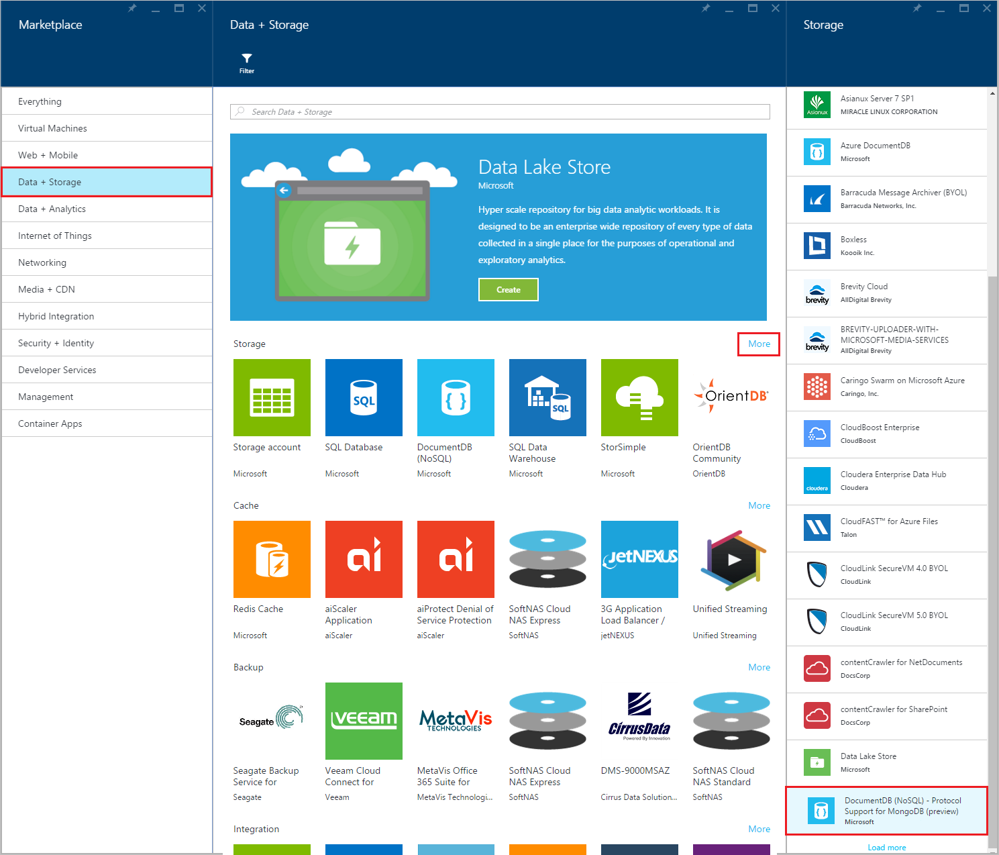
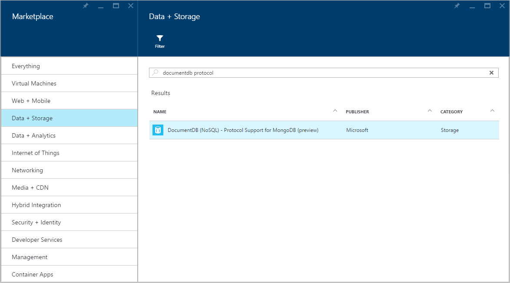
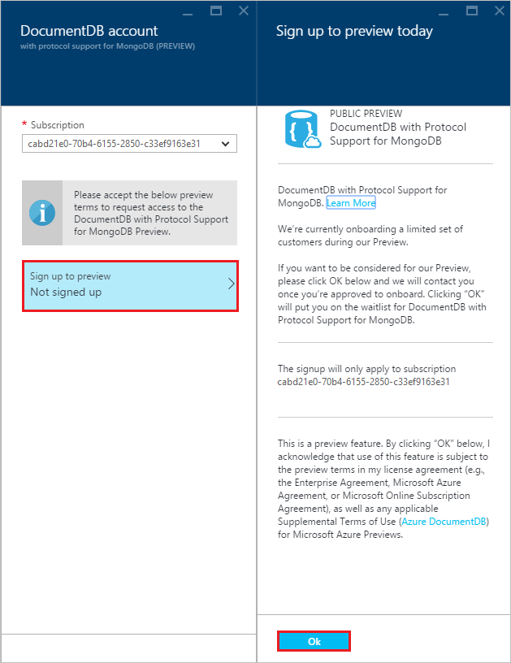
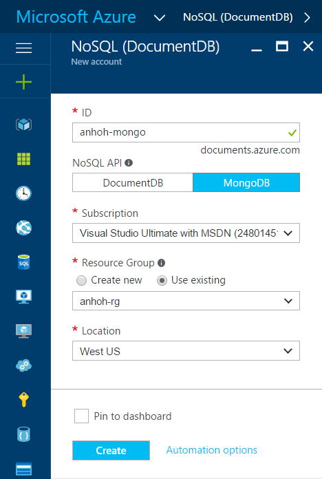
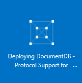
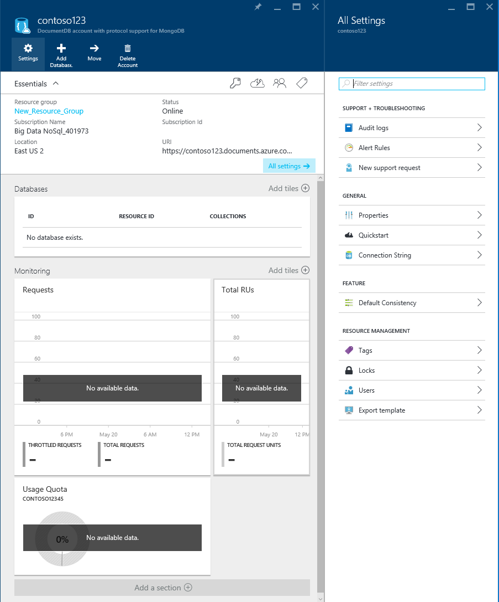

<properties 
	pageTitle="Create a DocumentDB for MongoDB account | Microsoft Azure" 
	description="Learn how to create a DocumentDB with protocol support for MongoDB account, now available for preview." 
	keywords="mongodb protocol, mongodb, mongo database"
	services="documentdb" 
	authors="stephbaron" 
	manager="jhubbard" 
	editor="" 
	documentationCenter=""/>

<tags 
	ms.service="documentdb" 
	ms.workload="data-services" 
	ms.tgt_pltfrm="na" 
	ms.devlang="na" 
	ms.topic="article" 
	ms.date="05/31/2016" 
	ms.author="stbaro"/>

# How to create a DocumentDB with protocol support for MongoDB account using the Azure portal

To create a DocumentDB with protocol support for MongoDB account, you must:

- Have an Azure account. You can get a [free Azure account](https://azure.microsoft.com/free/) if you don't have one already.

## Create the account  

To create a DocumentDB with protocol support for MongoDB account, perform the following steps.

1. Sign in to the [Azure Portal](https://portal.azure.com).
2. Click **NEW**, click **Data + Storage**, click **See all**, click **More**, and then click **DocumentDB - Protocol Support for MongoDB**.

	

3. Alternatively, search the **Data + Storage** category for "DocumentDB protocol".

	

4. Click **Create** to launch the preview signup process.

	

5. In the **New DocumentDB Account** blade, click **Sign up to preview**. Read the information and then click **OK**.

	

6.  After accepting the preview terms, you will be returned to the create blade.  In the **New DocumentDB account** blade, specify the desired configuration for the account.

	

	- In the **ID** box, enter a name to identify the account.  When the **ID** is validated, a green check mark appears in the **ID** box. The **ID** value becomes the host name within the URI. The **ID** may contain only lowercase letters, numbers, and the '-' character, and must be between 3 and 50 characters. Note that *documents.azure.com* is appended to the endpoint name you choose, the result of which will become your account endpoint.

	- For **Subscription**, select the Azure subscription that you want to use for the account. If your account has only one subscription, that account is selected by default.

	- In **Resource Group**, select or create a resource group for the account.  By default, an existing Resource group under the Azure subscription will be chosen.  You may, however, choose to select to create a new resource group to which you would like to add the account. For more information, see [Using the Azure portal to manage your Azure resources](resource-group-portal.md).

	- Use **Location** to specify the geographic location in which to host the account.   

7.	Once the new account options are configured, click **Create**.  It can take a few minutes to create the account.  To check the status, you can monitor the progress on the Startboard.  
	  

	Or, you can monitor your progress from the Notifications hub.  

	  

	

8.	After the account is created, it is ready for use with the default settings. 

	
	

## Next steps

- Learn how to [connect](documentdb-connect-mongodb-account.md) to a DocumentDB with protocol support for MongoDB account.

 
