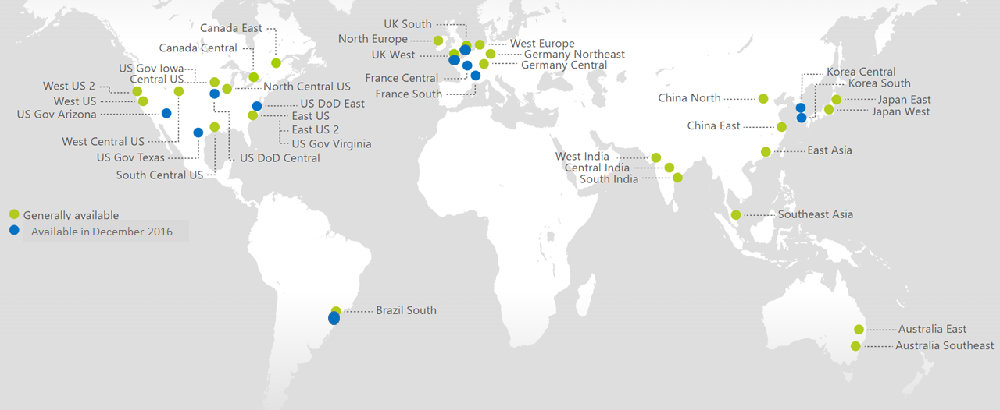
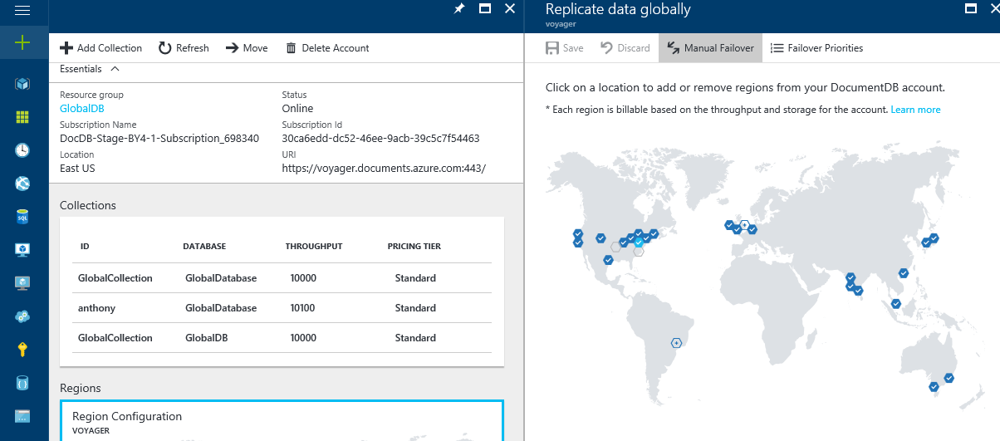
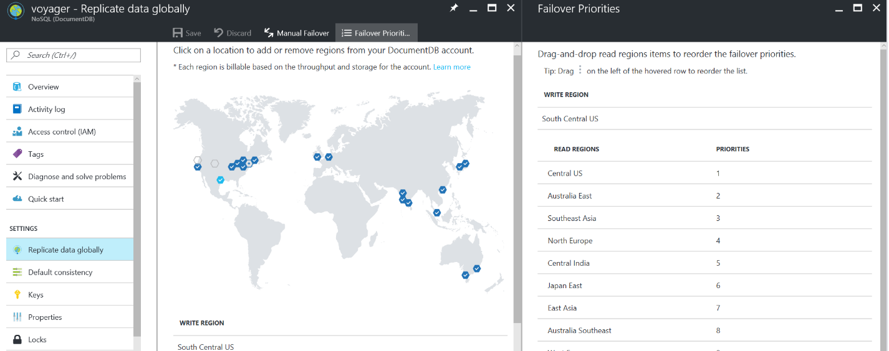
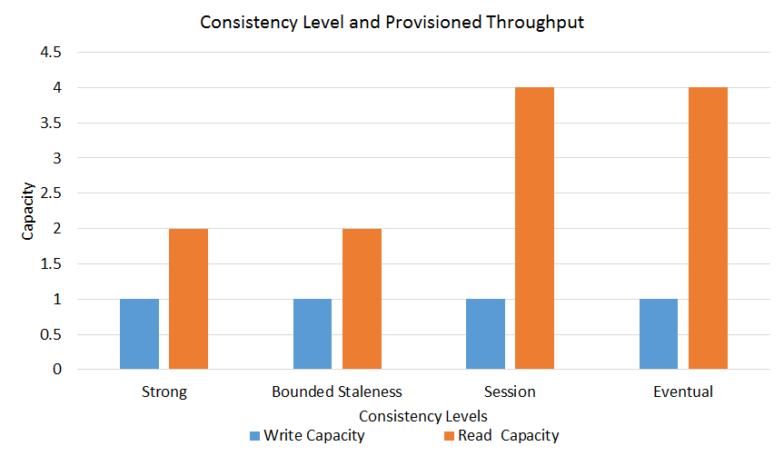
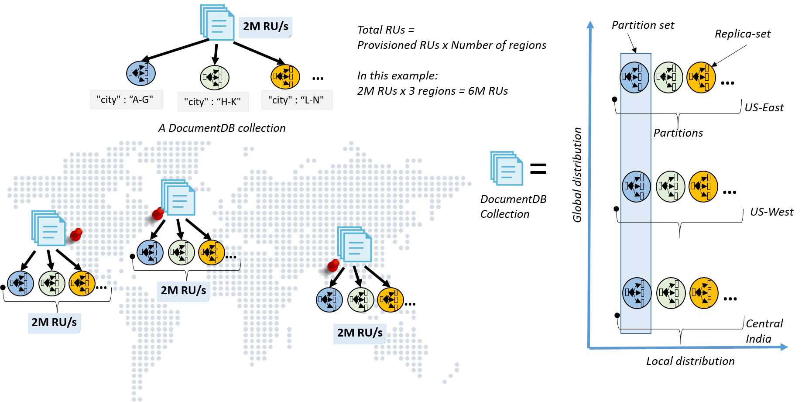
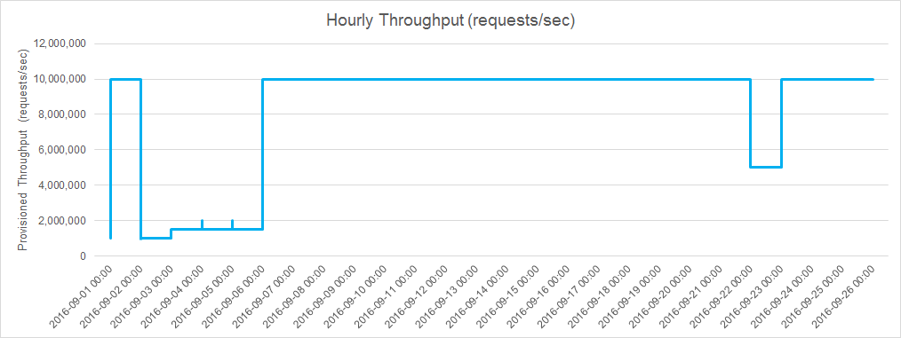
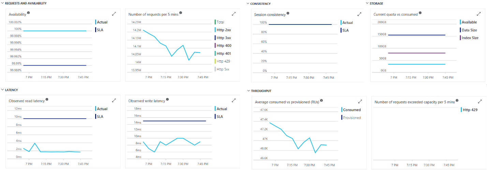

# DocumentDB - a globally distributed database service on Azure
Azure is ubiquitous - it has a global footprint across 30+ geographical regions and is continuously expanding. With its worldwide presence, one of the differentiated capabilities Azure offers to its developers is the ability to build, deploy, and manage globally distributed applications easily. DocumentDB is Microsoft's multi-tenant, globally distributed database system designed to enable developers to build planet scale applications. DocumentDB allows you to elastically scale both, throughput and storage across any number of geographical regions. The service offers guaranteed low latency at P99, 99.99% high availability, predictable throughput, and [multiple well-defined consistency models](documentdb-consistency-levels.md) – all backed by comprehensive SLAs. By virtue of its [schema-agnostic and write optimized database engine](http://www.vldb.org/pvldb/vol8/p1668-shukla.pdf), by default DocumentDB is capable of automatically indexing all the data it ingests and serve [SQL](documentdb-sql-query.md), [MongoDB](documentdb-protocol-mongodb.md), and [JavaScript language-integrated queries](documentdb-programming.md#javascript-language-integrated-query-api) in a scale-independent manner. As a cloud service, DocumentDB is carefully engineered with multi-tenancy and global distribution from the ground up.

**A single DocumentDB collection partitioned and distributed across three Azure regions**


As we have learned while building DocumentDB, adding global distribution cannot be an afterthought - it cannot be "bolted-on" atop a "single site" database system. The capabilities offered by a globally distributed database span beyond that of traditional geographical disaster recovery (Geo-DR) offered by "single-site" databases. Single site databases offering Geo-DR capability are a strict subset of globally distributed databases. 

With DocumentDB's turnkey global distribution, developers do not have to build their own replication scaffolding by employing either the Lambda pattern (for example, [AWS DynamoDB replication](https://github.com/awslabs/dynamodb-cross-region-library/blob/master/README.md)) over the database log or by doing "double writes" across multiple regions. We do not recommend these approaches since it is impossible to ensure correctness of such approaches and provide sound SLAs. 

In this article, we provide an overview of DocumentDB's global distribution capabilities. We also describe DocumentDB's unique approach to providing comprehensive SLAs. 

## <a id="EnableGlobalDistribution"></a>Enabling turn-key global distribution
DocumentDB provides the following capabilities to enable you to easily write planet scale applications. These capabilities are available via DocumentDB's resource provider-based [REST APIs](https://docs.microsoft.com/rest/api/documentdbresourceprovider/) as well as, the Azure portal.

### <a id="RegionalPresence"></a>Ubiquitous regional presence 
Azure is constantly growing its geographical presence by bringing new regions online. DocumentDB is available in all new Azure regions by default. This allows you to associate a geographical region with your DocumentDB database account as soon as Azure opens the new region for business.

**DocumentDB is available in all Azure regions by default**



### <a id="UnlimitedRegionsPerAccount"></a>Associating an unlimited number of regions with your DocumentDB database account
DocumentDB allows you to associate any number of Azure regions with your DocumentDB database account. Outside of geo-fencing restrictions (for example, China, Germany), there are no limitations on the number of regions that can be associated with your DocumentDB database account. The following figure shows a database account configured to span across 21 Azure regions.  

**A tenant's DocumentDB database account spanning 21 Azure regions**



### <a id="PolicyBasedGeoFencing"></a>Policy-based geo-fencing
DocumentDB is designed to have policy-based geo-fencing capabilities. Geo-fencing is an important component to ensure data governance and compliance restrictions and may prevent associating a specific region with your account. Examples of geo-fencing include (but are not restricted to), scoping global distribution to the regions within a sovereign cloud (for example, China and Germany), or within a government taxation boundary (for example, Australia). The policies are controlled using the metadata of your Azure subscription.

### <a id="DynamicallyAddRegions"></a>Dynamically add and remove regions
DocumentDB allows you to add (associate) or remove (dissociate) regions to your database account at any point in time (see [preceding figure](#UnlimitedRegionsPerAccount)). By virtue of replicating data across partitions in parallel, DocumentDB ensures that when a new region comes online, DocumentDB is available within 30 minutes anywhere in the world for up to 100 TBs. 

### <a id="FailoverPriorities"></a>Failover priorities
To control exact sequence of regional failovers when there is a multi-regional outage, DocumentDB enables you to associate the priority to various regions associated with the database account (see the following figure). DocumentDB ensures that the automatic failover sequence occurs in the priority order you specified. For more information about regional failovers, see [Automatic regional failovers for business continuity in DocumentDB](documentdb-regional-failovers.md).

**A tenant of DocumentDB can configure the failover priority order (right pane) for regions associated with a database account**



### <a id="OfflineRegions"></a>Dynamically taking a region "offline"
DocumentDB enables you to take your database account offline in a specific region and bring it back online later. Regions marked offline do not actively participate in replication and are not part of the failover sequence. This enables you to freeze the last known good database image in one of the read regions before rolling out potentially risky upgrades to your application.

### <a id="ConsistencyLevels"></a>Multiple, well-defined consistency models for globally replicated databases
DocumentDB exposes [multiple well-defined consistency levels](documentdb-consistency-levels.md) backed by SLAs. You can choose a specific consistency model (from the available list of options) depending on the workload/scenarios. 

### <a id="TunableConsistency"></a>Tunable consistency for globally replicated databases
DocumentDB allows you to programmatically override and relax the default consistency choice on a per request basis, at runtime. 

### <a id="DynamicallyConfigurableReadWriteRegions"></a>Dynamically configurable read and write regions
DocumentDB enables you to configure the regions (associated with the database) for "read", "write" or "read/write" regions. 

### <a id="ElasticallyScaleThroughput"></a>Elastically scaling throughput across Azure regions
You can elastically scale a DocumentDB collection by provisioning throughput programmatically. The throughput is applied to all the regions the collection is distributed in.

### <a id="GeoLocalReadsAndWrites"></a>Geo-local reads and writes
The key benefit of a globally distributed database is to offer low latency access to the data anywhere in the world. DocumentDB offers low latency guarantees at P99 for various database operations. It ensures that all reads are routed to the closest local read region. To serve a read request, the quorum local to the region in which the read is issued is used; the same applies to the writes. A write is acknowledged only after a majority of replicas has durably committed the write locally but without being gated on remote replicas to acknowledge the writes. Put differently, the replication protocol of DocumentDB operates under the assumption that the read and write quorums are always local to the read and write regions, respectively, in which the request is issued.

### <a id="ManualFailover"></a>Manually initiate regional failover
DocumentDB allows you to trigger the failover of the database account to validate the *end to end* availability properties of the entire application (beyond the database). Since both the safety and liveness properties of the failure detection and leader election are guaranteed, DocumentDB guarantees *zero-data-loss* for a tenant-initiated manual failover operation.

### <a id="AutomaticFailover"></a>Automatic failover
DocumentDB supports automatic failover in case of one or more regional outages. During a regional failover, DocumentDB maintains its read latency, uptime availability, consistency, and throughput SLAs. DocumentDB provides an upper bound on the duration of an automatic failover operation to complete. This is the window of potential data loss during the regional outage.

### <a id="GranularFailover"></a>Designed for different failover granularities
Currently the automatic and manual failover capabilities are exposed at the granularity of the database account. Note, internally DocumentDB is designed to offer *automatic* failover at finer granularity of a database, collection, or even a partition (of a collection owning a range of keys). 

### <a id="MultiHomingAPIs"></a>Multi-homing APIs in DocumentDB
DocumentDB allows you to interact with the database using either logical (region agnostic) or physical (region-specific) endpoints. Using logical endpoints ensures that the application can transparently be multi-homed in case of failover. The latter, physical endpoints, provide fine-grained control to the application to redirect reads and writes to specific regions.

### <a id="ReadPreferencesAPIforMongoDB"></a> Configurable read preferences in API for MongoDB
API for MongoDB enables you to specify your collection's read preference for a globally distributed database. For both low latency reads and global high availability, we recommend setting your collection's read preference to *nearest*. A read preference of *nearest* is configured to read from the closest region.

```csharp
var collection = database.GetCollection<BsonDocument>(collectionName);
collection = collection.WithReadPreference(new ReadPreference(ReadPreferenceMode.Nearest));
```

For applications with a primary read/write region and a secondary region for disaster recovery (DR) scenarios, we recommend setting your collection's read preference to *secondary preferred*. A read preference of *secondary preferred* is configured to read from the secondary region when the primary region is unavailable.

```csharp
var collection = database.GetCollection<BsonDocument>(collectionName);
collection = collection.WithReadPreference(new ReadPreference(ReadPreferenceMode.SecondaryPreferred));
```

Lastly, if you would like to manually specify your read regions. You can set the region Tag within your read preference.

```csharp
var collection = database.GetCollection<BsonDocument>(collectionName);
var tag = new Tag("region", "Southeast Asia");
collection = collection.WithReadPreference(new ReadPreference(ReadPreferenceMode.Secondary, new[] { new TagSet(new[] { tag }) }));
```

### <a id="TransparentSchemaMigration"></a>Transparent and consistent database schema and index migration 
DocumentDB is fully [schema agnostic](http://www.vldb.org/pvldb/vol8/p1668-shukla.pdf). The unique design of its database engine allows it to automatically and synchronously index all of the data it ingests without requiring any schema or secondary indices from you. This enables you to iterate your globally distributed application rapidly without worrying about database schema and index migration or coordinating multi-phase application rollouts of schema changes. DocumentDB guarantees that any changes to indexing policies explicitly made by you does not result into degradation of either performance or availability.  

### <a id="ComprehensiveSLAs"></a>Comprehensive SLAs (beyond just high availability)
As a globally distributed database service, DocumentDB offers well-defined SLA for **data-loss**, **availability**, **latency at P99**, **throughput** and **consistency** for the database as a whole, regardless of the number of regions associated with the database.  

## <a id="LatencyGuarantees"></a>Latency guarantees
The key benefit of a globally distributed database service like DocumentDB is to offer low latency access to your data anywhere in the world. DocumentDB offers guaranteed low latency at P99 for various database operations. The replication protocol that DocumentDB employs ensures that the database operations (ideally, both reads and writes) are always performed in the region local to that of the client. The latency SLA of DocumentDB includes P99 for both reads, (synchronously) indexed writes and queries for various request and response sizes. The latency guarantees for writes include durable majority quorum commits within the local datacenter.

### <a id="LatencyAndConsistency"></a>Latency's relationship with consistency 
For a globally distributed service to offer strong consistency in a globally distributed setup, it needs to synchronously replicate the writes or synchronous perform cross-region reads – the speed of light and the wide area network reliability dictate that strong consistency results in high latencies and low availability of database operations. Hence, in order to offer guaranteed low latencies at P99 and 99.99 availability, the service must employ asynchronous replication. This in-turn requires that the service must also offer [well-defined, relaxed consistency choice(s)](documentdb-consistency-levels.md) – weaker than strong (to offer low latency and availability guarantees) and ideally stronger than "eventual" consistency (to offer an intuitive programming model).

DocumentDB ensures that a read operation is not required to contact replicas across multiple regions to deliver the specific consistency level guarantee. Likewise, it ensures that a write operation does not get blocked while the data is being replicated across all the regions (i.e. writes are asynchronously replicated across regions). For multi-region database accounts multiple relaxed consistency levels are available. 

### <a id="LatencyAndAvailability"></a>Latency's relationship with availability 
Latency and availability are the two sides of the same coin. We talk about latency of the operation in steady state and availability, in the face of failures. From the application standpoint, a slow running database operation is indistinguishable from a database that is unavailable. 

To distinguish high latency from unavailability, DocumentDB provides an absolute upper bound on latency of various database operations. If the database operation takes longer than the upper bound to complete, DocumentDB returns a timeout error. The DocumentDB availability SLA ensures that the timeouts are counted against the availability SLA. 

### <a id="LatencyAndThroughput"></a>Latency's relationship with throughput
DocumentDB does not make you choose between latency and throughput. It honors the SLA for both latency at P99 and deliver the throughput that you have provisioned. 

## <a id="ConsistencyGuarantees"></a>Consistency guarantees
While the [strong consistency model](http://cs.brown.edu/~mph/HerlihyW90/p463-herlihy.pdf) is the gold standard of programmability, it comes at the steep price of high latency (in steady state) and loss of availability (in the face of failures). 

DocumentDB offers a well-defined programming model to you to reason about replicated data's consistency. In order to enable you to build multi-homed applications, the consistency models exposed by DocumentDB are designed to be region-agnostic and not depend on the region from where the reads and writes are served. 

DocumentDB's consistency SLA guarantees that 100% of read requests will meet the consistency guarantee for the consistency level requested by you (either the default consistency level on the database account or the overridden value on the request). A read request is considered to have met the consistency SLA if all the consistency guarantees associated with the consistency level are satisfied. The following table captures the consistency guarantees that correspond to specific consistency levels offered by DocumentDB.

**Consistency guarantees associated with a given consistency level in DocumentDB**

<table>
	<tr>
		<td><strong>Consistency Level</strong></td>
		<td><strong>Consistency Characteristics</strong></td>
		<td><strong>SLA</strong></td>
	</tr>
	<tr>
		<td rowspan="3">Session</td>
		<td>Read your own write</td>
		<td>100%</td>
	</tr>
	<tr>
		<td>Monotonic read</td>
		<td>100%</td>
	</tr>
	<tr>
		<td>Consistent prefix</td>
		<td>100%</td>
	</tr>
	<tr>
		<td rowspan="3">Bounded staleness</td>
		<td>Monotonic read (within a region)</td>
		<td>100%</td>
	</tr>
	<tr>
		<td>Consistent prefix</td>
		<td>100%</td>
	</tr>
	<tr>
		<td>Staleness bound &lt; K,T</td>
		<td>100%</td>
	</tr>
	<tr>
		<td>Eventual</td>
		<td>Consistent prefix</td>
		<td>100%</td>
	</tr>
	<tr>
		<td>Strong</td>
		<td>Linearizable</td>
		<td>100%</td>
	</tr>
</table>

### <a id="ConsistencyAndAvailability"></a>Consistency's relationship with availability
The [impossibility result](http://www.glassbeam.com/sites/all/themes/glassbeam/images/blog/10.1.1.67.6951.pdf) of the [CAP theorem](https://people.eecs.berkeley.edu/~brewer/cs262b-2004/PODC-keynote.pdf) proves that it is indeed impossible for the system to remain available and offer linearizable consistency in the face of failures. The database service must choose to be either CP or AP - CP systems forgo availability in favor of linearizable consistency while the AP systems forgo [linearizable consistency](http://cs.brown.edu/~mph/HerlihyW90/p463-herlihy.pdf) in favor of availability. DocumentDB never violates the requested consistency level, which formally makes it a CP system. However, in practice consistency is not an all or nothing proposition – there are multiple well-defined consistency models along the consistency spectrum between linearizable and eventual consistency. In DocumentDB, we have tried to identify several of the relaxed consistency models with real world applicability and an intuitive programming model. DocumentDB navigates the consistency-availability tradeoffs by offering 99.99 availability SLA along with [multiple relaxed yet well-defined consistency levels](documentdb-consistency-levels.md). 

### <a id="ConsistencyAndAvailability"></a>Consistency's relationship with latency
A more comprehensive variation of CAP was proposed by Prof. Daniel Abadi and it is called [PACELC](http://cs-www.cs.yale.edu/homes/dna/papers/abadi-pacelc.pdf), which also accounts for latency and consistency tradeoffs in steady state. It states that in steady state, the database system must choose between consistency and latency. With multiple relaxed consistency models (backed by asynchronous replication and local read, write quorums), DocumentDB ensures that all reads and writes are local to the read and write regions respectively.  This allows DocumentDB to offer low latency guarantees within the region for the consistency levels.  

### <a id="ConsistencyAndThroughput"></a>Consistency's relationship with throughput
Since the implementation of a specific consistency model depends on the choice of a [quorum type](http://cs.brown.edu/~mph/HerlihyW90/p463-herlihy.pdf), the throughput also varies based on the choice of consistency. For instance, in DocumentDB, the throughput with strongly consistent reads is roughly half to that of eventually consistent reads. 
 
**Relationship of read capacity for a specific consistency level in DocumentDB**



## <a id="ThroughputGuarantees"></a>Throughput guarantees 
DocumentDB allows you to scale throughput (as well as, storage), elastically across different regions depending on the demand. 

**A single DocumentDB collection partitioned (across three shards) and then distributed across three Azure regions**



A DocumentDB collection gets distributed using two dimensions – within a region and then across regions. Here's how: 

* Within a single region, a DocumentDB collection is scaled out in terms of resource partitions. Each resource partition manages a set of keys and is strongly consistent and highly available by virtue of state machine replication among a set of replicas. DocumentDB is a fully resource governed system where a resource partition is responsible for delivering its share of throughput for the budget of system resources allocated to it. The scaling of a DocumentDB collection is completely transparent – DocumentDB manages the resource partitions and splits and merges it as needed. 
* Each of the resource partitions is then distributed across multiple regions. Resource partitions owning the same set of keys across various regions form partition set (see [preceding figure](#ThroughputGuarantees)).  Resource partitions within a partition set are coordinated using state machine replication across the multiple regions. Depending on the consistency level configured, the resource partitions within a partition set are configured dynamically using different topologies (for example, star, daisy-chain, tree etc.). 

By virtue of a highly responsive partition management, load balancing and strict resource governance, DocumentDB allows you to elastically scale throughput across multiple Azure regions on a DocumentDB collection. Changing throughput on a collection is a runtime operation in DocumentDB - like with other database operations DocumentDB guarantees the absolute upper bound on latency for your request to change the throughput. As an example, the following figure shows a customer's collection with elastically provisioned throughput (ranging from 1M-10M requests/sec across two regions) based on the demand.
 
**A customer's collection with elastically provisioned throughput (1M-10M requests/sec)**



### <a id="ThroughputAndConsistency"></a>Throughput's relationship with consistency 
Same as [Consistency's relationship with throughput](#ConsistencyAndThroughput).

### <a id="ThroughputAndAvailability"></a>Throughput's relationship with availability
DocumentDB continues to maintain its availability when the changes are made to the throughput. DocumentDB transparently manages partitions (for example, split, merge, clone operations) and ensures that the operations do not degrade performance or availability, while the application elastically increases or decreases throughput. 

## <a id="AvailabilityGuarantees"></a>Availability guarantees
DocumentDB offers a 99.99% uptime availability SLA for each of the data and control plane operations. As described earlier, DocumentDB's availability guarantees include an absolute upper bound on latency for every data and control plane operations. The availability guarantees are steadfast and do not change with the number of regions or geographical distance between regions. Availability guarantees apply with both manual as well as, automatic failover. DocumentDB offers transparent multi-homing APIs that ensure that your application can operate against logical endpoints and can transparently route the requests to the new region in case of failover. Put differently, your application does not need to be redeployed upon regional failover and the availability SLAs are maintained.

### <a id="AvailabilityAndConsistency"></a>Availability's relationship with consistency, latency, and throughput
Availability’s relationship with consistency, latency, and throughput is described in  [Consistency's relationship with availability](#ConsistencyAndAvailability), [Latency's relationship with availability](#LatencyAndAvailability) and [Throughput's relationship with availability](#ThroughputAndAvailability). 

## <a id="GuaranteesAgainstDataLoss"></a>Guarantees and system behavior for "data loss"
In DocumentDB, each partition (of a collection) is made highly available by a number of replicas, which are spread across at least 10-20 fault domains. All writes are synchronously and durably committed by a majority quorum of replicas before they are acknowledged to the client. Asynchronous replication is applied with coordination across partitions spread across multiple regions. DocumentDB guarantees that there is no data loss for a tenant-initiated manual failover. During automatic failover, DocumentDB guarantees an upper bound of the configured bounded staleness interval on the data loss window as part of its SLA.

## <a id="CustomerFacingSLAMetrics"></a>Customer facing SLA Metrics
DocumentDB transparently exposes the throughput, latency, consistency and availability metrics. These metrics are accessible programmatically and via the Azure portal (see following figure). You can also set up alerts on various thresholds using Azure Application Insights.
 
**Consistency, Latency, Throughput, and Availability metrics are transparently available to each tenant**



## <a id="Next Steps"></a>Next Steps
* To implement global replication on your DocumentDB account using the Azure portal, see [How to perform DocumentDB global database replication using the Azure portal](documentdb-portal-global-replication.md).
* To learn about how to implement multi-master architectures with DocumentDB, see [Multi-master database architectures with Azure DocumentDB](documentdb-multi-region-writers.md).
* To learn more about how automatic and manual failovers work in DocumentDB, see [Regional Failovers in Azure DocumentDB](documentdb-regional-failovers.md).

## <a id="References"></a>References
1. Eric Brewer. [Towards Robust Distributed Systems](https://people.eecs.berkeley.edu/~brewer/cs262b-2004/PODC-keynote.pdf)
2. Eric Brewer. [CAP Twelve Years Later – How the rules have changed](http://informatik.unibas.ch/fileadmin/Lectures/HS2012/CS341/workshops/reportsAndSlides/PresentationKevinUrban.pdf)
3. Gilbert, Lynch. - [Brewer&#39;s Conjecture and Feasibility of Consistent, Available, Partition Tolerant Web Services](http://www.glassbeam.com/sites/all/themes/glassbeam/images/blog/10.1.1.67.6951.pdf)
4. Daniel Abadi. [Consistency Tradeoffs in Modern Distributed Database Systems Design](http://cs-www.cs.yale.edu/homes/dna/papers/abadi-pacelc.pdf)
5. Martin Kleppmann. [Please stop calling databases CP or AP](https://martin.kleppmann.com/2015/05/11/please-stop-calling-databases-cp-or-ap.html)
6. Peter Bailis et al. [Probabilistic Bounded Staleness (PBS) for Practical Partial Quorums](http://vldb.org/pvldb/vol5/p776_peterbailis_vldb2012.pdf)
7. Naor and Wool. [Load, Capacity and Availability in Quorum Systems](http://www.cs.utexas.edu/~lorenzo/corsi/cs395t/04S/notes/naor98load.pdf)
8. Herlihy and Wing. [Lineralizability: A correctness condition for concurrent objects](http://cs.brown.edu/~mph/HerlihyW90/p463-herlihy.pdf)
9. [Azure DocumentDB SLA](https://azure.microsoft.com/support/legal/sla/documentdb/v1_1/)
