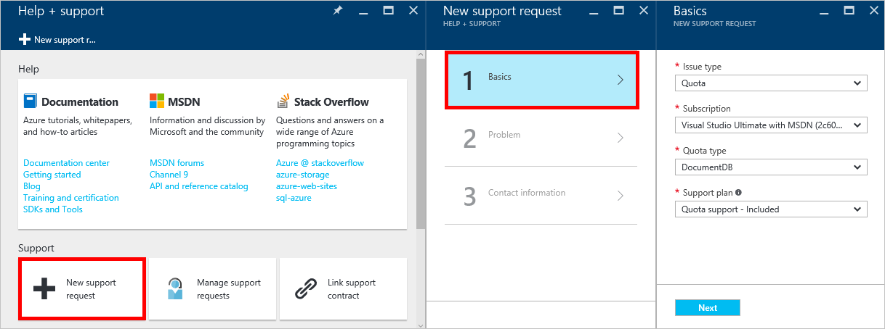
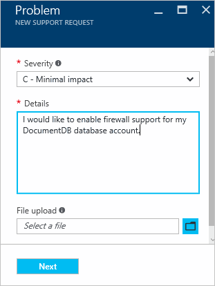

<properties
	pageTitle="DocumentDB firewall support | Microsoft Azure"
	description="Learn how to use IP access control policies for firewall support on Azure DocumentDB database accounts."
	keywords="IP access control, firewall support"
	services="documentdb"
	authors="shahankur11"
	manager="jhubbard"
	editor=""
    tags="azure-resource-manager"
	documentationCenter=""/>

<tags 
	ms.service="documentdb" 
	ms.workload="data-services" 
	ms.tgt_pltfrm="na" 
	ms.devlang="na" 
	ms.topic="article" 
	ms.date="10/14/2016" 
	ms.author="ankshah"/>

# DocumentDB firewall support

To secure data stored in an Azure DocumentDB database account, DocumentDB has provided support for a secret based [authorization model](https://msdn.microsoft.com/library/azure/dn783368.aspx) that utilizes a strong Hash-based message authentication code (HMAC). Now, in addition to the secret based authorization model, DocumentDB supports policy driven IP-based access control. This model is very similar to the firewall rules of a traditional database system and provides an additional level of security to the DocumentDB database account. With this model, you can now configure their DocumentDB database account to be accessible only from an approved set of machines and/or cloud services.  Access to DocumentDB resources from these approved sets of machines and services still require the caller to present a valid authorization token.

# How does IP access control for DocumentDB work?

By default, a DocumentDB database account is accessible from public internet as long as the request is accompanied by a valid authorization token. To configure IP policy-based access control, the user must provide the set of IP addresses or IP address ranges in CIDR form to be included as the allowed list of client IPs for a given database account. Once this configuration is applied, all requests originating from machines outside this allowed list will be blocked by the server.  The connection processing flow for the IP-based access control is described in the following diagram.

## Connecting from cloud services

In Azure, cloud services are a very common way for hosting middle tier service logic using DocumentDB. To enable access to a DocumentDB database account from a cloud service, the public IP address of the cloud service must be added to the allowed list of IP addresses associated with your DocumentDB database account by [contacting Azure support](#configure-ip-policy).  This ensures that all role instances of cloud services have access to your DocumentDB database account. Once enabled, the public IP addresses are displayed in the Azure portal, by clicking **Properties** in the resource menu, as shown in the following screenshot. 

When you scale out your cloud service by adding additional role instance(s), those new instances will automatically have access to the DocumentDB database account since they are part of the same cloud service.

## Connecting from virtual machines

[Virtual machines](https://azure.microsoft.com/services/virtual-machines/) or [virtual machine scale sets](https://azure.microsoft.com/documentation/articles/virtual-machine-scale-sets-overview/) can also be used to host middle tier services using DocumentDB.  To configure the DocumentDB database account to allow access from virtual machines, public IP addresses of virtual machine and/or virtual machine scale set must be configured as one of the allowed IP addresses for your DocumentDB database account by [contacting Azure support](#configure-ip-policy). Once enabled, the IP address is displayed in the Azure portal, by clicking **Properties** in the resource menu, as shown in the following screenshot.

When you add additional virtual machine instances to the group, they are automatically provided access to your DocumentDB database account.

## Connecting from the internet

When you access a DocumentDB database account from a computer on the internet, the client IP address or IP address range of the machine must be added to the allowed list of IP address for the DocumentDB database account. 

##  Configuring IP access control policy for your DocumentDB database account

Use the Azure portal to file a request with [Azure Support](https://portal.azure.com/?#blade/Microsoft_Azure_Support/HelpAndSupportBlade) to enable the IP access control policy on your database account.

1. In the [Help + support](https://portal.azure.com/?#blade/Microsoft_Azure_Support/HelpAndSupportBlade) blade, select **New support request**.
2. In the **New support request** blade, select **Basics**.
3. In the **Basics** blade, select the following:
	- **Issue type**: Quota
	- **Subscription**: The subscription associated with the account in which to add the IP access control policy.
	- **Quota type**: DocumentDB
	- Support plan: Azure Support Plan - Developer.
4. In the Problem blade, do the following:
	- **Severity**: Select C - Minimal impact
	- **Details**: Type "I would like to enable firewall support for my DocumentDB database account."
	- Click **OK**. 

## Troubleshooting IP access control policy

### Portal operations

By enabling an IP access control policy for your DocumentDB database account, all access to your DocumentDB database account from machines outside the configured allowed list of IP address ranges are blocked. By virtue of this model, browsing the data plane operation from the portal will also be blocked to ensure the integrity of access control. 

### SDK & Rest API

For security reasons, access via SDK or REST API from machines not on the allowed list will return a generic 404 Not Found response with no additional details. Please verify the IP allowed list configured for your DocumentDB database account to ensure the correct policy configuration is applied to your DocumentDB database account.

