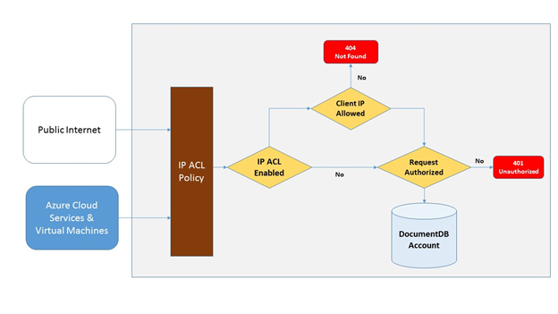
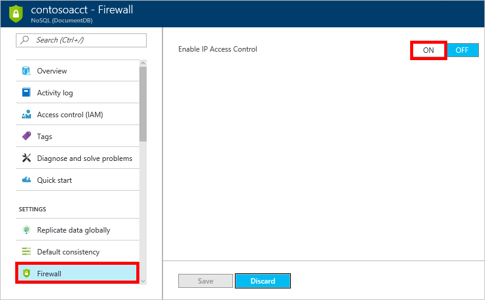
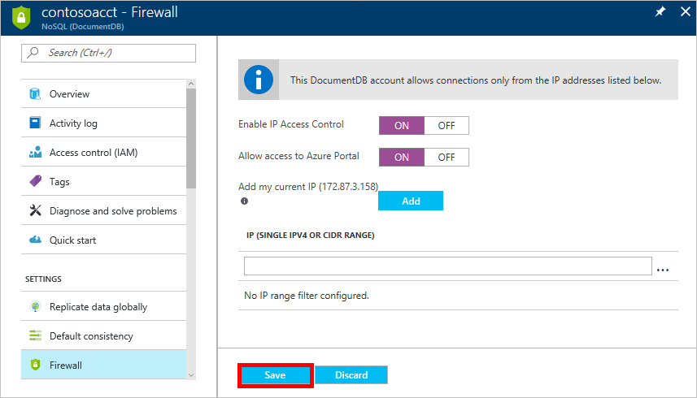

# DocumentDB firewall support
To secure data stored in an Azure DocumentDB database account, DocumentDB has provided support for a secret based [authorization model](https://msdn.microsoft.com/library/azure/dn783368.aspx) that utilizes a strong Hash-based message authentication code (HMAC). Now, in addition to the secret based authorization model, DocumentDB supports policy driven IP-based access controls for inbound firewall support. This model is very similar to the firewall rules of a traditional database system and provides an additional level of security to the DocumentDB database account. With this model, you can now configure a DocumentDB database account to be accessible only from an approved set of machines and/or cloud services. Access to DocumentDB resources from these approved sets of machines and services still require the caller to present a valid authorization token.

## IP access control overview
By default, a DocumentDB database account is accessible from public internet as long as the request is accompanied by a valid authorization token. To configure IP policy-based access control, the user must provide the set of IP addresses or IP address ranges in CIDR form to be included as the allowed list of client IPs for a given database account. Once this configuration is applied, all requests originating from machines outside this allowed list will be blocked by the server.  The connection processing flow for the IP-based access control is described in the following diagram.

## Connections from cloud services
In Azure, cloud services are a very common way for hosting middle tier service logic using DocumentDB. To enable access to a DocumentDB database account from a cloud service, the public IP address of the cloud service must be added to the allowed list of IP addresses associated with your DocumentDB database account by [configuring the IP access control policy](#configure-ip-policy).  This ensures that all role instances of cloud services have access to your DocumentDB database account. You can retrieve IP addresses for your cloud services in the Azure portal, as shown in the following screenshot.

When you scale out your cloud service by adding additional role instance(s), those new instances will automatically have access to the DocumentDB database account since they are part of the same cloud service.

## Connections from virtual machines
[Virtual machines](https://azure.microsoft.com/services/virtual-machines/) or [virtual machine scale sets](../virtual-machine-scale-sets/virtual-machine-scale-sets-overview.md) can also be used to host middle tier services using DocumentDB.  To configure the DocumentDB database account to allow access from virtual machines, public IP addresses of virtual machine and/or virtual machine scale set must be configured as one of the allowed IP addresses for your DocumentDB database account by [configuring the IP access control policy](#configure-ip-policy). You can retrieve IP addresses for virtual machines in the Azure portal, as shown in the following screenshot.

When you add additional virtual machine instances to the group, they are automatically provided access to your DocumentDB database account.

## Connections from the internet
When you access a DocumentDB database account from a computer on the internet, the client IP address or IP address range of the machine must be added to the allowed list of IP address for the DocumentDB database account. 

##  Configuring the IP access control policy
The IP access control policy can be set in the Azure portal, or programmatically through [Azure CLI](documentdb-automation-resource-manager-cli.md), [Azure Powershell](documentdb-manage-account-with-powershell.md), or the [REST API](https://msdn.microsoft.com/library/azure/dn781481.aspx) by updating the `ipRangeFilter` property. IP addresses/ranges must be comma separated and must not contain any spaces. Example: "13.91.6.132,13.91.6.1/24". When updating your database account through these methods, be sure to populate all of the properties to prevent resetting to default settings.

> [!NOTE]
> By enabling an IP access control policy for your DocumentDB database account, all access to your DocumentDB database account from machines outside the configured allowed list of IP address ranges are blocked. By virtue of this model, browsing the data plane operation from the portal will also be blocked to ensure the integrity of access control.

To simplify development, the Azure portal helps you identify and add the IP of your client machine to the allowed list, so that apps running your machine can access the DocumentDB account. Note that the client IP address here is detected as seen by the portal. It may be the client IP address of your machine, but it could also be the IP address of your network gateway. Do not forget to remove it before going to production.

To set the IP access control policy in the Azure portal, navigate to the DocumentDB account blade, click **Firewall** in the navigation menu, then click **ON** 

In the new pane, specify whether the Azure portal can access the account, and add other addresses and ranges as appropriate, then click **Save**.  

> [!NOTE]
> When you enable an IP access control policy, you need to add the IP address for the Azure portal to maintain access. The portal IP addresses are:
> |Region|IP address|
> |------|----------|
> |All regions except those specified below| 104.42.195.92|
> |Germany|51.4.229.218|
> |China|139.217.8.252|
> |US Gov Arizona|52.244.48.71|
>

## Troubleshooting the IP access control policy
### Portal operations
By enabling an IP access control policy for your DocumentDB database account, all access to your DocumentDB database account from machines outside the configured allowed list of IP address ranges are blocked. Therefore if you want to enable portal data plane operations like browsing collections and query documents, you need to explicitly allow Azure portal access using the **Firewall** blade in the portal. 

### SDK & Rest API
For security reasons, access via SDK or REST API from machines not on the allowed list will return a generic 404 Not Found response with no additional details. Please verify the IP allowed list configured for your DocumentDB database account to ensure the correct policy configuration is applied to your DocumentDB database account.

## Next steps
For information about network related performance tips, see [Performance tips](documentdb-performance-tips.md).

