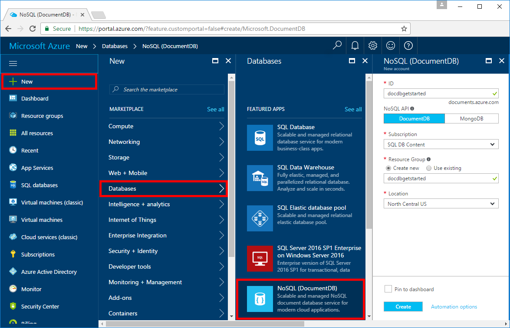
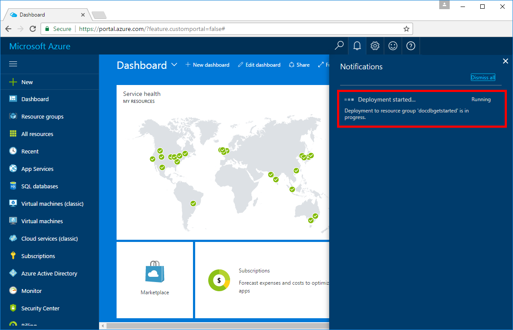
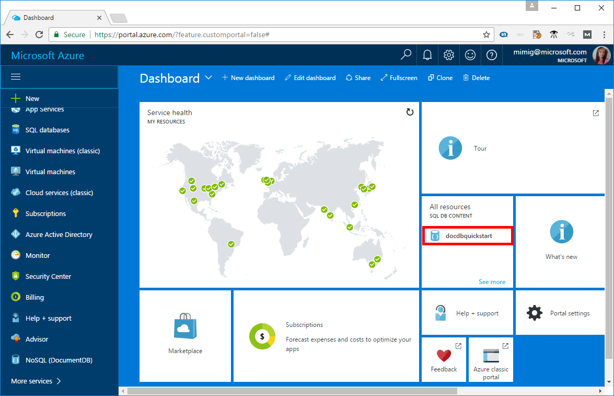

# Create an Azure Cosmos DB account in the Azure portal

This quick start tutorial walks through how to create an Azure Cosmos DB account in Azure. Azure Cosmos DB is a highly available globally-distributed database that supports key/value, relational (table), non-relational (NoSQL) data. This quick start shows you how to get started by creating an Azure Cosmos DB account using the Azure portal.

If you don't have an Azure subscription, create a [free](https://azure.microsoft.com/free/) account before you begin.

## Log in to the Azure portal

Log in to the [Azure portal](https://portal.azure.com/).

## Create an Azure Cosmos DB account

An Azure Cosmos DB account is is created within an [Azure resource group](../azure-resource-manager/resource-group-overview.md) in any of the available [Azure Regions](https://azure.microsoft.com/regions/). 

Follow these steps to create an Azure Cosmos DB account. 

1. Click the **New** button found on the upper left-hand corner of the Azure portal.

2. Select **Databases** from the **New** page, and select **NoSQL (DocumentDB)** from the **Databases** page.

    

3. Fill out the NoSQL (DocumentDB) form with the following information, as shown on the preceding image:     
   * ID: **docdbgetstarted**
   * NoSQL API: **DocumentDB**
   * Subscription: The Azure subscription that you want to use for the DocumentDB account.
   * Resoure Group: **docdbgetstarted**
   * Location: The [Azure region](https://azure.microsoft.com/regions/) closest to your users. 

4. Click **Create** to create the account. 

5. On the toolbar, click **Notifications** to monitor the deployment process.

    

6. When the deployment is complete, open the **docdbgetstarted** account from the All Resources tile. 

    

## Clean up resources

Other quick starts in this collection build upon this quick start. If you plan to continue on to work with subsequent quick starts, do not clean up the resources created in this quick start. If you do not plan to continue, use the following steps to delete all resources created by this quick start in the Azure portal.

1. From the left-hand menu in the Azure portal, click **Resource groups** and then click **docdbgetstarted**. 
2. On your resource group page, click **Delete**, type **docdbgetstarted** in the text box, and then click **Delete**.

## Next steps

* To connect using .NET, see [Connect and query with .NET](documentdb-connect-dotnet.md).
* To connect using .NET Core, see [Connect and query with .NET Core](documentdb-connect-dotnet-core.md).
* To connect using Node.js, see [Connect and query with Node.js and a MongoDB app](documentdb-connect-mongodb-app.md).