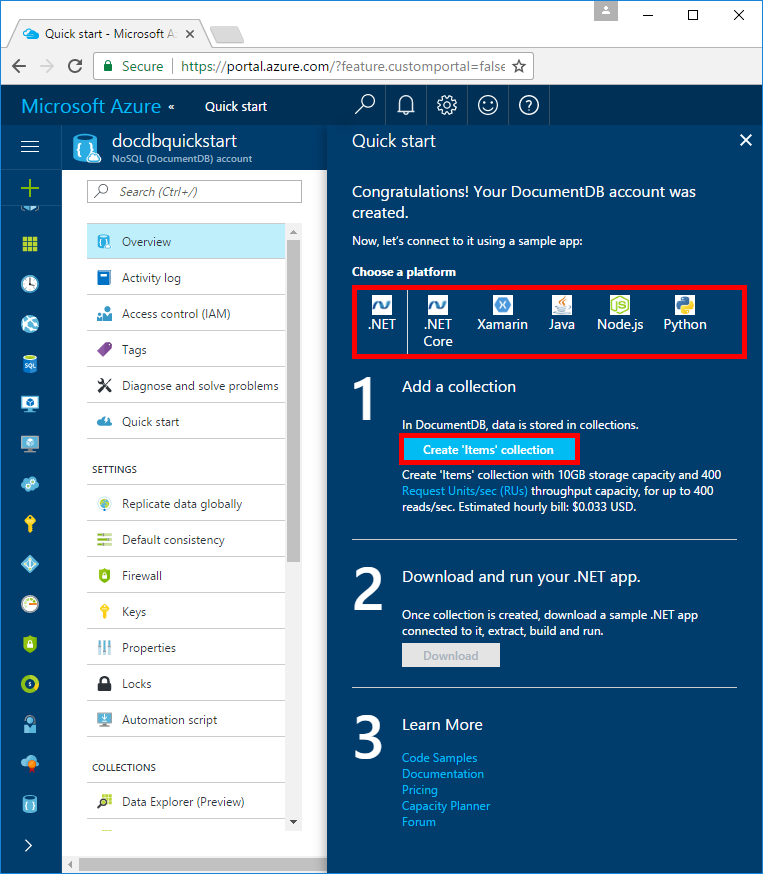
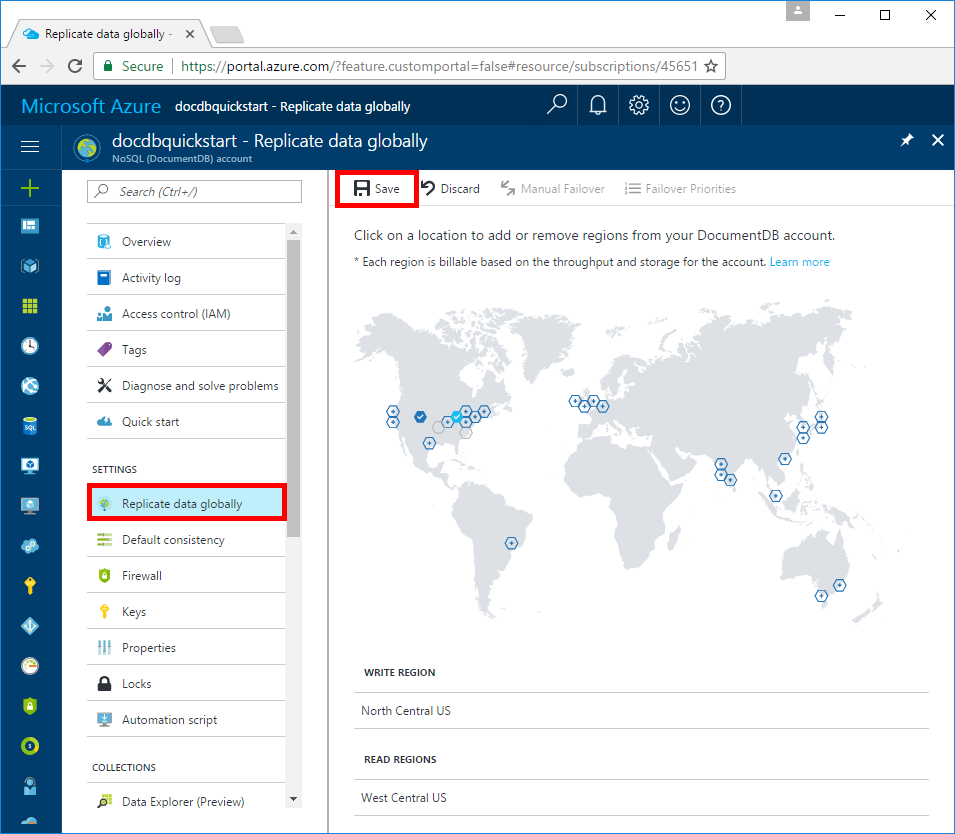

# Create an Azure DocumentDB account and collection in the Azure portal

This quick start tutorial walks through how to create a SQL database in Azure. Azure SQL Database is a “Database-as-a-Service” offering that enables you to run and scale highly available SQL Server databases in the cloud. This quick start shows you how to get started by creating a SQL database using the Azure portal.

If you don't have an Azure subscription, create a [free](https://azure.microsoft.com/free/) account before you begin.

## Log in to the Azure portal

Log in to the [Azure portal](https://portal.azure.com/).

## Create a DocumentDB database account

An Azure DocumentDB account is is created within an [Azure resource group](../azure-resource-manager/resource-group-overview.md) in any of the available [Azure Regions](https://azure.microsoft.com/regions/). 

Follow these steps to create a DocumentDB account. 

1. Click the **New** button found on the upper left-hand corner of the Azure portal.

2. Select **Databases** from the **New** page, and select **NoSQL (DocumentDB)** from the **Databases** page.

    

3. Fill out the NoSQL (DocumentDB) form with the following information, as shown on the preceding image:     
   * ID: **docdbgetstarted**
   * NoSQL API: **DocumentDB**
   * Subscription: The Azure subscription that you want to use for the DocumentDB account.
   * Resoure Group: **docdbgetstarted**
   * Location: The [Azure region](https://azure.microsoft.com/regions/) closest to your users. 

4. Click **Create** to create the account. 

5. On the toolbar, click **Notifications** to monitor the deployment process.

    

6. When the deployment is complete, open the **docdbquickstart** account from the All Resources tile. 

    

## Add a collection and download a sample app

The DocumentDB portal enables you to create a DocumentDB collection and use that collection in a web app with just a few clicks. The app you download has the connection string information built in, so all you need to do is download it and run it. 

In this step, you're creating a DocumentDB collection, which is a logical container of documents and the associated JavaScript application logic used to perform business-processing events and transactions. A collection is a billable entity, where the [cost](documentdb-performance-levels.md) is determined by the provisioned througput and the amount of storage used by the collection. 

1. First, decide what platform you want your DocumentDB app to run on, and select that tab. For this Quick start, we're going to use .NET. But don't worry, if you want to experiment with different technologies, you can come back and download different flavors at any time.

2. In the Step 1 area, click **Create 'Items' Collection**. 

    

    Once the collection has been created, the text in the Step 1 area changes to `"Items" collection has been created with 10GB storage capacity and 400 Request Units/sec (RUs) throughput capacity, for up to 400 reads/sec. Estimated hourly bill: $0.033 USD.`

3. In the Step 2 area, click **Download**. When asked if you want to open or save DocumentDB-Quickstart-Dotnet.zip, click **Save** and then click **Open**. 

4. In File Explorer, extract the contents of the zip file. 

5. Open the todo.sln solution in Visual Studio 2017.
    
## Build and deploy the web app

Build and deploy the sample app, then add some sample data to store in DocumentDB.

1. In Visual Studio 2017, press CTRL + F5 to run the application. 

    The sample application is displayed in your browser.

2. Click **Create New** in the browser and create a few new tasks in your to-do app.

   

## Query data in Data Explorer

Once you've added a few sample tasks to your todo app, you can use the Data Explorer (preview) in the Azure portal to view, query, and run business-logic on your data.

* In the Azure portal, in the navigation menu, under **Collections**, click **Data Explorer (Preview)**. In the **Data Explorer** blade, expand your collection (the ToDoList collection), and then you can view the documents, perform queries, and even create and run stored procedures, triggers, and UDFs. 

   
   
## Replicate data to multiple regions

DocumentDB enables you to replicate your data to multiple regions with the click of a button. You simply select the region on the map, and DocumentDB replicates your account data to the new region seamlessly. Global replication enables you to put your data closest to your users, and ensures your data is never offline in the case of regional outages.

*  In the Azure portal, in the navigation menu, under **Settings**, click **Replicate data globally** from the menu. In the **Replicate data globally** blade, select the regions to add or remove, and then click **Save**. 

   
    
Once you add and save a second region, the **Manual Failover** option is enabled on the **Replicate data locally** blade in the portal. You can use this option to test the failover process. Once you add a third region, the **Failover Priorities** option is enabled on the same blade so that you can change the failover order for reads.  

There is a cost to adding replicating data in multiple regions, see the [pricing page](https://azure.microsoft.com/pricing/details/documentdb/) or the [Distribute data globally with DocumentDB](documentdb-distribute-data-globally.md) article for more information.

## Review metrics in the Azure portal

Use the Azure portal to review the availability, latency, throughput, and consistency of your collection. Each graph that's associated with the [DocumentDB Service Level Agreements (SLAs)](https://azure.microsoft.com/en-us/support/legal/sla/documentdb/) provides a line showing the quota required to meet the SLA and your actual usage, providing you transparency into the performance of your database. Additional metrics such as storage usage, number of requests per minute are also included in the portal

* In the Azure portal, in the left menu, under **Monitoring**, click **Metrics**.

   

## Clean up resources

Other quick starts in this collection build upon this quick start. If you plan to continue on to work with subsequent quick starts, do not clean up the resources created in this quick start. If you do not plan to continue, use the following steps to delete all resources created by this quick start in the Azure portal.

1. From the left-hand menu in the Azure portal, click **Resource groups** and then click **docdbquickstart**. 
2. On your resource group page, click **Delete**, type **docdbquickstart** in the text box, and then click **Delete**.

## Next steps

TBD