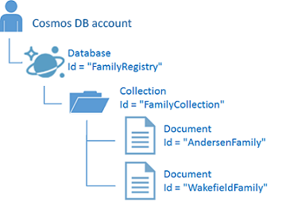
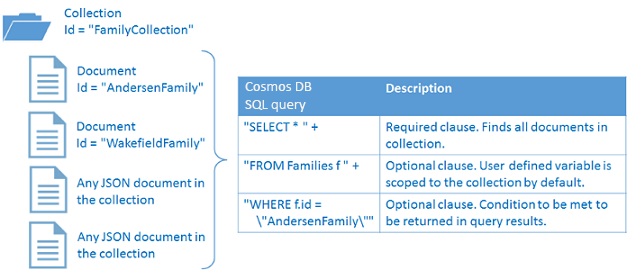

<properties
	pageTitle="NoSQL tutorial: DocumentDB .NET SDK | Microsoft Azure"
	description="A NoSQL tutorial that creates an online database and C# console application using the DocumentDB .NET SDK. DocumentDB is a NoSQL database for JSON."
	keywords="nosql tutorial, online database, c# console application"
	services="documentdb"
	documentationCenter=".net"
	authors="AndrewHoh"
	manager="jhubbard"
	editor="monicar"/>

<tags
	ms.service="documentdb"
	ms.workload="data-services"
	ms.tgt_pltfrm="na"
	ms.devlang="dotnet"
	ms.topic="hero-article"
	ms.date="03/30/2016"
	ms.author="anhoh"/>

# NoSQL tutorial: Build a DocumentDB C# console application

> [AZURE.SELECTOR]
- [.NET](documentdb-get-started.md)
- [Node.js](documentdb-nodejs-get-started.md)

Welcome to the NoSQL tutorial for the DocumentDB .NET SDK! After following this tutorial, you'll have a console application that creates and queries DocumentDB resources.

We'll cover:

- Creating and connecting to a DocumentDB account
- Configuring your Visual Studio Solution
- Creating an online database
- Creating a collection
- Creating JSON documents
- Querying the collection
- Deleting the database

Don't have time? Don't worry! The complete solution is available on [GitHub](https://github.com/Azure-Samples/documentdb-dotnet-getting-started). See [Get the complete solution](#GetSolution) for quick instructions.

Afterwards, please use the voting buttons at the top or bottom of this page to give us feedback. If you'd like us to contact you directly, feel free to include your email address in your comments.

Now let's get started!

## Prerequisites

Please make sure you have the following:

- An active Azure account. If you don't have one, you can sign up for a [Free Trial](https://azure.microsoft.com/pricing/free-trial/).
- [Visual Studio 2013 / Visual Studio 2015](http://www.visualstudio.com/).

## Step 1: Create a DocumentDB account

Let's create a DocumentDB account. If you already have an account you want to use, you can skip ahead to [Setup your Visual Studio Solution](#SetupVS).

[AZURE.INCLUDE [documentdb-create-dbaccount](../../includes/documentdb-create-dbaccount.md)]

## Step 2: Setup your Visual Studio solution

1. Open **Visual Studio** on your computer.
2. On the **File** menu, select **New**, and then choose **Project**.
3. In the **New Project** dialog, select **Templates** / **Visual C#** / **Console Application**, name your project, and then click **OK**.
4. In the **Solution Explorer**, right click on your new console application, which is under your Visual Studio solution.
5. Then without leaving the menu, click on **Manage NuGet Packages...**
6. On the left most panel of the **Manage NuGet Packages** window, click **Online** / **nuget.org**.
7. In the **Search Online** input box, search for **DocumentDB Client Library**.
8. Within the results, find **Microsoft Azure DocumentDB Client Library** and click **Install**.  
   The package ID for the DocumentDB Client Library is [Microsoft.Azure.DocumentDB](https://www.nuget.org/packages/Microsoft.Azure.DocumentDB)

Great! Now that we finished the setup, let's start writing some code. You can find a completed code project of this tutorial at [GitHub](https://github.com/Azure-Samples/documentdb-dotnet-getting-started/blob/master/src/Program.cs).

## Step 3: Connect to a DocumentDB account

First, add these references to the beginning of your C# application, in the Program.cs file:

    using Microsoft.Azure.Documents;
    using Microsoft.Azure.Documents.Client;
    using Microsoft.Azure.Documents.Linq;
    using Newtonsoft.Json;

> [AZURE.IMPORTANT] In order to complete this NoSQL tutorial, make sure you add the dependencies above.

Next, save the DocumentDB account endpoint and either the primary or secondary access key, which can be found in the [Azure Portal](https://portal.azure.com).

![Screen shot of the Azure Portal used by the NoSQL tutorial to create a C# console application. Shows a DocumentDB account, with the ACTIVE hub highlighted, the KEYS button highlighted on the DocumentDB account blade, and the URI, PRIMARY KEY and SECONDARY KEY values highlighted on the Keys blade][keys]

    private const string EndpointUrl = "<your endpoint URI>";
    private const string AuthorizationKey = "<your key>";

We'll start the getting started demo application by creating a new instance of the **DocumentClient**. Create a new asynchronous task called **GetStartedDemo** and instantiate our new **DocumentClient**.

	private static async Task GetStartedDemo()
	{
		// Create a new instance of the DocumentClient
		DocumentClient client = new DocumentClient(new Uri(EndpointUrl), AuthorizationKey);
	}

Call your asynchronous task from your **Main** method similar to the code below.

	public static void Main(string[] args)
	{
		try
		{
			GetStartedDemo().Wait();
		}
		catch (Exception e)
		{
			Exception baseException = e.GetBaseException();
			Console.WriteLine("Error: {0}, Message: {1}", e.Message, baseException.Message);
		}
	}

Now that you know how to connect to a DocumentDB account and create an instance of the **DocumentClient** class, let's take a look at working with DocumentDB resources.  

## Step 4: Create an online database
Your DocumentDB [database](documentdb-resources.md#databases) can be created by using the [CreateDatabaseAsync](https://msdn.microsoft.com/library/microsoft.azure.documents.client.documentclient.createdatabaseasync.aspx) method of the **DocumentClient** class. A database is the logical container of JSON document storage partitioned across collections. Create your new database in your **GetStartedDemo** method after your **DocumentClient** creation.

	// Check if the database FamilyDB does not exist
	string databaseName = "FamilyDB";
	
	try
	{
		await this.client.ReadDatabaseAsync(UriFactory.CreateDatabaseUri(familyName));
	}
	catch (DocumentClientException de)
	{
		// If the database does not exist, create a new database
		if (de.StatusCode == HttpStatusCode.NotFound)
		{
			await this.client.CreateDatabaseAsync(new Database { Id = familyName });
			this.WriteToConsoleAndPromptToContinue("Created {0}", databaseName);
		}
		else
		{
			throw;
		}
	}
	
##Step 5: Create a collection  

> [AZURE.WARNING] **CreateDocumentCollectionAsync** will create a new collection with reserved throughput, which has pricing implications. For more details, please visit our [pricing page](https://azure.microsoft.com/pricing/details/documentdb/).

A [collection](documentdb-resources.md#collections) can be created by using the [CreateDocumentCollectionAsync](https://msdn.microsoft.com/library/microsoft.azure.documents.client.documentclient.createdocumentcollectionasync.aspx) method of the **DocumentClient** class. A collection is a container of JSON documents and associated JavaScript application logic. Create a new collection named **FamilyCollection** after your Database creation in the **GetStartedDemo** method.

	string collectionName = "FamilyCollection";
	try
	{
		await this.client.ReadDocumentCollectionAsync(UriFactory.CreateDocumentCollectionUri(databaseName, collectionName));
	}
	catch (DocumentClientException de)
	{
		// If the document collection does not exist, create a new collection
		if (de.StatusCode == HttpStatusCode.NotFound)
		{
			// Configure the collection. Optionally, you can configure partitioning and indexing behavior of the collection here.
			DocumentCollection collectionInfo = new DocumentCollection();
			collectionInfo.Id = collectionName;

			// DocumentDB collections can be reserved with throughput specified in request units/second. 1 RU is a normalized request equivalent to the read
			// of a 1KB document.  Here we create a collection with 400 RU/s. 
			await this.client.CreateDocumentCollectionAsync(
				UriFactory.CreateDatabaseUri(databaseName),
				new DocumentCollection { Id = collectionName },
				new RequestOptions { OfferThroughput = 400 });

			this.WriteToConsoleAndPromptToContinue("Created {0}", collectionName);
		}
		else
		{
			throw;
		}
	}

##Step 6: Create JSON documents
A [document](documentdb-resources.md#documents) can be created by using the [CreateDocumentAsync](https://msdn.microsoft.com/library/microsoft.azure.documents.client.documentclient.createdocumentasync.aspx) method of the **DocumentClient** class. Documents are user defined (arbitrary) JSON content. We can now insert one or more documents. If you already have data you'd like to store in your database, you can use DocumentDB's [Data Migration tool](documentdb-import-data.md).

First, we need to create a **Family** class that will represent objects stored within DocumentDB in this sample. We will also create **Parent**, **Child**, **Pet**, **Address** subclasses that are used within **Family**. Note that documents must have an **Id** property serialized as **id** in JSON. Create these classes by adding the following internal sub-classes after the **GetStartedDemo** method. 

	public class Family
	{
		[JsonProperty(PropertyName = "id")]
		public string Id { get; set; }
		public string LastName { get; set; }
		string string District { get; set; }
		public Parent[] Parents { get; set; }
		public Child[] Children { get; set; }
		public Address Address { get; set; }
		public bool IsRegistered { get; set; }
	}
	
	public class Parent
	{
		public string FamilyName { get; set; }
		public string FirstName { get; set; }
	}

	public class Child
	{
		public string FamilyName { get; set; }
		public string FirstName { get; set; }
		public string Gender { get; set; }
		public int Grade { get; set; }
		public Pet[] Pets { get; set; }
	}

	public class Pet
	{
		public string GivenName { get; set; }
	}

	public class Address
	{
		public string State { get; set; }
		public string County { get; set; }
		public string City { get; set; }
	}

Next, create your documents within your **GetStartedDemo** async method. First, create a **CreateFamilyDocumentIfNotExists** method as shown below:

	private async Task CreateFamilyDocumentIfNotExists(string databaseName, string collectionName, Family family)
	{
		try
		{
			await this.client.ReadDocumentAsync(UriFactory.CreateDocumentUri(databaseName, collectionName, family.Id));
		}
		catch (DocumentClientException de)
		{
			if (de.StatusCode == HttpStatusCode.NotFound)
			{
				await this.client.CreateDocumentAsync(UriFactory.CreateDocumentCollectionUri(databaseName, collectionName), family);
				this.WriteToConsoleAndPromptToContinue("Created Family {0}", family.Id);
			}
			else
			{
				throw;
			}
		}
	}

And insert two documents, one each for the Andersen Family and the Wakefield Family as shown below:

	// Insert a document, here we create a Family object
	Family andersenFamily = new Family
	{
		Id = "Andersen.1",
		LastName = "Andersen",
		Parents = new Parent[] 
		{
			new Parent { FirstName = "Thomas" },
			new Parent { FirstName = "Mary Kay" }
		},
		Children = new Child[] 
		{
			new Child
			{
				FirstName = "Henriette Thaulow",
				Gender = "female",
				Grade = 5,
				Pets = new Pet[] 
				{
					new Pet { GivenName = "Fluffy" }
				}
			}
		},
		District = "WA5",
		Address = new Address { State = "WA", County = "King", City = "Seattle" },
		IsRegistered = true
	};

	await this.CreateFamilyDocumentIfNotExists("FamilyDB", "FamilyCollection", andersenFamily);

	Family wakefieldFamily = new Family
	{
		Id = "Wakefield.7",
		LastName = "Wakefield",
		Parents = new Parent[]
		{
			new Parent { FamilyName = "Wakefield", FirstName = "Robin" },
			new Parent { FamilyName = "Miller", FirstName = "Ben" }
		},
		Children = new Child[]
		{
			new Child
			{
				FamilyName = "Merriam",
				FirstName = "Jesse",
				Gender = "female",
				Grade = 8,
				Pets = new Pet[]
				{
					new Pet { GivenName = "Goofy" },
					new Pet { GivenName = "Shadow" }
				}
			},
			new Child
			{
				FamilyName = "Miller",
				FirstName = "Lisa",
				Gender = "female",
				Grade = 1
			}
		},
		District = "NY23",
		Address = new Address { State = "NY", County = "Manhattan", City = "NY" },
		IsRegistered = false
	};

	await this.CreateFamilyDocumentIfNotExists("FamilyDB", "FamilyCollection", wakefieldFamily);

You have now created the following database, collection, and documents in your DocumentDB account.

##Step 7: Query DocumentDB resources

DocumentDB supports rich [queries](documentdb-sql-query.md) against JSON documents stored in each collection.  The following sample code shows various queries - using both DocumentDB SQL syntax as well as LINQ - that we can run against the documents we inserted in the previous step. Add these queries to your **GetStartedDemo** async method.

	// Run a simple query via LINQ. DocumentDB indexes all properties, so queries can be completed efficiently and with low latency.
	// Here we find the Andersen family via its LastName
	IQueryable<Family> familyQuery = this.client.CreateDocumentQuery<Family>(
		UriFactory.CreateDocumentCollectionUri(databaseName, collectionName))
		.Where(f => f.LastName == "Andersen");

	// The query is executed synchronously here, but can also be executed asynchronously via the IDocumentQuery<T> interface
	Console.WriteLine("Running LINQ query...");
	foreach (Family family in familyQuery)
	{
			Console.WriteLine("\tRead {0}", family);
	}

	// Now execute the same query via direct SQL
	IQueryable<Family> familyQueryInSql = this.client.CreateDocumentQuery<Family>(
		UriFactory.CreateDocumentCollectionUri(databaseName, collectionName),
		"SELECT * FROM Family WHERE Family.lastName = 'Andersen'");

	Console.WriteLine("Running direct SQL query...");
	foreach (Family family in familyQuery)
	{
		Console.WriteLine("\tRead {0}", family);
	}

The following diagram illustrates how the DocumentDB SQL query syntax is called against the collection you created, and the same logic applies to the LINQ query as well.

The [FROM](documentdb-sql-query.md#from-clause) keyword is optional in the query because DocumentDB queries are already scoped to a single collection. Therefore, "FROM Families f" can be swapped with "FROM root r", or any other variable name you choose. DocumentDB will infer that Families, root, or the variable name you chose, reference the current collection by default.

##Step 8: Delete the online database

Deleting the created database will remove the database and all children resources (collections, documents, etc.). You can delete the database and the document client by adding the following code snippet to the end of your **GetStartedDemo** async method.

	// Clean up/delete the database
	await this.client.DeleteDatabaseAsync(UriFactory.CreateDatabaseUri("FamilyDB"));

##Step 9: Run your C# console application!

You are now ready to run your application. At the end of your **Main** method, add the following line of code, which will let you read the console output before the application finishes running.

	Console.ReadLine();

Now hit F5 in Visual Studio to build the application in debug mode.

You should now see the output of your get started app. The output will show the results of the queries we added and should match the example text below.

	Created FamilyDB
	Press any key to continue ...
	Created FamilyCollection
	Press any key to continue ...
	Created Family Andersen.1
	Press any key to continue ...
	Created Family Wakefield.7
	Press any key to continue ...
	Running LINQ query...
		Read {"id":"Andersen.1","LastName":"Andersen","District":"WA5","Parents":[{"FamilyName":null,"FirstName":"Thomas"},{"FamilyName":null,"FirstName":"Mary Kay"}],"Children":[{"FamilyName":null,"FirstName":"Henriette Thaulow","Gender":"female","Grade":5,"Pets":[{"GivenName":"Fluffy"}]}],"Address":{"State":"WA","County":"King","City":"Seattle"},"IsRegistered":true}
	Running direct SQL query...
		Read {"id":"Andersen.1","LastName":"Andersen","District":"WA5","Parents":[{"FamilyName":null,"FirstName":"Thomas"},{"FamilyName":null,"FirstName":"Mary Kay"}],"Children":[{"FamilyName":null,"FirstName":"Henriette Thaulow","Gender":"female","Grade":5,"Pets":[{"GivenName":"Fluffy"}]}],"Address":{"State":"WA","County":"King","City":"Seattle"},"IsRegistered":true}
	End of demo, press any key to exit.

Congratulations! You've completed this NoSQL tutorial and have a working C# console application!

## Get the complete NoSQL tutorial solution
To build the GetStarted solution that contains all the samples in this article, you will need the following:

-   [DocumentDB account][documentdb-create-account].
-   The [GetStarted](https://github.com/Azure-Samples/documentdb-dotnet-getting-started) solution available on GitHub.

To restore the references to the DocumentDB .NET SDK in Visual Studio, right-click the **GetStarted** solution in Solution Explorer, and then click **Enable NuGet Package Restore**. Next, in the App.config file, update the EndpointUrl and AuthorizationKey values as described in [Connect to a DocumentDB account](#Connect).

## Next steps

-   Want a more complex ASP.NET MVC NoSQL tutorial? See [Build a web application with ASP.NET MVC using DocumentDB](documentdb-dotnet-application.md).
-	Learn how to [monitor a DocumentDB account](documentdb-monitor-accounts.md).
-	Run queries against our sample dataset in the [Query Playground](https://www.documentdb.com/sql/demo).
-	Learn more about the programming model in the Develop section of the [DocumentDB documentation page](https://azure.microsoft.com/documentation/services/documentdb/).

[documentdb-create-account]: documentdb-create-account.md
[documentdb-manage]: documentdb-manage.md
[keys]: media/documentdb-get-started/nosql-tutorial-keys.png
