<properties
	pageTitle="Database migration tool for DocumentDB | Microsoft Azure"
	description="Learn how to use the open source DocumentDB data migration tools to import data to DocumentDB from various sources including MongoDB, SQL Server, Table storage, Amazon DynamoDB, CSV, and JSON files. CSV to JSON conversion."
	keywords="csv to json, database migration tools, convert csv to json" 
	services="documentdb"
	authors="andrewhoh"
	manager="jhubbard"
	editor="monicar"
	documentationCenter=""/>

<tags
	ms.service="documentdb"
	ms.workload="data-services"
	ms.tgt_pltfrm="na"
	ms.devlang="na"
	ms.topic="article"
	ms.date="04/05/2016"
	ms.author="anhoh"/>

# Import data to DocumentDB with the Database Migration tool

This article shows you how to use the open source DocumentDB data migration tool to import data to [Microsoft Azure DocumentDB](https://azure.microsoft.com/services/documentdb/) from various sources, including JSON files, CSV files, SQL, MongoDB, Azure Table storage, Amazon DynamoDB and DocumentDB collections.

After reading this article, you'll be able to answer the following questions:  

-	How can I import JSON file data to DocumentDB?
-	How can I import CSV file data to DocumentDB?
-	How can I import SQL Server data to DocumentDB?
-	How can I import MongoDB data to DocumentDB?
-	How can I import data from Azure Table storage to DocumentDB?
-	How can I import data from Amazon DynamoDB to DocumentDB?
-	How can I import data from HBase to DocumentDB
-	How can I migrate data between DocumentDB collections?

##Prerequisites

Before following the instructions in this article, ensure that you have the following installed:

- [Microsoft .NET Framework 4.51](https://www.microsoft.com/download/developer-tools.aspx) or higher.

##Overview of the DocumentDB Data Migration Tool

The DocumentDB Data Migration tool is an open source solution that imports data to DocumentDB from a variety of sources, including:

- JSON files
- MongoDB
- SQL Server
- CSV files
- Azure Table storage
- Amazon DynamoDB
- HBase
- DocumentDB collections

While the import tool includes a graphical user interface (dtui.exe), it can also be driven from the command line (dt.exe). In fact, there is an option to output the associated command after setting up an import through the UI. Tabular source data (e.g. SQL Server or CSV files) can be transformed such that hierarchical relationships (subdocuments) can be created during import. Keep reading to learn more about source options, sample command lines to import from each source, target options, and viewing import results.

##Installing the DocumentDB Data Migration tool

The migration tool source code is available on GitHub in [this repository](https://github.com/azure/azure-documentdb-datamigrationtool) and a compiled version is available from [Microsoft Download Center](http://www.microsoft.com/downloads/details.aspx?FamilyID=cda7703a-2774-4c07-adcc-ad02ddc1a44d). You may either compile the solution or simply download and extract the compiled version to a directory of your choice. Then run either:

- **Dtui.exe**: Graphical interface version of the tool
- **Dt.exe**: Command-line version of the tool

##Import JSON files

The JSON file source importer option allows you to import one or more single document JSON files or JSON files that each contain an array of JSON documents. When adding folders that contain JSON files to import, you have the option of recursively searching for files in subfolders.

Here are some command line samples to import JSON files:

	#Import a single JSON file
	dt.exe /s:JsonFile /s.Files:.\Sessions.json /t:DocumentDBBulk /t.ConnectionString:"AccountEndpoint=<DocumentDB Endpoint>;AccountKey=<DocumentDB Key>;Database=<DocumentDB Database>;" /t.Collection:Sessions /t.CollectionTier:S3

	#Import a directory of JSON files
	dt.exe /s:JsonFile /s.Files:C:\TESessions\*.json /t:DocumentDBBulk /t.ConnectionString:" AccountEndpoint=<DocumentDB Endpoint>;AccountKey=<DocumentDB Key>;Database=<DocumentDB Database>;" /t.Collection:Sessions /t.CollectionTier:S3

	#Import a directory (including sub-directories) of JSON files
	dt.exe /s:JsonFile /s.Files:C:\LastFMMusic\**\*.json /t:DocumentDBBulk /t.ConnectionString:" AccountEndpoint=<DocumentDB Endpoint>;AccountKey=<DocumentDB Key>;Database=<DocumentDB Database>;" /t.Collection:Music /t.CollectionTier:S3

	#Import a directory (single), directory (recursive), and individual JSON files
	dt.exe /s:JsonFile /s.Files:C:\Tweets\*.*;C:\LargeDocs\**\*.*;C:\TESessions\Session48172.json;C:\TESessions\Session48173.json;C:\TESessions\Session48174.json;C:\TESessions\Session48175.json;C:\TESessions\Session48177.json /t:DocumentDBBulk /t.ConnectionString:"AccountEndpoint=<DocumentDB Endpoint>;AccountKey=<DocumentDB Key>;Database=<DocumentDB Database>;" /t.Collection:subs /t.CollectionTier:S3

	#Import a single JSON file and partition the data across 4 collections
	dt.exe /s:JsonFile /s.Files:D:\\CompanyData\\Companies.json /t:DocumentDBBulk /t.ConnectionString:"AccountEndpoint=<DocumentDB Endpoint>;AccountKey=<DocumentDB Key>;Database=<DocumentDB Database>;" /t.Collection:comp[1-4] /t.PartitionKey:name /t.CollectionTier:S3

##Import from MongoDB

The MongoDB source importer option allows you to import from an individual MongoDB collection and optionally filter documents using a query and/or modify the document structure by using a projection.  

The connection string is in the standard MongoDB format:

	mongodb://<dbuser>:<dbpassword>@<host>:<port>/<database>

> [AZURE.NOTE] Use the Verify command to ensure that the MongoDB instance specified in the connection string field can be accessed.

Enter the name of the collection from which data will be imported. You may optionally specify or provide a file for a query (e.g. {pop: {$gt:5000}}) and/or projection (e.g. {loc:0}) to both filter and shape the data to be imported.

Here are some command line samples to import from MongoDB:

	#Import all documents from a MongoDB collection
	dt.exe /s:MongoDB /s.ConnectionString:mongodb://<dbuser>:<dbpassword>@<host>:<port>/<database> /s.Collection:zips /t:DocumentDBBulk /t.ConnectionString:"AccountEndpoint=<DocumentDB Endpoint>;AccountKey=<DocumentDB Key>;Database=<DocumentDB Database>;" /t.Collection:BulkZips /t.IdField:_id /t.CollectionTier:S3

	#Import documents from a MongoDB collection which match the query and exclude the loc field
	dt.exe /s:MongoDB /s.ConnectionString:mongodb://<dbuser>:<dbpassword>@<host>:<port>/<database> /s.Collection:zips /s.Query:{pop:{$gt:50000}} /s.Projection:{loc:0} /t:DocumentDBBulk /t.ConnectionString:"AccountEndpoint=<DocumentDB Endpoint>;AccountKey=<DocumentDB Key>;Database=<DocumentDB Database>;" /t.Collection:BulkZipsTransform /t.IdField:_id/t.CollectionTier:S3

##Import MongoDB export files

The MongoDB export JSON file source importer option allows you to import one or more JSON files produced from the mongoexport utility.  

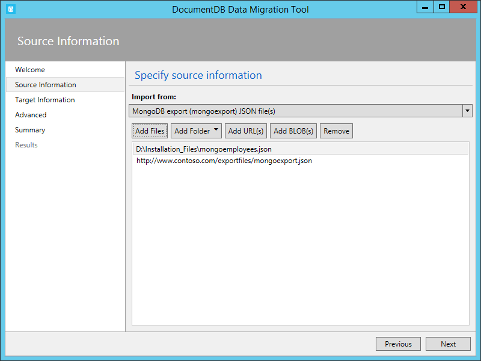

When adding folders that contain MongoDB export JSON files for import, you have the option of recursively searching for files in subfolders.

Here is a command line sample to import from MongoDB export JSON files:

	dt.exe /s:MongoDBExport /s.Files:D:\mongoemployees.json /t:DocumentDBBulk /t.ConnectionString:"AccountEndpoint=<DocumentDB Endpoint>;AccountKey=<DocumentDB Key>;Database=<DocumentDB Database>;" /t.Collection:employees /t.IdField:_id /t.Dates:Epoch /t.CollectionTier:S3

##Import from SQL Server

The SQL source importer option allows you to import from an individual SQL Server database and optionally filter the records to be imported using a query. In addition, you can modify the document structure by specifying a nesting separator (more on that in a moment).  

The format of the connection string is the standard SQL connection string format.

> [AZURE.NOTE] Use the Verify command to ensure that the SQL Server instance specified in the connection string field can be accessed.

The nesting separator property is used to create hierarchical relationships (sub-documents) during import. Consider the following SQL query:

*select CAST(BusinessEntityID AS varchar) as Id, Name, AddressType as [Address.AddressType], AddressLine1 as [Address.AddressLine1], City as [Address.Location.City], StateProvinceName as [Address.Location.StateProvinceName], PostalCode as [Address.PostalCode], CountryRegionName as [Address.CountryRegionName] from Sales.vStoreWithAddresses WHERE AddressType='Main Office'*

Which returns the following (partial) results:

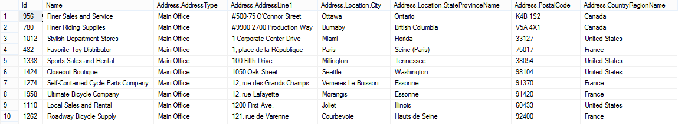

Note the aliases such as Address.AddressType and Address.Location.StateProvinceName. By specifying a nesting separator of ‘.’, the import tool creates Address and Address.Location subdocuments during the import. Here is an example of a resulting document in DocumentDB:

*{
  "id": "956",
  "Name": "Finer Sales and Service",
  "Address": {
    "AddressType": "Main Office",
    "AddressLine1": "#500-75 O'Connor Street",
    "Location": {
      "City": "Ottawa",
      "StateProvinceName": "Ontario"
    },
    "PostalCode": "K4B 1S2",
    "CountryRegionName": "Canada"
  }
}*

Here are some command line samples to import from SQL Server:

	#Import records from SQL which match a query
	dt.exe /s:SQL /s.ConnectionString:"Data Source=<server>;Initial Catalog=AdventureWorks;User Id=advworks;Password=<password>;" /s.Query:"select CAST(BusinessEntityID AS varchar) as Id, * from Sales.vStoreWithAddresses WHERE AddressType='Main Office'" /t:DocumentDBBulk /t.ConnectionString:" AccountEndpoint=<DocumentDB Endpoint>;AccountKey=<DocumentDB Key>;Database=<DocumentDB Database>;" /t.Collection:Stores /t.IdField:Id /t.CollectionTier:S3

	#Import records from sql which match a query and create hierarchical relationships
	dt.exe /s:SQL /s.ConnectionString:"Data Source=<server>;Initial Catalog=AdventureWorks;User Id=advworks;Password=<password>;" /s.Query:"select CAST(BusinessEntityID AS varchar) as Id, Name, AddressType as [Address.AddressType], AddressLine1 as [Address.AddressLine1], City as [Address.Location.City], StateProvinceName as [Address.Location.StateProvinceName], PostalCode as [Address.PostalCode], CountryRegionName as [Address.CountryRegionName] from Sales.vStoreWithAddresses WHERE AddressType='Main Office'" /s.NestingSeparator:. /t:DocumentDBBulk /t.ConnectionString:" AccountEndpoint=<DocumentDB Endpoint>;AccountKey=<DocumentDB Key>;Database=<DocumentDB Database>;" /t.Collection:StoresSub /t.IdField:Id /t.CollectionTier:S3

##Import CSV files - Convert CSV to JSON

The CSV file source importer option enables you to import one or more CSV files. When adding folders that contain CSV files for import, you have the option of recursively searching for files in subfolders.

Similar to the SQL source, the nesting separator property may be used to create hierarchical relationships (sub-documents) during import. Consider the following CSV header row and data rows:

Note the aliases such as DomainInfo.Domain_Name and RedirectInfo.Redirecting. By specifying a nesting separator of ‘.’, the import tool will create DomainInfo and RedirectInfo subdocuments during the import. Here is an example of a resulting document in DocumentDB:

*{
  "DomainInfo": {
    "Domain_Name": "ACUS.GOV",
    "Domain_Name_Address": "http://www.ACUS.GOV"
  },
  "Federal Agency": "Administrative Conference of the United States",
  "RedirectInfo": {
    "Redirecting": "0",
    "Redirect_Destination": ""
  },
  "id": "9cc565c5-ebcd-1c03-ebd3-cc3e2ecd814d"
}*

The import tool will attempt to infer type information for unquoted values in CSV files (quoted values are always treated as strings).  Types are identified in the following order: number, datetime, boolean.  

There are two other things to note about CSV import:

1.	By default, unquoted values are always trimmed for tabs and spaces, while quoted values are preserved as-is. This behavior can be overridden with the Trim quoted values checkbox or the /s.TrimQuoted command line option.

2.	By default, an unquoted null is treated as a null value. This behavior can be overridden (i.e. treat an unquoted null as a “null” string) with the Treat unquoted NULL as string checkbox or the /s.NoUnquotedNulls command line option.

Here is a command line sample for CSV import:

	dt.exe /s:CsvFile /s.Files:.\Employees.csv /t:DocumentDBBulk /t.ConnectionString:"AccountEndpoint=<DocumentDB Endpoint>;AccountKey=<DocumentDB Key>;Database=<DocumentDB Database>;" /t.Collection:Employees /t.IdField:EntityID /t.CollectionTier:S3

##Import from Azure Table storage

The Azure Table storage source importer option allows you to import from an individual Azure Table storage table and optionally filter the table entities to be imported.  

The format of the Azure Table storage connection string is:

	DefaultEndpointsProtocol=<protocol>;AccountName=<Account Name>;AccountKey=<Account Key>;

> [AZURE.NOTE] Use the Verify command to ensure that the Azure Table storage instance specified in the connection string field can be accessed.

Enter the name of the Azure table from which data will be imported. You may optionally specify a [filter](https://msdn.microsoft.com/library/azure/ff683669.aspx).

The Azure Table storage source importer option has the following additional options:

1. Include Internal Fields
	2. All - Include all internal fields (PartitionKey, RowKey, and Timestamp)
	3. None - Exclude all internal fields
	4. RowKey - Only include the RowKey field
3. Select Columns
	1. Azure Table storage filters do not support projections. If you want to only import specific Azure Table entity properties, add them to the Select Columns list. All other entity properties will be ignored.

Here is a command line sample to import from Azure Table storage:

	dt.exe /s:AzureTable /s.ConnectionString:"DefaultEndpointsProtocol=https;AccountName=<Account Name>;AccountKey=<Account Key>" /s.Table:metrics /s.InternalFields:All /s.Filter:"PartitionKey eq 'Partition1' and RowKey gt '00001'" /s.Projection:ObjectCount;ObjectSize  /t:DocumentDBBulk /t.ConnectionString:" AccountEndpoint=<DocumentDB Endpoint>;AccountKey=<DocumentDB Key>;Database=<DocumentDB Database>;" /t.Collection:metrics /t.CollectionTier:S3

##Import from Amazon DynamoDB

The Amazon DynamoDB source importer option allows you to import from an individual Amazon DynamoDB table and optionally filter the entities to be imported. Several templates are provided so that setting up an import is as easy as possible.

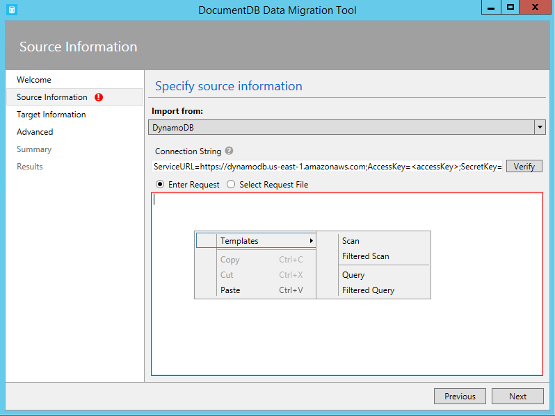

The format of the Amazon DynamoDB connection string is:

	ServiceURL=<Service Address>;AccessKey=<Access Key>;SecretKey=<Secret Key>;

> [AZURE.NOTE] Use the Verify command to ensure that the Amazon DynamoDB instance specified in the connection string field can be accessed.

Here is a command line sample to import from Amazon DynamoDB:

	dt.exe /s:DynamoDB /s.ConnectionString:ServiceURL=https://dynamodb.us-east-1.amazonaws.com;AccessKey=<accessKey>;SecretKey=<secretKey> /s.Request:"{   """TableName""": """ProductCatalog""" }" /t:DocumentDBBulk /t.ConnectionString:"AccountEndpoint=<DocumentDB Endpoint>;AccountKey=<DocumentDB Key>;Database=<DocumentDB Database>;" /t.Collection:catalogCollection /t.CollectionTier:S3

##Import files from Azure Blob storage

The JSON file, MongoDB export file, and CSV file source importer options allow you to import one or more files from Azure Blob storage. After specifying a Blob container URL and Account Key, simply provide a regular expression to select the file(s) to import.

Here is command line sample to import JSON files from Azure Blob storage:

	dt.exe /s:JsonFile /s.Files:"blobs://<account key>@account.blob.core.windows.net:443/importcontainer/.*" /t:DocumentDBBulk /t.ConnectionString:"AccountEndpoint=<DocumentDB Endpoint>;AccountKey=<DocumentDB Key>;Database=<DocumentDB Database>;" /t.Collection:doctest

##Import from DocumentDB

The DocumentDB source importer option allows you to import data from one or more DocumentDB collections and optionally filter documents using a query.  

The format of the DocumentDB connection string is:

	AccountEndpoint=<DocumentDB Endpoint>;AccountKey=<DocumentDB Key>;Database=<DocumentDB Database>;

The DocumentDB account connection string can be retrieved from the Keys blade of the Azure portal, as described in [How to manage a DocumentDB account](documentdb-manage-account.md), however the name of the database needs to be appended to the connection string in the following format:

    Database=<DocumentDB Database>;

> [AZURE.NOTE] Use the Verify command to ensure that the DocumentDB instance specified in the connection string field can be accessed.

To import from a single DocumentDB collection, enter the name of the collection from which data will be imported. To import from multiple DocumentDB collections, provide a regular expression to match one or more collection names (e.g. collection01 | collection02 | collection03). You may optionally specify, or provide a file for, a query to both filter and shape the data to be imported.

> [AZURE.NOTE] Since the collection field accepts regular expressions, if you are importing from a single collection whose name contains regular expression characters, then those characters must be escaped accordingly.

The DocumentDB source importer option has the following advanced options:

1. Include Internal Fields: Specifies whether or not to include DocumentDB document system properties in the export (e.g. _rid, _ts).
2. Number of Retries on Failure: Specifies the number of times to retry the connection to DocumentDB in case of transient failures (e.g. network connectivity interruption).
3. Retry Interval: Specifies how long to wait between retrying the connection to DocumentDB in case of transient failures (e.g. network connectivity interruption).
4. Connection Mode: Specifies the connection mode to use with DocumentDB. The available choices are DirectTcp, DirectHttps, and Gateway. The direct connection modes are faster, while the gateway mode is more firewall friendly as it only uses port 443.

> [AZURE.TIP] The import tool defaults to connection mode DirectTcp. If you experience firewall issues, switch to connection mode Gateway, as it only requires port 443.

Here are some command line samples to import from DocumentDB:

	#Migrate data from one DocumentDB collection to another DocumentDB collections
	dt.exe /s:DocumentDB /s.ConnectionString:"AccountEndpoint=<DocumentDB Endpoint>;AccountKey=<DocumentDB Key>;Database=<DocumentDB Database>;" /s.Collection:TEColl /t:DocumentDBBulk /t.ConnectionString:" AccountEndpoint=<DocumentDB Endpoint>;AccountKey=<DocumentDB Key>;Database=<DocumentDB Database>;" /t.Collection:TESessions /t.CollectionTier:S3

	#Migrate data from multiple DocumentDB collections to a single DocumentDB collection
	dt.exe /s:DocumentDB /s.ConnectionString:"AccountEndpoint=<DocumentDB Endpoint>;AccountKey=<DocumentDB Key>;Database=<DocumentDB Database>;" /s.Collection:comp1|comp2|comp3|comp4 /t:DocumentDBBulk /t.ConnectionString:"AccountEndpoint=<DocumentDB Endpoint>;AccountKey=<DocumentDB Key>;Database=<DocumentDB Database>;" /t.Collection:singleCollection /t.CollectionTier:S3

	#Export a DocumentDB collection to a JSON file
	dt.exe /s:DocumentDB /s.ConnectionString:"AccountEndpoint=<DocumentDB Endpoint>;AccountKey=<DocumentDB Key>;Database=<DocumentDB Database>;" /s.Collection:StoresSub /t:JsonFile /t.File:StoresExport.json /t.Overwrite /t.CollectionTier:S3

##Import from HBase

The HBase source importer option allows you to import data from an HBase table and optionally filter the data. Several templates are provided so that setting up an import is as easy as possible.

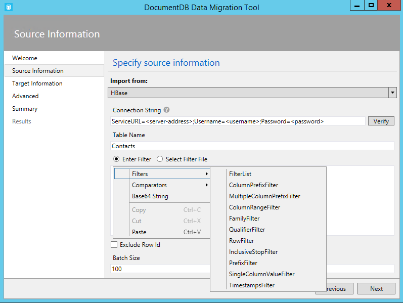

The format of the HBase Stargate connection string is:

	ServiceURL=<server-address>;Username=<username>;Password=<password>

> [AZURE.NOTE] Use the Verify command to ensure that the HBase instance specified in the connection string field can be accessed.

Here is a command line sample to import from HBase:

	dt.exe /s:HBase /s.ConnectionString:ServiceURL=<server-address>;Username=<username>;Password=<password> /s.Table:Contacts /t:DocumentDBBulk /t.ConnectionString:"AccountEndpoint=<DocumentDB Endpoint>;AccountKey=<DocumentDB Key>;Database=<DocumentDB Database>;" /t.Collection:hbaseimport

##Import to DocumentDB (Bulk Import)

The DocumentDB Bulk importer allows you to import from any of the available source options, using a DocumentDB stored procedure for efficiency. The tool supports import to a single DocumentDB collection, as well as sharded import whereby data is partitioned across multiple DocumentDB collections. For more information about partitioning data, see [Partitioning and scaling in Azure DocumentDB](documentdb-partition-data.md). The tool will create, execute, and then delete the stored procedure from the target collection(s).  

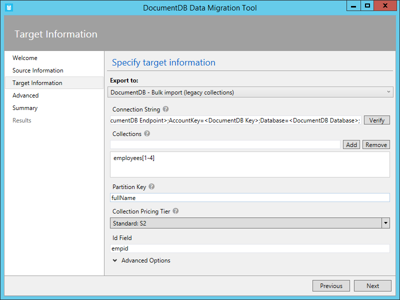

The format of the DocumentDB connection string is:

	AccountEndpoint=<DocumentDB Endpoint>;AccountKey=<DocumentDB Key>;Database=<DocumentDB Database>;

The DocumentDB account connection string can be retrieved from the Keys blade of the Azure portal, as described in [How to manage a DocumentDB account](documentdb-manage-account.md), however the name of the database needs to be appended to the connection string in the following format:

    Database=<DocumentDB Database>;

> [AZURE.NOTE] Use the Verify command to ensure that the DocumentDB instance specified in the connection string field can be accessed.

To import to a single collection, enter the name of the collection to which data will be imported and click the Add button. To import to multiple collections, either enter each collection name individually or use the following syntax to specify multiple collections: *collection_prefix*[start index - end index]. When specifying multiple collections via the aforementioned syntax, keep the following in mind:

1. Only integer range name patterns are supported. For example, specifying collection[0-3] will produce the following collections: collection0, collection1, collection2, collection3.
2. You can use an abbreviated syntax: collection[3] will emit same set of collections mentioned in step 1.
3. More than one substitution can be provided. For example, collection[0-1] [0-9] will generate 20 collection names with leading zeros (collection01, ..02, ..03).

Once the collection name(s) have been specified, choose the desired pricing tier of the collection(s) (S1, S2, or S3). For best import performance, choose S3. For more information about performance levels, see [Performance levels in DocumentDB](documentdb-performance-levels.md).

> [AZURE.NOTE] The performance tier setting only applies to collection creation. If the specified collection already exists, its pricing tier will not be modified.

When importing to multiple collections, the import tool supports hash based sharding. In this scenario, specify the document property you wish to use as the Partition Key (if Partition Key is left blank, documents will be sharded randomly across the target collections).

You may optionally specify which field in the import source should be used as the DocumentDB document id property during the import (note that if documents do not contain this property, then the import tool will generate a GUID as the id property value).

There are a number of advanced options available during import. First, while the tool includes a default bulk import stored procedure (BulkInsert.js), you may choose to specify your own import stored procedure:

 

Additionally, when importing date types (e.g. from SQL Server or MongoDB), you can choose between three import options:

 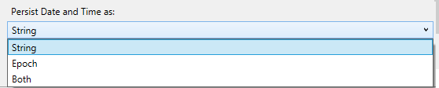

-	String: Persist as a string value
-	Epoch: Persist as an Epoch number value
-	Both: Persist both string and Epoch number values. This option will create a subdocument, for example:
"date_joined": {
    "Value": "2013-10-21T21:17:25.2410000Z",
    "Epoch": 1382390245
  }

The DocumentDB Bulk importer has the following additional advanced options:

1. Batch Size: The tool defaults to a batch size of 50.  If the documents to be imported are large, consider lowering the batch size. Conversely, if the documents to be imported are small, consider raising the batch size.
2. Max Script Size (bytes): The tool defaults to a max script size of 512KB
3. Disable Automatic Id Generation: If every document to be imported contains an id field, then selecting this option can increase performance. Documents missing a unique id field will not be imported.
4. Update Existing Documents: The tool defaults to not replacing existing documents with id conflicts. Selecting this option will allow overwriting existing documents with matching ids. This feature is useful for scheduled data migrations that update existing documents.
5. Number of Retries on Failure: Specifies the number of times to retry the connection to DocumentDB in case of transient failures (e.g. network connectivity interruption).
6. Retry Interval: Specifies how long to wait between retrying the connection to DocumentDB in case of transient failures (e.g. network connectivity interruption).
7. Connection Mode: Specifies the connection mode to use with DocumentDB. The available choices are DirectTcp, DirectHttps, and Gateway. The direct connection modes are faster, while the gateway mode is more firewall friendly as it only uses port 443.

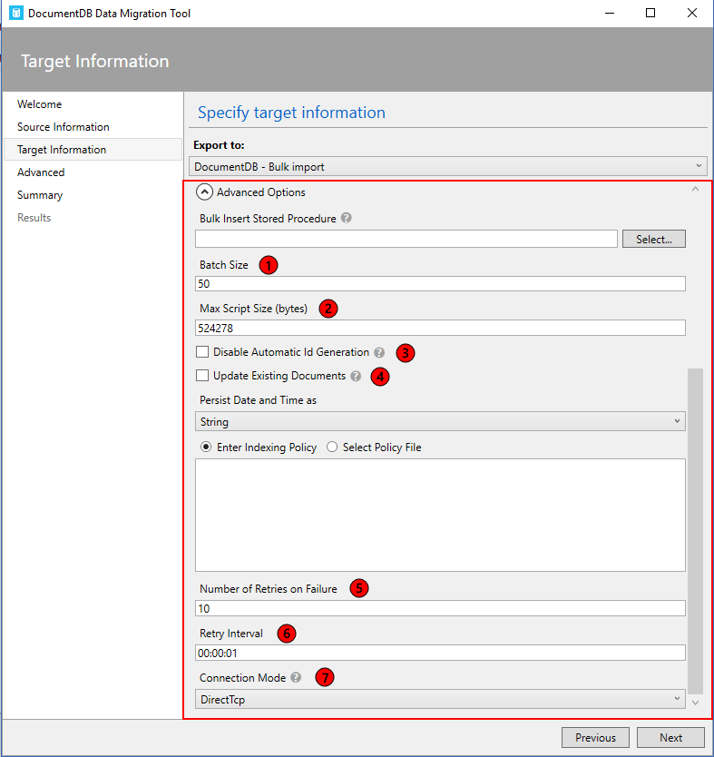

> [AZURE.TIP] The import tool defaults to connection mode DirectTcp. If you experience firewall issues, switch to connection mode Gateway, as it only requires port 443.

##Import to DocumentDB (Sequential Record Import)

The DocumentDB sequential record importer allows you to import from any of the available source options on a record by record basis. You might choose this option if you’re importing to an existing collection that has reached its quota of stored procedures. The tool supports import to a single DocumentDB collection, as well as sharded import whereby data is partitioned across multiple DocumentDB collections. For more information about partitioning data, see [Partitioning and scaling in Azure DocumentDB](documentdb-partition-data.md).

The format of the DocumentDB connection string is:

	AccountEndpoint=<DocumentDB Endpoint>;AccountKey=<DocumentDB Key>;Database=<DocumentDB Database>;

The DocumentDB account connection string can be retrieved from the Keys blade of the Azure portal, as described in [How to manage a DocumentDB account](documentdb-manage-account.md), however the name of the database needs to be appended to the connection string in the following format:

    Database=<DocumentDB Database>;

> [AZURE.NOTE] Use the Verify command to ensure that the DocumentDB instance specified in the connection string field can be accessed.

To import to a single collection, enter the name of the collection to which data will be imported and click the Add button. To import to multiple collections, either enter each collection name individually or use the following syntax to specify multiple collections: *collection_prefix*[start index - end index]. When specifying multiple collections via the aforementioned syntax, keep the following in mind:

1. Only integer range name patterns are supported. For example, specifying collection[0-3] will produce the following collections: collection0, collection1, collection2, collection3.
2. You can use an abbreviated syntax: collection[3] will emit same set of collections mentioned in step 1.
3. More than one substitution can be provided. For example, collection[0-1] [0-9] will generate 20 collection names with leading zeros (collection01, ..02, ..03).

Once the collection name(s) have been specified, choose the desired pricing tier of the collection(s) (S1, S2, or S3). For best import performance, choose S3. For more information about performance levels, see [Performance levels in DocumentDB](documentdb-performance-levels.md).

> [AZURE.NOTE] The performance tier setting only applies to collection creation. If the specified collection already exists, its pricing tier will not be modified.

When importing to multiple collections, the import tool supports hash based sharding. In this scenario, specify the document property you wish to use as the Partition Key (if Partition Key is left blank, documents will be sharded randomly across the target collections).

You may optionally specify which field in the import source should be used as the DocumentDB document id property during the import (note that if documents do not contain this property, then the import tool will generate a GUID as the id property value).

There are a number of advanced options available during import. First, when importing date types (e.g. from SQL Server or MongoDB), you can choose between three import options:

 

-	String: Persist as a string value
-	Epoch: Persist as an Epoch number value
-	Both: Persist both string and Epoch number values. This option will create a subdocument, for example:
"date_joined": {
    "Value": "2013-10-21T21:17:25.2410000Z",
    "Epoch": 1382390245
  }

The DocumentDB - Sequential record importer has the following additional advanced options:

1. Number of Parallel Requests: The tool defaults to 2 parallel requests. If the documents to be imported are small, consider raising the number of parallel requests. Note that if this number is raised too much, the import may experience throttling.
2. Disable Automatic Id Generation: If every document to be imported contains an id field, then selecting this option can increase performance. Documents missing a unique id field will not be imported.
3. Update Existing Documents: The tool defaults to not replacing existing documents with id conflicts. Selecting this option will allow overwriting existing documents with matching ids. This feature is useful for scheduled data migrations that update existing documents.
4. Number of Retries on Failure: Specifies the number of times to retry the connection to DocumentDB in case of transient failures (e.g. network connectivity interruption).
5. Retry Interval: Specifies how long to wait between retrying the connection to DocumentDB in case of transient failures (e.g. network connectivity interruption).
6. Connection Mode: Specifies the connection mode to use with DocumentDB. The available choices are DirectTcp, DirectHttps, and Gateway. The direct connection modes are faster, while the gateway mode is more firewall friendly as it only uses port 443.

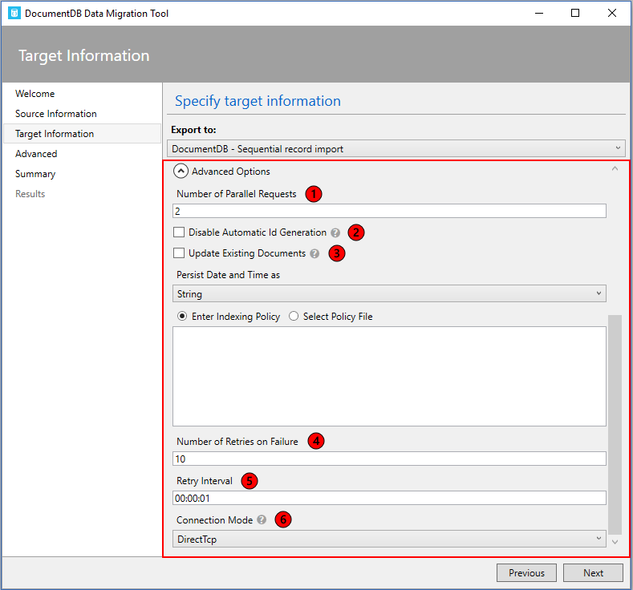

> [AZURE.TIP] The import tool defaults to connection mode DirectTcp. If you experience firewall issues, switch to connection mode Gateway, as it only requires port 443.

##Specify an indexing policy when creating DocumentDB collections

When you allow the migration tool to create collections during import, you can specify the indexing policy of the collections. In the advanced options section of the DocumentDB Bulk import and DocumentDB Sequential record options, navigate to the Indexing Policy section.

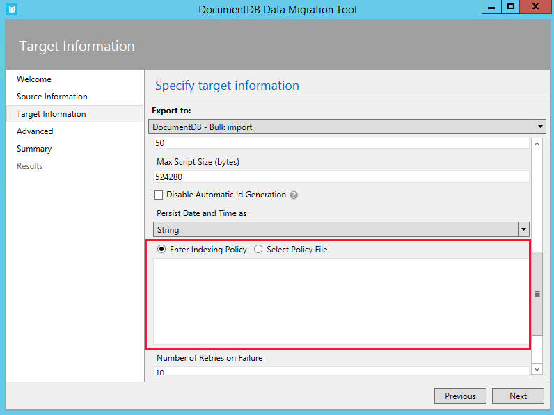

Using the Indexing Policy advanced option, you can select an indexing policy file, manually enter an indexing policy, or select from a set of default templates (by right clicking in the indexing policy textbox).

The policy templates the tool provides are:

- Default. This policy is best when you’re performing equality queries against strings and using ORDER BY, range, and equality queries for numbers. This policy has a lower index storage overhead than Range.
- Range. This policy is best you’re using ORDER BY, range and equality queries on both numbers and strings. This policy has a higher index storage overhead than Default or Hash.

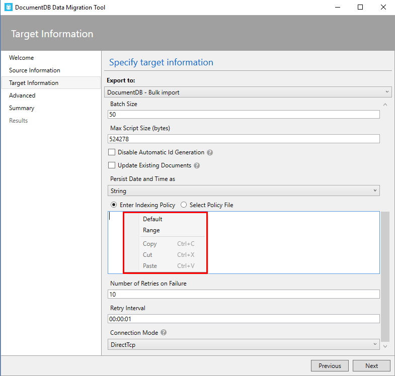

> [AZURE.NOTE] If you do not specify an indexing policy, then the default policy will be applied. For more information about indexing policies, see [DocumentDB indexing policies](documentdb-indexing-policies.md).

## Export to JSON file

The DocumentDB JSON exporter allows you to export any of the available source options to a JSON file that contains an array of JSON documents. The tool will handle the export for you, or you can choose to view the resulting migration command and run the command yourself. The resulting JSON file may be stored locally or in Azure Blob storage.

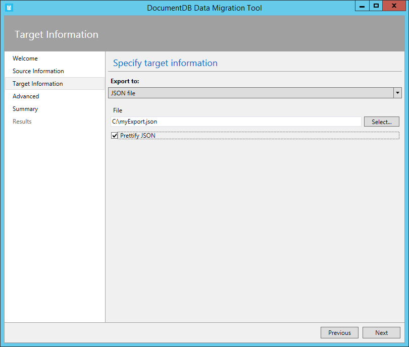

You may optionally choose to prettify the resulting JSON, which will increase the size of the resulting document while making the contents more human readable.

	Standard JSON export
	[{"id":"Sample","Title":"About Paris","Language":{"Name":"English"},"Author":{"Name":"Don","Location":{"City":"Paris","Country":"France"}},"Content":"Don's document in DocumentDB is a valid JSON document as defined by the JSON spec.","PageViews":10000,"Topics":[{"Title":"History of Paris"},{"Title":"Places to see in Paris"}]}]

	Prettified JSON export
	[
 	{
    "id": "Sample",
    "Title": "About Paris",
    "Language": {
      "Name": "English"
    },
    "Author": {
      "Name": "Don",
      "Location": {
        "City": "Paris",
        "Country": "France"
      }
    },
    "Content": "Don's document in DocumentDB is a valid JSON document as defined by the JSON spec.",
    "PageViews": 10000,
    "Topics": [
      {
        "Title": "History of Paris"
      },
      {
        "Title": "Places to see in Paris"
      }
    ]
	}]

## Advanced configuration

In the Advanced configuration screen, specify the location of the log file to which you would like any errors written. The following rules apply to this page:

1.	If a file name is not provided, then all errors will be returned on the Results page.
2.	If a file name is provided without a directory, then the file will be created (or overwritten) in the current environment directory.
3.	If you select an existing file, then the file will be overwritten, there is no append option.

Then, choose whether to log all, critical, or no error messages. Finally, decide how frequently the on screen transfer message will be updated with its progress.

	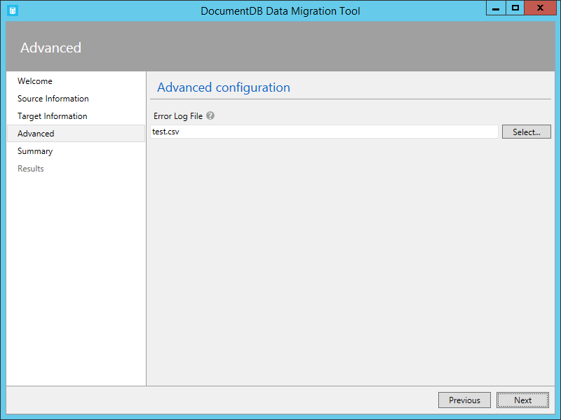

## Confirm import settings and view command line

1. After specifying source information, target information, and advanced configuration, review the migration summary and, optionally, view/copy the resulting migration command (copying the command is useful to automate import operations):

	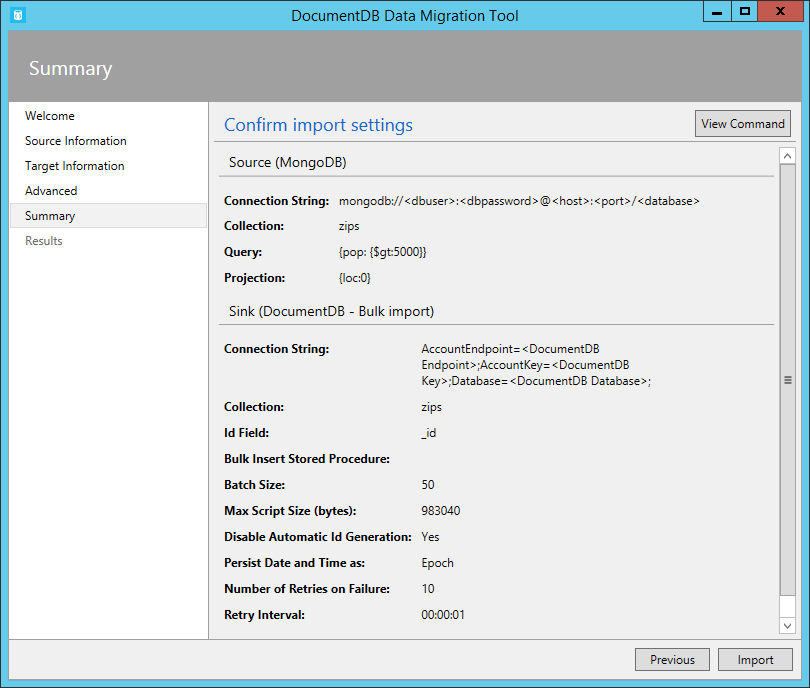

	

2. Once you’re satisfied with your source and target options, click **Import**. The elapsed time, transferred count, and failure information (if you didn't provide a file name in the Advanced configuration) will update as the import is in process. Once complete, you can export the results (e.g. to deal with any import failures).

	

3. You may also start a new import, either keeping the existing settings (e.g. connection string information, source and target choice, etc.) or resetting all values.

	

## Next steps

- To learn more about DocumentDB, see the [Learning Path](https://azure.microsoft.com/documentation/learning-paths/documentdb/).
