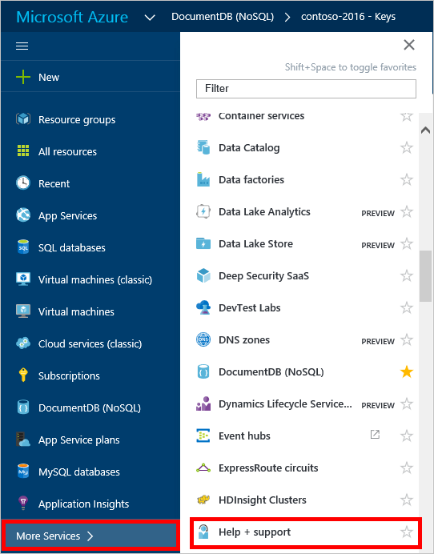
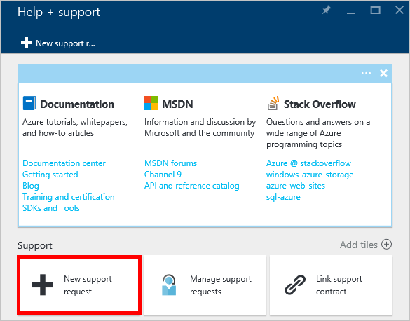
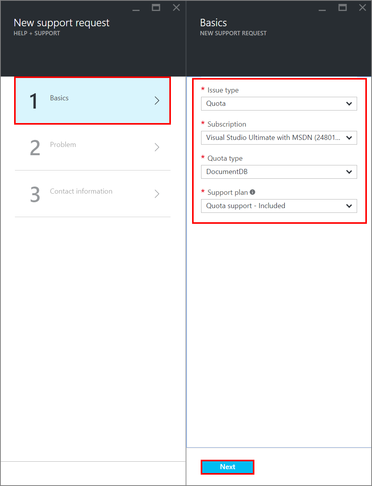
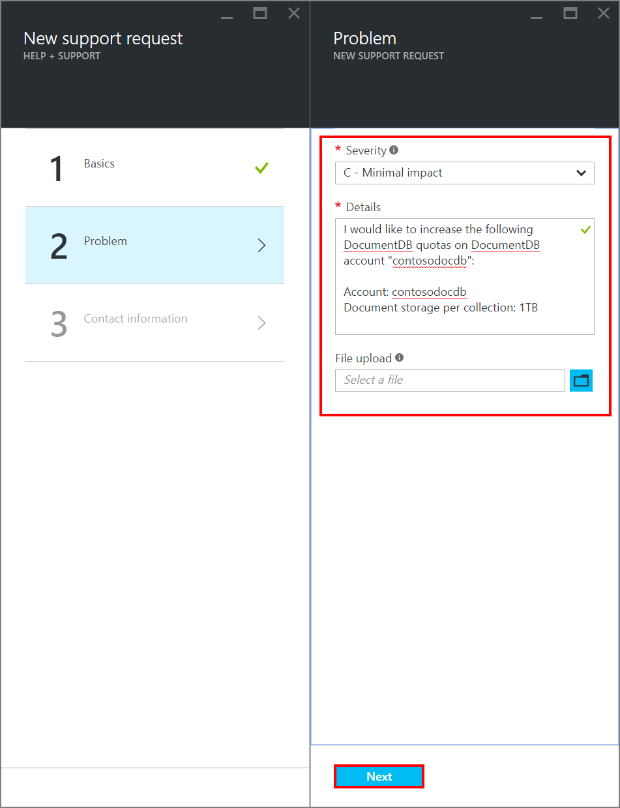
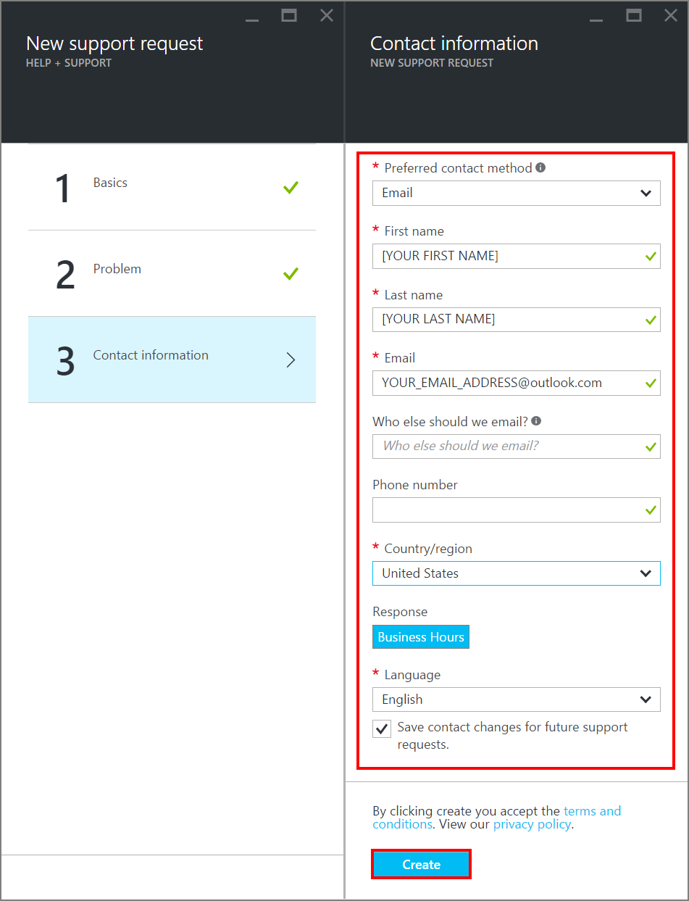
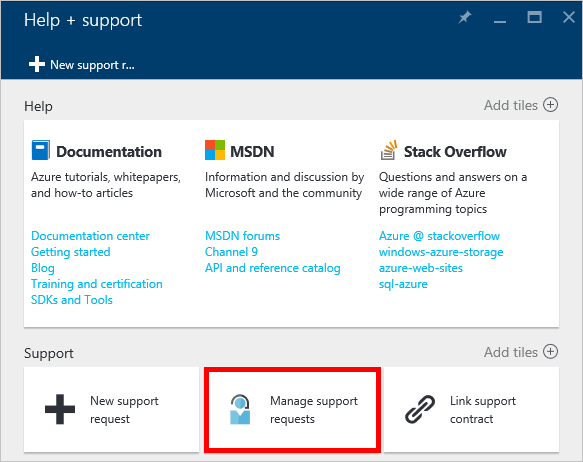

<properties
	pageTitle="Request increased DocumentDB account limits | Microsoft Azure"
	description="Learn how to request an adjustment to DocumentDB limits such as the number of allowed collections, stored procedures and query clauses."
	services="documentdb"
	authors="AndrewHoh"
	manager="jhubbard"
	editor="monicar"
	documentationCenter=""/>

<tags
	ms.service="documentdb"
	ms.workload="data-services"
	ms.tgt_pltfrm="na"
	ms.devlang="na"
	ms.topic="article"
	ms.date="10/22/2015"
	ms.author="anhoh"/>

# Request increased DocumentDB account limits

[Microsoft Azure DocumentDB](https://azure.microsoft.com/services/documentdb/) has a set of default limits and quota enforcements.  Several quotas can be adjusted by contacting Azure support.  This article shows how to request an account limit increase.

After reading this article, you'll be able to answer the following questions:  

-	Which DocumentDB account quotas can be adjusted by contacting Azure support?
-	How can I request a DocumentDB account quota adjustment?

## Adjustable DocumentDB account quotas

The following table describes the DocumentDB quotas that can be adjusted by contacting Azure support:   

|Entity |Quota (Standard Offer)|
|-------|--------|
|Database Accounts     |5
|Number of stored procedures, triggers and UDFs per collection       |25 each
|Maximum collections per database account    |100
|Maximum document storage per database (100 collections)    |1 TB
|Maximum number of UDFs per query     |2
|Maximum number of JOINs per query    |5
|Maximum number of AND clauses per query      |20
|Maximum number of OR clauses per query       |10
|Maximum number of values per IN expression       |100
|Maximum number of points in a polygon argument in a ST_WITHIN query	|16
|Maximum number of collection creates per minute    |5
|Maximum number of scale operations per minute    |5

## Request a quota adjustment
The following steps show how to request a quota adjustment.

1. In the [Azure Preview portal](https://portal.azure.com), click **Browse**, and then click **Help + support**.

	

2. In the **Help + support** blade, click **Get Support**.

	

3. In the **New support request** blade, click **Basics**. Next, set **Issue type** to **Quota**, **Subscription** to your subscription that hosts your DocumentDB account, **Service** to **DocumentDB**, and **Support plan** to **Quota SUPPORT - Included**. Finally, click **Next**.

	

4. In the **Problem** blade, choose a severity. Set **Problem type** to **DocumentDB** and include information about your quota increase in **Details**. Click **Next**.

	

5. Finally, fill in your contact information in the **Contact information** blade.

	

Once the support ticket has been created, you should receive the support request number via email.  You can also view the support request by clicking **Manage support requests** in the **Help + support** blade.

## Next steps
- To learn more about DocumentDB, click [here](http://azure.com/docdb).
