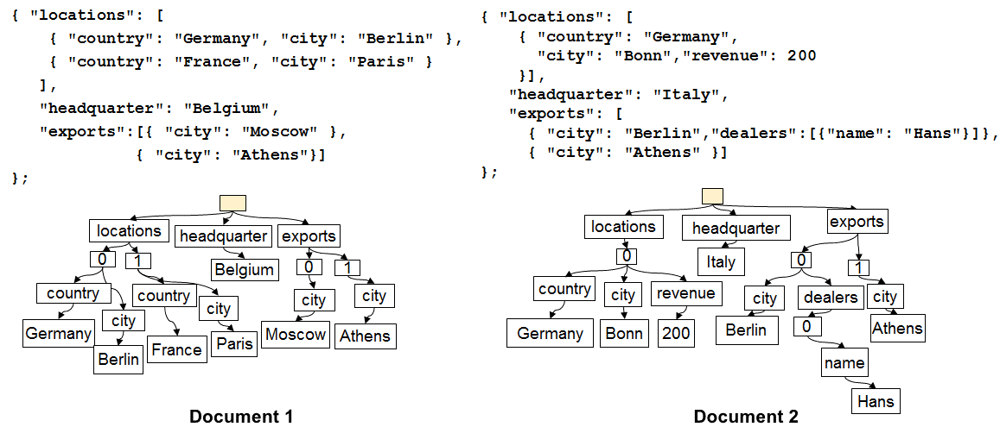
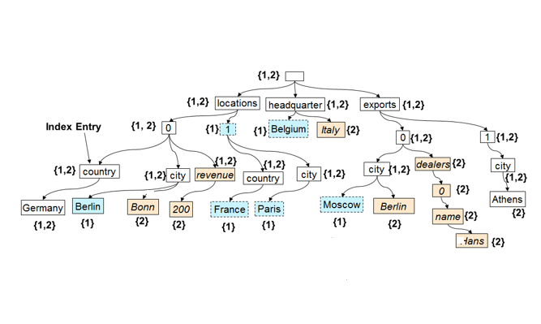

<properties 
	pageTitle="Automatic Indexing in DocumentDB | Azure" 
	description="Learn about how automatic indexing works in Azure DocumentDB." 
	services="documentdb" 
	authors="arramac" 
	manager="johnmac" 
	editor="mimig" 
	documentationCenter=""/>

<tags 
	ms.service="documentdb" 
	ms.workload="data-services" 
	ms.tgt_pltfrm="na" 
	ms.devlang="na" 
	ms.topic="article" 
	ms.date="08/03/2015" 
	ms.author="arramac"/>
	
# DocumentDB Indexing

[Microsoft Azure DocumentDB](http://azure.microsoft.com/services/documentdb/) is a true schema-free database purpose built for JSON. It does not expect or require any schema or secondary index definitions to index data at scale. This allows you to quickly define and iterate on application data models using DocumentDB. As you add documents to a collection, DocumentDB automatically indexes all document properties so they are available for you to query. Automatic indexing allows you to store documents belonging to completely arbitrary schemas without worrying about schemas or secondary indexes.

## How DocumentDB indexing works

With a goal to eliminate the impedance mismatch between the database and the application programming models, DocumentDB exploits the simplicity of JSON and its lack of a schema specification. It makes no assumptions about the documents and allows documents within a DocumentDB collection to vary in schema, in addition to the instance specific values. In contrast to other document databases, DocumentDB’s database engine operates directly at the level of JSON grammar, remaining agnostic to the concept of a document schema and blurring the boundary between the structure and instance values of documents. This, in-turn, enables it to automatically index documents without requiring schema or secondary indexes.

The indexing in DocumentDB takes advantage of the fact that JSON grammar allows documents to be **represented as trees**. For a JSON document to be represented as a tree, a dummy root node needs to be created which parents the rest of the actual nodes in the document underneath. Each label including the array indices in a JSON document becomes a node of the tree. The figure below illustrates an example JSON document and its corresponding tree representation.

***JSON Documents as Trees:***

For example, in the example shown above:
•	The JSON property `{"headquarters": "Belgium"}` property in the above example corresponds to the path/headquarters/Belgium.
•	The JSON array `{"exports": [{"city": “Moscow"}`, `{"city": Athens"}]}` corresponds to the paths `/exports/[]/city/Moscow` and `/exports/[]/city/Athens`.

With automatic indexing, (1) every path in a document tree is indexed (unless the developer has explicitly configured the indexing policy to exclude certain path patterns). (2) Each update of a document to a DocumentDB collection leads to update of the structure of the index (i.e., causes addition or removal of nodes). One of the primary requirements of automatic indexing of documents is to ensure that the cost to index and query a document with deeply nested structure, say 10 levels, is the same as that of a flat JSON document consisting of key-value pairs just one level deep. Therefore a normalized path representation is the foundation upon which both automatic indexing and query subsystems are built.

An important implication of treating both the schema and instance values uniformly in terms of paths is that logically, just like the individual documents, an index of the two documents shown that keeps a map between paths and the document ids containing that path can also be represented as a tree. DocumentDB uses this fact to build an index tree which is constructed out of the union of all of the trees representing individual documents within the collection. The index tree in DocumentDB collections grows over time as new documents get added or updated to the collection.

**DocumentDB Index as a Tree:**

[AZURE.NOTE] The path representation blurs the boundary between the structure/schema and the instance values in documents, allowing DocumentDB to be truly schema-free.

Despite being schema-free, DocumentDB’s SQL and JavaScript query languages provide relational projections and filters, hierarchical navigation across documents, and invocation of UDFs written entirely in JavaScript. The DocumentDB’s query runtime is able to support these queries since it can operate directly against this index tree representation of the data.

The default indexing policy automatically indexes all properties of all documents and provides consistent queries (meaning the index is updated synchronously with the document write). How does DocumentDB support consistent updates to the index tree at scale? DocumentDB uses write optimized, lock free, and log structured index maintenance techniques. This means that DocumentDB can support a sustained volume of fast writes while still serving consistent queries. 

DocumentDB’s indexing is designed for storage efficiency and to handle multi-tenancy. For cost effectiveness, the on-disk storage overhead of the index is low and predictable. Index updates are also performed within the budget of system resources allocated per DocumentDB collection.

## Next steps
- Now that you've seen how indexing works, learn about how to [Query with DocumentDB SQL](documentdb-sql-query.md)
- Learn about how to customize the DocumentDB index [here](documentdb-indexing-policies.md)
 
