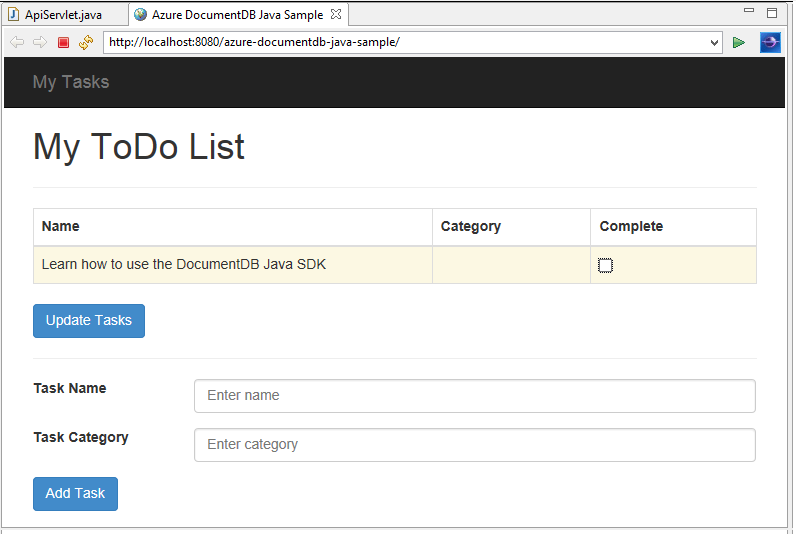
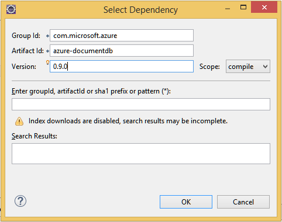

<properties
	pageTitle="Java application development tutorial using DocumentDB | Microsoft Azure"
	description="This Java web application tutorial shows you how to use the Azure DocumentDB service to store and access data from a Java application hosted on Azure Websites."
	keywords="Application development, database tutorial, java application, java web application tutorial, documentdb, azure, Microsoft azure"
	services="documentdb"
	documentationCenter="java"
	authors="AndrewHoh"
	manager="jhubbard"
	editor="mimig"/>

<tags
	ms.service="documentdb"
	ms.devlang="java"
	ms.topic="hero-article"
	ms.tgt_pltfrm="NA"
	ms.workload="data-services"
	ms.date="08/11/2016"
	ms.author="anhoh"/>

# Build a Java web application using DocumentDB

> [AZURE.SELECTOR]
- [.NET](documentdb-dotnet-application.md)
- [Node.js](documentdb-nodejs-application.md)
- [Java](documentdb-java-application.md)
- [Python](documentdb-python-application.md)

This Java web application tutorial shows you how to use the [Microsoft Azure DocumentDB](https://portal.azure.com/#gallery/Microsoft.DocumentDB) service to store and access data from a Java application hosted on Azure Websites. In this topic, you will learn:

- How to build a basic JSP application in Eclipse.
- How to work with the Azure DocumentDB service using the [DocumentDB Java SDK](https://github.com/Azure/azure-documentdb-java).

This Java application tutorial shows you how to create a web-based task-management application that enables you to create, retrieve, and mark tasks as complete, as shown in the following image. Each of the tasks in the ToDo list are stored as JSON documents in Azure DocumentDB.

> [AZURE.TIP] This application development tutorial assumes that you have prior experience using Java. If you are new to Java or the [prerequisite tools](#Prerequisites), we recommend downloading the complete [todo](https://github.com/Azure-Samples/documentdb-java-todo-app) project from GitHub and building it using [the instructions at the end of this article](#GetProject). Once you have it built, you can review the article to gain insight on the code in the context of the project.  

##Prerequisites for this Java web application tutorial
Before you begin this application development tutorial, you must have the following:

- An active Azure account. If you don't have an account, you can create a free trial account in just a couple of minutes. For details, see [Azure Free Trial](https://azure.microsoft.com/pricing/free-trial/).
- [Java Development Kit (JDK) 7+](http://www.oracle.com/technetwork/java/javase/downloads/index.html).
- [Eclipse IDE for Java EE Developers.](http://www.eclipse.org/downloads/packages/eclipse-ide-java-ee-developers/lunasr1)
- [An Azure Website with a Java runtime environment (e.g. Tomcat or Jetty) enabled.](../app-service-web/web-sites-java-get-started.md)

If you're installing these tools for the first time, coreservlets.com provides a walk-through of the installation process in the Quick Start section of their [Tutorial: Installing TomCat7 and Using it with Eclipse](http://www.coreservlets.com/Apache-Tomcat-Tutorial/tomcat-7-with-eclipse.html) article.

##Step 1: Create a DocumentDB database account

Let's start by creating a DocumentDB account. If you already have an account, you can skip to [Step 2: Create the Java JSP application](#CreateJSP).

[AZURE.INCLUDE [documentdb-create-dbaccount](../../includes/documentdb-create-dbaccount.md)]

[AZURE.INCLUDE [documentdb-keys](../../includes/documentdb-keys.md)]

##Step 2: Create the Java JSP application

To create the JSP application:

1. First, we’ll start off by creating a Java project. Start Eclipse, then click **File**, click **New**, and then click **Dynamic Web Project**. If you don’t see **Dynamic Web Project** listed as an available project, do the following: click **File**, click **New**, click **Project**…, expand **Web**, click **Dynamic Web Project**, and click **Next**.

	

2. Enter a project name in the **Project name** box, and in the **Target Runtime** drop-down menu, optionally select a value (e.g. Apache Tomcat v7.0), and then click **Finish**. Selecting a target runtime enables you to run your project locally through Eclipse.
3. In Eclipse, in the Project Explorer view, expand your project. Right-click **WebContent**, click **New**, and then click **JSP File**.
4. In the **New JSP File** dialog box, name the file **index.jsp**. Keep the parent folder as **WebContent**, as shown in the following illustration, and then click **Next**.

	

5. In the **Select JSP Template** dialog box, for the purpose of this tutorial select **New JSP File (html)**, and then click **Finish**.

6. When the index.jsp file opens in Eclipse, add text to display **Hello World!** within the existing <body> element. Your updated <body> content should look like the following code:

	    <body>
	        <% out.println("Hello World!"); %>
	    </body>

8. Save the index.jsp file.
9. If you set a target runtime in step 2, you can click **Project** and then **Run** to run your JSP application locally:

	

##Step 3: Install the DocumentDB Java SDK ##

The easiest way to pull in the DocumentDB Java SDK and its dependencies is through [Apache Maven](http://maven.apache.org/).

To do this, you will need to convert your project to a maven project by completing the following steps:

1. Right-click your project in the Project Explorer, click **Configure**, click **Convert to Maven Project**.
2. In the **Create new POM** window, accept the defaults and click **Finish**.
3. In **Project Explorer**, open the pom.xml file.
4. On the **Dependencies** tab, in the **Dependencies** pane, click **Add**.
4. In the **Select Dependency** window, do the following:
 - In the **GroupId** box, enter com.microsoft.azure.
 - In the **Artifact Id** box enter azure-documentdb.
 - In the **Version** box enter 1.5.1.

	

	Or add the dependency XML for GroupId and ArtifactId directly to the pom.xml via a text editor:

	    <dependency>
		    <groupId>com.microsoft.azure</groupId>
		    <artifactId>azure-documentdb</artifactId>
		    <version>1.5.1</version>
	    </dependency>

5. Click **Ok** and Maven will install the DocumentDB Java SDK.
6. Save the pom.xml file.

##Step 4: Using the DocumentDB service in a Java application

1. First, let's define the TodoItem object:

	    @Data
	    @Builder
	    public class TodoItem {
		    private String category;
		    private boolean complete;
		    private String id;
		    private String name;
	    }

	In this project, we are using [Project Lombok](http://projectlombok.org/) to generate the constructor, getters, setters, and a builder. Alternatively, you can write this code manually or have the IDE generate it.

2. To invoke the DocumentDB service, you must instantiate a new **DocumentClient**. In general, it is best to reuse the **DocumentClient** - rather than construct a new client for each subsequent request. We can reuse the client by wrapping the client in a **DocumentClientFactory**. This is also where you need to paste the URI and PRIMARY KEY value you saved to your clipboard in [step 1](#CreateDB). Replace [YOUR\_ENDPOINT\_HERE] with your URI and replace [YOUR\_KEY\_HERE] with your PRIMARY KEY.

	    private static final String HOST = "[YOUR_ENDPOINT_HERE]";
	    private static final String MASTER_KEY = "[YOUR_KEY_HERE]";

	    private static DocumentClient documentClient;

	    public static DocumentClient getDocumentClient() {
	        if (documentClient == null) {
	            documentClient = new DocumentClient(HOST, MASTER_KEY,
	                    ConnectionPolicy.GetDefault(), ConsistencyLevel.Session);
	        }

	        return documentClient;
	    }

3. Now let's create a Data Access Object (DAO) to abstract persisting our ToDo items to DocumentDB.

	In order to save ToDo items to a collection, the client needs to know which database and collection to persist to (as referenced by self-links). In general, it is best to cache the database and collection when possible to avoid additional round-trips to the database.

	The following code illustrates how to retrieve our database and collection, if it exists, or create a new one if it doesn't exist:

		public class DocDbDao implements TodoDao {
		    // The name of our database.
		    private static final String DATABASE_ID = "TodoDB";

		    // The name of our collection.
		    private static final String COLLECTION_ID = "TodoCollection";

		    // The DocumentDB Client
		    private static DocumentClient documentClient = DocumentClientFactory
		            .getDocumentClient();

		    // Cache for the database object, so we don't have to query for it to
		    // retrieve self links.
		    private static Database databaseCache;

		    // Cache for the collection object, so we don't have to query for it to
		    // retrieve self links.
		    private static DocumentCollection collectionCache;

		    private Database getTodoDatabase() {
		        if (databaseCache == null) {
		            // Get the database if it exists
		            List<Database> databaseList = documentClient
		                    .queryDatabases(
		                            "SELECT * FROM root r WHERE r.id='" + DATABASE_ID
		                                    + "'", null).getQueryIterable().toList();

		            if (databaseList.size() > 0) {
		                // Cache the database object so we won't have to query for it
		                // later to retrieve the selfLink.
		                databaseCache = databaseList.get(0);
		            } else {
		                // Create the database if it doesn't exist.
		                try {
		                    Database databaseDefinition = new Database();
		                    databaseDefinition.setId(DATABASE_ID);

		                    databaseCache = documentClient.createDatabase(
		                            databaseDefinition, null).getResource();
		                } catch (DocumentClientException e) {
		                    // TODO: Something has gone terribly wrong - the app wasn't
		                    // able to query or create the collection.
		                    // Verify your connection, endpoint, and key.
		                    e.printStackTrace();
		                }
		            }
		        }

		        return databaseCache;
		    }

		    private DocumentCollection getTodoCollection() {
		        if (collectionCache == null) {
		            // Get the collection if it exists.
		            List<DocumentCollection> collectionList = documentClient
		                    .queryCollections(
		                            getTodoDatabase().getSelfLink(),
		                            "SELECT * FROM root r WHERE r.id='" + COLLECTION_ID
		                                    + "'", null).getQueryIterable().toList();

		            if (collectionList.size() > 0) {
		                // Cache the collection object so we won't have to query for it
		                // later to retrieve the selfLink.
		                collectionCache = collectionList.get(0);
		            } else {
		                // Create the collection if it doesn't exist.
		                try {
		                    DocumentCollection collectionDefinition = new DocumentCollection();
		                    collectionDefinition.setId(COLLECTION_ID);

		                    // Configure the new collection performance tier to S1.
		                    RequestOptions requestOptions = new RequestOptions();
		                    requestOptions.setOfferType("S1");

		                    collectionCache = documentClient.createCollection(
		                            getTodoDatabase().getSelfLink(),
		                            collectionDefinition, requestOptions).getResource();
		                } catch (DocumentClientException e) {
		                    // TODO: Something has gone terribly wrong - the app wasn't
		                    // able to query or create the collection.
		                    // Verify your connection, endpoint, and key.
		                    e.printStackTrace();
		                }
		            }
		        }

		        return collectionCache;
		    }
		}

4. The next step is to write some code to persist the TodoItems in to the collection. In this example, we will use [Gson](https://code.google.com/p/google-gson/) to serialize and de-serialize TodoItem Plain Old Java Objects (POJOs) to JSON documents. [Jackson](http://jackson.codehaus.org/) or your own custom serializer are also great alternatives for serializing POJOs.

	    // We'll use Gson for POJO <=> JSON serialization for this example.
	    private static Gson gson = new Gson();

	    @Override
	    public TodoItem createTodoItem(TodoItem todoItem) {
	        // Serialize the TodoItem as a JSON Document.
	        Document todoItemDocument = new Document(gson.toJson(todoItem));

	        // Annotate the document as a TodoItem for retrieval (so that we can
	        // store multiple entity types in the collection).
	        todoItemDocument.set("entityType", "todoItem");

	        try {
	            // Persist the document using the DocumentClient.
	            todoItemDocument = documentClient.createDocument(
	                    getTodoCollection().getSelfLink(), todoItemDocument, null,
	                    false).getResource();
	        } catch (DocumentClientException e) {
	            e.printStackTrace();
	            return null;
	        }

	        return gson.fromJson(todoItemDocument.toString(), TodoItem.class);
	    }

5. Like DocumentDB databases and collections, documents are also referenced by self-links. The following helper function lets us retrieve documents by another attribute (e.g. "id") rather than self-link:

	    private Document getDocumentById(String id) {
	        // Retrieve the document using the DocumentClient.
	        List<Document> documentList = documentClient
	                .queryDocuments(getTodoCollection().getSelfLink(),
	                        "SELECT * FROM root r WHERE r.id='" + id + "'", null)
	                .getQueryIterable().toList();

	        if (documentList.size() > 0) {
	            return documentList.get(0);
	        } else {
	            return null;
	        }
	    }

6. We can use the helper method in step 5 to retrieve a TodoItem JSON document by id and then deserialize it to a POJO:

	    @Override
	    public TodoItem readTodoItem(String id) {
	        // Retrieve the document by id using our helper method.
	        Document todoItemDocument = getDocumentById(id);

	        if (todoItemDocument != null) {
	            // De-serialize the document in to a TodoItem.
	            return gson.fromJson(todoItemDocument.toString(), TodoItem.class);
	        } else {
	            return null;
	        }
	    }

7. We can also use the DocumentClient to get a collection or list of TodoItems using DocumentDB SQL:

	    @Override
	    public List<TodoItem> readTodoItems() {
	        List<TodoItem> todoItems = new ArrayList<TodoItem>();

	        // Retrieve the TodoItem documents
	        List<Document> documentList = documentClient
	                .queryDocuments(getTodoCollection().getSelfLink(),
	                        "SELECT * FROM root r WHERE r.entityType = 'todoItem'",
	                        null).getQueryIterable().toList();

	        // De-serialize the documents in to TodoItems.
	        for (Document todoItemDocument : documentList) {
	            todoItems.add(gson.fromJson(todoItemDocument.toString(),
	                    TodoItem.class));
	        }

	        return todoItems;
	    }

8. There are many ways to update a document with the DocumentClient. In our Todo list application, we want to be able to toggle whether a TodoItem is complete. This can be achieved by updating the "complete" attribute within the document:

	    @Override
	    public TodoItem updateTodoItem(String id, boolean isComplete) {
	        // Retrieve the document from the database
	        Document todoItemDocument = getDocumentById(id);

	        // You can update the document as a JSON document directly.
	        // For more complex operations - you could de-serialize the document in
	        // to a POJO, update the POJO, and then re-serialize the POJO back in to
	        // a document.
	        todoItemDocument.set("complete", isComplete);

	        try {
	            // Persist/replace the updated document.
	            todoItemDocument = documentClient.replaceDocument(todoItemDocument,
	                    null).getResource();
	        } catch (DocumentClientException e) {
	            e.printStackTrace();
	            return null;
	        }

	        return gson.fromJson(todoItemDocument.toString(), TodoItem.class);
	    }

9. Finally, we want the ability to delete a TodoItem from our list. To do this, we can use the helper method we wrote earlier to retrieve the self-link and then tell the client to delete it:

	    @Override
	    public boolean deleteTodoItem(String id) {
	        // DocumentDB refers to documents by self link rather than id.

	        // Query for the document to retrieve the self link.
	        Document todoItemDocument = getDocumentById(id);

	        try {
	            // Delete the document by self link.
	            documentClient.deleteDocument(todoItemDocument.getSelfLink(), null);
	        } catch (DocumentClientException e) {
	            e.printStackTrace();
	            return false;
	        }

	        return true;
	    }

##Step 5: Wiring the rest of the of Java application development project together

Now that we've finished the fun bits - all that left is to build a quick user interface and wire it up to our DAO.

1. First, let's start with building a controller to call our DAO:

		public class TodoItemController {
		    public static TodoItemController getInstance() {
		        if (todoItemController == null) {
		            todoItemController = new TodoItemController(TodoDaoFactory.getDao());
		        }
		        return todoItemController;
		    }

		    private static TodoItemController todoItemController;

		    private final TodoDao todoDao;

		    TodoItemController(TodoDao todoDao) {
		        this.todoDao = todoDao;
		    }

		    public TodoItem createTodoItem(@NonNull String name,
		            @NonNull String category, boolean isComplete) {
		        TodoItem todoItem = TodoItem.builder().name(name).category(category)
		                .complete(isComplete).build();
		        return todoDao.createTodoItem(todoItem);
		    }

		    public boolean deleteTodoItem(@NonNull String id) {
		        return todoDao.deleteTodoItem(id);
		    }

		    public TodoItem getTodoItemById(@NonNull String id) {
		        return todoDao.readTodoItem(id);
		    }

		    public List<TodoItem> getTodoItems() {
		        return todoDao.readTodoItems();
		    }

		    public TodoItem updateTodoItem(@NonNull String id, boolean isComplete) {
		        return todoDao.updateTodoItem(id, isComplete);
		    }
		}

	In a more complex application, the controller may house complicated business logic on top of the DAO.

2. Next, we'll create a servlet to route HTTP requests to the controller:

		public class TodoServlet extends HttpServlet {
			// API Keys
			public static final String API_METHOD = "method";

			// API Methods
			public static final String CREATE_TODO_ITEM = "createTodoItem";
			public static final String GET_TODO_ITEMS = "getTodoItems";
			public static final String UPDATE_TODO_ITEM = "updateTodoItem";

			// API Parameters
			public static final String TODO_ITEM_ID = "todoItemId";
			public static final String TODO_ITEM_NAME = "todoItemName";
			public static final String TODO_ITEM_CATEGORY = "todoItemCategory";
			public static final String TODO_ITEM_COMPLETE = "todoItemComplete";

			public static final String MESSAGE_ERROR_INVALID_METHOD = "{'error': 'Invalid method'}";

			private static final long serialVersionUID = 1L;
			private static final Gson gson = new Gson();

			@Override
			protected void doGet(HttpServletRequest request,
					HttpServletResponse response) throws ServletException, IOException {

				String apiResponse = MESSAGE_ERROR_INVALID_METHOD;

				TodoItemController todoItemController = TodoItemController
						.getInstance();

				String id = request.getParameter(TODO_ITEM_ID);
				String name = request.getParameter(TODO_ITEM_NAME);
				String category = request.getParameter(TODO_ITEM_CATEGORY);
				boolean isComplete = StringUtils.equalsIgnoreCase("true",
						request.getParameter(TODO_ITEM_COMPLETE)) ? true : false;

				switch (request.getParameter(API_METHOD)) {
				case CREATE_TODO_ITEM:
					apiResponse = gson.toJson(todoItemController.createTodoItem(name,
							category, isComplete));
					break;
				case GET_TODO_ITEMS:
					apiResponse = gson.toJson(todoItemController.getTodoItems());
					break;
				case UPDATE_TODO_ITEM:
					apiResponse = gson.toJson(todoItemController.updateTodoItem(id,
							isComplete));
					break;
				default:
					break;
				}

				response.getWriter().println(apiResponse);
			}

			@Override
			protected void doPost(HttpServletRequest request,
					HttpServletResponse response) throws ServletException, IOException {
				doGet(request, response);
			}
		}

3. We'll need a Web User Interface to display to the user. Let's re-write the index.jsp we created earlier:

		<html>
		<head>
		  <meta http-equiv="Content-Type" content="text/html; charset=ISO-8859-1">
          <meta http-equiv="X-UA-Compatible" content="IE=edge;" />
		  <title>Azure DocumentDB Java Sample</title>

		  <!-- Bootstrap -->
		  <link href="//ajax.aspnetcdn.com/ajax/bootstrap/3.2.0/css/bootstrap.min.css" rel="stylesheet">

		  
		</head>
		<body>
		  <!-- Nav Bar -->
		  

		    

		      

		        <a class="navbar-brand" href="#">My Tasks</a>
		      

		    

		  

		  <!-- Body -->
		  

		    <h1>My ToDo List</h1>

		    

		    <!-- The ToDo List -->
		    

		      <table class="table table-bordered table-striped" id="todoItems">
		        <thead>
		          <tr>
		            <th>Name</th>
		            <th>Category</th>
		            <th>Complete</th>
		          </tr>
		        </thead>
		        <tbody>
		        </tbody>
		      </table>

		      <!-- Update Button -->
		      

		        <form class="form-horizontal" role="form">
		          <button type="button" class="btn btn-primary">Update Tasks</button>
		        </form>
		      

		    

		    

		    <!-- Item Input Form -->
		    

		      <form class="form-horizontal" role="form">
		        

		          <label for="inputItemName" class="col-sm-2">Task Name</label>
		          

		            <input type="text" class="form-control" id="inputItemName" placeholder="Enter name">
		          

		        

		        

		          <label for="inputItemCategory" class="col-sm-2">Task Category</label>
		          

		            <input type="text" class="form-control" id="inputItemCategory" placeholder="Enter category">
		          

		        

		        <button type="button" class="btn btn-primary">Add Task</button>
		      </form>
		    

		  

		  <!-- Placed at the end of the document so the pages load faster -->
		  
		  
		  
		</body>
		</html>

4. And finally, write some client-side Javascript to tie the web user interface and the servlet together:

		var todoApp = {
		  /*
		   * API methods to call Java backend.
		   */
		  apiEndpoint: "api",

		  createTodoItem: function(name, category, isComplete) {
		    $.post(todoApp.apiEndpoint, {
		        "method": "createTodoItem",
		        "todoItemName": name,
		        "todoItemCategory": category,
		        "todoItemComplete": isComplete
		      },
		      function(data) {
		        var todoItem = data;
		        todoApp.addTodoItemToTable(todoItem.id, todoItem.name, todoItem.category, todoItem.complete);
		      },
		      "json");
		  },

		  getTodoItems: function() {
		    $.post(todoApp.apiEndpoint, {
		        "method": "getTodoItems"
		      },
		      function(data) {
		        var todoItemArr = data;
		        $.each(todoItemArr, function(index, value) {
		          todoApp.addTodoItemToTable(value.id, value.name, value.category, value.complete);
		        });
		      },
		      "json");
		  },

		  updateTodoItem: function(id, isComplete) {
		    $.post(todoApp.apiEndpoint, {
		        "method": "updateTodoItem",
		        "todoItemId": id,
		        "todoItemComplete": isComplete
		      },
		      function(data) {},
		      "json");
		  },

		  /*
		   * UI Methods
		   */
		  addTodoItemToTable: function(id, name, category, isComplete) {
		    var rowColor = isComplete ? "active" : "warning";

		    todoApp.ui_table().append($("<tr>")
		      .append($("<td>").text(name))
		      .append($("<td>").text(category))
		      .append($("<td>")
		        .append($("<input>")
		          .attr("type", "checkbox")
		          .attr("id", id)
		          .attr("checked", isComplete)
		          .attr("class", "isComplete")
		        ))
		      .addClass(rowColor)
		    );
		  },

		  /*
		   * UI Bindings
		   */
		  bindCreateButton: function() {
		    todoApp.ui_createButton().click(function() {
		      todoApp.createTodoItem(todoApp.ui_createNameInput().val(), todoApp.ui_createCategoryInput().val(), false);
		      todoApp.ui_createNameInput().val("");
		      todoApp.ui_createCategoryInput().val("");
		    });
		  },

		  bindUpdateButton: function() {
		    todoApp.ui_updateButton().click(function() {
		      // Disable button temporarily.
		      var myButton = $(this);
		      var originalText = myButton.text();
		      $(this).text("Updating...");
		      $(this).prop("disabled", true);

		      // Call api to update todo items.
		      $.each(todoApp.ui_updateId(), function(index, value) {
		        todoApp.updateTodoItem(value.name, value.value);
		        $(value).remove();
		      });

		      // Re-enable button.
		      setTimeout(function() {
		        myButton.prop("disabled", false);
		        myButton.text(originalText);
		      }, 500);
		    });
		  },

		  bindUpdateCheckboxes: function() {
		    todoApp.ui_table().on("click", ".isComplete", function(event) {
		      var checkboxElement = $(event.currentTarget);
		      var rowElement = $(event.currentTarget).parents('tr');
		      var id = checkboxElement.attr('id');
		      var isComplete = checkboxElement.is(':checked');

		      // Toggle table row color
		      if (isComplete) {
		        rowElement.addClass("active");
		        rowElement.removeClass("warning");
		      } else {
		        rowElement.removeClass("active");
		        rowElement.addClass("warning");
		      }

		      // Update hidden inputs for update panel.
		      todoApp.ui_updateForm().children("input[name='" + id + "']").remove();

		      todoApp.ui_updateForm().append($("<input>")
		        .attr("type", "hidden")
		        .attr("class", "updateComplete")
		        .attr("name", id)
		        .attr("value", isComplete));

		    });
		  },

		  /*
		   * UI Elements
		   */
		  ui_createNameInput: function() {
		    return $(".todoForm #inputItemName");
		  },

		  ui_createCategoryInput: function() {
		    return $(".todoForm #inputItemCategory");
		  },

		  ui_createButton: function() {
		    return $(".todoForm button");
		  },

		  ui_table: function() {
		    return $(".todoList table tbody");
		  },

		  ui_updateButton: function() {
		    return $(".todoUpdatePanel button");
		  },

		  ui_updateForm: function() {
		    return $(".todoUpdatePanel form");
		  },

		  ui_updateId: function() {
		    return $(".todoUpdatePanel .updateComplete");
		  },

		  /*
		   * Install the TodoApp
		   */
		  install: function() {
		    todoApp.bindCreateButton();
		    todoApp.bindUpdateButton();
		    todoApp.bindUpdateCheckboxes();

		    todoApp.getTodoItems();
		  }
		};

		$(document).ready(function() {
		  todoApp.install();
		});

5. Awesome! Now all that's left is to test the application. Run the application locally, and add some Todo items by filling in the item name and category and clicking **Add Task**.

6. Once the item appears, you can update whether it's complete by toggling the checkbox and clicking **Update Tasks**.

##Step 6: Deploy your Java application to Azure Websites

Azure Websites makes deploying Java Applications as simple as exporting your application as a WAR file and either uploading it via source control (e.g. GIT) or FTP.

1. To export your application as a WAR, right-click on your project in **Project Explorer**, click **Export**, and then click **WAR File**.
2. In the **WAR Export** window, do the following:
 - In the Web project box, enter azure-documentdb-java-sample.
 - In the Destination box, choose a destination to save the WAR file.
 - Click **Finish**.

3. Now that you have a WAR file in hand, you can simply upload it to your Azure Website's **webapps** directory. For instructions on uploading the file, see [Adding an application to your Java website on Azure](../app-service-web/web-sites-java-add-app.md).

	Once the WAR file is uploaded to the webapps directory, the runtime environment will detect that you've added it and will automatically load it.
4. To view your finished product, navigate to http://YOUR\_SITE\_NAME.azurewebsites.net/azure-documentdb-java-sample/ and start adding your tasks!

##Get the project from GitHub

All the samples in this tutorial are included in the [todo](https://github.com/Azure-Samples/documentdb-java-todo-app) project on GitHub. To import the todo project into Eclipse, ensure you have the software and resources listed in the [Prerequisites](#Prerequisites) section, then do the following:

1. Install [Project Lombok](http://projectlombok.org/). Lombok is used to generate constructors, getters, setters in the project. Once you have downloaded the lombok.jar file, double-click it to install it or install it from the command line.
2. If Eclipse is open, close it and restart it to load Lombok.
3. In Eclipse, on the **File** menu, click **Import**.
4. In the **Import** window, click **Git**, click **Projects from Git**, and then click **Next**.
5. On the **Select Repository Source** screen, click **Clone URI**.
6. On the **Source Git Repository** screen, in the **URI** box, enter https://github.com/Azure-Samples/documentdb-java-todo-app.git, and then click **Next**.
7. On the **Branch Selection** screen, ensure that **master** is selected, and then click **Next**.
8. On the **Local Destination** screen, click **Browse** to select a folder where the repository can be copied, and then click **Next**.
9. On the **Select a wizard to use for importing projects** screen, ensure that **Import existing projects** is selected, and then click **Next**.
10. On the **Import Projects** screen, unselect the **DocumentDB** project, and then click **Finish**. The DocumentDB project contains the DocumentDB Java SDK, which we will add as a dependency instead.
11. In **Project Explorer**, navigate to azure-documentdb-java-sample\src\com.microsoft.azure.documentdb.sample.dao\DocumentClientFactory.java and replace the HOST and MASTER_KEY values with the URI and PRIMARY KEY for your DocumentDB account, and then save the file. For more information, see [Step 1. Create a DocumentDB database account](#CreateDB).
12. In **Project Explorer**, right click the **azure-documentdb-java-sample**, click **Build Path**, and then click **Configure Build Path**.
13. On the **Java Build Path** screen, in the right pane, select the **Libraries** tab, and then click **Add External JARs**. Navigate to the location of the lombok.jar file, and click **Open**, and then click **OK**.
14. Use step 12 to open the **Properties** window again, and then in the left pane click **Targeted Runtimes**.
15. On the **Targeted Runtimes** screen, click **New**, select **Apache Tomcat v7.0**, and then click **OK**.
16. Use step 12 to open the **Properties** window again, and then in the left pane click **Project Facets**.
17. On the **Project Facets** screen, select **Dynamic Web Module** and **Java**, and then click **OK**.
18. On the **Servers** tab at the bottom of the screen, right-click **Tomcat v7.0 Server at localhost** and then click **Add and Remove**.
19. On the **Add and Remove** window, move **azure-documentdb-java-sample** to the **Configured** box, and then click **Finish**.
20. In the **Server** tab, right-click **Tomcat v7.0 Server at localhost**, and then click **Restart**.
21. In a browser, navigate to http://localhost:8080/azure-documentdb-java-sample/ and start adding to your task list. Note that if you changed your default port values, change 8080 to the value you selected.
22. To deploy your project to an Azure web site, see [Step 6. Deploy your application to Azure Websites](#Deploy).

[1]: media/documentdb-java-application/keys.png
