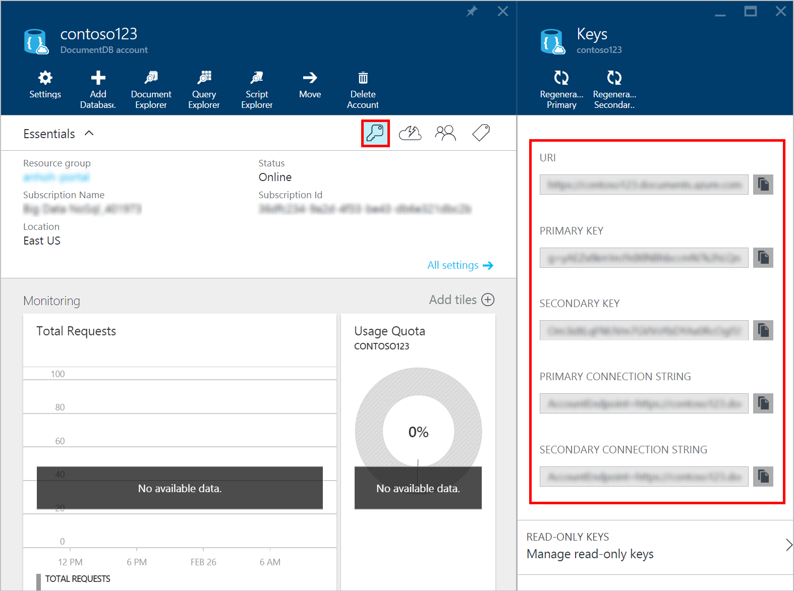
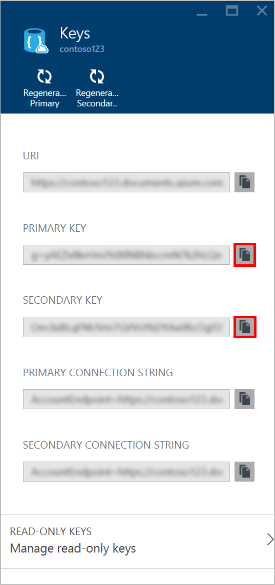
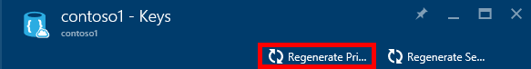
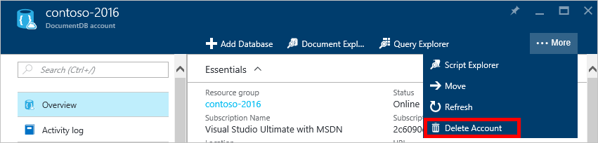

<properties
	pageTitle="Manage a DocumentDB account via the Azure Portal | Microsoft Azure"
	description="Learn how to manage your DocumentDB account via the Azure Portal. Find a guide on using the Azure Portal to view, copy, delete and access accounts."
	keywords="Azure Portal, documentdb, azure, Microsoft azure"
	services="documentdb"
	documentationCenter=""
	authors="AndrewHoh"
	manager="jhubbard"
	editor="cgronlun"/>

<tags
	ms.service="documentdb"
	ms.workload="data-services"
	ms.tgt_pltfrm="na"
	ms.devlang="na"
	ms.topic="article"
	ms.date="08/11/2016"
	ms.author="anhoh"/>

# How to manage a DocumentDB account

Learn how to set global consistency and manage multiple regions for global availability of data in Azure DocumentDB. Also, learn how to work with keys, and how to delete an account in the Azure Portal.

## Manage DocumentDB consistency settings

Selecting the right consistency level depends on the semantics of your application. You should familiarize yourself with the available consistency levels in DocumentDB: [Using consistency levels to maximize availability and performance in DocumentDB] [consistency]. DocumentDB provides consistency, availability and performance guarantees, at every consistency level available for your database account. Configuring your database account with a consistency level of strong requires that your data is confined to a single Azure region and not be globally available. On the other hand, the relaxed consistency levels - bounded staleness, session or eventual enable you to associate any number of Azure regions with your database account. The following simple steps show you how to select the default consistency level for your database account. 

### To specify the default consistency for a DocumentDB account

1. In the [Azure Portal](https://portal.azure.com/), access your DocumentDB account.
2. In the account blade, click **Default Consistency**.
3. In the **Default Consistency** blade, select the new consistency level and click **OK**.
    ![Default consistency session][5]

## Add regions

DocumentDB is available in most [Azure regions] [azureregions]. After selecting the default consistency level for your database account, you can associate one or more regions (depending on your choice of default consistency level and global distribution needs).

> [AZURE.NOTE] Global distribution of DocumentDB databases is generally available and automatically enabled for any newly created DocumentDB accounts. We are working to enable global distribution on all existing accounts, but in the interim, if you want global distribution enabled on your account, please [contact support](https://portal.azure.com/?#blade/Microsoft_Azure_Support/HelpAndSupportBlade) and we’ll enable it for you now. 

1. In the [Azure Portal](https://portal.azure.com/), in the Jumpbar, click **DocumentDB Accounts**.
2. In the **DocumentDB Account** blade, select the database account to modify.
3. In the account blade, if the **All Settings** blade is not already opened, click **All Settings**.
4. In the **All Settings** blade, click on **Add / Remove Regions**.
    ![Add regions under DocumentDB Account > Settings > Add/Remove Regions][1]
5. In the **Add/Remove Regions** blade, select the regions to add or remove, and then click **OK**. There is a cost to adding regions, see the pricing page for more information.

    ![Click on the regions in the map to add or remove them][2]

### Select regions

When configuring two or more regions, it is recommended that regions are selected based on the region pairs described in the [Business continuity and disaster recovery (BCDR): Azure Paired Regions] [bcdr] article.

Specifically, when configuring to multiple regions, make sure to select the same number of regions (+/-1 for odd/even) from each of the paired region columns. For example, if you want to deploy to 4 US regions, you select 2 US regions from the left column and 2 from the right. So, the following would be an appropriate set: West US, East US, North Central US and South Central US.

This guidance is important to follow when only 2 regions are configured for disaster recovery scenarios. For more than 2 regions, following this guidance is good practice, but not critical as long as some of the selected regions adhere to this pairing.

## Select the write region

While all regions associated with your DocumentDB database account can serve reads (both, single item as well as multi-item paginated reads) and queries, only one region can actively receive the write (insert, upsert, replace, delete) requests. To set the active write region, do the following  

1. In the **DocumentDB Account** blade, select the database account to modify.
2. In the account blade, if the **All Settings** blade is not already opened, click **All Settings**.
3. In the **All Settings** blade, click **Write Region Priority**.
    ![Change the write region under DocumentDB Account > Settings > Add/Remove Regions][3]
4. Click and drag regions to order the list of regions. The first region in the list of regions is the active write region.
    ![Change the write region by reordering the region list under DocumentDB Account > Settings > Change Write Regions][4]

## View, copy, and regenerate access keys
When you create a DocumentDB account, the service generates two master access keys that can be used for authentication when the DocumentDB account is accessed. By providing two access keys, DocumentDB enables you to regenerate the keys with no interruption to your DocumentDB account. 

In the [Microsoft Azure Portal](https://portal.azure.com/), access the **Keys** blade from the **DocumentDB Account** blade to view, copy, and regenerate the access keys that are used to access your DocumentDB account.

> [AZURE.NOTE] The **Keys** blade also includes primary and secondary connection strings that can be used to connect to your account from the [Data Migration Tool](documentdb-import-data.md).

Read-only keys are also available on this blade. Reads and queries are read-only operations, while creates, deletes, and replaces are not.

### View and copy an access key in the Azure Portal

On the **Keys** blade, click the **Copy** button to the right of the key you wish to copy.

### Regenerate access keys

You should change the access keys to your DocumentDB account periodically to help keep your connections more secure. Two access keys are assigned to enable you to maintain connections to the DocumentDB account using one access key while you regenerate the other access key.

> [AZURE.WARNING] Regenerating your access keys affects any applications that are dependent on the current key. All clients that use the access key to access the DocumentDB account must be updated to use the new key.

If you have applications or cloud services using the DocumentDB account, you will lose the connections if you regenerate keys, unless you roll your keys. The following steps outline the process involved in rolling your keys.

1. Update the access key in your application code to reference the secondary access key of the DocumentDB account.
2. Regenerate the primary access key for your DocumentDB account. In the [Azure Portal](https://portal.azure.com/),
access your DocumentDB account.
3. In the **DocumentDB Account** blade, click **Keys**.
4. On the **Keys** blade, click the **Regenerate Primary** command, then click **Ok** to confirm that you want to generate a new key.
    

5. Once you have verified that the new key is available for use (approximately 5 minutes after regeneration), update the access key in your application code to reference the new primary access key.
6. Regenerate the secondary access key.
    

> [AZURE.NOTE] It can take several minutes before a newly generated key can be used to access your DocumentDB account.

##  Delete a DocumentDB account
To remove a DocumentDB account from the Azure Portal that you are no longer using, use the **Delete Account** command on the **DocumentDB account** blade.

1. In the [Azure Portal](https://portal.azure.com/), access the DocumentDB Account you wish to delete.
2. On the **DocumentDB account** blade, click **More**, and then click **Delete Account**. Or, right-click the name of the database, and click **Delete Account**.
3. On the resulting confirmation blade, type the DocumentDB Account name to confirm that you want to delete the account.
4. Click the **Delete** button.

## Next steps

Learn how to [get started with your DocumentDB account](http://go.microsoft.com/fwlink/p/?LinkId=402364).

To learn more about DocumentDB, see the Azure DocumentDB documentation on [azure.com](http://go.microsoft.com/fwlink/?LinkID=402319&clcid=0x409).

<!--Image references-->
[1]: ./media/documentdb-manage-account/documentdb_add_region-1.png
[2]: ./media/documentdb-manage-account/documentdb_add_region-2.png
[3]: ./media/documentdb-manage-account/documentdb_change_write_region-1.png
[4]: ./media/documentdb-manage-account/documentdb_change_write_region-2.png
[5]: ./media/documentdb-manage-account/documentdb_change_consistency-1.png
[6]: ./media/documentdb-manage-account/chooseandsaveconsistency.png

<!--Reference style links - using these makes the source content way more readable than using inline links-->
[bcdr]: https://azure.microsoft.com/documentation/articles/best-practices-availability-paired-regions/
[consistency]: https://azure.microsoft.com/documentation/articles/documentdb-consistency-levels/
[azureregions]: https://azure.microsoft.com/en-us/regions/#services
[offers]: https://azure.microsoft.com/en-us/pricing/details/documentdb/
