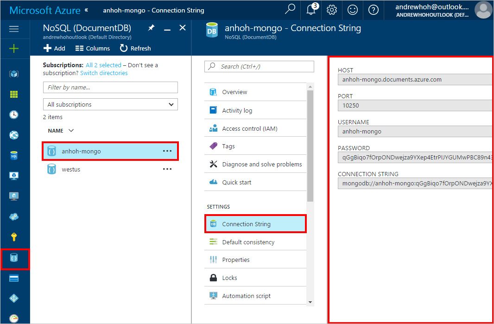

# Azure Cosmos DB: How to import MongoDB data? 

To migrate data from MongoDB to an Azure Cosmos DB account for use with the MongoDB API, you must:

* Download either *mongoimport.exe* or *mongorestore.exe* from the [MongoDB Download Center](https://www.mongodb.com/download-center).
* Get your [API for MongoDB connection string](documentdb-connect-mongodb-account.md).

If you are importing data from MongoDB and plan to use it with the DocumentDB API, you should use the Data Migration Tool to import data. For more information, see [Data Migration Tool](documentdb-import-data.md).

This tutorial covers the following tasks:

> [!div class="checklist"]
> * Retrieving your connection string
> * Importing MongoDB data using mongoimport
> * Importing MongoDB data using mongorestore

## Prerequisites

* Increase throughput: The duration of your data migration depends on the amount of throughput you set up for your collections. Be sure to increase the throughput for larger data migrations. After you've completed the migration, decrease the throughput to save costs. For more information about increasing throughput in the [Azure portal](https://portal.azure.com), see [Performance levels and pricing tiers in Azure Cosmos DB](documentdb-performance-levels.md).

* Enable SSL: Azure Cosmos DB has strict security requirements and standards. Be sure to enable SSL when you interact with your account. The procedures in the rest of the article include how to enable SSL for *mongoimport* and *mongorestore*.

## Find your connection string information (host, port, username, and password)

1. In the [Azure portal](https://portal.azure.com), in the left pane, click the **Azure Cosmos DB** entry.
2. In the **Subscriptions** pane, select your account name.
3. In the **Connection String** blade, click **Connection String**.  
The right pane contains all the information you need to successfully connect to your account.

    

## Import data to API for MongoDB with mongoimport

To import data to your Azure Cosmos DB account, use the following template to execute the import. Fill in *host*, *username*, and *password* with the values that are specific to your account.  

Template:

    mongoimport.exe --host <your_hostname>:10250 -u <your_username> -p <your_password> --db <your_database> --collection <your_collection> --ssl --sslAllowInvalidCertificates --type json --file C:\sample.json

Example:  

    mongoimport.exe --host anhoh-host.documents.azure.com:10250 -u anhoh-host -p tkvaVkp4Nnaoirnouenrgisuner2435qwefBH0z256Na24frio34LNQasfaefarfernoimczciqisAXw== --ssl --sslAllowInvalidCertificates --db sampleDB --collection sampleColl --type json --file C:\Users\anhoh\Desktop\*.json

## Import data to API for MongoDB with mongorestore

To restore data to your API for MongoDB account, use the following template to execute the import. Fill in *host*, *username*, and *password* with the values specific to your account.

Template:

    mongorestore.exe --host <your_hostname>:10250 -u <your_username> -p <your_password> --db <your_database> --collection <your_collection> --ssl --sslAllowInvalidCertificates <path_to_backup>

Example:

    mongorestore.exe --host anhoh-host.documents.azure.com:10250 -u anhoh-host -p tkvaVkp4Nnaoirnouenrgisuner2435qwefBH0z256Na24frio34LNQasfaefarfernoimczciqisAXw== --ssl --sslAllowInvalidCertificates ./dumps/dump-2016-12-07

## Next steps

In this tutorial, you've done the following:

> [!div class="checklist"]
> * Retrieved your connection string
> * Imported MongoDB data using mongoimport
> * Imported MongoDB data using mongorestore

You can now proceed to the next tutorial and learn how to query MongoDB data using Azure Cosmos DB. 

> [!div class="nextstepaction"]
>[How to query MongoDB data?](../cosmos-db/tutorial-query-mongodb.md)
