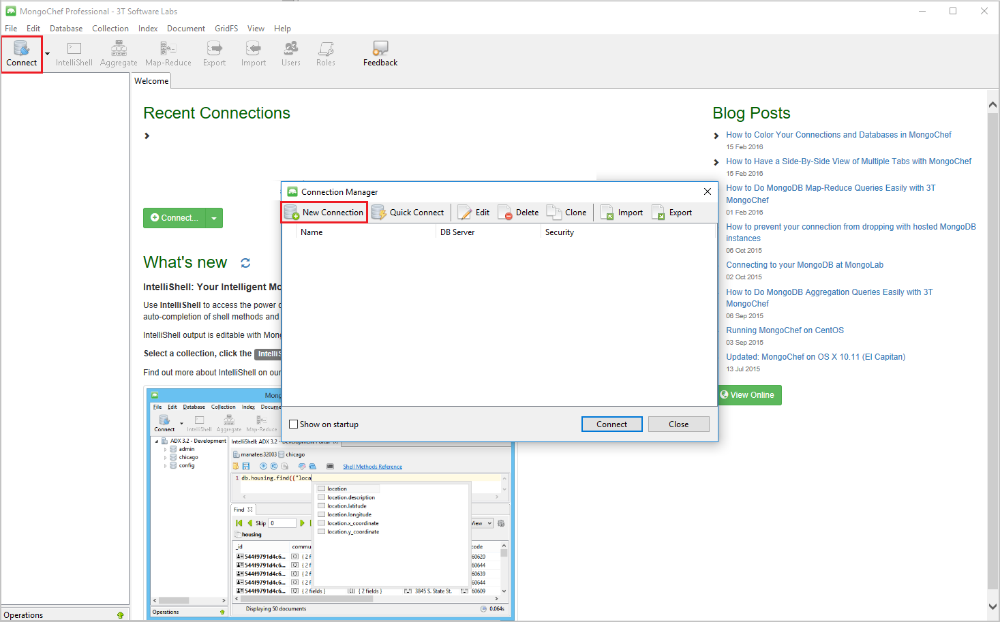
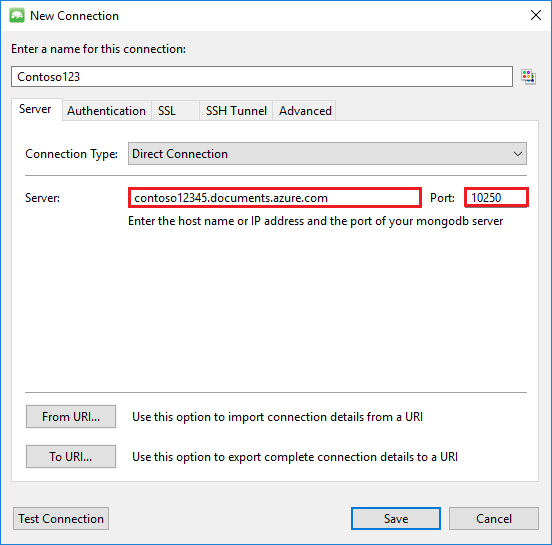
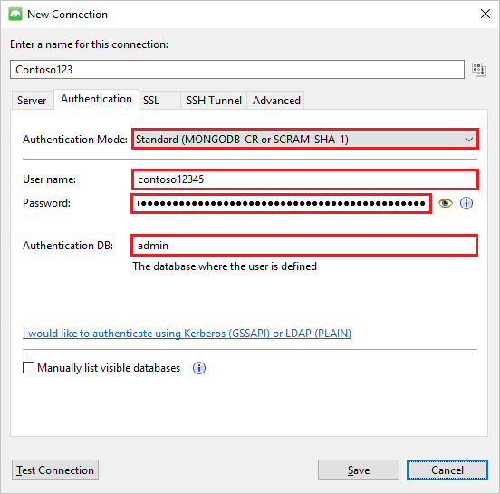
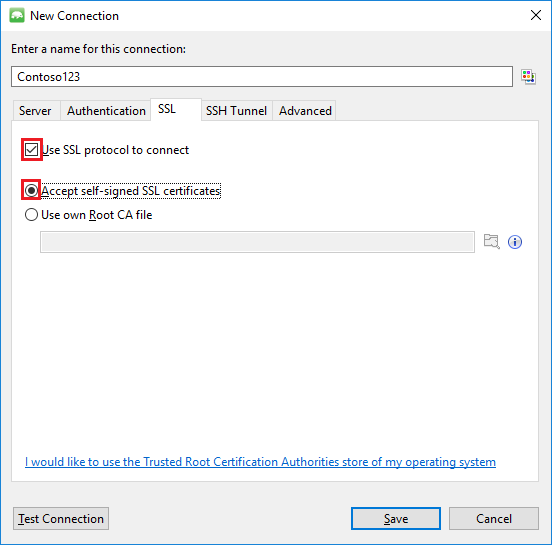
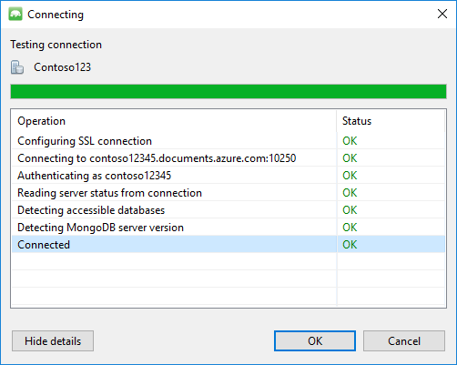
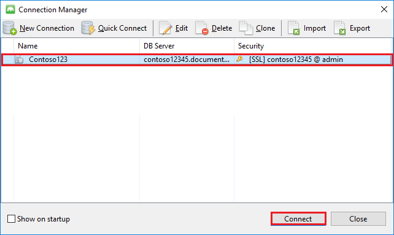
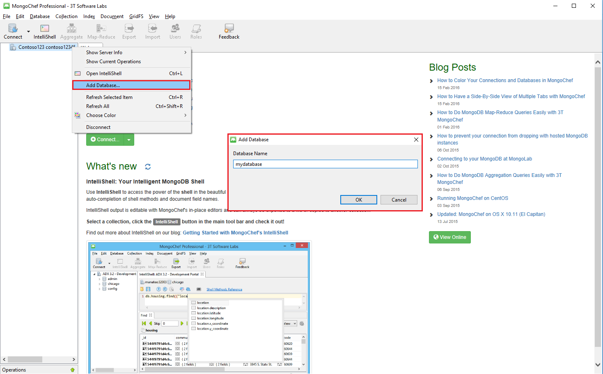
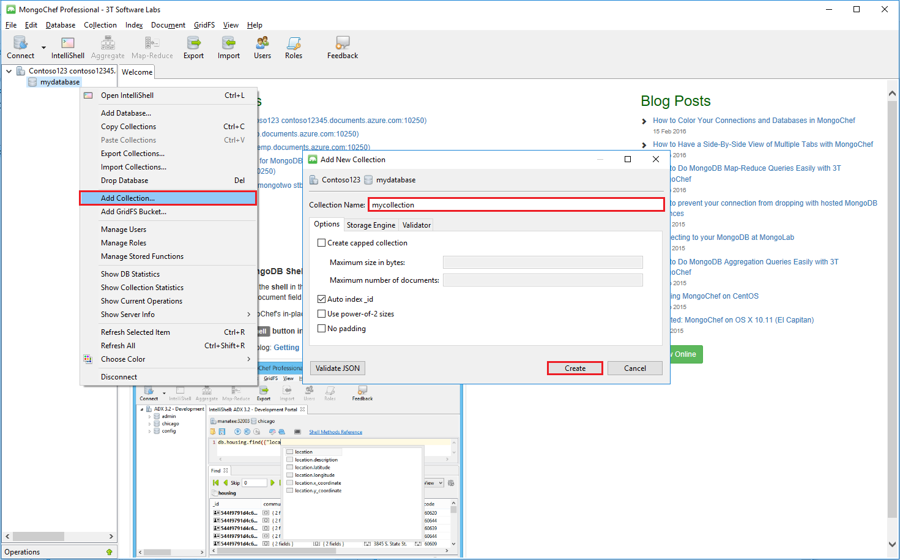
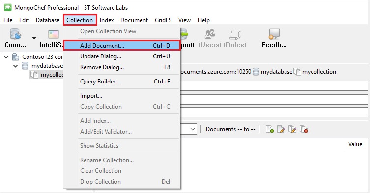

<properties 
	pageTitle="Use MongoChef with a DocumentDB account with protocol support for MongoDB | Microsoft Azure" 
	description="Learn how to use MongoChef with a DocumentDB account with protocol support for MongoDB, now available for preview." 
	keywords="mongochef"
	services="documentdb" 
	authors="stephbaron" 
	manager="jhubbard" 
	editor="" 
	documentationCenter=""/>

<tags 
	ms.service="documentdb" 
	ms.workload="data-services" 
	ms.tgt_pltfrm="na" 
	ms.devlang="na" 
	ms.topic="article" 
	ms.date="06/29/2016" 
	ms.author="stbaro"/>

# Use MongoChef with a DocumentDB account with protocol support for MongoDB

To connect to an Azure DocumentDB account with protocol support for MongoDB using MongoChef, you must:

- Download and install [MongoChef](http://3t.io/mongochef)
- Have your DocumentDB account with protocol support for MongoDB [connection string](documentdb-connect-mongodb-account.md) information

## Create the connection in MongoChef  

To add your DocumentDB account with protocol support for MongoDB to the MongoChef connection manager, perform the following steps.

1. Retrieve your DocumentDB with protocol support for MongoDB connection information using the instructions [here](documentdb-connect-mongodb-account.md).

	

2. Click **Connect** to open the Connection Manager, then click **New Connection**

	
	
2. In the **New Connection** window, on the **Server** tab, enter the HOST (FQDN) of the DocumentDB account with protocol support for MongoDB and the PORT.
	
	

3. In the **New Connection** window, on the **Authentication** tab, choose Authentication Mode **Standard (MONGODB-CR or SCARM-SHA-1)** and enter the USERNAME and PASSWORD.  Accept the default authentication db (admin) or provide your own value.

	

4. In the **New Connection** window, on the **SSL** tab, check the **Use SSL protocol to connect** check box and the **Accept self-signed SSL certificates** radio button.

	

5. Click the **Test Connection** button to validate the connection information, click **OK** to return to the New Connection window, and then click **Save**.

	

## Use MongoChef to create a database, collection, and documents  

To create a database, collection, and documents using MongoChef, perform the following steps.

1. In **Connection Manager**, highlight the connection and click **Connect**.

	

2. Right click the host and choose **Add Database**.  Provide a database name and click **OK**.
	
	

3. Right click the database and choose **Add Collection**.  Provide a collection name and click **Create**.

	

4. Click the **Collection** menu item, then click **Add Document**.

	

5. In the Add Document dialog, paste the following and then click **Add Document**.

		{
    	"_id": "AndersenFamily",
    	"lastName": "Andersen",
    	"parents": [
       		{ "firstName": "Thomas" },
       		{ "firstName": "Mary Kay"}
    	],
    	"children": [
       	{
           	"firstName": "Henriette Thaulow", "gender": "female", "grade": 5,
           	"pets": [{ "givenName": "Fluffy" }]
       	}
    	],
    	"address": { "state": "WA", "county": "King", "city": "seattle" },
    	"isRegistered": true
		}

	
6. Add another document, this time with the following content.

		{
	    "_id": "WakefieldFamily",
	    "parents": [
    	    { "familyName": "Wakefield", "givenName": "Robin" },
        	{ "familyName": "Miller", "givenName": "Ben" }
    	],
    	"children": [
	        {
            	"familyName": "Merriam", 
             	"givenName": "Jesse", 
            	"gender": "female", "grade": 1,
            	"pets": [
	                { "givenName": "Goofy" },
                	{ "givenName": "Shadow" }
            	]
        	},
        	{ 
	            "familyName": "Miller", 
             	"givenName": "Lisa", 
             	"gender": "female", 
             	"grade": 8 }
    	],
    	"address": { "state": "NY", "county": "Manhattan", "city": "NY" },
    	"isRegistered": false
		}

7. Execute a sample query. For example, search for families with the last name 'Andersen' and return the parents and state fields.

	
	

## Next steps

- Explore DocumentDB with protocol support for MongoDB [samples](documentdb-mongodb-samples.md).
- Read about the DocumentDB with protocol support for MongoDB [preview development guidelines](documentdb-mongodb-guidelines.md).

 
