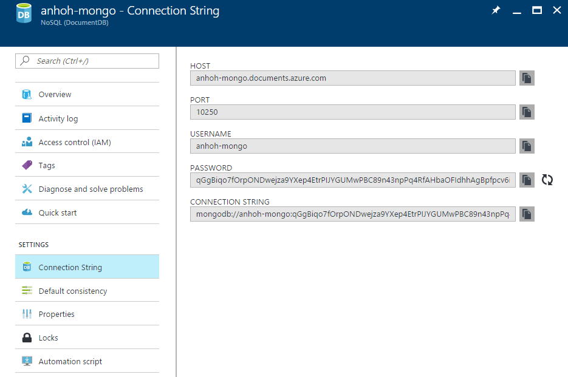
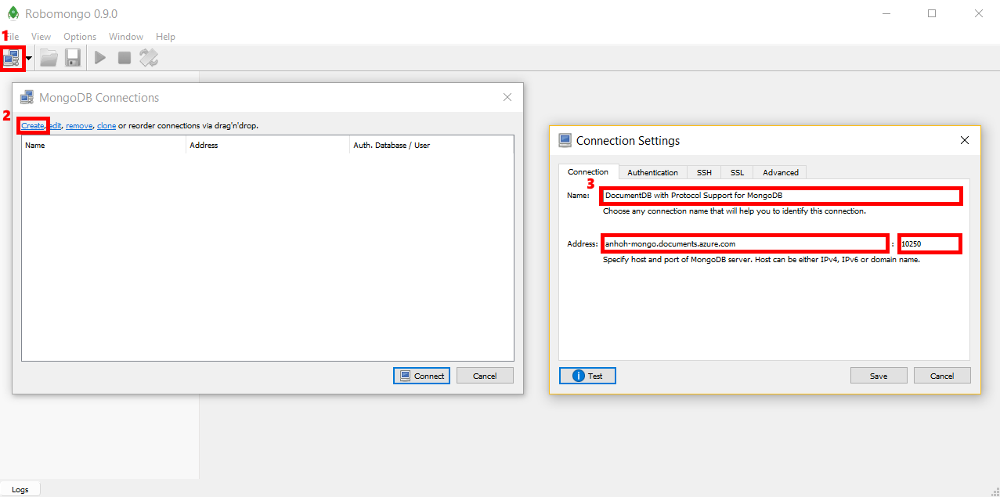
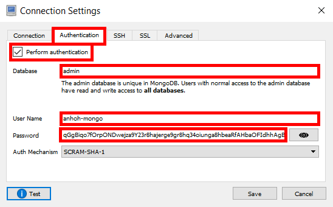
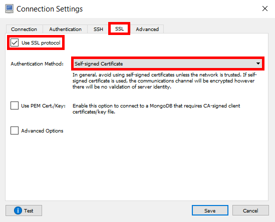

# Use Robomongo with an Azure Cosmos DB: API for MongoDB account
To connect to an Azure Cosmos DB: API for MongoDB account using Robomongo, you must:

* Download and install [Robomongo](https://robomongo.org/)
* Have your Azure Cosmos DB: API for MongoDB account [connection string](documentdb-connect-mongodb-account.md) information

## Connect using Robomongo
To add your Azure Cosmos DB: API for MongoDB account to the Robomongo MongoDB Connections, perform the following steps.

1. Retrieve your Azure Cosmos DB: API for MongoDB account connection information using the instructions [here](documentdb-connect-mongodb-account.md).

    
2. Run *Robomongo.exe*

3. Click the connection button under **File** to manage your connections. Then, click **Create** in the **MongoDB Connections** window, which will open up the **Connection Settings** window.

4. In the **Connection Settings** window, choose a name. Then, find the **Host** and **Port** from your connection information in Step 1 and enter them into **Address** and **Port**, respectively.

    
5. On the **Authentication** tab, click **Perform authentication**. Then, enter your Database (default is *Admin*), **User Name** and **Password**.
Both **User Name** and **Password** can be found in your connection information in Step 1.

    
6. On the **SSL** tab, check **Use SSL protocol**, then change the **Authentication Method** to **Self-signed Certificate**.

    
7. Finally, click **Test** to verify that you are able to connect, then **Save**.

## Next steps
* Explore Azure Cosmos DB: API for MongoDB [samples](documentdb-mongodb-samples.md).
