<properties
	pageTitle="Monitor a DocumentDB account by using the Azure Portal | Microsoft Azure"
	description="Learn how to monitor your DocumentDB account for performance metrics, such as requests and server errors, and usage metrics, such as storage consumption."
	services="documentdb"
	documentationCenter=""
	authors="mimig1"
	manager="jhubbard"
	editor="cgronlun"/>

<tags
	ms.service="documentdb"
	ms.workload="data-services"
	ms.tgt_pltfrm="na"
	ms.devlang="na"
	ms.topic="article"
	ms.date="03/10/2016"
	ms.author="mimig"/>

# Monitor a DocumentDB account usage in the Azure portal

You can monitor your DocumentDB accounts in the [Microsoft Azure Portal](https://portal.azure.com/). For each DocumentDB account, both performance metrics, such as requests and server errors, and usage metrics, such as storage consumption, are available.

## View performance metrics for a DocumentDB account
1.	In the [Azure portal](https://portal.azure.com/), click **Browse**, **DocumentDB Accounts**, and then click the name of the DocumentDB account for which you would like to view performance metrics.
2.	Within the **Monitoring** lens you can, by default, see:
	*	Total requests for the current day.
	*	Storage usage for the account.

	If your table displays **No data available** see the [Troubleshooting](#troubleshooting) section.

	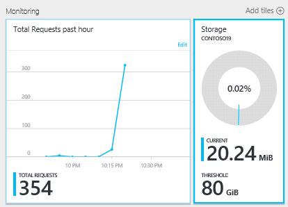

3.	Clicking on the **Total Requests** or **Storage** tile opens a detailed **Metric** blade.
4.	The **Metric** blade shows you details about the metrics you have selected.  At the top of the blade is a graph and below that a table that shows aggregation values of the selected metrics such as average, minimum, maximum, and total.  The metric blade also shows the list of alerts which have been defined, filtered to the metrics that appear on the current metric blade (this way, if you have a number of alerts, you'll only see the relevant ones presented here).   

	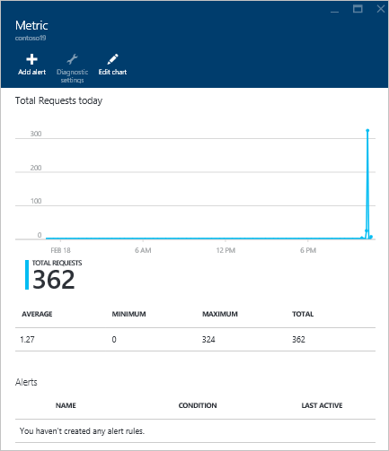

## Customize performance metric views for a DocumentDB account

1.	To customize the metrics that display in a particular part, right-click the metric chart, and then select **Edit Chart**.  
	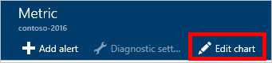

2.	On the **Edit Chart** blade, there are options to modify the metrics that display in the part, as well as their time range.  
	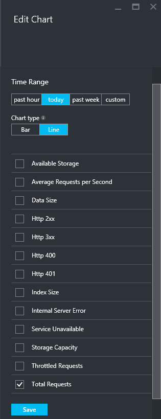

3.	To change the metrics displayed in the part, simply select or clear the available performance metrics, and then click **Save** at the bottom of the blade.  
4.	To change the time range, choose a different range (for example, **Custom**), and then click **Save** at the bottom of the blade.  

	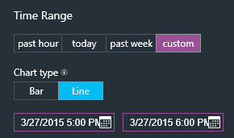

## Create side-by-side performance metric charts
The Azure Portal allows you to create side-by-side metric charts.  

1.	First, right-click on the chart you want to clone and modify and select **Customize**.

	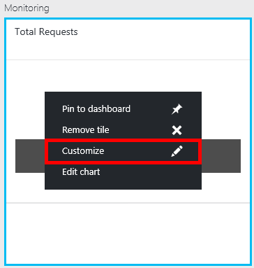

2.	Click **Clone** on the menu to copy the part and then click **Done customizing**.

	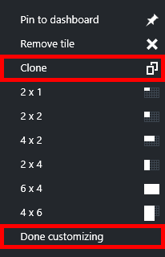  

You may now treat this part as any other metric part, customizing the metrics and time range displayed in the part.  By doing this, you can see two different metrics chart side-by-side at the same time.  
	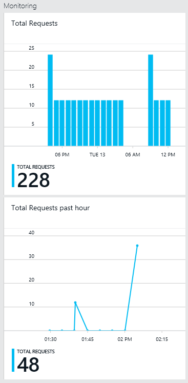  

## Set up performance metric alerts for a DocumentDB account
1.	In the [Azure Portal](https://portal.azure.com/), click **Browse All**, **DocumentDB Accounts**, and then click the name of the DocumentDB account for which you would like to setup performance metric alerts.

2.	If the **All Settings** blade is not open, click the **Settings** Command at the top left to open the blade.
	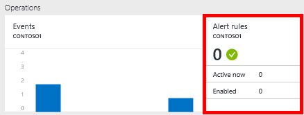

3.	In the **All Settings** blade, click **Alert Rules** to open the Alert rules blade.  
	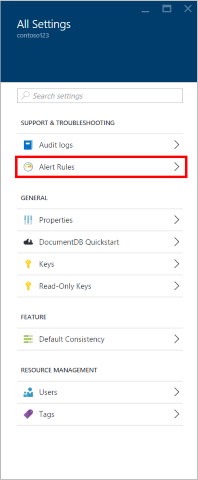

4.	In the Alert rules blade, click **Add alert**.  
	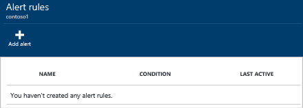

5.	In the **Add an alert rule** blade, specify:
	*	The name of the alert rule you are setting up.
	*	A description of the new alert rule.
	*	The metric for the alert rule.
	*	The condition, threshold, and period that determine when the alert activates. For example, a server error count greater than 5 over the last 15 minutes.
	*	Whether the service administrator and coadministrators are emailed when the alert fires.
	*	Additional email addresses for alert notifications.  
	

## Other ways to monitor DocumentDB
The account level metrics available in the portal, such as account storage usage and total requests, are not available via the DocumentDB APIs. However, you can retrieve usage data at the collection
 level. To retrieve collection level data, do the following:

- To use the REST API, [perform a GET on the collection](https://msdn.microsoft.com/library/mt489073.aspx). The quota and usage information for the collection is returned in the x-ms-resource-quota and x-ms-resource-usage headers in the response.
- To use the .NET SDK, use the [DocumentClient.ReadDocumentCollectionAsync](https://msdn.microsoft.com/library/microsoft.azure.documents.client.documentclient.readdocumentcollectionasync.aspx) method, which returns a [ResourceResponse](https://msdn.microsoft.com/library/dn799209.aspx) that contains a number of usage properties such as **CollectionSizeUsage**, **DatabaseUsage**, **DocumentUsage**, and more.

## Troubleshooting
If your monitoring tiles display the **No data available** message, and you recently made requests or added data to the database, you can edit the tile to reflect the recent usage.

### Edit a tile to refresh current data
1.	To customize the metrics that display in a particular part, right-click the metric chart, and then select **Edit Chart**.  
    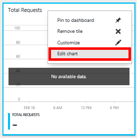

2.	On the **Edit Chart** blade, in the **Time Range** section, click **past hour**, and then click **Save**.  
	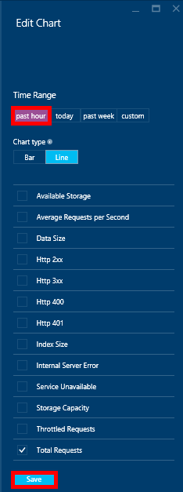

3.	Your tile should now refresh showing your current data and usage.  
	

## Next steps
To learn more about DocumentDB capacity, see [Manage DocumentDB capacity](documentdb-manage.md).
