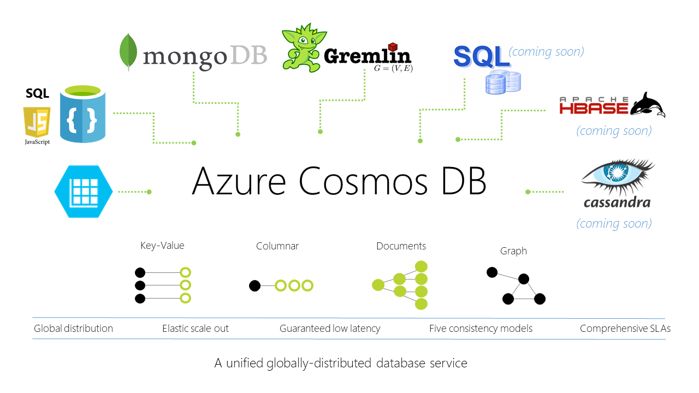

# Introduction to Azure Cosmos DB: Azure's comprehensive database service

## What is Cosmos DB?

Azure Cosmos DB is the next generation of Azure DocumentDB. Cosmos DB was built from 
the ground up with global distribution and horizontal scale at its core – it offers 
turn-key global distribution across any number of Azure regions by transparently 
scaling and replicating your data wherever your users are. You can elastically scale 
throughput and storage worldwide and pay only for the throughput and storage you need. 
Cosmos DB guarantees single-digit millisecond latencies at the 99th percentile anywhere 
in the world, offers multiple well-defined consistency models to fine-tune for performance 
and guaranteed high availability with multi-homing capabilities – all backed by industry 
leading service level agreements (SLAs). 

Cosmos DB is truly schema-agnostic – it automatically indexes all the data without requiring 
you to deal with schema and index management. Cosmos DB is multi-model – it natively 
supports document, key-value, graph and columnar data models. With Cosmos DB, you can 
access your data using NoSQL APIs of your choice -- DocumentDB SQL (document), 
MongoDB (document), Azure Table Storage (key-value), and Gremlin (graph), are all natively 
supported. Cosmos DB is a fully managed, enterprise ready and trustworthy service. 
All your data is fully and transparently encrypted  and secure by default. Cosmos DB is 
ISO, FedRAMP, EU,HIPAA, and PCI compliant as well.  

Cosmos DB now provides multi-model support for the following data models and APIs:

|Data model| APIs supported|
|---|---|
|Key-value (table) data| [Tables API](documentdb-table-introduction.md)|
|Document data|[Native DocumentDB support](documentdb-introduction.md) plus support for [MongoDB APIs](documentdb-protocol-mongodb.md)|
|Graph data|[Gremlin graph APIs](documentdb-graph-introduction.md)|
 
> [!NOTE]
> In addition to the new high performance  Table experience provided by Azure Cosmos DB, 
Azure storage continues to maintain existing Table storage. To work with existing tables 
in Azure Storage, see [Azure Table storage](https://docs.microsoft.com/rest/api/storageservices/fileservices/Table-Service-Concepts). 

## Why use Cosmos DB?

Azure Cosmos DB is known for it's global distribution and ability to add any number of 
regions anywhere in the globe, elastic scale-out of throughput and latency worldwide, 
guaranteed low latency, failover and 99.99% availability, five well-defined consistency 
levels, support for multi-model and any OSS API, and comprehensive SLAs

Azure Cosmos DB provides up to three times better price performance than other managed NoSQL 
database services and has at least 10 times better total cost of ownership (TCO) than operating 
an open source NoSQL database system. With no upfront costs or commitments, customers pay a simple 
hourly charge for reserved throughput provisioned to use for the hour and cold storage pricing for 
the data at rest. As a horizontally partitioned database with automatic geo-replication, 
Azure Cosmos DB can automatically scale throughput from 100’s of requests per second) to millions 
of requests per second, while also scaling storage automatically to Petabytes across all Azure 
regions. With a few clicks in the Azure portal, customers can launch a new Cosmos database, scale 
up or down without downtime or performance degradation, and gain visibility into resource 
utilization and performance metrics. Azure Cosmos DB enables customers to offload the 
administrative burdens of operating and scaling distributed databases so they don’t have to 
worry about hardware provisioning, setup and configuration, replication, software patching, 
partitioning, or cluster scaling. 
 

Azure Cosmos DB is a cloud born distributed database that gives you the best of both worlds – 
the performance characteristics, flexibility and ease of use of popular APIs and open source 
programming model along with enterprise grade availability and durability guarantees and, low 
capital and operational cost of managed cloud databases without any lock-in to the vendor. 
Azure Cosmos DB automatically replicates data across selected Azure regions and is highly available 
(99.99% SLA) and highly performant (P99 reads < 6ms & P99 writes < 10ms), while maintaining 
99.999999% durability guarantee for all data. With security and privacy embedded at the core 
of the platform, Azure Cosmos DB makes security and privacy a priority at each step, from 
development to incident response. All the data stored and accessed as part of Azure Cosmos DB 
is always encrypted at rest and in motion. As a core Azure service, Cosmos DB also provides 
the most comprehensive compliance coverage.  

## What capabilities and key features does Cosmos DB offer?
Azure Cosmos DB offers the following key capabilities and benefits:

* **Global distribution and ability to add any number of regions anywhere in the globe:** 
Cosmos DB transparently replicates your data to all regions you've associated with your Cosmos 
DB account, enabling you to develop applications that require global access to data while providing 
tradeoffs between consistency, availability and performance, all with corresponding guarantees. 
Cosmos DB provides transparent regional failover with multi-homing APIs, and the ability to 
elastically scale throughput and storage across the globe. Learn more in [Distribute data globally with Cosmos DB](documentdb-distribute-data-globally.md).

* **Elastically scalable throughput and storage:** Easily scale up or scale down your Cosmos 
database to meet your application needs. Your data is stored on solid state disks (SSD) for guaranteed 
and predictablelow latencies. Cosmos DB can scale to virtually unlimited storage sizes and provisioned 
throughput. You can elastically scale Cosmos DB with predictable performance seamlessly as your 
application grows. 

* **Guaranteed single-digit-ms latency:** Serve read and write requests from the nearest region 
while simultaneously distributing data across the globe. With its latch-free and write optimized 
database engine, Cosmos DB guarantees less than 10-ms latencies on reads and less than 15-ms 
latencies on (indexed) writes at the 99th percentile. 

* **High Availability and Failovers:** Cosmos DB supports both manual and automatic failovers 
to ensure that Cosmos DB accounts and applications are globally available. By using Azure 
Cosmos DB's global replication support, you can improve end-to-end latency and ensure that your 
applications are highly available even in the event of region failures.

* **Tunable consistency levels:** Select from five well-defined consistency levels to achieve 
optimal trade-off between consistency and performance. For queries and read operations, 
DocumentDB offers five distinct consistency levels: strong, bounded-staleness, session, consistent 
prefix and eventual. These granular, well-defined consistency levels allow you to make sound 
trade-offs between consistency, availability, and latency. Learn more in [Using consistency levels to maximize availability and performance in Cosmos DB](documentdb-consistency-levels.md).

* **No schema or indexes ever needed:** By default, Cosmod DB automatically indexes all the 
data in the database and does not expect or require any schema or creation of secondary indices. 
Don't want to index everything? Don't worry, you can [opt out](documentdb-indexing-policies.md) too.

* **Industry-leading comprehensive SLAs:** Rest assured your apps are running on world-class 
infrastructure, with “battle-tested” service, in the most trusted cloud. Cosmos DB is the first 
and only service to offer industry-leading 99.99% SLAs for latency at the 99th percentile, 
guaranteed throughput, consistency and high availability.

* **Multi-model and Multi-API support:** Only Cosmos DB allows you to use key-value, graph, 
and document data in one service, at global scale and without worrying about schema or index 
management. Cosmos DB automatically indexes all data, and allows you to use your favorite NoSQL 
API including SQL, JavaScript, Gremlin, MongoDB, and Azure Table Storage to query your data.
Because Cosmos DB utilizes a highly concurrent, lock free, log structured indexing technology 
to automatically index all data content. This enables rich real-time queries without the need 
to specify schema hints, secondary indexes, or views. Learn more in [Query Cosmos DB](documentdb-sql-query.md). 

* **Fully managed:** Eliminate the need to manage database and machine resources. As a 
fully-managed Microsoft Azure service, you do not need to manage virtual machines, deploy and 
configure software, manage scaling, or deal with complex data-tier upgrades. Every database is 
automatically backed up and protected against regional failures. You can easily add a Cosmos DB 
account and provision capacity as you need it, allowing you to focus on your application instead 
of operating and managing your database. 

## Battle-tested distributed database technology stack 

Azure Cosmos DB delivers these unprecedented guarantees in the industry, for performance and 
availability by using a fast SSD based latch free database engine co-developed by Microsoft 
Research and leveraging patterns used in some of the largest scale out systems on planet. 
Completely fault tolerant and self-healing, Cosmos DB uses industry leading machine learning 
and high scale infrastructure to automatically monitor and mitigate any issues that could 
impact a customer workload.  

## Flexibility, versatility and ease of use 
Azure Cosmos DB is a comprehensive database service that provides true multi-model support. 
The data store enables high performant Key-Value, Document and Graph database needs for 
Azure customers. Customer scenarios and needs for a scalable and performant database often 
start with simple Key-Value needs, but then as the data grows and new scenario need arises, 
customers often look for other sophisticated capabilities like Documents and  Graph. This 
often results in application re-writes or fragmented application backends - using multipl
databases. With Azure Cosmos DB, customers can just start using a new set of APIs and 
capabilities that are directly integrated with the database and leverage the more advanced 
capabilities for their application without any application re-write or change in their data 
infrastructure.  

With popular open source APIs and frameworks, it is easy for developers to start an application 
and bring it to life. Customers often face challenges when they need to move the application 
into production and issues like scale, cost, availability and maintenance means, these 
applications must wait until the infrastructure is built and secured for the scale needs 
of the application. In a world where applications can go viral in a matter of hours, customers 
cannot easily plan for the challenges ahead. Now, customers can easily lift, and shift applications 
built for popular NoSQL databases like MongoDB to Azure Cosmos DB without having to worry about 
the cost or elastic needs of the application. Also, Cosmos DB provides the MongoDB, graph and tabular 
application the same level of enterprise guarantees for availability, performance, throughput and 
consistency without requiring a single line of application change. 

Azure Cosmos DB brings a highly scalable graph engine, compatible with Apache Gremlin API. 
This native graph engine automatically geo-replicates all the data and is optimized for fast 
traversal of complex graph with over hundreds of billions of vertices and edges. Azure Cosmos DB 
enables high performant graph queries and traversal and the integration with the most popular 
graph query language, Gremlin, can be used to traverse and operate on these graphs, thus providing 
the ease and flexibility already familiar to the developers. Fully integrated graph engine enables 
every application built on Azure Cosmos DB to easily incorporate and leverage graph database 
capabilities for their application. 

## Guaranteed performance at global scale

As a schema-free NoSQL database, Cosmos DB provides rich and familiar SQL query capabilities 
with consistent low latencies on data - ensuring that 99% of your reads are served under 
10 milliseconds and 99% of your writes are served under 15 milliseconds. These unique benefits 
make Cosmos DB a great fit for web, mobile, gaming, and IoT, and many other applications that 
need seamless scale and global replication.

## How can I learn about Cosmos DB?
A quick way to learn about Cosmos DB and see it in action is to follow these three steps: 

1. Watch the two minute [What is Cosmos DB?](https://azure.microsoft.com/documentation/videos/what-is-azure-documentdb/) 
video, which introduces the benefits of using Cosmos DB.
2. Watch the three minute [Create Cosmos database on Azure](https://azure.microsoft.com/documentation/videos/create-documentdb-on-azure/) 
video, which highlights how to get started with Cosmos DB by using the Azure Portal.
3. Visit the [Query Playground](http://www.documentdb.com/sql/demo), where you can walk through 
different activities to learn about the rich DocumentDB API querying functionality (for documents) available in 
Azure Cosmos DB. Then, head over to the Sandbox tab and run your own custom SQL queries and 
experiment with Cosmos DB.

Then, return to this article, where we'll dig in deeper.  

| Download | Documentation |
| --- | --- |
| [.NET SDK](http://go.microsoft.com/fwlink/?LinkID=402989) |[.NET library](https://msdn.microsoft.com/library/azure/dn948556.aspx) |
| [Node.js SDK](http://go.microsoft.com/fwlink/?LinkID=402990) |[Node.js library](http://azure.github.io/azure-documentdb-node/) |
| [Java SDK](http://go.microsoft.com/fwlink/?LinkID=402380) |[Java library](http://azure.github.io/azure-documentdb-java/) |
| [JavaScript SDK](http://go.microsoft.com/fwlink/?LinkID=402991) |[JavaScript library](http://azure.github.io/azure-documentdb-js/) |
| n/a |[Server-side JavaScript SDK](http://azure.github.io/azure-documentdb-js-server/) |
| [Python SDK](https://pypi.python.org/pypi/pydocumentdb) |[Python library](http://azure.github.io/azure-documentdb-python/) |
| n/a | [API for MongoDB](documentdb-protocol-mongodb.md)

Using the [Azure Cosmos DB Emulator](documentdb-nosql-local-emulator.md), you can develop and 
est your application locally, without creating an Azure subscription or incurring any costs. When you're 
satisfied with how your application is working in the Cosmos DB Emulator, you can switch to using an Azure 
Cosmos DB account in the cloud.

Beyond basic create, read, update, and delete operations, Cosmos DB provides a rich SQL query 
interface for retrieving tables, documents, graph and server side support for transactional execution 
of JavaScript application logic. The query and script execution interfaces are available through all 
platform libraries as well as the REST APIs. 

### SQL query
Azure Cosmos DB supports querying documents using a SQL language, which is rooted in the JavaScript type system, 
and expressions with support for relational, hierarchical, and spatial queries. The Cosmos DB query language is a 
simple yet powerful interface to query JSON documents. The language supports a subset of ANSI SQL grammar and 
adds deep integration of JavaScript object, arrays, object construction, and function invocation. Cosmos DB 
provides its query model without any explicit schema or indexing hints from the developer.

User Defined Functions (UDFs) can be registered with Cosmos DB and referenced as part of a SQL query, 
thereby extending the grammar to support custom application logic. These UDFs are written as JavaScript 
programs and executed within the database. 

For .NET developers, Cosmos DB also offers a LINQ query provider as part of the [.NET SDK](https://msdn.microsoft.com/library/azure/microsoft.azure.documents.linq.aspx). 

### Transactions and JavaScript execution
Cosmos DB allows you to write application logic as named programs written entirely in JavaScript. 
These programs are registered for a collection and can issue database operations on the documents within 
a given collection. JavaScript can be registered for execution as a trigger, stored procedure or user 
defined function. Triggers and stored procedures can create, read, update, and delete documents whereas 
user defined functions execute as part of the query execution logic without write access to the collection.

JavaScript execution within Cosmos DB is modeled after the concepts supported by relational database 
systems, with JavaScript as a modern replacement for Transact-SQL. All JavaScript logic is executed 
within an ambient ACID transaction with snapshot isolation. During the course of its execution, 
if the JavaScript throws an exception, then the entire transaction is aborted.

## Are there any online courses on Cosmos DB?

Yes, there's a [Microsoft Virtual Academy](https://mva.microsoft.com/en-US/training-courses/azure-documentdb-planetscale-nosql-16847) course on Azure Cosmos DB. 

>[!VIDEO https://mva.microsoft.com/en-US/training-courses-embed/azure-documentdb-planetscale-nosql-16847]
>
>

## Next steps
Already have an Azure account? Then you can get started with Cosmos DB in the [Azure Portal](https://portal.azure.com/#gallery/Microsoft.DocumentDB) by [creating a Cosmos DB database account](documentdb-create-account.md).

Don't have an Azure account? You can:

* Sign up for an [Azure free trial](https://azure.microsoft.com/free/), which gives you 30 days and $200 to try all the Azure services. 
* If you have an MSDN subscription, you are eligible for [$150 in free Azure credits per month](https://azure.microsoft.com/pricing/member-offers/msdn-benefits-details/) to use on any Azure service. 
* Download the the [Azure Cosmos DB Emulator](documentdb-nosql-local-emulator.md) to develop your application locally.
