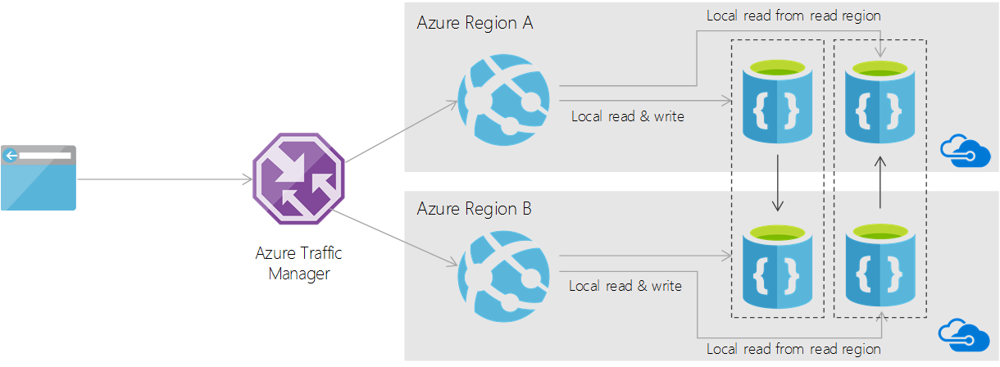

# Multi-master globally replicated database architectures with Azure Cosmos DB
Azure Cosmos DB supports turnkey [global replication](documentdb-distribute-data-globally.md), so you can distribute data to multiple regions with low-latency access anywhere in the world. This model is commonly used for publisher/consumer workloads where there is a writer in a single geographic region and globally distributed readers in other (read) regions. 

You can also use the global replication support in Azure Cosmos DB to build applications in which writers and readers are globally distributed. This article outlines a pattern that enables achieving local write and local read access for distributed writers by using Azure Cosmos DB.

## Content publishing: an example scenario
Let's look at a real-world scenario to describe how you can use globally distributed multi-region/multi-master read and write patterns with Azure Cosmos DB. Consider a content publishing platform built on Azure Cosmos DB. Here are some requirements that this platform must meet for a great user experience for both publishers and consumers:

* Both authors and subscribers are distributed over the world. 
* Authors can publish (write) articles to their local (closest) region.
* Subscribers get a notification when new articles are published.
* Subscribers can read articles from their local region. They can also add reviews to these articles. 
* Anyone, including the author, can view all the reviews attached to articles from a local region. 

Assuming millions of consumers and publishers with billions of articles, soon we have to confront the problems of scale along with guaranteeing locality of access. As with most scalability problems, the solution lies in a good partitioning strategy. Next, let's look at how to model articles, reviews, and notifications as documents, configure Azure Cosmos DB accounts, and implement a data access layer (DAL). 

If you want to learn more about partitioning and partition keys, see [Partitioning and scaling in Azure Cosmos DB](documentdb-partition-data.md).

## Modeling notifications
Notifications are data feeds specific to a user. Therefore, the access patterns for notification documents are always in the context of a single user. For example, you would "post a notification to a user" or "fetch all notifications for a given user." So, the optimal choice of partitioning key for this type would be `UserId`.

	class Notification 
	{ 
		// Unique ID for the notification. 
		public string Id { get; set; }

		// User ID that the notification is addressed to. 
		public string UserId { get; set; }

		// Partition key for the resource. 
		public string PartitionKey 
		{ 
			get 
			{ 
				return this.UserId; 
			}
		}

		// Subscription for which this notification is raised. 
		public string SubscriptionFilter { get; set; }

		// Subject of the notification. 
		public string ArticleId { get; set; } 
	}

## Modeling subscriptions
You can create subscriptions for various criteria like a specific category of articles of interest, or a specific publisher. `SubscriptionFilter` is a good choice for a partition key.

	class Subscriptions 
	{ 
		// Unique ID for the subscription. 
		public string Id { get; set; }

		// Subscription source. Might be Author | Category, etc. 
		public string SubscriptionFilter { get; set; }

		// Subscribing user. 
		public string UserId { get; set; }

		public string PartitionKey 
		{ 
			get 
			{ 
				return this.SubscriptionFilter; 
			} 
		} 
	}

## Modeling articles
After an article is identified through notifications, subsequent queries are typically based on `Article.Id`. Choosing `Article.Id` as the partition the key provides the best distribution for storing articles inside an Azure Cosmos DB collection. 

	class Article 
	{ 
		// Unique ID for the article 
		public string Id { get; set; }
		
		public string PartitionKey 
		{ 
			get 
			{ 
				return this.Id; 
			} 
		}
		
		// Author of the article.
		public string Author { get; set; }

		// Category/genre of the article.
		public string Category { get; set; }

		// Tags associated with the article.
		public string[] Tags { get; set; }

		// Title of the article.
		public string Title { get; set; }
		
		//... 
	}

## Modeling reviews
Reviews are mostly written and read in the context of an article. Choosing `ArticleId` as a partition key provides the best distribution and efficient access of reviews associated with an article. 

	class Review 
	{ 
		// Unique ID for the review. 
		public string Id { get; set; }

		// Article ID of the review. 
		public string ArticleId { get; set; }

		public string PartitionKey 
		{ 
			get 
			{ 
				return this.ArticleId; 
			} 
		}
		
		//Reviewer ID. 
		public string UserId { get; set; }
		public string ReviewText { get; set; }
		
		public int Rating { get; set; } }
	}

## Data access layer methods
Now let's look at the main data access methods that we need to implement. Here's the list of methods that `ContentPublishDatabase` needs:

	class ContentPublishDatabase 
	{ 
		public async Task CreateSubscriptionAsync(string userId, string category);
	
		public async Task<IEnumerable<Notification>> ReadNotificationFeedAsync(string userId);
	
		public async Task<Article> ReadArticleAsync(string articleId);
	
		public async Task WriteReviewAsync(string articleId, string userId, string reviewText, int rating);
	
		public async Task<IEnumerable<Review>> ReadReviewsAsync(string articleId); 
	}

## Azure Cosmos DB account configuration
To guarantee local reads and writes, we must partition data not just on the partition key, but also based on the geographical access pattern into regions. The model relies on having a geo-replicated Azure Cosmos DB database account for each region. For example, with two regions, here's a setup for multi-region writes:

| Account name | Write region | Read region |
| --- | --- | --- |
| `contentpubdatabase-usa.documents.azure.com` | `West US` |`North Europe` |
| `contentpubdatabase-europe.documents.azure.com` | `North Europe` |`West US` |

The following diagram shows how reads and writes are performed in a typical application with this setup:

Here is a code snippet that shows how to initialize the clients in a DAL running in the `West US` region:
    
    ConnectionPolicy writeClientPolicy = new ConnectionPolicy { ConnectionMode = ConnectionMode.Direct, ConnectionProtocol = Protocol.Tcp };
    writeClientPolicy.PreferredLocations.Add(LocationNames.WestUS);
    writeClientPolicy.PreferredLocations.Add(LocationNames.NorthEurope);

    DocumentClient writeClient = new DocumentClient(
        new Uri("https://contentpubdatabase-usa.documents.azure.com"), 
        writeRegionAuthKey,
        writeClientPolicy);

    ConnectionPolicy readClientPolicy = new ConnectionPolicy { ConnectionMode = ConnectionMode.Direct, ConnectionProtocol = Protocol.Tcp };
    readClientPolicy.PreferredLocations.Add(LocationNames.NorthEurope);
    readClientPolicy.PreferredLocations.Add(LocationNames.WestUS);

    DocumentClient readClient = new DocumentClient(
        new Uri("https://contentpubdatabase-europe.documents.azure.com"),
        readRegionAuthKey,
        readClientPolicy);

With the preceding setup, the DAL can forward all writes to the local account based on where it is deployed. You read from both accounts to get the global view of data. You can extend this approach to as many regions as required. For example, here's a setup with three geographic regions:

| Account name | Write region | Read region 1 | Read region 2 |
| --- | --- | --- | --- |
| `contentpubdatabase-usa.documents.azure.com` | `West US` |`North Europe` |`Southeast Asia` |
| `contentpubdatabase-europe.documents.azure.com` | `North Europe` |`West US` |`Southeast Asia` |
| `contentpubdatabase-asia.documents.azure.com` | `Southeast Asia` |`North Europe` |`West US` |

## Data access layer implementation
Now let's look at the implementation of the DAL for an application that has two writable regions. The DAL must implement the following steps:

* Create multiple instances of `DocumentClient` for each account. With two regions, each DAL instance has one `writeClient` and one `readClient`. 
* Based on the deployed region of the application, configure the endpoints for `writeClient` and `readClient`. For example, the DAL deployed in `West US` uses `contentpubdatabase-usa.documents.azure.com` for performing writes. The DAL deployed in `NorthEurope` uses `contentpubdatabase-europ.documents.azure.com` for writes.

With the preceding setup, you can implement the data access methods. Write operations forward the write to the corresponding `writeClient`.

    public async Task CreateSubscriptionAsync(string userId, string category)
    {
        await this.writeClient.CreateDocumentAsync(this.contentCollection, new Subscriptions
        {
            UserId = userId,
            SubscriptionFilter = category
        });
    }

    public async Task WriteReviewAsync(string articleId, string userId, string reviewText, int rating)
    {
        await this.writeClient.CreateDocumentAsync(this.contentCollection, new Review
        {
            UserId = userId,
            ArticleId = articleId,
            ReviewText = reviewText,
            Rating = rating
        });
    }

For reading notifications and reviews, you must read from both regions and create a union of the results, as shown in the following snippet:

    public async Task<IEnumerable<Notification>> ReadNotificationFeedAsync(string userId)
    {
        IDocumentQuery<Notification> writeAccountNotification = (
        	from notification in this.writeClient.CreateDocumentQuery<Notification>(this.contentCollection) 
        	where notification.UserId == userId 
        	select notification).AsDocumentQuery();
        
        IDocumentQuery<Notification> readAccountNotification = (
        	from notification in this.readClient.CreateDocumentQuery<Notification>(this.contentCollection) 
        	where notification.UserId == userId 
        	select notification).AsDocumentQuery();

        List<Notification> notifications = new List<Notification>();

        while (writeAccountNotification.HasMoreResults || readAccountNotification.HasMoreResults)
        {
            IList<Task<FeedResponse<Notification>>> results = new List<Task<FeedResponse<Notification>>>();

            if (writeAccountNotification.HasMoreResults)
            {
                results.Add(writeAccountNotification.ExecuteNextAsync<Notification>());
            }

            if (readAccountNotification.HasMoreResults)
            {
                results.Add(readAccountNotification.ExecuteNextAsync<Notification>());
            }

            IList<FeedResponse<Notification>> notificationFeedResult = await Task.WhenAll(results);

            foreach (FeedResponse<Notification> feed in notificationFeedResult)
            {
                notifications.AddRange(feed);
            }
        }
        return notifications;
    }

    public async Task<IEnumerable<Review>> ReadReviewsAsync(string articleId)
    {
        IDocumentQuery<Review> writeAccountReviews = (
        	from review in this.writeClient.CreateDocumentQuery<Review>(this.contentCollection) 
        	where review.ArticleId == articleId 
        	select review).AsDocumentQuery();
        
        IDocumentQuery<Review> readAccountReviews = (
        	from review in this.readClient.CreateDocumentQuery<Review>(this.contentCollection) 
        	where review.ArticleId == articleId 
        	select review).AsDocumentQuery();

        List<Review> reviews = new List<Review>();
        
        while (writeAccountReviews.HasMoreResults || readAccountReviews.HasMoreResults)
        {
            IList<Task<FeedResponse<Review>>> results = new List<Task<FeedResponse<Review>>>();

            if (writeAccountReviews.HasMoreResults)
            {
                results.Add(writeAccountReviews.ExecuteNextAsync<Review>());
            }

            if (readAccountReviews.HasMoreResults)
            {
                results.Add(readAccountReviews.ExecuteNextAsync<Review>());
            }

            IList<FeedResponse<Review>> notificationFeedResult = await Task.WhenAll(results);

            foreach (FeedResponse<Review> feed in notificationFeedResult)
            {
                reviews.AddRange(feed);
            }
        }

        return reviews;
    }

## Next steps
This article described how you can use globally distributed multi-region read and write patterns with Azure Cosmos DB by using content publishing as a sample scenario. By choosing a good partitioning key and static account-based partitioning, you can achieve multi-region local reads and writes by using Azure Cosmos DB.

Next, you can:

* Learn about how Azure Cosmos DB supports [global distribution](documentdb-distribute-data-globally.md).
* Learn about [automatic and manual failovers in Azure Cosmos DB](documentdb-regional-failovers.md).
* Learn about [global consistency with Azure Cosmos DB](documentdb-consistency-levels.md).
* Develop with multiple regions by using the [DocumentDB API](../cosmos-db/tutorial-global-distribution-documentdb.md).
* Develop with multiple regions by using the [MongoDB API](../cosmos-db/tutorial-global-distribution-MongoDB.md).
* Develop with multiple regions by using the [Table API](../cosmos-db/tutorial-global-distribution-table.md).
